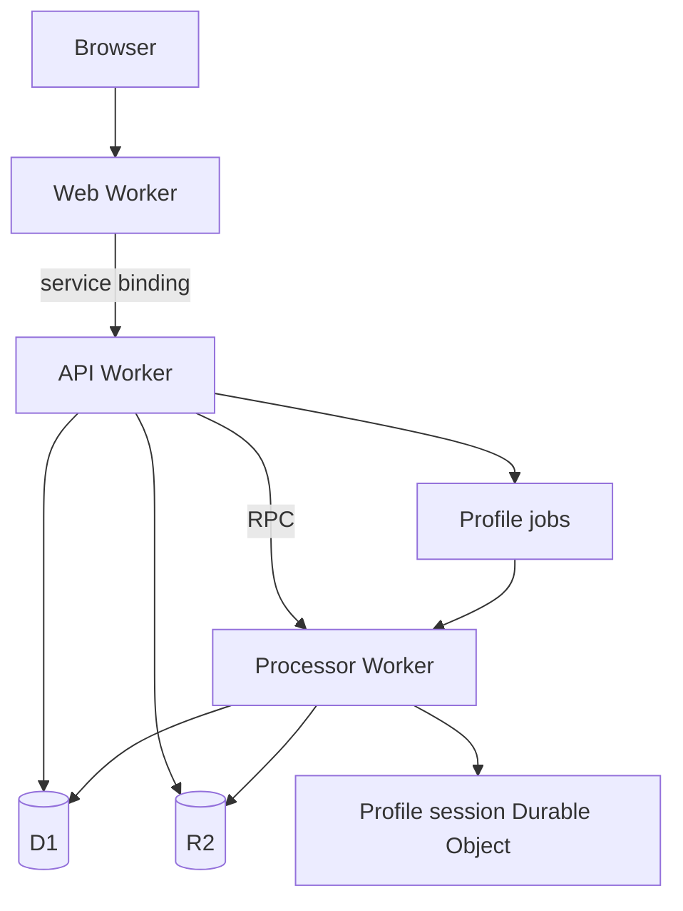

## One infrastructure graph

`infra/alchemy.run.ts` composes deployment configuration, the Worker graph, and the web application. Resource objects carry their outputs and types into downstream bindings.

The API and processor have no public `workers.dev` URLs. The web Worker reaches the API through a service binding. Alchemy supplies local implementations of the same graph during development and tests.

| Path                                                     | Owns                                                 |
| -------------------------------------------------------- | ---------------------------------------------------- |
| `infra/src/data-plane.ts`                                | Shared D1, R2, and Queue resources                   |
| `infra/src/worker-bindings.ts`                           | Runtime bindings and derived environment types       |
| `infra/src/api.ts`, `processor.ts`, `profile-session.ts` | Worker and Durable Object declarations               |
| `infra/src/workers.ts`                                   | Worker implementation layers                         |
| `infra/src/web-application.ts`                           | TanStack Start's Alchemy Website resource            |
| `workers/*/src/artifacts/`                               | Services, repositories, and handlers for the example |
| `workers/*/src/platform/`                                | Adapters for calls to other runtimes                 |
| `apps/web/src/features/artifacts/`                       | UI, query options, and server functions              |
| `apps/web/src/routes/`                                   | URLs, route loaders, and HTTP handlers               |
| `packages/contracts/`                                    | Shared schemas and tagged failures                   |
| `migrations/`                                            | D1 schema migrations                                 |

## Worker-to-Worker RPC

Each Worker has a declaration and an implementation layer. The declaration identifies the Worker and derives its callable methods from the implementation's return type.

For the API-to-processor call:

1. `infra/src/processor.ts` declares `Processor` and exposes `getProcessingState`. Its `.make(...)` layer initializes the application and returns that method.
2. `apiBindings` calls `Cloudflare.Workers.bindWorker(Processor)`. Alchemy records the service binding during planning and supplies a typed client at runtime.
3. `workers/api/src/index.ts` provides that client through `ProcessorClient.layer`.
4. `platform/processor-client.ts` adds a five-second deadline and maps failures before the artifact service calls it.

`infra/src/workers.ts` supplies both Worker implementation layers to the graph. A consuming Worker references the other Worker's declaration; it does not construct the other Worker's application services.

The web Worker receives the API resource as `env.API`. Its server adapter uses `makeRpcStub` to call `getArtifact` and `listArtifacts`, with a ten-second deadline. Uploads and downloads use HTTP through the same binding.

Method arguments, results, and failures come from the Worker declaration's types. Native RPC does not preserve error class identity, so remote tagged failures are handled with `Effect.catchTag`. Cancellation interrupts the caller's local Effect but does not stop work already executing in the receiving Worker.

## The reference application's data flow

An upload writes its source to R2 and creates a queued D1 record. A record without a dispatch timestamp is durable pending work. The API attempts delivery after responding, and a scheduled dispatcher retries pending deliveries every minute.

The processor consumes queue messages, computes a CSV profile, and writes the result to D1. Duplicate delivery is safe; completed results survive late dead letters. The Durable Object stores advisory progress while D1 owns artifact status and results.

The example is anonymous and shared. Every visitor can list and download files, uploads are limited to 256 KB, and artifacts have no ownership or cleanup policy. Replace it before handling private data.

## Add a runtime

Add web apps under `apps/` and Workers under `workers/`. Keep their application behavior in those workspaces and declare infrastructure under `infra/`.

Define bindings in `worker-bindings.ts`, compose the runtime into the Alchemy graph, and test through its public HTTP or RPC interface. Alchemy owns bundling, migrations, queue delivery, and local emulation; individual runtimes have no separate Wrangler configuration.

Keep resource logical IDs stable when moving declarations between files. Alchemy uses those IDs to identify existing resources across deployments.

The pinned Alchemy package has a type-only patch for resource outputs in `consumeQueueMessages`'s `deadLetterQueue` option. Review `patches/alchemy@2.0.0-beta.76.patch` when upgrading Alchemy.
