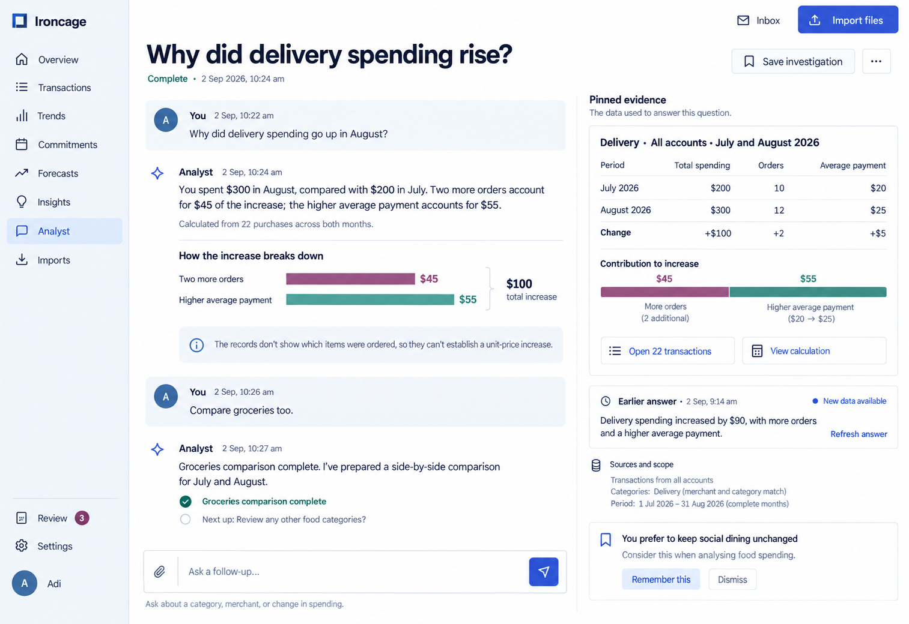
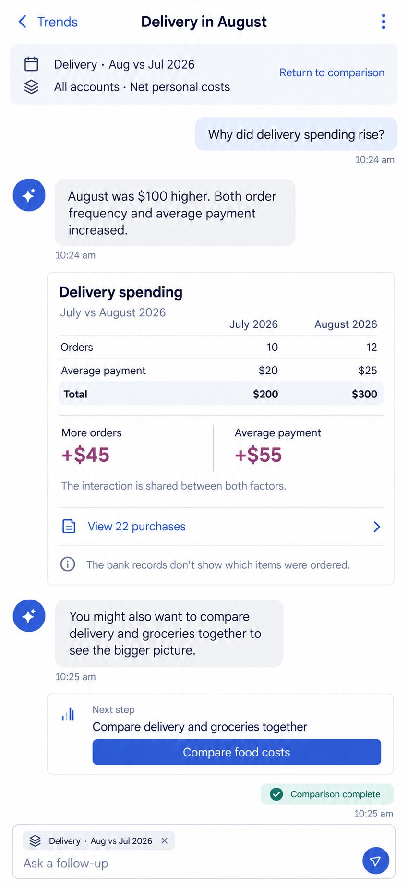
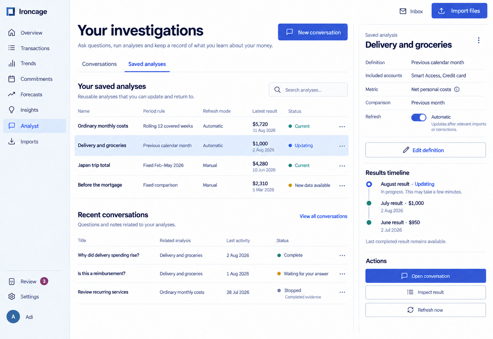
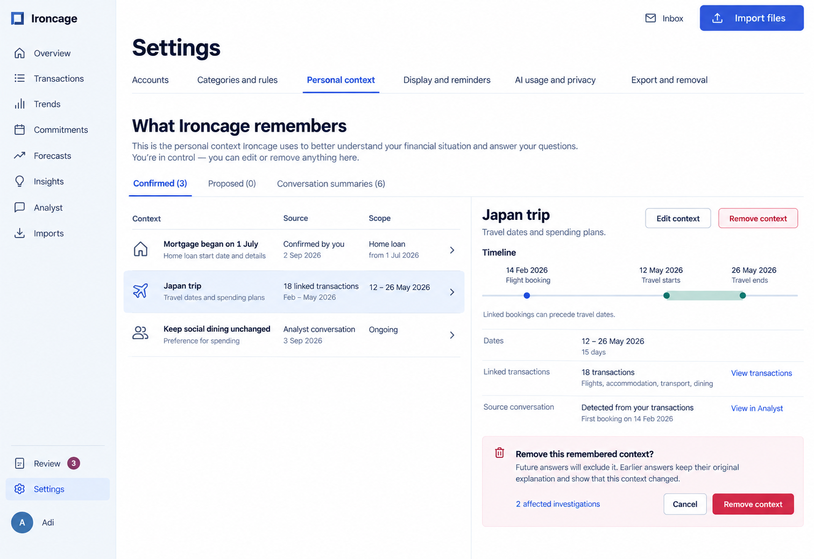

The analyst keeps the selected question and its evidence together. Saved results retain their original basis, and remembered context exposes its source and scope.

Product behavior: [Analyst and memory](/product/analyst-and-memory).

## Conversation and evidence

<Tabs inline param="viewport">
  <Tab title="Desktop">
    The conversation and pinned evidence share the workspace. A prior answer remains available with a refresh action when its data changes.

    <Frame caption="A delivery investigation with the comparison, supporting purchases, and a proposed remembered preference.">

    

    </Frame>

  </Tab>
  <Tab title="Mobile">
    The comparison appears within the conversation. The selected period and measure remain visible above the answer and in the composer.

    <Frame caption="Mobile analyst with a readable evidence table and a return path to Trends.">
      

      

      

    </Frame>

  </Tab>
</Tabs>

## Saved analyses

The library separates an analysis definition from its completed results. Refresh mode, period selection, and update status remain visible beside the result history.

<Frame caption="Saved analyses with automatic and manual refresh, plus the last completed result during an update.">

</Frame>

## Personal context

Confirmed facts, proposals, and conversation summaries occupy separate views. A removal preview explains the effect on future answers and earlier investigations.

<Frame caption="A remembered trip links advance bookings to travel dates and exposes its source and removal controls.">

</Frame>
