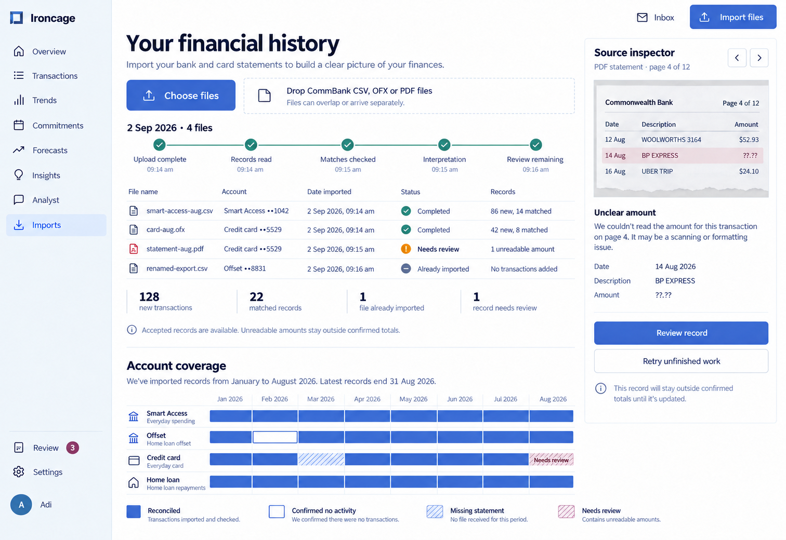
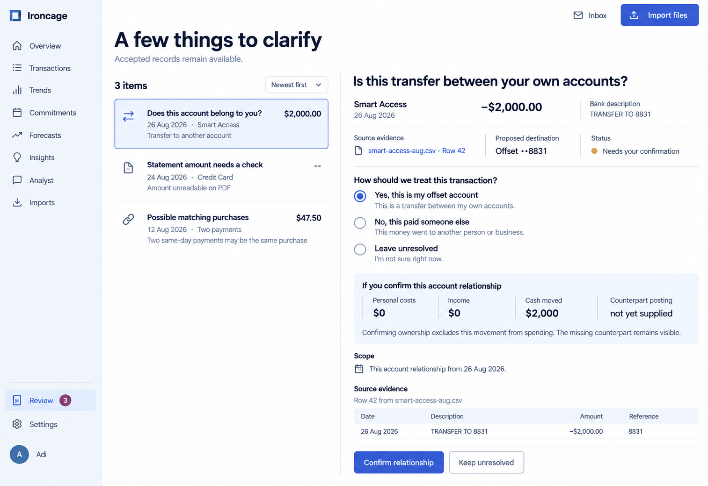

Imports shows what each supplied file contributed. Review items identify the uncertain record, its evidence, and the effect of the proposed interpretation.

Product behavior: [Imports](/product/imports) and [Unresolved relationships](/product/transactions#unresolved-relationships).

## Batch and coverage

File results distinguish new transactions, matched records, repeated sources, and unresolved amounts. The coverage timeline separates reconciled history, confirmed inactivity, missing statements, and records awaiting review.

<Frame caption="A mixed import batch with accepted records, a repeated file, and an unreadable PDF amount.">

</Frame>

## Clarification

The selected review item asks whether a destination account belongs to the user. The proposed relationship shows its scope and financial treatment, including the missing counterpart posting.

<Frame caption="Confirmation of an owned-account transfer with the original bank record and a financial-impact preview.">

</Frame>
