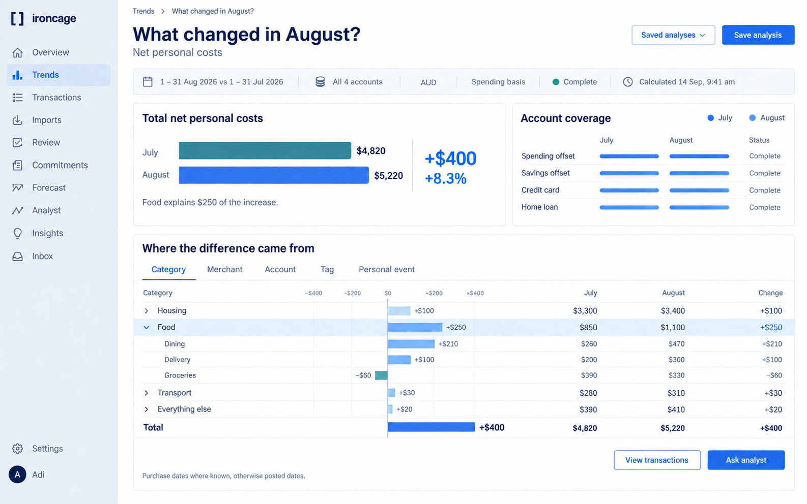

Click an image to enlarge it. Stage requirements define which features to build.

- [1. Record transactions](/design/record-transactions)
- [2. Import historical files](/design/historical-imports)
- [3. Interpret transactions](/design/interpret-transactions)
- [4. Explore spending](/design/explore-spending)
- [5. Plan costs](/design/plan-costs)
- [6. Investigate with the analyst](/design/analyst)
- [7. Follow through](/design/follow-through)
- [Mobile layouts](/design/responsive)
