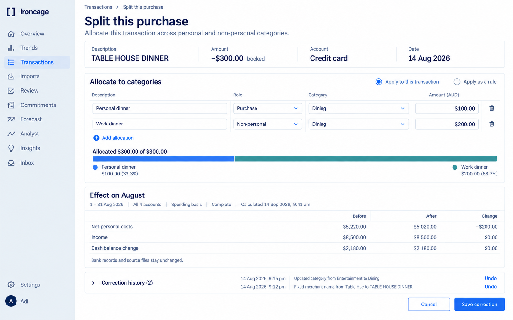
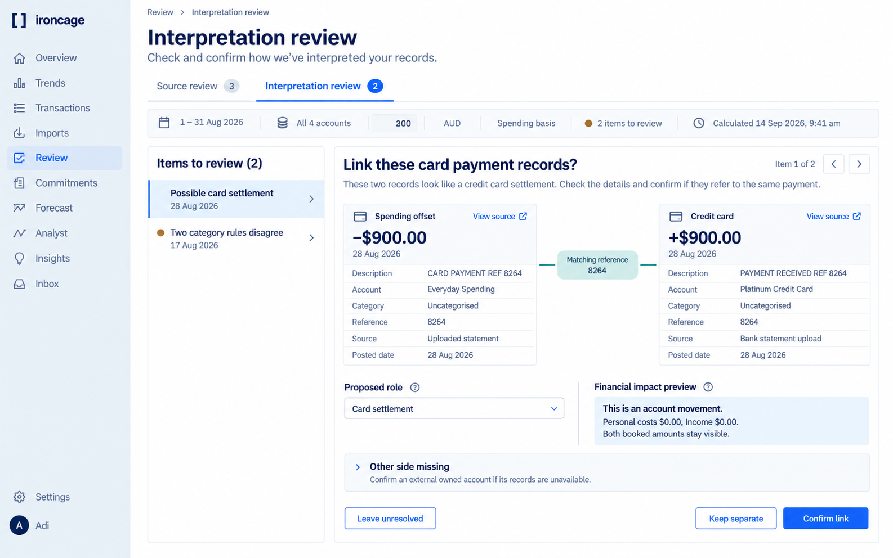
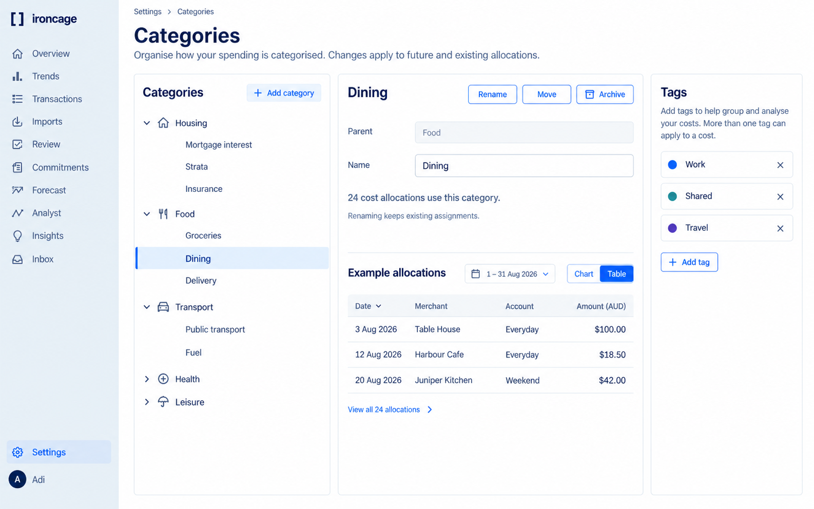
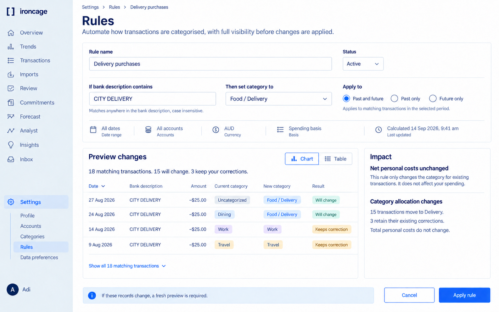
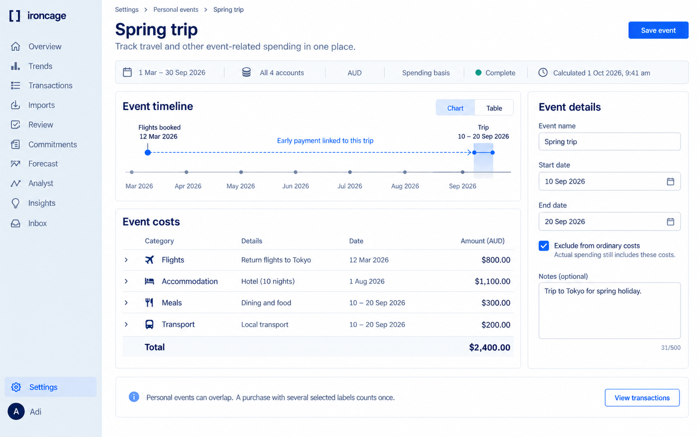
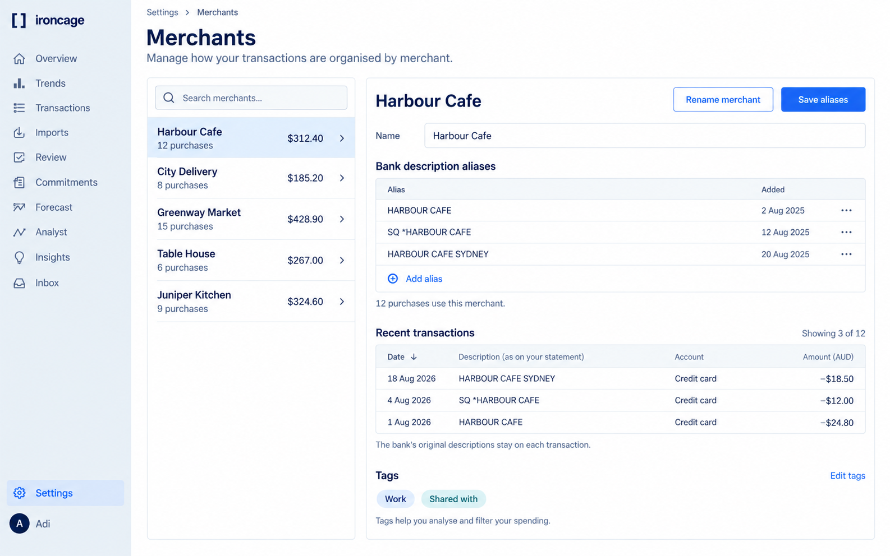

[Stage requirements](/stages/interpret-transactions).

## Split and correction preview

## Interpretation review

## Categories and tags

## Rules and exceptions

## Personal events

## Merchants and aliases

