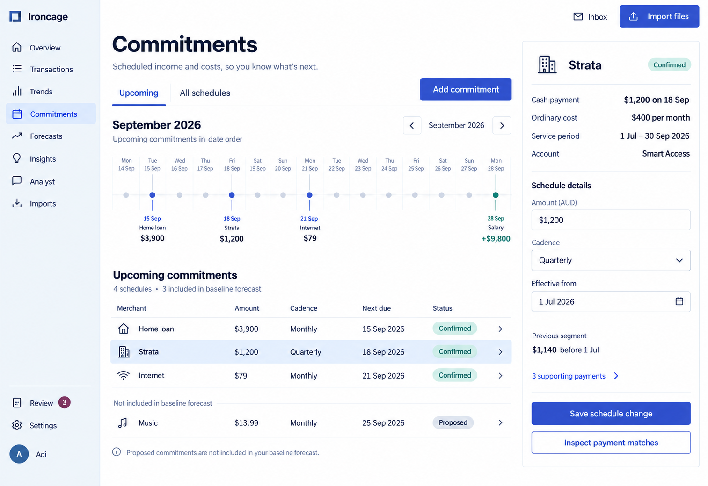
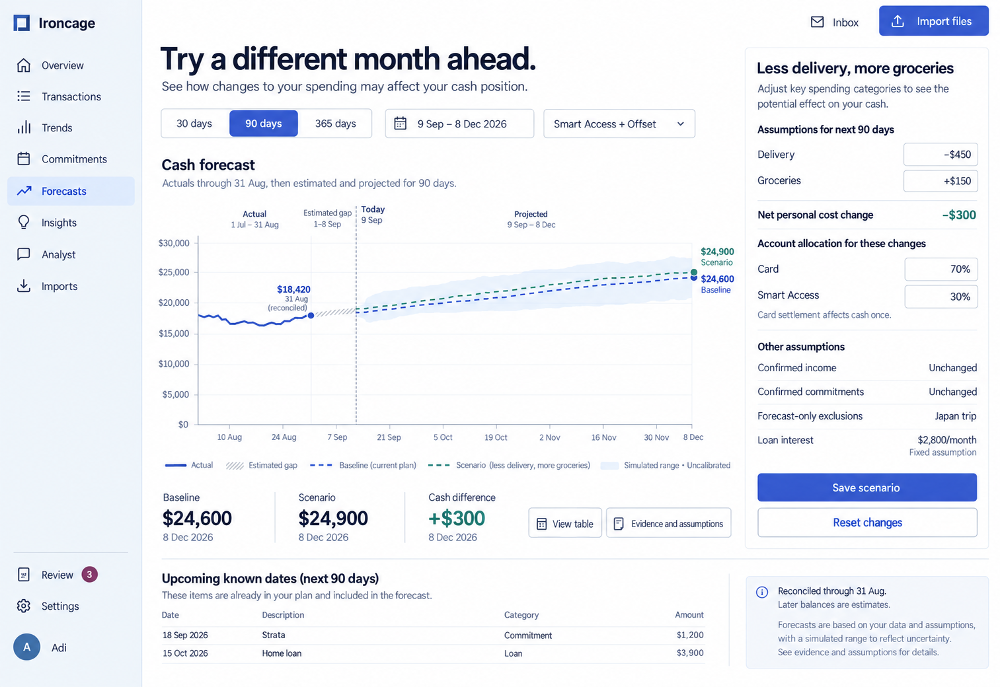
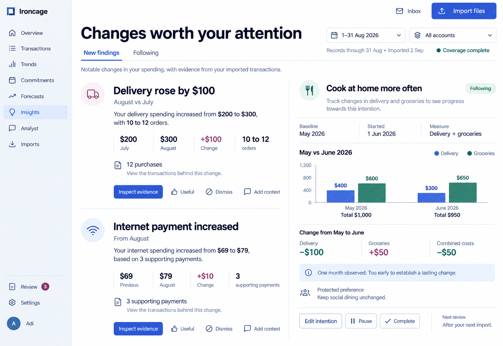

These screens connect expected payments to future cash and later observations. Confirmed schedules, scenario assumptions, and actual outcomes have distinct labels.

Product behavior: [Commitments and forecasts](/product/commitments-and-forecasts) and [Insights and follow-through](/product/insights-and-follow-through).

## Commitments

The cash calendar retains each payment's due date. A selected schedule exposes its amount, cadence, payment account, service period, and effective date. Proposed schedules remain visibly separate.

<Frame caption="A quarterly strata payment keeps its cash date beside its ordinary monthly allocation.">

</Frame>

## Forecast scenario

The chart separates reconciled history, the estimated gap after the last records, and projected balances. The scenario editor names the delivery reduction and grocery increase behind the comparison.

<Frame caption="A 90-day scenario with explicit assumptions and an uncalibrated simulated range.">

</Frame>

## Insights and intentions

Findings show their comparison period and supporting records. The tracked intention includes grocery substitution costs and identifies the limited observation period.

<Frame caption="New August findings sit beside a separate saved comparison of May and June food costs.">

</Frame>
