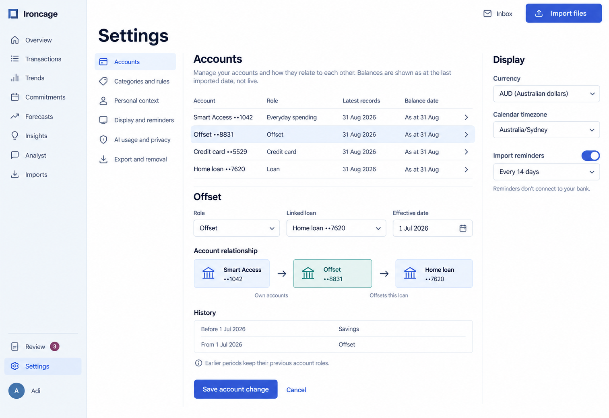
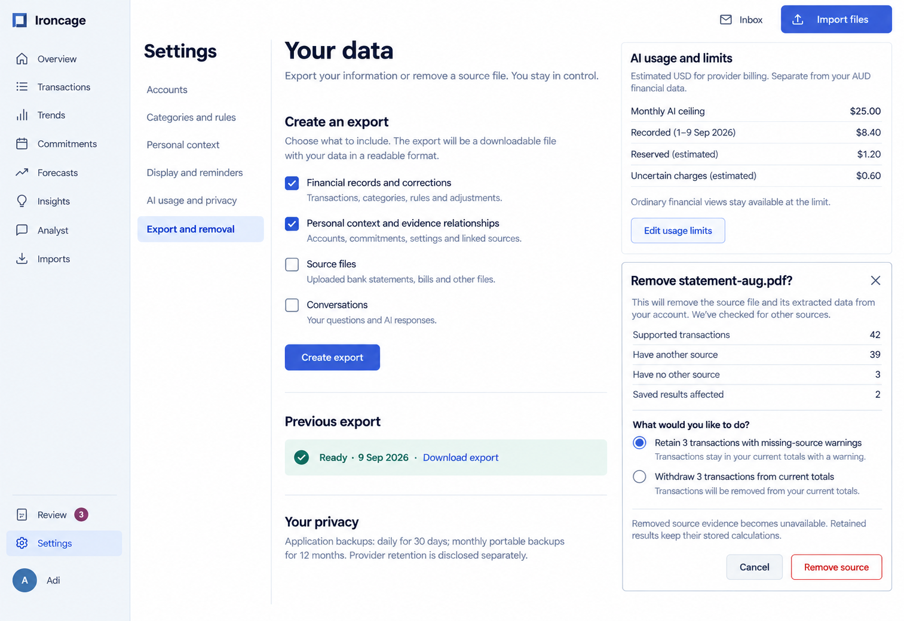

Settings groups the controls that apply across the workspace. Historical account context and source relationships remain inspectable when current settings change.

Product behavior: [Settings and data controls](/product/settings-and-data).

## Accounts and preferences

The account editor includes the role, related loan, and effective date. Currency, calendar timezone, and import reminders use separate controls.

<Frame caption="Account relationships retain their earlier roles and identify the date of supplied balances.">

</Frame>

## Usage, export, and removal

AI usage distinguishes recorded costs, reservations, and uncertain charges. The export lets the user include sources and conversations. Source removal previews affected records and offers an explicit choice for transactions with no remaining source.

<Frame caption="Export controls and a source-removal preview beside the AI usage policy.">

</Frame>
