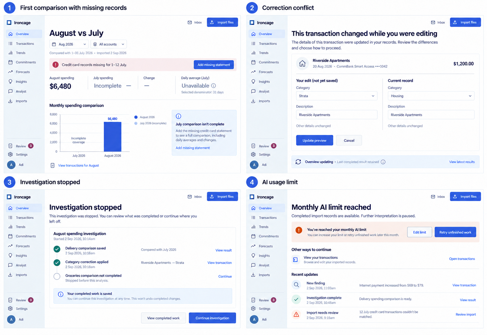

These references show what remains available when a view cannot produce a complete result or an operation cannot continue.

<Frame caption="Four recovery states with explicit limits, preserved work, and a next action.">

</Frame>

## Missing coverage

The comparison identifies the missing account interval and offers an import action. July's missing records leave its daily average unavailable. The known August total remains visible.

Related behavior: [Comparable periods](/product/trends#comparable-periods).

## Conflicting correction

The edit view preserves the user's input beside the current record and offers an updated preview. A separate update status retains the last completed overview result.

Related behavior: [Corrections from any view](/product/workspace#corrections-from-any-view).

## Stopped investigation

Completed comparisons and committed corrections remain available. The investigation names the unfinished analysis and provides a continuation action.

Related behavior: [Continuing work](/product/analyst-and-memory#continuing-work).

## AI usage limit

The limit state identifies paused interpretation work and links to the policy and retry action. Accepted records and ordinary financial views remain accessible.

Related behavior: [AI usage and privacy](/product/settings-and-data#ai-usage-and-privacy).
