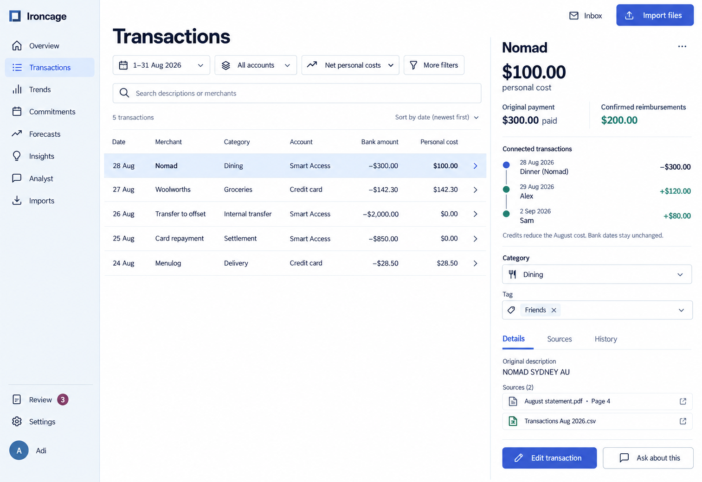
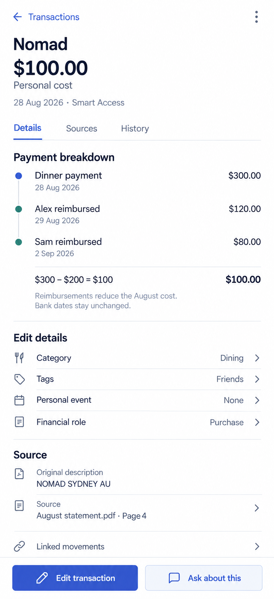
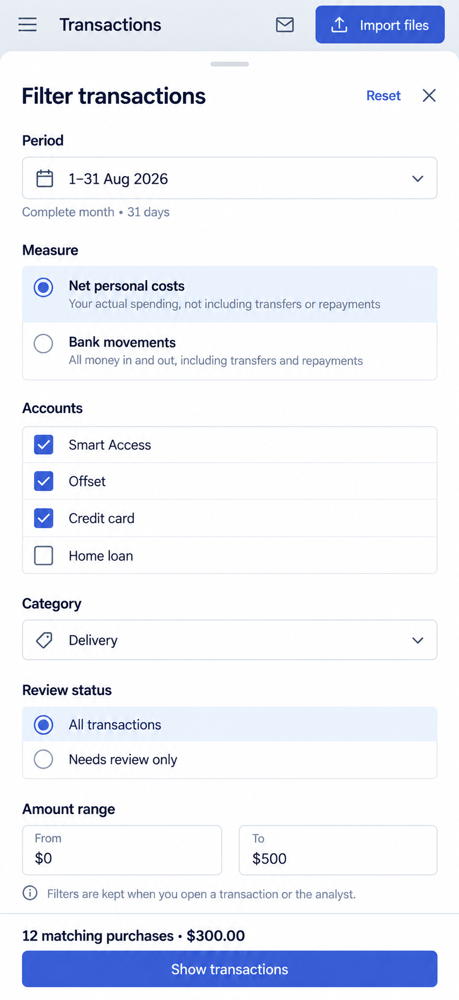
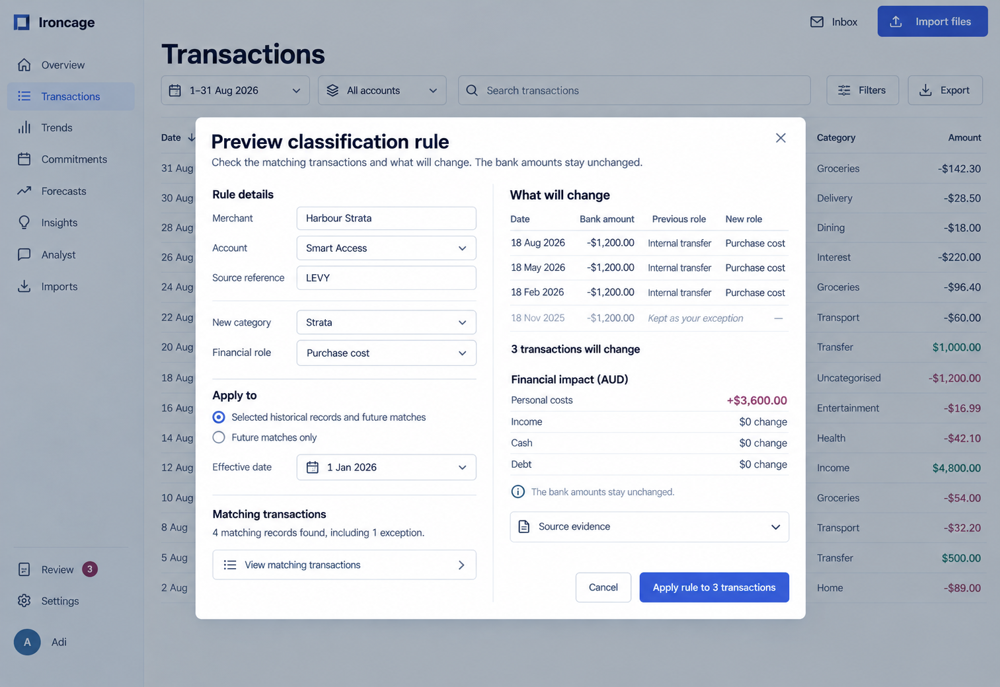

The record view distinguishes the bank amount from the transaction's contribution to personal costs. Linked reimbursements remain visible with their own posting dates.

Product behavior: [Transactions](/product/transactions).

## Record and evidence

<Tabs inline param="view">
  <Tab title="Desktop">
    The selected transaction opens beside the ledger. Its interpretation, linked credits, original description, and supporting sources share one inspector.

    <Frame caption="A $300 dinner contributes $100 to personal costs after $200 in confirmed reimbursements.">

    

    </Frame>

  </Tab>
  <Tab title="Mobile detail">
    A full-screen detail keeps the payment breakdown and edit actions readable. Back navigation returns to the previous transaction selection.

    <Frame caption="Mobile transaction detail with linked credits and source access.">
      

      

      

    </Frame>

  </Tab>
  <Tab title="Mobile filters">
    A filter sheet contains the period, measure, accounts, category, review status, and amount range. The footer previews the matching records.

    <Frame caption="Mobile filters with 12 matching delivery purchases and a $300 total.">
      

      

      

    </Frame>

  </Tab>
</Tabs>

## Rule preview

The broad correction shows matching records, an existing exception, and the effect on financial measures before acceptance. The original bank amounts remain visible.

<Frame caption="A classification rule changes three records and preserves an individual exception.">

</Frame>
