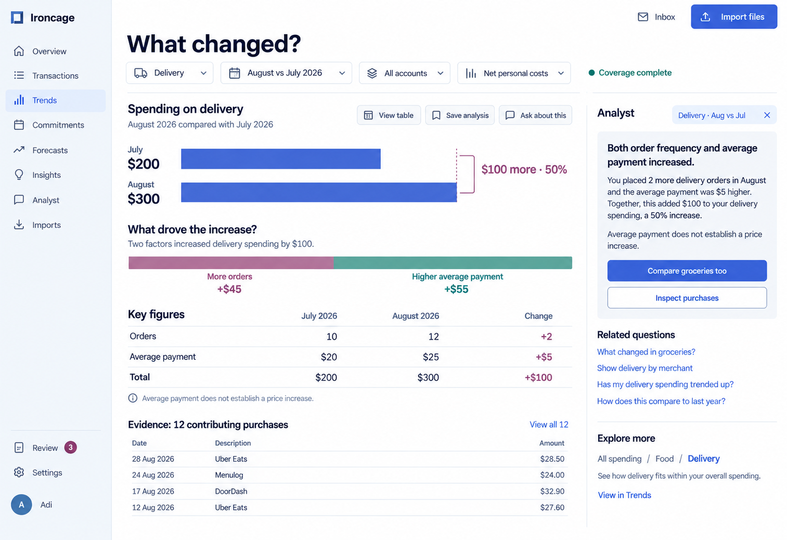
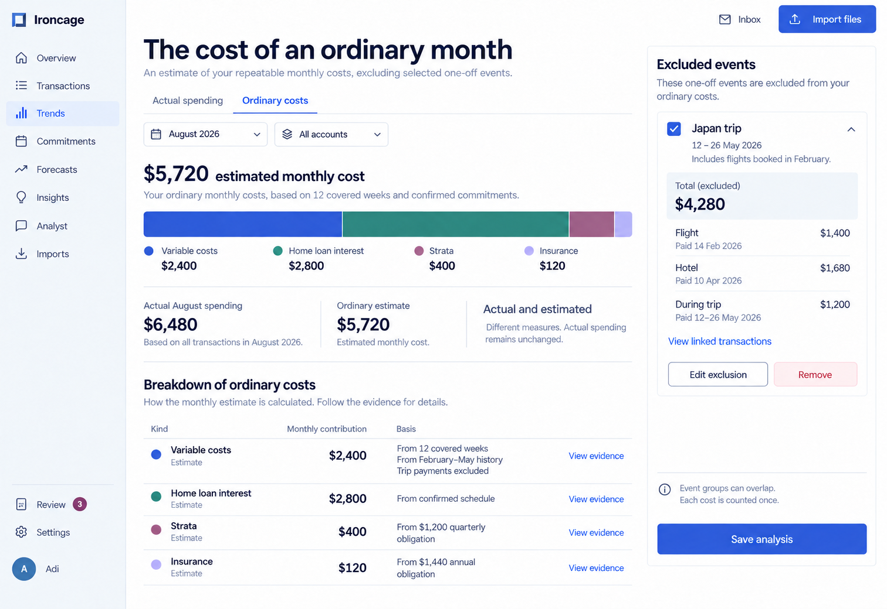

Trends carries the comparison period and selected measure through the chart, contributing records, and analyst panel.

Product behavior: [Trends](/product/trends).

## Spending comparison

The delivery example separates purchase frequency from average payment. The displayed contributions add to the total change, and the evidence remains available below the comparison.

<Frame caption="Delivery rises from $200 to $300. Frequency contributes $45 and average payment contributes $55.">

</Frame>

## Ordinary costs

The ordinary-cost view identifies estimated contributions from covered history and recurring obligations. Excluded personal events keep their linked bookings and payments available for inspection.

<Frame caption="Ordinary costs show their calculation basis separately from actual August spending.">

</Frame>
