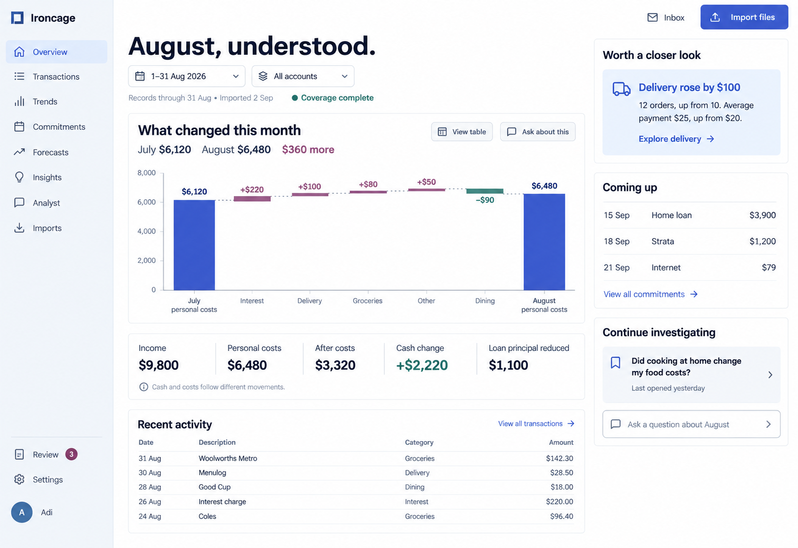
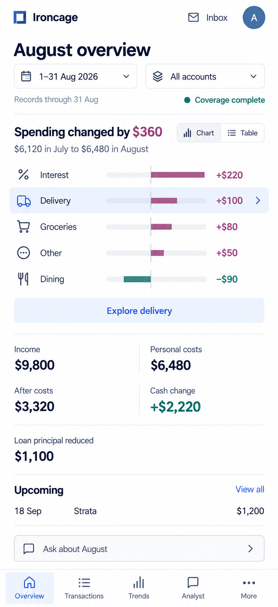
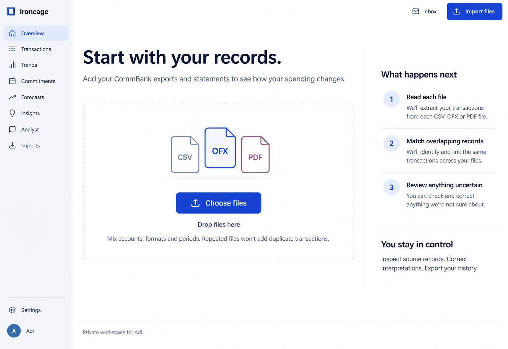

The overview leads with the change between two periods. Income, personal costs, surplus, cash change, and principal reduction keep separate labels.

Product behavior: [Workspace](/product/workspace).

## Period overview

<Tabs inline param="viewport">
  <Tab title="Desktop">
    The comparison occupies the main working area. Relevant findings, upcoming commitments, and a saved investigation remain alongside it.

    <Frame caption="Desktop overview with spending contributors and separate cash and cost measures.">

    

    </Frame>

  </Tab>
  <Tab title="Mobile">
    Horizontal contributor rows preserve readable amounts. The selected category opens its evidence, while the bottom navigation exposes the main destinations.

    <Frame caption="Mobile overview with a selectable delivery contributor and a chart-to-table control.">
      

      

      

    </Frame>

  </Tab>
</Tabs>

## Before the first import

The empty workspace offers file selection and explains the import process. Financial summaries appear after records are available.

<Frame caption="First-import screen for CommBank CSV, OFX, and PDF files.">

</Frame>
