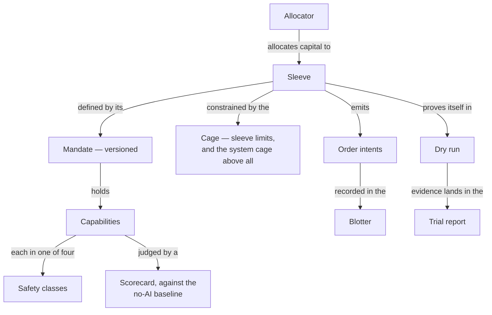

This glossary is the ubiquitous language of the domain. [Vision](/vision) holds the vision, [Product](/product) the specification. Every term in this system obeys three rules, in order:

1. **If the domain already has a word, use it.** Finance, trading, statistics, and tax have real vocabularies — sleeve, mandate, blotter, regime, walk-forward, parcel are terms of art, not inventions.
2. **Where no term of art exists, build a plain compound** that a competent stranger parses in one sentence of context: safety class, trial count, no-AI baseline.
3. **Theme belongs to the product name and the UI, never the domain model.** The cage is the single deliberate exception — the product's namesake, and near self-explanatory.

The test: a trader, an engineer, or an accountant should guess any term's meaning without this glossary. The glossary disambiguates; it never decodes.

How the core terms hang together — each is defined in the tables below:

## Capital

| Term          | Meaning                                                                                                                                                                                                                                  | Avoid                                                                |
| ------------- | ---------------------------------------------------------------------------------------------------------------------------------------------------------------------------------------------------------------------------------------- | -------------------------------------------------------------------- |
| **Sleeve**    | A bounded allocation of capital with its own mandate — the standard portfolio-management sense. The system's central object; sleeves are tenants of the engine.                                                                          | bot, strategy (for the capital unit), portfolio (for one sleeve)     |
| **Mandate**   | A sleeve's versioned rules of engagement: everything it may do, and under what limits — the standard investment-mandate sense, extended to cover AI capabilities.                                                                        | config, settings, profile (reserved for capability-bundle shorthand) |
| **Allocator** | The discipline governing capital: total system capital equals unallocated cash plus sleeve allocations — a ledger of authority, not a valuation — and every allocation change is a recorded operator act.                                | rebalancer, treasury                                                 |
| **Cage**      | The deterministic risk-limit layer no AI output can reach — per-sleeve limits plus the system cage (total exposure, system drawdown kill switch, venue concentration) above all sleeves. The one deliberately themed term in the system. | guardrails, safety layer, risk management (as a vague noun)          |

## Money

| Term                           | Meaning                                                                                                                                                                                         | Avoid                                                     |
| ------------------------------ | ----------------------------------------------------------------------------------------------------------------------------------------------------------------------------------------------- | --------------------------------------------------------- |
| **Bank transaction**           | One canonical posted movement in one owned bank account. Analysis counts it once regardless of how many source observations support it.                                                         | imported row, CSV transaction, statement transaction      |
| **Source observation**         | One bank-supplied representation of a bank transaction from an import bundle. It preserves source facts and links to the canonical transaction when identity is proven.                         | transaction (when referring to evidence), raw transaction |
| **Import bundle**              | The transient files submitted together for one account and source window: paired CSV/OFX or one statement PDF. Confirm stores the resulting record and source metadata, not the uploaded bytes. | upload, import file (for a multi-file source)             |
| **Coverage gap**               | An inclusive date interval for which a required bank account has no confirmed complete source window. Analysis treats the affected month as unavailable, never as zero spending.                | missing transactions, empty period                        |
| **Transaction classification** | One effective, provenance-bearing set of signed category splits for a bank transaction. Its splits sum exactly to the transaction amount.                                                       | category (when the transaction is split), tag             |
| **Owned transfer**             | A confirmed pair of equal and opposite bank transactions in two owned accounts. Analysis excludes both legs from income and spending.                                                           | expense, income, duplicate                                |

## AI capabilities

| Term                  | Meaning                                                                                                                                                                                                                                                                     | Avoid                                                                                   |
| --------------------- | --------------------------------------------------------------------------------------------------------------------------------------------------------------------------------------------------------------------------------------------------------------------------- | --------------------------------------------------------------------------------------- |
| **Capability**        | One typed, bounded AI authority drawn from the versioned capability registry, held by a sleeve's mandate — or, for sleeve-independent work such as system observers and Money's categorization, by the system itself.                                                       | grant, permission, feature, power                                                       |
| **Safety class**      | The containment shape of a capability — exactly four, closed forever: throttle, proposal, observer, trade proposer.                                                                                                                                                         | valve class, category, level, type (unqualified)                                        |
| **Throttle**          | A run-time capability whose output is deterministically clamped to reduce-only semantics: a [0,1] multiplier, an added lock, or a tightened limit.                                                                                                                          | attenuator, filter, modifier, signal booster                                            |
| **Proposal**          | A design-time capability's output: a draft change to the machine — new parameter values, a strategy variant, a mandate diff — inert until it passes the gate pipeline.                                                                                                      | gated proposal, suggestion, auto-update                                                 |
| **Regime assessment** | The flagship throttle: per-instrument, multi-axis market assessments on a quantized ladder, collapsed by a deterministic combiner into an entry-size multiplier.                                                                                                            | regime vector, prediction, forecast, trade signal                                       |
| **No-AI baseline**    | A capability's counterfactual: what the sleeve would have done with the capability absent (for a throttle, a multiplier of 1), simulated through the same fill machinery. Never the safe default — comparing against the fail-closed output would flatter every capability. | control, benchmark (reserved for sleeve-level comparisons), safe default (as a synonym) |
| **Safe default**      | The fail-closed output a capability contributes when its run fails or its output goes stale — for the regime assessment, a multiplier of 0. It protects the sleeve; it is never the scorecard's comparator.                                                                 | fallback, baseline, no-AI baseline (as a synonym)                                       |
| **Scorecard**         | A capability's running score versus its no-AI baseline — the evidence that decides whether the capability keeps its place.                                                                                                                                                  | value-added ledger, rating                                                              |
| **Decision record**   | The permanent record of one AI decision: what was asked, what was answered, the stated reasoning, the model, and the cost — the durable half of AI observability (full traces live in the gateway only for its retention window).                                           | trace (for the permanent record), audit log (unqualified)                               |
| **Gate pipeline**     | The test gauntlet a proposal must survive before touching live behavior: validation, reproducible backtest, walk-forward, shadow run, operator approval.                                                                                                                    | CI, review process                                                                      |

## Trading

| Term             | Meaning                                                                                                                                                      | Avoid                                                         |
| ---------------- | ------------------------------------------------------------------------------------------------------------------------------------------------------------ | ------------------------------------------------------------- |
| **Order intent** | A typed, idempotent request to change a position, emitted by the engine after strategy, capability, and cage evaluation.                                     | trade (before execution), order (before it reaches the venue) |
| **Blotter**      | The immutable, append-only record of orders and fills, from which all derived position state is recomputed — the standard trading-desk sense.                | ledger (unqualified), journal                                 |
| **Pair lock**    | A deterministic no-entry marker on an instrument (or everything) with a reason and an expiry.                                                                | ban, freeze, blacklist                                        |
| **Tick**         | One scheduled execution of a recurring process — an engine tick, a capability tick, or a housekeeping run. Decision-making ticks align to candle boundaries. | cycle, iteration, heartbeat                                   |

## Proving

| Term             | Meaning                                                                                                                                                                                                                                 | Avoid                                                                                                                               |
| ---------------- | --------------------------------------------------------------------------------------------------------------------------------------------------------------------------------------------------------------------------------------- | ----------------------------------------------------------------------------------------------------------------------------------- |
| **Dry run**      | Running a sleeve against live markets with simulated fills through the same code path as live trading; the mandatory proving ground for every sleeve.                                                                                   | paper trading (the industry synonym — fine in conversation, but dry run also proves non-trading behavior), simulation (unqualified) |
| **Trial report** | The evidence document a promotion decision is made from: performance against declared benchmarks, risk profile, costs, behavior conformance, and every capability's scorecard.                                                          | performance report (unqualified), review (reserved for weekly reports)                                                              |
| **Shadow run**   | A challenger configuration running in simulation beside the incumbent champion, on the same live data.                                                                                                                                  | A/B test, parallel run                                                                                                              |
| **Workbench**    | The research surface: historical data coverage, reproducible cost-modeled backtests, the trial count, and gate/shadow run visibility.                                                                                                   | lab, sandbox                                                                                                                        |
| **Trial count**  | The visible count of trials behind any comparative result, so best-of-many is never mistaken for evidence.                                                                                                                              | multiplicity ledger, run counter                                                                                                    |
| **Parcel**       | A quantity of one asset with a single acquisition date and cost base, tracked from acquisition to disposal — the ATO's own term; the unit the tax engine's capital-gains math operates on.                                              | lot (in docs; acceptable in code), batch                                                                                            |
| **Gap ledger**   | The per-source record of which time windows have been fetched from where, and which expected points remain missing or disputed — tax sources, bank imports, and candle history alike — so holes are visible instead of silently absent. | sync log, coverage report                                                                                                           |
| **Fail closed**  | The universal resolution of ambiguity: stale input, uncomputable state, or an unreachable venue always resolves toward not trading.                                                                                                     | fail safe (imprecise), graceful degradation                                                                                         |
