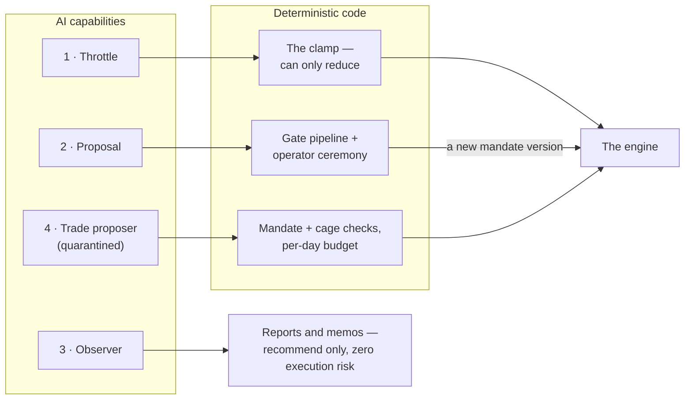
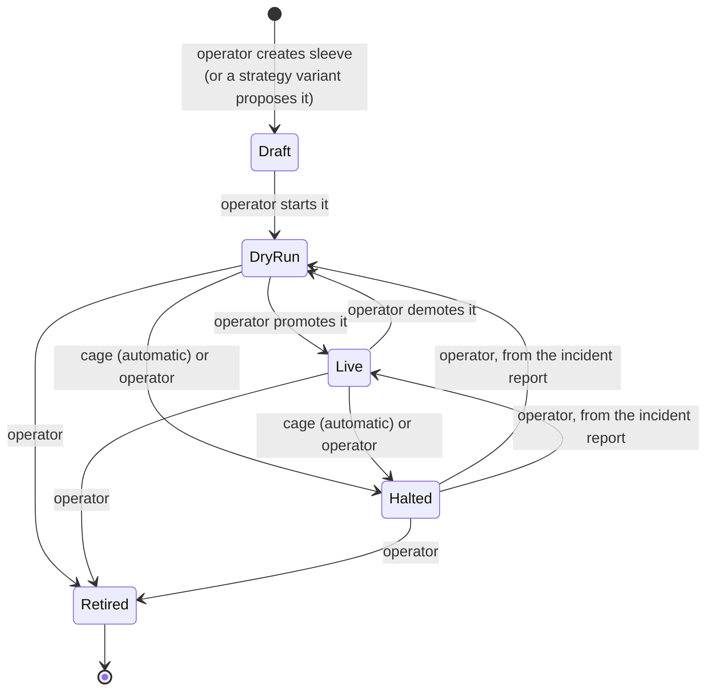

A sleeve is the product's central object: a bounded allocation of capital with its own rules of engagement. Creating, watching, and adjudicating sleeves _is_ using Ironcage. This document specifies the roster, the mandate, the AI capability system, the lifecycle, and the per-sleeve living view.

## The roster

The Sleeves view opens on the roster: every sleeve the system has ever run. Active sleeves lead — each with the same at-a-glance summary Overview shows (state, profile, allocation vs. cap, P&L net of costs, trajectory, next action) — and retired sleeves follow in an archive section, each keeping its complete record forever. A retired sleeve is a closed book, not a deleted one, and the archive is where the operator's accumulated evidence about what works actually lives. Creating a sleeve starts here.

## The mandate

Every sleeve is defined by its mandate — versioned configuration, changed only through a deliberate, recorded act ([Operations](/product/operations)), never a live slider. A mandate states:

| Section                        | What it declares                                                                                                                                                                                                                                                                                                                                                                     |
| ------------------------------ | ------------------------------------------------------------------------------------------------------------------------------------------------------------------------------------------------------------------------------------------------------------------------------------------------------------------------------------------------------------------------------------ |
| **Name and purpose**           | One paragraph a human can understand. A strategy the operator can't explain doesn't get a sleeve.                                                                                                                                                                                                                                                                                    |
| **Market, venue, instruments** | E.g. spot BTC and ETH on Kraken; US-listed ETFs via Alpaca. Kraken and Alpaca are the system's two venues by deliberate consolidation; first sleeves are spot, long-only. The mandate vocabulary supports venues, sides, and instrument classes beyond these (ASX, shorts, options) so future mandates can propose them per the scope rules in the [product introduction](/product). |
| **Strategy**                   | The systematic rules it runs, and the timeframe(s) they evaluate on.                                                                                                                                                                                                                                                                                                                 |
| **Cadence**                    | How often it acts: from quarterly rebalancing to every 4-hour candle. Never sub-minute.                                                                                                                                                                                                                                                                                              |
| **AI capabilities**            | Which capabilities from the registry this sleeve holds, with their per-sleeve parameters.                                                                                                                                                                                                                                                                                            |
| **Capital cap**                | The maximum the sleeve may ever hold, in dollars. The allocator may grant less; nothing grants more without a mandate change.                                                                                                                                                                                                                                                        |
| **Risk limits**                | The sleeve's own cage: max position size per instrument, max concurrent positions, stop-loss policy, daily loss halt, drawdown halt, trade-frequency cap.                                                                                                                                                                                                                            |
| **Winddown policy**            | What a halt does with open state: `flatten-all`, `keep-positions-cancel-orders`, or `keep-all`.                                                                                                                                                                                                                                                                                      |
| **Benchmarks**                 | What this sleeve must beat to justify itself, declared up front (always including buy-and-hold of its own universe; for any sleeve with run-time capabilities, also its own no-AI baseline).                                                                                                                                                                                         |

## Creating a sleeve

A new sleeve is authored, not configured: a guided mandate editor walks the operator through every section above, validating as it goes — strategies come from the strategy registry (they exist as reviewed code before any mandate can name them), risk limits must be complete (an unstated limit is a validation error, not a default), and structural rules are enforced at authoring time (a Piloted mandate cannot be written with more than its permanently-small cap). The finished draft is saved as the mandate's version 1 with the operator's stated purpose as its recorded reasoning, and the sleeve enters the roster in Draft: fully specified, running nothing, waiting for its dry run to begin. AI-drafted sleeves (strategy variants, below) arrive through this same door with their mandate pre-filled and their provenance attached.

## AI capabilities

AI participation is not a single dial but a set of **capabilities**: typed, bounded authorities a mandate holds, drawn from a system-wide, versioned **capability registry**. Each registry entry declares, once, what the capability consumes, the exact shape of its output, what deterministic component reads it, its cadence, its staleness window, its safe default, its audit record, its **baseline definition** (what the no-AI counterfactual is), and its **demotion rule**. A mandate then simply lists capabilities plus per-sleeve parameters.

Every capability belongs to exactly one of four **safety classes** — and the classes are closed: adding a fifth changes the product's foundations and requires its own written decision, never a feature.

Each class reaches the machine through a different deterministic checkpoint, and none holds the order button:

1. **Throttle** (run-time). Output is deterministically clamped so it can only _reduce_ what the strategy and cage would otherwise permit: a [0,1] size multiplier, an added lock, a tightened limit. Missing, stale, or invalid output resolves to the most restrictive default. Throttles compose conservatively — multiple capabilities combine by taking the most restrictive, so **adding capabilities can only make a sleeve more cautious, never less**. Worst case if the AI is wrong or fed hostile data: the sleeve behaves like its no-AI self, or stands down.
2. **Proposal** (design-time). Output is a _draft change to the machine_ — new parameter values, a strategy variant, a mandate diff — that lands in a proposal queue and must pass its declared gate pipeline before touching live behavior: schema validation → reproducible backtest → walk-forward evaluation (with multiplicity-corrected acceptance thresholds — the system assumes that an AI generating many candidates will produce impressive flukes) → champion/challenger dry-run shadowing → operator approval. A wholly wrong AI produces nothing worse than a bad proposal the gates exist to kill.
3. **Observer**. Read-only analysis: reviews, memos, calibration reports. Observers recommend; they never act. Zero execution risk.
4. **Trade proposer** (quarantined). The one non-reduce-only class: AI originates individual trades as typed intents that deterministic code checks against the mandate and cage, under a declared per-day proposal budget, with every proposal opening its decision record. Permanently small-capped, permanently experimental — the class exists so this configuration can be _studied_, never scaled.

**Capabilities follow evidence — the same discipline that governs capital applies to AI itself.** Every run-time capability computes its counterfactual on every tick: what would the sleeve have done without this capability? The counterfactual runs through the same simulated-fill machinery as dry run, accruing a per-capability **scorecard** (P&L delta, drawdown delta, cost delta versus the no-AI baseline) that is always visible on the sleeve's living view. The registry declares each capability's default demotion rule and a mandate may tighten it for its sleeve; a capability that underperforms its baseline past that rule is automatically **suspended** — output ignored, safe default applied, critical feed event, operator adjudicates. Design-time capabilities keep the analogous scorecard over their proposals: submitted, passed gates, survived live, value added.

Every capability output — every assessment, veto, tightening, and proposal — opens its decision record ([Activity](/product/activity)): what the model was asked, what it decided, and why, with a link into the platform's full trace while the platform retains it.

### Profiles (shorthand, not structure)

Named capability bundles exist purely as vocabulary. The living view always shows the actual capability list; the profile name is a summary, never the mechanism.

| Profile             | Capability bundle                                          |
| ------------------- | ---------------------------------------------------------- |
| **Clockwork**       | No capabilities (pure rules — the long-term wealth sleeve) |
| **Advised**         | The run-time throttle bundle plus observers                |
| **Assisted-design** | Advised plus proposal capabilities                         |
| **Piloted**         | Includes the trade proposer                                |

## The capability registry (initial catalog)

### Throttles

- **Regime assessment.** The generalization of the original ON/HALF/OFF signal. On its cadence, AI emits — per instrument in the sleeve's universe — a small set of named axes (e.g. trend quality, volatility state, liquidity, news risk), each on a quantized ladder (0, ¼, ½, ¾, 1) with per-axis rationale and cited sources. A deterministic combiner declared in the mandate (default: the minimum across axes) collapses it to one entry-size multiplier per instrument. An instrument at 0 simply doesn't enter. Stale or invalid → 0. ON/HALF/OFF is the one-axis, three-rung special case.
- **Event veto.** AI reads economic calendars, exchange status, and news, and writes time-boxed locks ("no BTC entries from 6h before FOMC to 2h after", "venue X degraded — lock all its instruments") with reason and source snapshot, bounded by mandate-declared maximum duration and count. AI can lock; only expiry or the operator unlocks — including locks it didn't create.
- **Risk-officer overlay.** Once daily, AI reviews the book adversarially — positions, distance to limits, news — and may apply _temporary tightenings_ of the sleeve's own limits (a lower daily-loss halt, a cap on the entry multiplier, an added lock), each with expiry, each relative to the mandate's baseline (no compounding ratchet). It can also recommend flattening — as a critical feed event for the operator's one-click controls, never as an action of its own. Exits and stops remain untouchable by every capability.

### Proposals

- **Parameter corridors.** The mandate pre-declares, per tunable strategy parameter, a corridor: minimum, maximum, maximum step per change, minimum interval between changes. AI analyzes performance and proposes new values inside the corridor with rationale and a reproducible backtest; the proposal passes the gate pipeline and becomes a new mandate version on approval. The operator signs the risk envelope once (the corridor), then adjudicates moves within it; small pre-signed sub-corridors may later auto-approve.
- **Strategy variants.** AI drafts new or modified strategy rules as a challenger: a Draft sleeve with an auto-generated mandate, entering the standard lifecycle — dry run, trial report against the incumbent, promotion or death. The AI is a prolific proposer of tenants; capital-follows-evidence is the killing floor. Concurrent trials are capped so best-of-many luck can't be laundered into capital.

### Observers

- **Calibration audit.** Periodically analyzes which limits never bind (meaninglessly loose?), which bind constantly (too tight — or the cage is doing the strategy's job), stops versus realized volatility, and recommends mandate diffs. Any loosening goes through the normal operator mandate-change act.
- **Allocation memo.** Reviews all sleeves' evidence, correlation, and conditions; writes the memo the operator reads before allocator decisions. Recommend-only.
- **Red-team scenarios.** AI authors adversarial what-ifs as typed shock specifications (gap-downs, venue outages, depegs, historical replays); a deterministic scenario engine replays them against the current book and reports which limits fire, in what order, and whether winddown behaves. Findings feed calibration and risk-officer tightenings.

### Trade proposer

- **Piloted trading.** As specified above: typed proposals, cage-checked, budget-capped, permanently small, heaviest audit load.

The registry grows by adding entries within these classes — each addition a recorded, versioned act with its baseline definition and demotion rule defined before first use.

## The lifecycle

**Draft → Dry run → Live → Halted / Retired**

The diagram and the table state the same transitions; the table adds what each state means:

| State   | Meaning                                                                                                                 | Entered by                                                             |
| ------- | ----------------------------------------------------------------------------------------------------------------------- | ---------------------------------------------------------------------- |
| Draft   | Mandate written; nothing runs                                                                                           | Operator creates sleeve (or a strategy-variant capability proposes it) |
| Dry run | Trades simulated money against live markets through the same code path as live, with realistic simulated fills and fees | Operator starts it                                                     |
| Live    | Real money within the mandate's cap                                                                                     | Operator promotes it                                                   |
| Halted  | Stopped; winddown policy applied; no new entries                                                                        | Cage (automatic) or operator                                           |
| Retired | Closed; capital returned; record kept forever                                                                           | Operator                                                               |

Every transition is a feed event recording who or what triggered it and why.

**Promotion is the operator's decision — informed, never forced.** The default recommendation is three months of dry run before first live capital, but the operator can promote or demote any sleeve at any time. The product's guarantee is _informed consent_: promotion happens through the decision ceremony ([Operations](/product/operations)) from a **trial report** ([Reports](/product/reports)) — performance against the mandate's declared benchmarks, drawdown, costs, behavior conformance, and the scorecard of every capability it holds — and the report, the timing, and the decision are permanently recorded. The system never blocks an allocation choice; it makes every one explicit and impossible to misremember.

**Halts are automatic.** Breaching the sleeve's daily loss or drawdown limits, a reconciliation mismatch, or a system-cage breach halts the sleeve without asking. A halt applies the mandate's winddown policy — with one exception: a reconciliation-mismatch halt always freezes (`keep-all`) regardless of policy, because the system never trades on numbers in dispute. Leaving Halted is always an operator action, from the halt's incident report.

Two orthogonal notes. Any running sleeve may be **paused** — an operator flag, not a lifecycle state: no new entries while existing positions and stops continue to be managed, visibly flagged everywhere the sleeve appears. And demotion (Live → Dry run) is an ordinary operator transition, recorded exactly like promotion.

## Capital accounting

Sleeves may share a venue account, but every position, order, and dollar is tagged to exactly one sleeve; per-sleeve equity, P&L, and cost accounting are exact, not estimates. Above all sleeves sits the system cage: total exposure and total drawdown limits across the whole of Ironcage, enforced independently of any sleeve's own limits.

## The living view

One page per sleeve — the heart of the observatory. Watching a sleeve think should be engaging enough that checking on it is something the operator wants to do, not has to.

**The view adapts to the mandate.** "What are you doing and why" is answered in the sleeve's own vocabulary, at the sleeve's own tempo. An Advised trading sleeve leads with its entry multipliers and each capability's contribution to them; a Clockwork rebalancing sleeve — which holds the most money and does the least — leads with holdings versus target weights, current drift, the next contribution or rebalance date, and conformance to plan. A slow sleeve's view is calm on purpose: "nothing until the next rebalance, on plan, drift 0.4%" is that sleeve's version of good news, stated proudly rather than apologized for. A view that makes the biggest allocation look boring-broken while flattering the busiest sleeve has failed this spec.

- **Now**: what the sleeve is doing at this moment. Its last tick and time to next action; the current strategy read per instrument; the effective entry multiplier per instrument and exactly how it was arrived at (each capability's current contribution — the regime assessment's axes with rationale, active event vetoes with reasons, any risk-officer tightening in force); and the distance to each cage limit, so the operator sees not just that the sleeve is safe but _how much room it has_.
- **Capabilities**: every capability the mandate holds, with its current output, its staleness, its scorecard-versus-baseline over time, and its suspension state if demoted. For design-time capabilities: the proposal queue — pending proposals with their gate results so far, and the history of accepted and rejected ones. Every output opens its decision record.
- **Positions**: open positions with entry, current price, stop, unrealized P&L, and age; open orders with their lifecycle state. Every position and completed trade opens its trade story ([Activity](/product/activity)).
- **Performance**: equity curve (dry/live distinguished), returns over standard windows, max drawdown, win rate, average win/loss, total fees and costs, and the benchmark overlays the mandate declared — including the no-AI baseline.
- **Decisions**: the sleeve-filtered activity feed — every intent with its cage verdict, every fill, every capability output change, in order.
- **Mandate**: the current mandate in full, plus its complete version history with diffs and the recorded reasoning for each change (including gate records for AI-proposed versions).
- **Trial report** (when pending): the report, presented with the promote/defer decision it exists to inform.

## The first sleeves

Two tenants are defined from the start; both go through the full lifecycle:

1. **Crypto trend** — Advised profile. Trend-following on BTC and ETH spot (Kraken), 4h–1d timeframes, volatility-scaled sizing. Initial capabilities: regime assessment, event veto, calibration audit — each running against its no-AI baseline from the first dry-run day. The first sleeve to run end-to-end, and the proving ground for the whole engine.
2. **Long-term wealth** — Clockwork profile, no capabilities. Diversified US-listed ETF holdings on a slow contribution-and-rebalance cadence. Alpaca is the target venue, contingent on an approved and funded Australian securities account and the key-transfer launch gate. Fractional or notional market-day orders track the target allocation. Actual fills, rounding, asset eligibility, and residual cash mean "exact" is never promised. Its mandate exists from day one so the allocator and portfolio views are not retrofitted. US-domiciled holdings carry W-8BEN and, at larger sizes, estate-tax considerations. The mandate records the accountant conversation before scale.

Assisted-design capabilities (parameter corridors, strategy variants) and any Piloted sleeve are supported by the product from day one but expected to be adopted only once the first two tenants have proven the machine.
