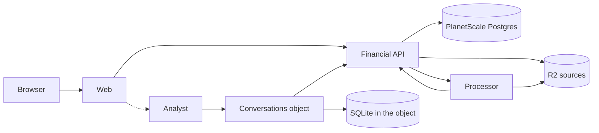

## System split

| Part      | Workspace           | Responsibility                                                                                                                  |
| --------- | ------------------- | ------------------------------------------------------------------------------------------------------------------------------- |
| Web       | `apps/web`          | Cloudflare Access validation, TanStack Start routes and server functions, query state, UI.                                      |
| API       | `workers/api`       | Postgres records, R2 sources, matching and publication, interpretation, ledger facts, commands, exports.                        |
| Processor | `workers/processor` | Workflows: parse one file and publish it through the API, run enrichment with a model, build exports, and rebuild ledger facts. |
| Analyst   | `workers/analyst`   | Conversations kept in a Durable Object's SQLite, with each question answered in the background from reads of the API.           |

The API is the only Worker that writes financial records and the only one with a database binding. The processor reads R2 and calls the API. The analyst keeps conversations in its Durable Object's SQLite and reads financial data only through the API. The web app has the analyst's binding, and its screens come next (see the [roadmap](/roadmap)).

## Shared packages

| Package              | Contents                                                                                                                                   |
| -------------------- | ------------------------------------------------------------------------------------------------------------------------------------------ |
| `packages/contracts` | Effect schemas for values and payloads that two workspaces exchange. Branded IDs, Money, filters, results.                                 |
| `packages/finance`   | Deterministic money, date, matching, descriptor, interpretation, and calculation functions. Imported by the API, the processor, and tests. |
| `infra`              | The Alchemy stack. One module per service under `infra/src/`, composed by `infra/src/worker-bindings.ts`.                                  |

File parsers live in the processor, because they carry large libraries such as PDF.js. Descriptor parsing is a pure function over one posting and lives in `packages/finance`, so the API can run it inside a transaction. SQL over financial records lives in the API; the analyst's SQL covers only its conversations. UI lives in the web app. A Worker never imports another Worker's internals. Shared packages never import a Worker, a route, or infrastructure. Add a package when two workspaces need the same runtime code, and a Worker when there is a distinct execution or storage requirement.

## RPC chain

1. `operations` in `workers/api/src/index.ts` is one Effect that yields the API's services and returns every operation as a method of one of them. `ApiOperations` is its success type, so adding an operation is one entry there. It depends only on service types, not on the Worker's bindings, so the infra Worker class can use it without referring to itself.
2. `infra/src/api.ts` declares the API Worker class with `ApiOperations`, and `infra/src/processor.ts` picks the processor's methods with `Pick`. `infra/src/analyst.ts` declares the `Conversations` Durable Object class with `ConversationOperations` from `workers/analyst/src/conversations/index.ts`, and the Analyst Worker with `AnalystOperations` from `workers/analyst/src/index.ts`. The Analyst Worker forwards each call to the one object, named `ledger`. The bridge infers argument, success, and tagged failure types for callers. The object declares `FinanceError`, so its failures reach the Worker as that class.
3. `infra/src/worker-bindings.ts` gives each Worker its bindings: the API its storage, Hyperdrive, and processor binding, the processor its Workflows, the analyst's object its API binding and AI Gateway client, and the web app its API and analyst bindings. Each Workflow in `infra/src/processor.ts` binds the API itself with `Cloudflare.Workers.bindWorker(Api)`. The analyst binds it with `bindWorker(Api, { errors: [FinanceError] })`, typed `ApiClient<AnalystOperation>`.
4. The web app's server functions validate browser input with the contracts schemas and call the API through the typed binding. `ApiClient` in `infra/src/api.ts` types a binding's methods as the API declares them, plus the `RpcCallError` a call fails with when the API Worker throws, runs out of CPU, restarts, or loses the connection. The web maps that error to `unavailable` when it answers a request, and the analyst when a call returns (`workers/analyst/src/platform/api.ts`). `apps/web/src/server/api-client.server.ts` exposes `ApiClient<WebOperation>`: every operation except `InternalOperation`, the ones only the processor, the analyst, and tests call, such as `publishImport` and `recordModelUsage`. `AnalystOperation` names what the analyst may call: reads, previews, `getModelAllowance`, and `recordModelUsage`. Naming any other command there fails to compile.

Method signatures come from the service implementations, so a changed service signature reaches every caller. Payload schemas are shared where two sides need them. There is no generated HTTP client.

## Boundary rules

- The web Worker validates the Access JWT's signature, issuer, audience, and expiry on every request, including downloads and server functions. Local development uses a local identity only when the stage is `dev`.
- The API, processor, and analyst have no public routes. Service bindings are the only way in.
- Responses carry what a screen or tool needs: record fields and evidence references. They never carry storage keys, credentials, or full bank account numbers beyond what the account settings screen shows.
- Browser input, stored JSON, and model output are validated at the boundary. Inside a Worker, decoded types are trusted.

## Effect service lifetime

The API builds its application layers during Worker initialization. Platform
adapters capture Alchemy's `RuntimeContext` there, so domain services expose only
their results and typed failures. Binding clients defer I/O until a handler runs;
initialization must not open connections or perform storage operations.

Alchemy's `PostgresLayer` creates the pool lazily within the current execution
scope and closes it when that scope ends. Application code does not keep a pool
or a `ManagedRuntime` across Worker requests. No-argument service reads are
Effect values; the RPC boundary exposes them as callable methods.

The `Conversations` object builds its services and runs its SQLite migrations each time
it activates, before it takes a call or an alarm. Its methods, like the API's, expose
only results and `FinanceError`. A failure of its own SQLite is a defect.

Cloudflare Workflow tasks report native failures as defects. Workflow recovery
handles those defects without converting interruption into successful work.
Multipart exports bracket acquisition and cleanup with `Effect.acquireUseRelease`,
so failure or cancellation aborts an unfinished upload.

## Background work

Cloudflare Workflows runs imports with a few steps and the platform's bounded retries. The API keeps a small import status and the Workflow instance ID; it asks the platform for instance status when the import has no summary yet. There is no application job table.

A failed step is visible on its owning screen with a retry action that starts new work. A retry may reparse a file or repeat a model call; publication and commands are what make repeats safe.

The analyst answers questions in the background too, through the object's alarm instead of a Workflow. See [Analyst conversations](#analyst-conversations).

## Analyst conversations

One `Conversations` Durable Object holds every conversation, because they all describe the one ledger. It is an Effect layer like the API, and calls the model through Effect AI (see [the decision](/reference/decisions#the-analyst-is-effect-ai-in-a-durable-object)). It stores conversations in its SQLite through `@effect/sql-sqlite-do`. `workers/analyst/src/storage/migrations.ts` holds the schema as `effect/unstable/sql/Migrator` migrations, one statement per `sql` call, and JSON columns hold the contract's JSON encoding as text.

| Table           | Holds                                                                                                                                                            |
| --------------- | ---------------------------------------------------------------------------------------------------------------------------------------------------------------- |
| `conversations` | The title, taken from the first question, when a question was last asked, and `next_reference`, the number the next figure or record cited in it takes.          |
| `turns`         | Each question with its context, its status, its answer, why it was blocked or failed, how many attempts the analyst started, and when it was asked and finished. |
| `turn_steps`    | What the analyst read on the way to an answer, in order, with the screen that shows each read.                                                                   |

A turn is `queued`, `running`, `answered`, `blocked`, or `failed`. `blocked` means the analyst is off or model usage reached the warning, and `failed` that it could not finish. Both keep a message that says why.

`ask` carries a command ID. The turn takes that ID, and so does the conversation it starts, so repeating an ask returns the same conversation without queuing another turn. Reusing the ID for a different question fails with `conflict`. A conversation answers one question at a time. Asking while a turn is queued or running fails with `conflict`, and a unique index on unfinished turns holds the rule in storage.

`ask` stores the queued turn and sets the object's alarm. The alarm runs `WorkScheduler.runNext`, which works on one turn and sets the alarm again while turns wait, so the answer does not depend on the browser staying open. A turn that finds the analyst off, or usage at the warning, ends `blocked` with the allowance's message. Otherwise the analyst works with the model until it has an answer it can keep, and the turn ends `answered` or `failed` (see [the analyst's turns](/reference/ai#turns)). Each step is stored as the analyst takes it, so the conversation shows the steps of a running turn.

A failed alarm runs again, up to six times with backoff. A turn an earlier attempt left `running` starts again, and each start counts an attempt on the turn and clears the steps of the attempt before. A turn found `running` after five attempts ends `failed`, so it never stays running or holds up other conversations. The count is the turn's, not the platform's retry count, because every ask sets the object's one alarm again and starts that count over.

## Infrastructure ownership

Each service module under `infra/src/` declares the resources that service owns. The API in `infra/src/api.ts` declares Postgres, Hyperdrive, the sources bucket, and the `TemporaryExports` bucket with its seven-day expiry. The processor in `infra/src/processor.ts` declares four Workflows: `ImportWorkflow`, `ExportWorkflow`, `EnrichmentWorkflow`, and `FactsWorkflow`. The web module declares the site, domain, and Access application. The analyst in `infra/src/analyst.ts` declares the `Conversations` Durable Object class, the Analyst Worker that hosts it, and its own AI Gateway, `AnalystGateway`. Deployment values and secrets stay in the stack and never enter a runtime bundle. Runtime entry points may import their inferred binding types from `@repo/infra/worker-bindings` as type-only imports.

The processor's enrichment service owns an AI Gateway in `infra/src/enrichment.ts`,
and `infra/src/worker-bindings.ts` composes its binding into the enrichment
workflow and `AnalystGateway`'s into the analyst's object. On both gateways
authentication is enabled, and logging and caching are disabled.
Development uses a real stage-specific gateway. Local infrastructure tests replace
only the gateway's cloud resource provider and make no model calls.
`infra/src/models.ts` holds the Workers AI prices for the enrichment and analyst
models, which the API receives through its bindings.

## Local development

`pnpm dev` runs the whole stack locally against a Docker Postgres on host port 54329, which stays fixed so a Docker restart does not strand the recorded connection. Test stages let Docker choose their ports.

Editing code under `workers/` rebuilds that Worker's bundle and restarts its local runtime. A Workflow step that is running dies with it, and the local Workflow engine never resumes the instance, so it reports `running` indefinitely. The import, export, or enrichment run it belongs to stays running too. Mark that run failed in the local database; for enrichment, the next run picks up the aliases that were left. Avoid editing Worker code, or packages the Workers share, while a long run is in progress.

`pnpm dev` uses the Cloudflare runtime’s supported registry polling mode. The native directory watcher failed to propagate API worker registrations to the separate Vite process on macOS; polling restores service bindings. This changes local discovery only. Hosted workers use Cloudflare service bindings.
