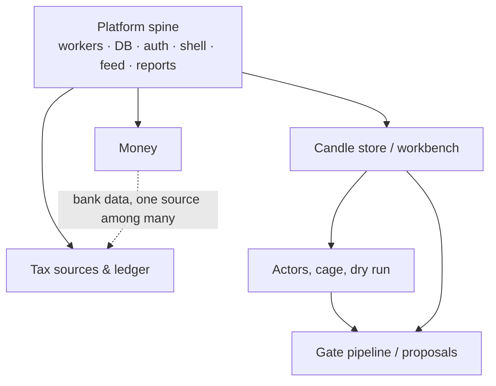

The build order, decided and recorded in the [decision history](/technical/appendix/decisions): **Money first, Tax second, the investing engine third.** No dates — phases end when their exit criteria hold, and the phases exist because of two facts about this system: the read-only surfaces are useful immediately at zero risk, and the platform spine they require is the same spine the engine will later stand on. Building in this order means every piece of shared infrastructure is proven on money-that-only-gets-read before it touches money-that-moves.

## Phase 1 — Wealth management (Money)

Bank import, categorization, spending analysis, and the first reports — the [Money](/product/money) surface end to end.

What it delivers: fixture-proven paired CommBank CSV/OFX import with overlap dedupe, source preservation, balance reconciliation, and account-level coverage. It also delivers the categorization capability with its review queue and rules, monthly/trends/recurring/anomaly analysis, savings suggestions, the monthly spending report, and external balances feeding a first whole-of-wealth view. QIF remains unsupported because it adds no identity or reconciliation evidence. Older statements are archived immediately and enter the record only through account-specific fixture-proven parsers.

**What phase 1 quietly builds — the real payload:**

- The monorepo, the four-Worker skeleton (compute can stay empty), local dev, deploys, migrations.
- `wealth.arishi.dev` behind Cloudflare Access — the decided auth model ([decision history](/technical/appendix/decisions)).
- Postgres via dual Hyperdrive, the schema conventions, R2 layout.
- The app shell (mode, connection indicator, attention items), TanStack Query + feed plumbing.
- The feed itself: events, severities, acknowledgment — exercised by imports and anomalies before anything critical exists.
- **The entire AI runtime on its first real capability**: the categorization agent in pinned Flue, gateway-fronted providers, the decision-records queue and DLQ consumer, returned Gateway Log IDs/application trace IDs, explicit Flue durable-state inventory, safe defaults, and the review queue. Every seam the regime assessment will later cross gets crossed first by transaction categorization, where the worst possible failure is a miscategorized coffee.
- The reports library with its first report type.

:::note[Exit criteria]
Two years of available structured CommBank history imported for the four required accounts through overlapping paired bundles. Reimport must produce zero new canonical transactions, and all complete months must pass account, row-pair, balance, and coverage reconciliation. Redacted observed fixtures must cover all four account types and their observed signs, balances, identifiers, windows, and overlaps; deterministic fixtures may cover collisions, quoting, character decoding, empty results, and the 600-row edge. Categorization must learn visible rules from corrections, and the first complete-month report must be generated. Statement PDFs must be archived, but production statement parsing is a later tranche unless the required overlap fixtures already pass.
:::

## Phase 2 — Tax

The [tax engine](/product/tax): source sync workflows (Kraken full-history export, external exchanges, wallets, Alpaca activities, bank interest from phase 1's data), the canonical event ledger, `packages/tax` computation (parcels, CGT, Division 775, FITO), the verification layer, the FY report, and the running estimate on Portfolio.

Why second: it completes the read-only half while the engine is still unbuilt, replaces the paid external service (the one-time oracle comparison happens here), and its source-sync machinery — long-running workflows, gap ledgers, reconciliation against external systems — is a dress rehearsal for venue reconciliation. It also makes phase 3 accountable from birth: when the first sleeve trades, its tax events land in an engine that already works.

:::note[Exit criteria]
Full history reconciled from raw sources across every account and wallet; balance reconciliation green on every source; differences against the prior service's export itemized and each one explained; a FY report an accountant would accept. The fixture homework lands here too: a full Kraken history export and a real Alpaca activities pull are what clear the venue-export and activity-code **VERIFY** markers in the technical chapters.
:::

## Phase 3 — The investing engine

Everything else, in lifecycle order:

<Steps>
  <Step title="Candle store and workbench basics">
    Collection, backfill from Kraken archives, coverage honesty, first backtests of the crypto-trend
    strategy in the compute container.
  </Step>
  <Step title="The actors and the cage">
    Sleeve, venue, system-cage, feed actors; the tick; the intent ledger; adapter shape proven
    against Alpaca paper and Kraken validate, then the exact live launch fixtures and
    written-confirmation gates in [Venues](/technical/venues) before capital is enabled.
  </Step>
  <Step title="Crypto-trend in dry run">
    The first tenant, with its capabilities (regime assessment, event veto, calibration audit)
    accruing scorecards against their no-AI baselines from day one, and the living view making it
    worth watching.
  </Step>
  <Step title="Trial, promotion, live">
    The trial report, the ceremony, first small real capital on Kraken; the long-term wealth sleeve
    arrives only after a funded Australian-resident Alpaca securities account and its credential
    transfer boundary are proven, then completes its own dry run.
  </Step>
  <Step title="The proving machinery matures">
    Gate pipeline, proposals, shadow runs — once there is an incumbent worth challenging.
  </Step>
</Steps>

:::warning[Easy to misremember]
**Dry run is our own simulated-fill machinery against live market data, not a venue paper account.** Kraken offers no spot sandbox at all, and one simulator serving dry run, backtests, and the no-AI counterfactuals is what makes their evidence comparable. Alpaca's paper account is provisioned anyway — it integration-tests the venue adapter, nothing more. Recorded in the [decision history](/technical/appendix/decisions).
:::

## The dependency map

What actually depends on what — and therefore what could proceed in parallel if the operator's appetite says so:

The diagram and the table state the same dependencies; the table adds what each row is independent of:

| Work                                                     | Depends on                               | Independent of               |
| -------------------------------------------------------- | ---------------------------------------- | ---------------------------- |
| Platform spine (workers, DB, auth, shell, feed, reports) | —                                        | everything below             |
| Money                                                    | spine                                    | tax computation, engine      |
| Tax sources & ledger                                     | spine; bank data (one source among many) | engine (until sleeves trade) |
| Candle store / workbench                                 | spine                                    | Money, tax                   |
| Actors, cage, dry run                                    | spine, candle store                      | Money, tax                   |
| Gate pipeline / proposals                                | workbench, a running sleeve              | Money, tax                   |

The phases serialize the spine's construction through the lowest-risk consumer first; after phase 1, the islands are genuinely parallel and the order between tax and engine work is preference, not dependency — the decided preference is tax first.
