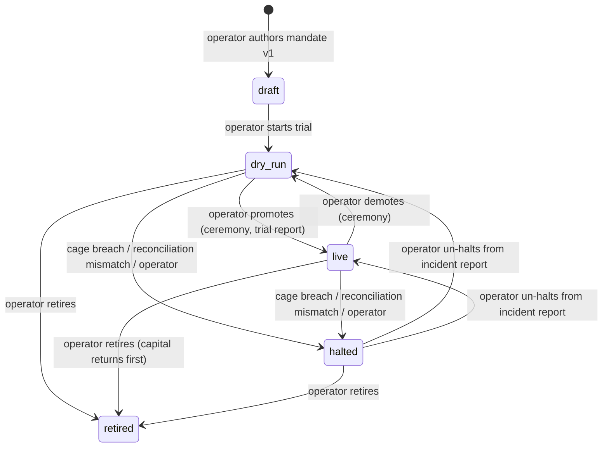

The domain vocabulary is defined in the [glossary](/glossary); the product docs say what each object means to the operator. This chapter gives those objects their technical identities, their lifecycles as state machines, and a single owner for every invariant. It also defines the system's accounting: how a sleeve's value is measured so that a deposit or a withdrawal can never look like performance. It stops where storage begins: schemas and DDL are in [Data](/technical/data), and the order intent's lifecycle is specified where it is executed, in [Venues](/technical/venues).

## What this chapter guarantees

- Every domain object has a stated identity scheme, and any row anywhere in the system can be traced to its owning object.
- Every lifecycle is a state machine with named writers. No state changes by an unlisted writer.
- Every invariant in the invariant table has exactly one owner. A second apparent owner elsewhere in the docs is a defect.
- No deposit or withdrawal can mask a loss, create one, or move a drawdown percentage. The unit accounting defined here makes that arithmetic, not policy.
- Allocation and equity are never conflated. Allocation is authority granted by the operator; equity is measured value; and the balance sheet is asserted on schedule, never assumed.

## Identities

- **All IDs are UUIDv7**, minted by the writer before any external call that references them. An intent has its ID before the venue hears of it; a decision record has its ID before the model is called. UUIDv7 values sort by creation time, which keeps append-only ledgers naturally ordered and makes pagination cursors trivial. One format serves every role in the system, including the venue client-order-ID role, where field limits are strict.
- **Ticks are identified by `(sleeve_id, candle_close_at)`**, not by a generated ID. The tick's identity must be derivable by anyone at any time, because idempotency depends on two executions computing the same key.
- **Mandates are identified by `(sleeve_id, version)`**, monotonically increasing integers. Every intent, verdict, and scorecard row records the mandate version it was produced under, so behavior at any past moment is reconstructable.
- **Strategies are identified by `name@version`** in the strategy registry, referenced by mandates. Strategy code changes require a new version; there is no editing a strategy under a running sleeve.
- **Capabilities are identified by registry name**, with model and parameter choices held in versioned configuration rows, so a scorecard is always attributable to the exact configuration that produced it.

## Money and quantities

Money is a `NUMERIC` value beside a currency code, decoded to a decimal type at every boundary. Asset quantities are the same shape beside an asset code. A JavaScript `number` must never hold a financial value in storage or in a contract. Display rounding is half-even at the currency's minor unit; stored values keep full precision. The accounting currency is AUD; every cage comparison happens in AUD at recorded marks.

## Equity and unit accounting

This section is the one home for equity arithmetic; every other chapter that mentions equity restates a summary and points here.

Raw equity mixes two things that must never mix: investment performance and capital flows. A sleeve that holds A$100, receives a A$20 deposit, and then loses A$5 ends the day at A$115. Compared naively against the morning's A$100, that reads as a 15% gain, and the loss disappears inside the deposit. Any monitor that reads raw equity can be blinded, or falsely triggered, by moving money. The fix is the one fund accounting has always used: measure value per unit, and let flows change the number of units instead of the price.

### The unit ledger

Each sleeve keeps a unit ledger per execution-mode segment (one for its dry-run history, a fresh one from promotion, a fresh one again if it is later demoted). At the start of a segment, a sleeve with positive equity issues units at a price of 1. Immediately before any external capital flow, the ledger computes the current unit price and issues or redeems units at that price:

$$
\begin{aligned}
\text{unit price}_{\text{before}} &= \frac{\text{equity}_{\text{before flow}}}{\text{units}_{\text{before}}} \\[4pt]
\text{units}_{\text{after}} &= \text{units}_{\text{before}} + \frac{\text{capital flow}}{\text{unit price}_{\text{before}}} \\[4pt]
\text{unit price}_{\text{after}} &= \frac{\text{equity}_{\text{after flow}}}{\text{units}_{\text{after}}}
\end{aligned}
$$

A deposit is a positive capital flow; a withdrawal is negative. Because equity changes by exactly the flow amount, the unit price after equals the unit price before whenever there is no investment P&L in between. A flow moves the unit count and leaves the price alone; only performance moves the price.

:::note[Worked example — illustrative, not a default]
A sleeve begins a day at equity A$100 with 100 units, unit price 1. A deposit of A$20 issues 20 units at price 1: equity A$120, 120 units, price still 1. A trading loss of A$5 leaves equity A$115 and unit price 115 / 120 = 0.95833. The naive equity comparison shows +15% on the day; the unit price correctly shows −4.17%, and the deposit created neither gain nor loss. A withdrawal is symmetric: it redeems units at the current price and cannot manufacture a drawdown.
:::

### What the monitors read

The daily-loss and drawdown monitors read the unit-price series, never raw equity. At the UTC day boundary the sleeve actor snapshots the day-start unit price, and:

$$
\begin{aligned}
\text{daily loss fraction} &= \max\left(0,\; 1 - \frac{\text{unit price}_{\text{now}}}{\text{unit price}_{\text{day start}}}\right) \\[4pt]
\text{high-water unit price} &= \max\left(\text{high-water}_{\text{previous}},\; \text{unit price}_{\text{now}}\right) \\[4pt]
\text{drawdown} &= \max\left(0,\; 1 - \frac{\text{unit price}_{\text{now}}}{\text{high-water unit price}}\right)
\end{aligned}
$$

Continuing the example with a high-water unit price of 1: after the loss, both the daily loss and the drawdown read 4.17%, regardless of the deposit. The thresholds these numbers are compared against are mandate values, and the monitors' halt behavior is specified in [The tick](/technical/the-tick).

The unit count and both prices must be positive for the monitors to compute. A sleeve with zero units and no positions or obligations has inactive monitors, which is correct: there is nothing to protect. Zero or negative equity while a position or a possible fill remains is an uncomputable critical condition, and the sleeve halts.

### Which flows count

For a sleeve's ledger, allocator-to-sleeve attributions and transfers in or out are capital flows. For the system-level ledger, only deposits into and withdrawals from managed real capital issue or redeem system units; allocator-to-sleeve flows and movements between managed locations are internal and do not. The system series excludes shadow and dry-run equity. System drawdown unitizes real investing value with the same algorithm.

### Authority and value

Allocation is authority; equity is value. The identity `total system capital = unallocated + Σ allocations` survives only as the authority ledger: it states how much new risk the operator has authorized per sleeve and how much authority remains unallocated. It stops being a value statement the moment any sleeve has profit or loss, because allocation changes only by operator act while equity moves with every mark. A sleeve whose equity rises above its allocation does not gain headroom, and a sleeve whose equity falls below it cannot spend cash it no longer has.

The value statement is the balance-sheet identity, asserted by a nightly scheduled check:

$$
\text{system equity} = \text{unallocated cash} + \sum \text{sleeve equity} + \text{in transit}
$$

Every asset is valued exactly once: it leaves its source book before entering the in-transit book, and leaves in-transit before entering its destination. A venue-reported asset or movement with no resolved attribution becomes a suspense record and blocks the affected scope until the operator resolves it; it is never silently valued into a book ([Venues](/technical/venues)). A failed assertion is a critical finding, never an auto-correction.

## Lifecycles

### The sleeve

A sleeve moves through five states, and only the writers named below may move it. The diagram and the table state the same rules.



| Transition                             | Writer                                       | Requires                                                      |
| -------------------------------------- | -------------------------------------------- | ------------------------------------------------------------- |
| any → `halted`                         | The sleeve actor (automatic) or the operator | Nothing. Halts are never gated.                               |
| `halted` → anything                    | Operator only                                | The un-halt action exists only on the incident report's view. |
| `dry_run` → `live`, `live` → `dry_run` | Operator only                                | Ceremony, with the trial report as evidence.                  |
| any → `retired`                        | Operator only                                | Ceremony. Retirement archives; it never deletes.              |

The lifecycle state lives in Postgres and changes only through these writers; the actor caches it and refreshes at tick boundaries.

**Pause is a flag, not a state.** A paused sleeve stays `dry_run` or `live`; its ticks skip new entries while positions, stops, and reconciliation continue to be managed. The flag is set and cleared by the operator without ceremony, because pausing only reduces risk.

**Accounting follows the mode.** Each execution-mode segment has its own unit ledger and high-water mark, as defined in the equity section above, so dry-run drawdown never counts against the live record and demotion starts a fresh dry-run evaluation rather than merging histories.

### The order intent

Specified where it is executed: [Venues](/technical/venues) has the state machine, the transition table, and the ambiguity protocol; [The tick](/technical/the-tick) creates intents and hands them off at execution. Its identity here: the intent's UUIDv7 doubles as the venue client-order ID.

### The proposal

```mermaid
stateDiagram-v2
    [*] --> submitted: bundle lands in the R2 quarantine bucket
    submitted --> validating: gate pipeline picks it up
    validating --> backtesting --> walk_forward --> shadow --> awaiting_approval
    validating --> killed: schema/corridor violation
    backtesting --> killed: claimed results don't reproduce
    walk_forward --> killed: fails corrected thresholds
    shadow --> killed: challenger loses
    awaiting_approval --> approved: operator ceremony
    awaiting_approval --> rejected: operator ceremony
    approved --> [*]: becomes a mandate version / draft sleeve
```

Writers: the gate-pipeline Workflow advances every state except the last two, which only the operator's ceremony writes. An agent must not be able to advance its own proposal. Proposal bundles are content-addressed objects in a dedicated R2 quarantine bucket; the bundle lifecycle and full gate semantics are in [Workbench](/technical/workbench).

### The capital act

Only the operator changes a sleeve's allocation limit, through one of three acts. An act changes authority immediately and settles value over time; it never creates or destroys value itself. Value moves through transfers, and an act that needs money moved issues a transfer request. A dismissed transfer request cancels the act awaiting it, recorded like the act itself.

| Act        | Immediate effect                                                | Settlement                                                                         | Complete when                                                             |
| ---------- | --------------------------------------------------------------- | ---------------------------------------------------------------------------------- | ------------------------------------------------------------------------- |
| **Fund**   | Records the higher limit; validates against the mandate cap     | Attributes unallocated equity to the sleeve; requests a transfer if cash must move | The limit is active and required funding is settled at the sleeve's venue |
| **Reduce** | Lowers the entry limit at once; blocks new entries above target | Returns sleeve equity above the target as it becomes settled cash                  | Sleeve equity is at or below target with no excess sleeve cash            |
| **Return** | Sets the allocation to zero and stops new entries               | Moves residual sleeve assets to unallocated after positions and obligations close  | No positions, orders, liabilities, or sleeve-owned cash remain            |

### The transfer

`pending → settled | flagged | dismissed`. A transfer is created when the operator records a movement or when a capital act needs money moved. The system never initiates a bank or venue withdrawal; it requests, records, and watches.

Settlement is by matching. When reconciliation detects a venue- or bank-side movement, the movement settles a pending transfer only if it matches by exact amount, direction, and arrival within 3 days, and the match is unique or carries an explicit reference. Amounts are exact because same-bank transfers arrive exact; there is no tolerance. An ambiguous match waits for operator confirmation. A detected movement that matches no pending transfer is never adopted as one: it lands in a suspense record and the affected scope pauses until the operator claims or flags it, per the claim-first reconciliation protocol in [Venues](/technical/venues).

A transfer is flagged when its expected window passes or the amount differs, and a flagged transfer is corrected only by the operator's hand. For a cross-currency funding flow, the achieved FX rate attaches to the legs only when source evidence ties the conversion to the movement; otherwise the legs stay related with policy-rate valuations.

### The override

`armed → active → consumed | expired`. Armed by ceremony with a typed confirmation phrase. It becomes active after a 15-minute cooling-off and expires 24 hours after activation. It covers one limit, one sleeve, one action class, with a stated maximum action size. It is consumed by a single use, applied by compare-and-set inside the verdict's transaction, so two concurrent evaluations cannot both spend it. Any new mandate version for the sleeve voids an outstanding override.

The cage's evaluation reads overrides in exactly one place, and the verdict records the rule as **overridden**, never as passed. An override may also lift a capability-written event lock; the operator outranks the AI, and the ceremony preserves the evidence of the disagreement. The system cage and the risk-reducing controls never read the override table at all.

## The invariant table

The single-owner rule, made explicit. Each row names the one component allowed to decide the fact, where the authoritative copy lives, and how other copies are reconciled.

| Invariant                                                   | Owner (single writer)                                                         | Authoritative store                       | Other copies, and their reconciliation                                                                                                                                                                                                        |
| ----------------------------------------------------------- | ----------------------------------------------------------------------------- | ----------------------------------------- | --------------------------------------------------------------------------------------------------------------------------------------------------------------------------------------------------------------------------------------------- |
| A sleeve's lifecycle state and pause flag                   | Sleeve actor (halts) / operator via `AppApi` (everything else)                | Postgres `sleeves` + `sleeve_transitions` | The actor's cached copy refreshes on every tick; the app renders from Postgres.                                                                                                                                                               |
| A sleeve's cage counters (positions, daily loss, frequency) | Sleeve actor                                                                  | The actor's SQLite, as a projection       | Rebuilt from the blotter on `rebuild()`; audited by reconciliation.                                                                                                                                                                           |
| The system mode (`running` / `halted`)                      | System-cage actor (automatic halts) / operator via ceremony (everything else) | Postgres                                  | The actor caches and enforces the mode. Flagship kill switches are a separate brake checked in series: the effective answer is the more restrictive, an unreadable flag reads as kill, and no flag can start, resume, or loosen anything.     |
| Total exposure and reservations                             | System-cage actor (sole granter)                                              | Postgres reservation rows                 | The actor's copy is a projection, rebuilt on `rebuild()`. Headroom returns only on a proven terminal venue outcome ([The tick](/technical/the-tick)); recomputed from the blotter at every reconciliation, and drift is a `critical` finding. |
| An intent's lifecycle state                                 | Venue actor (after handoff); sleeve actor (creation and cage rejection)       | Postgres `order_intents`                  | Advanced by compare-and-set with an append-only transition ledger ([Data](/technical/data)). The sleeve's in-flight marker is a local flag, cleared on settlement, never authoritative.                                                       |
| The blotter (intents, orders, fills)                        | Writing actors, append-only                                                   | Postgres                                  | Append-only is enforced by database role, not convention ([Data](/technical/data)). Positions are computed projections; reconciliation recomputes them independently before comparing with the venue.                                         |
| Kraken's nonce                                              | The `kraken-primary` venue actor                                              | The actor's storage                       | None. No other code may call Kraken's private API; the nonce formula makes a lost value recoverable from the clock ([Venues](/technical/venues)).                                                                                             |
| A capability's latest output and freshness                  | The queue consumer in core (writes); the registry (staleness window)          | Postgres `capability_outputs`             | The consumer dedupes by run ID inside the write transaction ([Contracts](/technical/contracts)). Agents hold nothing authoritative; their transcripts are debugging material.                                                                 |
| Mandates and system-cage configuration                      | Operator via ceremony                                                         | Postgres, versioned                       | Actors cache the active version and refresh at tick boundaries; changes take effect next tick, never mid-decision.                                                                                                                            |
| The authority ledger (unallocated + Σ allocation limits)    | Operator via capital acts (ceremony)                                          | Postgres                                  | Read by entry checks as the allocation limit; it states authority, never value.                                                                                                                                                               |
| The unit ledgers and the balance-sheet identity             | Core's capital-flow handler, in the same transaction as the flow it prices    | Postgres                                  | Recomputable from the equity series and recorded flows; the balance-sheet identity is asserted nightly, and a failure is a `critical` finding.                                                                                                |

## Technical glossary

Terms this specification adds to the product vocabulary, defined once:

- **Actor** — a Durable Object used as a named single-writer. "The sleeve actor" is the DO instance owning one sleeve.
- **Outbox** — the Postgres `pending_effects` table holding obligations that must reach a system other than Postgres, written in the same transaction as the fact that requires them. At v1 it carries the halt email and nothing else. Drained by the system-cage actor's alarm; defined in [Data](/technical/data).
- **In-flight marker** — the actor-local flag recording work in progress, written before the Postgres commit or venue call it precedes. On crash recovery, a marker without a matching row means the work never committed and is re-run idempotently.
- **Receipt** — a pointer (an ID or R2 key) returned by a Workflow step in place of its real output, which the step wrote to Postgres or R2. Workflow state is orchestration, never record.
- **Projection** — any derived state that can be dropped and rebuilt from Postgres. All actor state is either an in-flight marker or a projection.
- **Safe default** — the value a capability's consumer uses when the output is missing, stale, or invalid. Declared per capability in the registry; always the most restrictive choice.
- **No-AI identity** — the value that means the capability is absent, also declared per capability. It is not the safe default, and scorecards compare against it, never the safe default; the distinction is explained in [AI](/technical/ai).
- **Suspense record** — a detected external asset or movement with no resolved attribution. It blocks the affected scope until the operator claims or flags it ([Venues](/technical/venues)).
- **Worked example** — the fixed crypto-trend trade threaded through chapters 05–07; full trace in [Crypto trend order](/technical/examples/crypto-trend-order).

## Values set in this chapter

| Value                              | Default                                | Owner         | Status  |
| ---------------------------------- | -------------------------------------- | ------------- | ------- |
| Accounting currency                | AUD                                    | engine config | decided |
| Display rounding                   | half-even at the currency's minor unit | engine config | decided |
| Initial unit price (segment start) | 1                                      | engine config | decided |
| Daily unit-price snapshot boundary | UTC day boundary                       | engine config | decided |
| Transfer matching window           | 3 days                                 | engine config | decided |
| Transfer amount tolerance          | none (exact match)                     | engine config | decided |
| Override cooling-off               | 15 minutes                             | engine config | decided |
| Override lifetime after activation | 24 hours                               | engine config | decided |

## Alternatives considered

- **ULIDs for all IDs.** Rejected: the intent ID doubles as the venue client-order ID, and Kraken's client-order field accepts a UUID or at most 18 ASCII characters, which a 26-character ULID violates. UUIDv7 keeps the creation-time sortability that made ULIDs attractive and is valid on both venues.
- **A generated ID for the tick.** Rejected: idempotency requires the key to be derivable, not generated. Two executions of the same tick must compute the same identity.
- **Sleeve mode in Flagship as the authority.** Rejected: flags are eventually consistent and vendor-hosted. Mode and lifecycle live in Postgres behind the ceremony; flags may only brake.
- **Flow-adjusted equity instead of unitization.** Rejected: subtracting deposits from P&L works until a flow lands between two snapshots, and every monitor then needs its own correction. Unitization makes flow-invariance a property of the arithmetic instead of a set of patches.
- **A mutable current-balance field per book.** Rejected: a balance that is overwritten cannot be audited. The record is an append-only journal, and balances are projections recomputed from it.
- **Time-based reservation release.** Rejected: a reservation whose intent may have reached the venue cannot be assumed dead because a timer fired. Expiry is detection, never release; headroom returns only on a proven terminal venue outcome, per the protocol in [The tick](/technical/the-tick).

## Open questions

1. **Mandate document schema.** The question: the full field-level schema of the mandate `jsonb`, currently sketched across the product docs and the tick chapter. Safe fallback while open: entry checks reject any mandate missing a field they need, so an incomplete schema fails closed rather than trading on defaults. Must close before: the Data chapter's DDL is frozen for the engine build. Evidence that closes it: the Effect Schema in `packages/domain`, reproduced in [Data](/technical/data).

## Build checklist

- [ ] `packages/domain` with the ID types (UUIDv7 newtypes, TickId, mandate version), Money/Quantity types, and their Schemas
- [ ] State machines above encoded as types with writer-restricted transition functions
- [ ] The unit-accounting module, with a property test: a capital flow of any size at any point leaves the unit price, daily loss, and drawdown unchanged
- [ ] The nightly balance-sheet assertion implemented as a scheduled check that emits a `critical` finding on failure
- [ ] The invariant table's reconciliation checks implemented as scheduled assertions
- [ ] Property test: transition functions reject every unlisted (state, writer) pair
