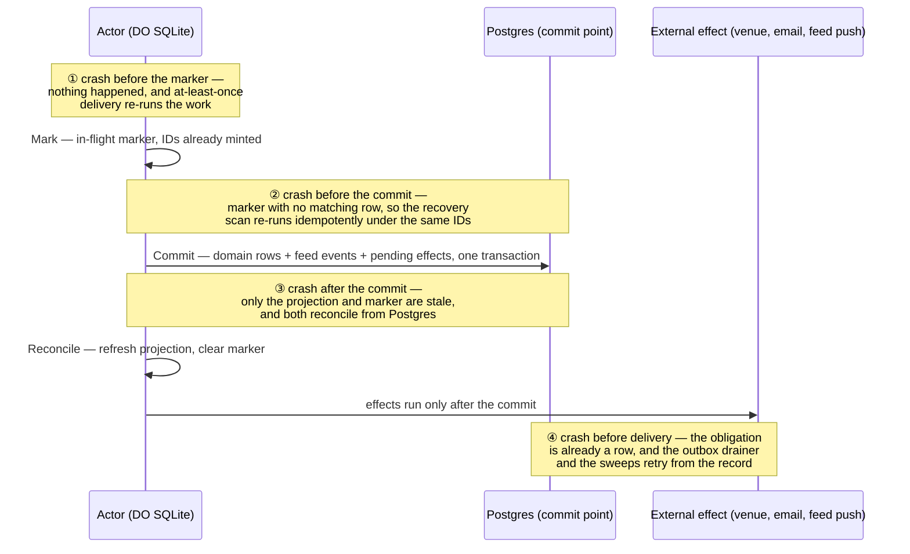
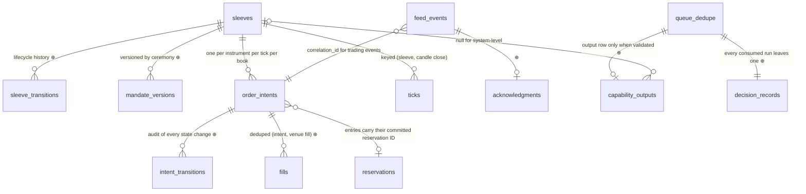

This chapter defines what is stored, where, and in what shape: the three storage tiers and the rule each obeys, the commit point that decides what commits together, the outbox for obligations that cannot be database writes, the DDL for the core tables, the feed record and its closed event taxonomy, the R2 layout, and the migration and retention rules. Every guarantee the product makes — nothing silent, numbers reconcile, history permanent — is ultimately a claim about rows, and this chapter is where those claims become transaction boundaries. It stops at the storage layer: what the tick writes and when is [The tick](/technical/the-tick); what the venue actor writes is [Venues](/technical/venues); how migrations are executed and how backups run is [Operations](/technical/operations).

## What this chapter guarantees

- A domain fact, its feed event, and any delivery obligation it creates commit in one Postgres transaction. Under any crash at any point, they exist together or not at all.
- No order intent reaches a venue before it is durably recorded in Postgres. If Postgres cannot be written, the sleeve does not trade.
- Every recorded delivery obligation is delivered at least once, surviving crashes and deploys.
- Every byte of Ironcage's trading-actor Durable Object storage is rebuildable from Postgres. Flue-owned Durable Object state is a separate, explicitly inventoried platform record and never financial authority.
- Append-only tables are enforced by the database role, not by discipline: the application role has no `UPDATE` or `DELETE` privilege on them.
- No financial value is ever a float — not in a table, not in a contract, not in a computation.
- Every displayed figure in the product is recomputable from Postgres rows plus R2 blobs.
- Nothing is deleted, except rows in the three named mechanism tables.

## The four storage classes

The system's state lives in four storage classes with different durability, cost, and transactional properties. The design names each job and authority explicitly.

| Tier                     | Holds                                                                                                                                                                                                 | Rule                                                                                                                |
| ------------------------ | ----------------------------------------------------------------------------------------------------------------------------------------------------------------------------------------------------- | ------------------------------------------------------------------------------------------------------------------- |
| **PlanetScale Postgres** | The blotter, intents, ticks, mandates, capital acts, transfers, reservations, feed events, decision records, scorecards, candles, bank transactions, tax events, reports, ceremonies, pending effects | The record. Append-only where the domain is append-only. Money is `NUMERIC`, never a float.                         |
| **Ironcage DO SQLite**   | Each trading actor's working set: cached mandate, cage counters, tick bookkeeping, in-flight markers                                                                                                  | A cache plus in-flight markers. Rebuildable from Postgres; never the only holder of a fact.                         |
| **Flue DO SQLite**       | Canonical research-conversation streams; accepted submissions; attachment references/bytes; workflow inputs, results, errors, and durable events as the pinned runtime persists them                  | Durable sensitive platform state. Not financial authority; access and retention are defined in [AI](/technical/ai). |
| **R2**                   | Raw external files, candle archives, backtest artifacts, report bodies, proposal bundles, logical dumps                                                                                               | Blobs, addressed by keys stored in Postgres rows. Immutable once written.                                           |

Core-owned Cloudflare Workflows are orchestration, never the domain record. A step writes its real output to Postgres or R2 and returns only a pointer. The selected paid-plan contract currently retains completed state for 30 days (Free is 3 days), caps non-streaming step results at 1 MiB, and becomes a metered cost dimension on 2026-08-10; the deployment register pins and rechecks those terms. Flue's own durable execution state is the separately disclosed Flue class above, not a substitute for the Postgres decision record.

## Conventions

These rules bind every table in the system.

- **IDs are UUIDv7** (`uuid` columns), system-wide: intents, events, runs, records. The writer mints an ID before any external call that references it. An intent proposes that ID as the venue client order ID only after the venue's conformance fixture accepts the exact UUID form. The intent ledger remains the idempotency authority ([Venues](/technical/venues)). UUIDv7 is time-ordered, so primary keys index well and feed event IDs can serve as cursors. Capability run IDs are the deliberate exception to random minting. A run ID is a deterministic name-based UUID derived from capability, configuration version, and the run's trigger anchor — a cadence slot for scheduled capabilities, the batch identity for batch capabilities. A duplicate dispatch therefore derives the same ID ([AI](/technical/ai)). The one keying exception is `ticks`, keyed `(sleeve_id, candle_close_at)`, because tick identity must be derivable ([Domain](/technical/domain)).
- **Time uses `timestamptz` instants.** PostgreSQL stores them internally in UTC but renders them in the current session time zone. Drivers parse instants, SQL never relies on a session-scoped `SET`, the role default is UTC for diagnostic consistency, and Australia/Sydney conversion is explicit. Two deliberate exceptions are calendar dates, not instants: bank posting dates (stored as `date`) and financial-year assignment, which uses the Australia/Sydney local date ([Tax](/technical/tax)).
- **Money and quantities are `NUMERIC` beside a currency or asset code.** Cash amounts: `numeric(20,8)`. Asset quantities: `numeric(38,18)`. Prices: `numeric(24,8)`. Effect Schema decodes them to `BigDecimal` at the boundary; the JavaScript `number` type is banned for financial values. Storage keeps full precision; display rounds half-even at the currency's minor unit; the tax engine rounds only at its own declared boundaries.
- **Append-only tables (⊕) have no `UPDATE` or `DELETE` path.** Corrections are new rows referencing what they correct. Enforcement is structural: the application's database role has `UPDATE` and `DELETE` revoked on ⊕ tables, and the few sanctioned mutable columns (an intent's `state`, a report's read marker) are granted individually at column level. A forgotten rule fails at the database, not in review.
- **Enums are `text` with a `CHECK` constraint** — the cheapest representation to extend in a system that will add event and tax types for years.
- **Payloads are `jsonb`, validated at the boundary.** Every `jsonb` column has an Effect Schema in `packages/domain`. A stored row that fails decoding is a defect, and the failure is loud.
- **Provenance is mandatory.** A row derived from an external source carries where it came from and when it was fetched. A row derived by computation carries the code or config version that computed it.
- **R2 by reference.** Postgres rows hold R2 keys; R2 keys embed the ID of the owning row. Neither store is ever the only holder of the other's existence.

## The commit point

This section is the canonical definition of what commits together. Every other chapter that touches persistence restates a summary and points here.

The problem it solves: the system's state lives in two kinds of store that cannot share a transaction — Postgres, reached over the network, and each Durable Object's private SQLite. A design that writes some facts in one and some in the other has a crash window between the two writes. The first crash in that window produces a fill with no feed event, or a halt with no email, and the product's completeness promise dies quietly. An earlier draft of this system promised "the domain row and its feed event are one transaction" while placing the feed event in a Durable Object outbox; that promise was physically impossible, and this protocol is its replacement.

:::info[The rule]
**Postgres is the sole financial commit point.** When an Ironcage actor performs a consequential domain action, one Postgres transaction writes its domain rows, feed events, idempotency and state rows, and pending effects. They exist together or not at all. No transaction spans DO SQLite and Postgres.
:::

No financial fact passes through Ironcage DO storage on its way to Postgres. Actor storage is updated after the Postgres commit as a cache of what committed. Writing actor storage first would reopen the crash window this protocol closes, so that path is forbidden. Flue's separately inventoried conversation and execution state sits outside this protocol and has no financial authority.

Around the commit point, each actor follows the same three beats:

<Steps>
  <Step title="Mark">
    Before doing anything externally visible, the actor writes an in-flight marker to its own
    SQLite. The marker names the work and the IDs the actor has already minted.
  </Step>
  <Step title="Commit">The actor performs the work and commits the one Postgres transaction.</Step>
  <Step title="Reconcile">
    The actor updates its local projection from what was committed and clears the marker.
  </Step>
</Steps>

Each beat has a defined failure. A crash before the marker means nothing happened; the alarm's at-least-once delivery re-runs the work, and the idempotency keys make the re-run safe. A crash between marker and commit leaves a marker with no matching Postgres row; the actor's recovery scan on next wake finds it and re-runs idempotently, under the IDs it already minted, so a retry collides with unique constraints instead of duplicating rows. A crash after the commit costs only the projection and the marker, both of which reconcile from Postgres.

The first consequence is that Postgres availability gates trading. If the transaction cannot commit, the action does not happen.

PlanetScale says failovers typically complete in seconds, but a long-running query can extend unavailability toward 30 seconds. There is no 1–2 second guarantee. Database roles therefore set statement, transaction, and idle-in-transaction timeouts. Application transactions stay under 3 seconds. Writes make at most 3 attempts with exponential backoff from 250 ms (proposed), and only under an idempotency key or after an outcome query.

If those attempts exhaust during a tick, the sleeve stands down for that tick. The system records the gap when the database returns. [The tick](/technical/the-tick) defines the graduated fail-closed ladder. An unreadable database is never evidence of a breach.

The second consequence is that effects which cannot be database writes are recorded before they happen. That is the outbox, next section.

### What commits together

The load-bearing transactions, one row each. Anything not listed commits alone.

| Flow                             | The one Postgres transaction                                                                                                                                                                                   | DO storage (never in the transaction)            |
| -------------------------------- | -------------------------------------------------------------------------------------------------------------------------------------------------------------------------------------------------------------- | ------------------------------------------------ |
| System cage changes headroom     | lock singleton cage-control row; re-read the ledger; insert or update the idempotent reservation; commit. `reserve`, per-fill `commit`, and `release` all take the same lock ([The tick](/technical/the-tick)) | projection update after commit                   |
| Tick decides an entry            | tick outcome + intent (`pending`, carrying its committed reservation ID) + its `intent_transitions` row + strategy state + feed events, guarded by a mandate-version and system-mode compare-and-set           | marker before; projection update and clear after |
| Cage rejects an intent           | tick outcome + intent (`rejected`) + transition + feed event carrying the full verdict                                                                                                                         | marker before; clear after                       |
| Venue outcome arrives            | intent `state` compare-and-set + transition + fill rows + feed events ([Venues](/technical/venues))                                                                                                            | venue actor's marker before; clear after         |
| Sleeve halts                     | sleeve transition + feed event (`critical`) + `pending_effects` row for the halt email                                                                                                                         | marker before; clear after                       |
| Queue consumer accepts an AI run | dedupe row + `capability_outputs` + `decision_records` + feed event, keyed on the run ID ([Contracts](/technical/contracts))                                                                                   | none — the consumer is stateless                 |
| Operator ceremony completes      | ceremony row + its effect (mandate version, transition, capital act) + feed event                                                                                                                              | none                                             |
| Money import confirm             | import + source files + observations + transaction links + canonical bank transactions + balances + coverage + feed event ([Money](/technical/money))                                                          | none                                             |

:::note[Worked example — illustrative, not a default]
The fixed trace is [Crypto trend order](/technical/examples/crypto-trend-order). The crypto-trend sleeve ticks at the 4-hour close `2026-08-07T04:00Z` and mints intent ID `018f6b2a-7c4e-7d31-a2f0-3b9d4e8c1a55`. The system-cage transaction locks the cage-control row and grants an A$1,000 reservation under that intent ID. The sleeve writes its in-flight marker, then the decision transaction commits atomically: the `ticks` row's outcome, the intent row (`pending`, notional A$1,000, `book = dry_run`) carrying the reservation ID, its first `intent_transitions` row, the updated strategy state, and the `intent_emitted` feed event. Only after that commit does the venue actor submit the order, quoting the intent UUID as the client order ID. A crash before the decision commit leaves no venue call; if the reservation exists without an intent row, the cage's orphan scan releases it. A crash after the decision commit leaves a committed intent whose venue outcome the sweep resolves.
:::

### Crash windows

The three beats and the effects that follow them define four positions a crash can land in. The diagram places them; the table below then enumerates every window — including the venue, feed, and queue variants of these positions — and closes each one.



Every window, closed. "None" in the last column is the claim this chapter exists to make true.

| Window                                     | Persisted at the crash                         | Detection                                                                           | Recovery                                                                                                                                                                                     | Data lost                       |
| ------------------------------------------ | ---------------------------------------------- | ----------------------------------------------------------------------------------- | -------------------------------------------------------------------------------------------------------------------------------------------------------------------------------------------- | ------------------------------- |
| Before the marker                          | Nothing, or a reservation with no intent row   | Alarm redelivery; cage orphan scan                                                  | Re-run under the same intent ID; the reservation returns idempotently, or the orphan scan releases it if the decision never resumes                                                          | None                            |
| After the marker, before the commit        | Marker only                                    | Recovery scan on wake: marker with no matching Postgres row                         | Re-run idempotently under the already-minted IDs; unique constraints absorb any partial retry                                                                                                | None                            |
| Mid-transaction                            | Nothing (the transaction rolls back)           | Same scan                                                                           | Same re-run                                                                                                                                                                                  | None                            |
| Mid-tick, after some recorded progress     | `ticks` row `running` with its progress column | A `running` row older than the takeover threshold ([The tick](/technical/the-tick)) | The same actor resumes from the last recorded step. The DO is the only executor, so no lease or fencing is needed                                                                            | None                            |
| After the commit, before the venue call    | Intent row with no venue outcome               | The owner's sweep finds a `pending` intent past its age threshold                   | The venue actor queries all authoritative surfaces for evidence; absence never triggers resubmission or reservation release, and unresolved intent quarantines ([Venues](/technical/venues)) | None                            |
| After the commit, before projection update | Everything committed                           | Marker whose Postgres row exists                                                    | Clear the marker; refresh the projection from Postgres                                                                                                                                       | None                            |
| After the commit, before effect delivery   | Fact + feed event + `pending_effects` row      | The drainer alarm; the cron watchdog if the alarm itself died                       | Retry on schedule until acknowledged; a duplicate email is possible and accepted                                                                                                             | None                            |
| After the commit, before the feed push     | Fact + feed event                              | None needed                                                                         | The client's next replay from the record catches it up ([App](/technical/app))                                                                                                               | None                            |
| Postgres unreachable                       | Nothing new                                    | Commit fails after retries                                                          | Stand down for the tick; record the gap and a `warning` event on recovery ([The tick](/technical/the-tick))                                                                                  | None (and no entries that tick) |
| Queue redelivers an already-accepted run   | The first delivery's rows                      | Run-ID unique constraint                                                            | Duplicate dropped; the same run ID with a different payload hash raises a `critical` event ([Contracts](/technical/contracts))                                                               | None                            |
| DO storage lost entirely                   | Everything (Postgres untouched)                | Schema-version check at wake                                                        | `rebuild()`; the Postgres-side sweeps re-establish in-flight knowledge, so lost markers are also safe                                                                                        | None                            |

## The outbox: `pending_effects`

An email cannot be part of a database transaction, so the transaction records the obligation instead. The `pending_effects` table carries only obligations that are not Postgres writes. At v1 that is exactly one thing: the halt email. Its row commits in the same transaction as the halt it announces. A crash between commit and send therefore loses nothing.

Live capital remains unavailable until a provider contract defines authentication, request idempotency, rate limits, the acceptance response, and delivery or bounce semantics.

The system-cage actor's alarm drains the table on the proposed retry schedule: 1 minute, doubling to a 30-minute cap, forever. It uses the effect ID as the provider idempotency key. The drainer marks `delivered_at` only after the selected provider returns its documented acceptance response. That means "provider accepted," not "arrived in the inbox." If the provider exposes later delivery or bounce events, they are recorded separately.

If the alarm dies, the cron watchdog re-arms it ([Operations](/technical/operations)). At-least-once dispatch can produce a duplicate only if the provider's proven idempotency boundary fails. The launch fixture is mandatory for that reason.

The live feed push is deliberately not a pending effect. After commit, the originating actor calls the feed actor best-effort. If the push is lost, the client's next replay from Postgres catches it up, because the record was never in the socket ([App](/technical/app)). Push is an optimization; the record is the truth.

## The read path: two Hyperdrive bindings

Core binds the same database twice through Hyperdrive. `DB` has query caching disabled and is the default for all code. `DB_CACHED` has caching enabled (60-second max age, proposed) and is opt-in per call site, for staleness-tolerant analytics reads only: dashboard aggregates, equity curves, cost rollups, spending trends. The split exists because Hyperdrive's cache is never invalidated by writes; a cached read after a write can return the old value for up to 75 seconds. Uncached-as-default means forgetting the rule can only make a query slower, never wrong. Nothing in the engine or any cage path may depend on the cached binding, and the code enforces that structurally: the cached service's type is simply not available to those packages.

Hyperdrive pools connections in transaction mode. Session state does not survive across statements. Code therefore uses no session-scoped `SET`, session advisory lock, or temporary table that must outlive a transaction. Schema migrations and logical dumps use direct connections instead ([Operations](/technical/operations)).

Each binding has a proposed origin-connection target of 8. Cloudflare documents that value as a soft limit that Hyperdrive may exceed for resiliency. Capacity planning therefore reserves headroom above 16 across the two bindings and alerts on observed open and waiting connections. A deployed-dev load test closes this gate; arithmetic on the configured targets does not.

## Core DDL

The load-bearing tables in full. The remaining tables follow the same conventions and are specified field-level in their owning chapters — equity units and capital in [Domain](/technical/domain), Money in [Money](/technical/money), Tax in [Tax](/technical/tax), Workbench in [Workbench](/technical/workbench) — with their DDL in the migrations.

How the tables below relate — ⊕ marks append-only, and the two dashed groups are the domains the blotter's rows reference:



Positions are deliberately absent from the picture: they are a SQL view over `fills`, never a table, for the reason given below.

### Sleeves and mandates

```sql sleeves.sql
CREATE TABLE sleeves (
  id                 uuid PRIMARY KEY,                  -- UUIDv7
  name               text NOT NULL UNIQUE,
  market             text NOT NULL,                     -- 'crypto' | 'stocks'
  state              text NOT NULL CHECK (state IN ('draft','dry_run','live','halted','retired')),
  paused             boolean NOT NULL DEFAULT false,
  shadow             boolean NOT NULL DEFAULT false,    -- gate-pipeline challengers; excluded from roster and capital
  active_mandate     integer NOT NULL,
  created_at         timestamptz NOT NULL
);

CREATE TABLE sleeve_transitions (                        -- ⊕ the lifecycle history
  id            uuid PRIMARY KEY,
  sleeve_id     uuid NOT NULL REFERENCES sleeves(id),
  from_state    text NOT NULL,
  to_state      text NOT NULL,
  triggered_by  text NOT NULL,                           -- 'operator' | 'cage:<rule>' | 'reconciliation' | 'system_cage'
  reason        text NOT NULL,
  ceremony_id   uuid,                                    -- required for operator transitions except halts
  occurred_at   timestamptz NOT NULL
);

CREATE TABLE mandate_versions (                          -- ⊕
  sleeve_id     uuid NOT NULL REFERENCES sleeves(id),
  version       integer NOT NULL CHECK (version > 0),
  document      jsonb NOT NULL,                          -- Schema: Mandate (packages/domain)
  diff          jsonb,                                   -- vs predecessor; null for v1
  reasoning     text NOT NULL,
  authored_by   text NOT NULL,                           -- 'operator' | proposal UUID
  ceremony_id   uuid NOT NULL,
  created_at    timestamptz NOT NULL,
  PRIMARY KEY (sleeve_id, version)
);
```

`sleeves.state` and `paused` are the two sanctioned mutable columns in this domain. Their writers are restricted by the transition rules in [Domain](/technical/domain), and every change appends a `sleeve_transitions` row in the same transaction.

### The blotter

```sql blotter.sql
CREATE TABLE order_intents (                             -- ⊕ except state
  id                 uuid PRIMARY KEY,                   -- UUIDv7; doubles as the venue client-order ID
  sleeve_id          uuid NOT NULL REFERENCES sleeves(id),
  mandate_version    integer NOT NULL,
  tick_close_at      timestamptz NOT NULL,
  book               text NOT NULL CHECK (book IN ('live','dry_run','shadow','baseline') OR book LIKE 'lo:%'),
  instrument         text NOT NULL,
  side               text NOT NULL CHECK (side IN ('buy','sell')),
  order_type         text NOT NULL CHECK (order_type IN ('limit','market')),
  notional           numeric(20,8) NOT NULL,
  currency           text NOT NULL DEFAULT 'AUD',
  limit_price        numeric(24,8),
  stop_price         numeric(24,8),
  decision_context   jsonb NOT NULL,                     -- strategy read, clamp arithmetic, capability inputs
  cage_verdict       jsonb NOT NULL,                     -- every rule: threshold, observed, distance, result
  reservation_id     uuid,
  state              text NOT NULL CHECK (state IN ('rejected','pending','submitted','placed',
                       'partially_filled','filled','canceled','venue_rejected','failed',
                       'resolving','quarantined')),
  created_at         timestamptz NOT NULL,
  UNIQUE (sleeve_id, tick_close_at, instrument, book)    -- one intent per instrument per tick per book
);

CREATE TABLE intent_transitions (                        -- ⊕ the audit of every state change
  intent_id    uuid NOT NULL REFERENCES order_intents(id),
  seq          integer NOT NULL CHECK (seq > 0),
  to_state     text NOT NULL,
  writer       text NOT NULL CHECK (writer IN ('sleeve_actor','venue_actor')),
  venue_payload jsonb,                                   -- raw venue response where one exists
  occurred_at  timestamptz NOT NULL,
  PRIMARY KEY (intent_id, seq)
);

CREATE TABLE fills (                                     -- ⊕
  id            uuid PRIMARY KEY,
  intent_id     uuid NOT NULL REFERENCES order_intents(id),
  venue_fill_id text NOT NULL,
  book          text NOT NULL,                           -- mirrors the intent's book
  quantity      numeric(38,18) NOT NULL,
  asset         text NOT NULL,
  price         numeric(24,8) NOT NULL,
  fee_amount    numeric(20,8) NOT NULL,
  fee_asset     text NOT NULL,                           -- Kraken's fee asset varies; captured, never assumed
  simulated     boolean NOT NULL,
  fill_model    text,                                    -- version, when simulated
  venue_time    timestamptz NOT NULL,
  received_at   timestamptz NOT NULL,
  UNIQUE (intent_id, venue_fill_id)                      -- venue event dedupe
);
```

`order_intents.state` is mutable so current state is one indexed read; `intent_transitions` is the append-only truth of how it got there. The state advances only by compare-and-set — `UPDATE order_intents SET state = $next WHERE id = $id AND state = $expected`, row count checked — and each successful advance appends its `intent_transitions` row in the same transaction. A state whose latest transition disagrees is a defect. Writer restrictions: the sleeve actor writes creation and `rejected`; the venue actor writes everything after `pending`. The lifecycle semantics, including `resolving` and `quarantined`, are defined in [Venues](/technical/venues).

The `book` column is the mode tag that survives to every screen. `live` is real money; `dry_run` is the sleeve's dry-run book; `shadow` is a gate-pipeline challenger; `baseline` is the joint no-AI counterfactual; `lo:{capability_id}` is a leave-one-out counterfactual when a sleeve holds two or more runtime capabilities ([AI](/technical/ai)). Only `live` rows may carry `simulated = false`, and only `live` rows ever count in real capital. Counterfactual books never touch real system-cage reservations.

Positions are not a table. They are a plain SQL view computed from fills, per sleeve, instrument, and book, and recomputed independently by reconciliation before any comparison with a venue. Materializing the view is a recorded future change if read latency ever demands it; at one operator's volume it does not.

### Ticks

```sql ticks.sql
CREATE TABLE ticks (
  sleeve_id        uuid NOT NULL REFERENCES sleeves(id),
  candle_close_at  timestamptz NOT NULL,
  outcome          text NOT NULL CHECK (outcome IN ('running','acted','no_change','stood_down','gated','halted')),
  progress         text,                                 -- last completed step, for same-actor resume
  detail           jsonb,                                -- stand-down reason, gap description
  started_at       timestamptz NOT NULL,
  completed_at     timestamptz,
  PRIMARY KEY (sleeve_id, candle_close_at)
);
```

This table is the tick's idempotency record, and it lives in Postgres because the DO copy is only a cache. The sleeve actor claims a tick by inserting the row with outcome `running`; the unique key makes a duplicate alarm's claim collide harmlessly. Progress advances as steps complete, and the final outcome is set inside the decision transaction, atomically with the intent and events the tick produced. A `running` row older than the takeover threshold is resumed from its recorded progress by the same actor. The DO is the only executor of its own ticks, so there is no lease, epoch, or fencing machinery. The threshold and the resume mechanics are defined in [The tick](/technical/the-tick). `outcome` and `progress` are sanctioned mutable columns, written only by the owning actor.

### The feed

```sql feed.sql
CREATE TABLE feed_events (                               -- ⊕
  id             uuid PRIMARY KEY,                       -- UUIDv7; time-ordered, the feed cursor
  occurred_at    timestamptz NOT NULL,
  origin         text NOT NULL,                          -- sleeve ID | 'money' | 'tax' | 'system'
  category       text NOT NULL,                          -- taxonomy below
  event_type     text NOT NULL,
  severity       text NOT NULL CHECK (severity IN ('info','notice','warning','critical')),
  summary        text NOT NULL,
  payload        jsonb NOT NULL,
  correlation_id uuid,                                   -- for trading events, the originating intent's ID
  links          jsonb                                   -- {intent, report, mandate, decision_record, ...}
);

CREATE TABLE acknowledgments (                           -- ⊕
  event_id        uuid PRIMARY KEY REFERENCES feed_events(id),
  acknowledged_at timestamptz NOT NULL
);

CREATE TABLE pending_effects (
  id              uuid PRIMARY KEY,
  kind            text NOT NULL CHECK (kind IN ('halt_email')),
  payload         jsonb NOT NULL,
  created_at      timestamptz NOT NULL,
  attempts        integer NOT NULL DEFAULT 0,
  next_attempt_at timestamptz NOT NULL,
  delivered_at    timestamptz
);
```

The feed's completeness guarantee is the commit point applied to this table: a domain row and its feed event are one transaction, so an event cannot be skipped while its fact survives, or vice versa. The wire protocol that delivers these rows to the app is defined in [App](/technical/app); the product meaning of the taxonomy is [Activity](/product/activity).

### AI

```sql ai.sql
CREATE TABLE capability_outputs (                        -- ⊕
  run_id         uuid PRIMARY KEY,
  capability     text NOT NULL,                          -- registry name
  sleeve_id      uuid REFERENCES sleeves(id),            -- null for system-level capabilities
  trigger        jsonb NOT NULL,                          -- the anchor this run answered: a schedule slot or a batch identity
  scheduled_at   timestamptz,                            -- the schedule anchor's slot; null for batch runs
  output         jsonb,                                  -- null when the run failed validation
  failure        jsonb,                                  -- validation failure detail, when failed
  payload_hash   text NOT NULL,
  config_version integer NOT NULL,
  produced_at    timestamptz NOT NULL,
  valid_until    timestamptz                             -- scheduled_at + the trigger's validity window; null for batch runs, which do not decay
);

CREATE TABLE decision_records (                          -- ⊕ permanent; rendered in Activity
  id              uuid PRIMARY KEY,
  capability      text NOT NULL,
  asked           text NOT NULL,                         -- the question, at decision grain
  inputs_summary  jsonb NOT NULL,                        -- what data mattered
  decided         jsonb NOT NULL,                        -- the validated conclusion
  rationale       text NOT NULL,
  model           text NOT NULL,
  config_version  integer NOT NULL,
  gateway_log_ids text[] NOT NULL DEFAULT '{}',          -- returned cf-aig-log-id values, when the pinned Flue seam exposes them
  otel_trace_id   text NOT NULL,                          -- generated by Ironcage
  otel_parent_span_ids text[] NOT NULL DEFAULT '{}',     -- generated by Ironcage per provider call
  occurred_at     timestamptz NOT NULL
);
```

For a scheduled run, `valid_until` is precomputed from the run's scheduled time, not its arrival time, so a late run loses lifetime; the staleness semantics are defined in [AI](/technical/ai), and tick consumption picks the greatest eligible `(scheduled_at, run_id)`. A batch run has no validity window; its consumer is the surface that dispatched it. The `queue_dedupe` mechanism table (run ID, payload hash, consumed-at; unique on run ID) backs the queue consumer's insert-first discipline defined in [Contracts](/technical/contracts). The decision record is the permanent financial evidence of an AI decision. It does not contain full prompts or transcripts, but those may persist in Gateway logs under count-based retention and in durable Flue state as inventoried above.

Scorecards, proposals, ceremonies, capital acts, transfers, reservations, unit-ledger rows, candles, Money, and tax tables follow the same conventions; their field-level shapes live in their owning chapters and their DDL in the migrations. Candles are worth one rule here because two chapters depend on it: `candles` is ⊕, unique on `(venue, instrument, timeframe, close_ts)`, each row carrying its source and fetched-at; a re-fetch that disagrees with a stored candle is flagged with a feed event and never overwritten.

## The feed-event taxonomy

The event `type` universe is a closed union. It is the wire contract the app renders and invalidates caches from, so it is enumerated in full, by category, with default severities. Adding a type is a reviewed schema change, not an ad-hoc string. The product meaning of each category is [Activity](/product/activity).

| Type                           | Category     | Severity | Note                                                                                         |
| ------------------------------ | ------------ | -------- | -------------------------------------------------------------------------------------------- |
| `intent_emitted`               | Trading      | info     |                                                                                              |
| `intent_rejected`              | Trading      | notice   | payload carries the full verdict                                                             |
| `order_placed`                 | Trading      | info     |                                                                                              |
| `order_partial_fill`           | Trading      | info     |                                                                                              |
| `order_filled`                 | Trading      | info     |                                                                                              |
| `order_canceled`               | Trading      | info     |                                                                                              |
| `order_replaced`               | Trading      | info     |                                                                                              |
| `position_opened`              | Trading      | info     |                                                                                              |
| `position_closed`              | Trading      | info     | carries realized P&L and costs                                                               |
| `stop_placed`                  | Trading      | info     |                                                                                              |
| `stop_moved`                   | Trading      | info     |                                                                                              |
| `stop_triggered`               | Trading      | info     |                                                                                              |
| `capability_output_changed`    | Capabilities | notice   | old → new with rationale                                                                     |
| `capability_output_stale`      | Capabilities | warning  |                                                                                              |
| `capability_suspended`         | Capabilities | critical |                                                                                              |
| `capability_reinstated`        | Capabilities | notice   |                                                                                              |
| `proposal_submitted`           | Capabilities | notice   |                                                                                              |
| `proposal_gate_passed`         | Capabilities | info     |                                                                                              |
| `proposal_gate_failed`         | Capabilities | notice   |                                                                                              |
| `proposal_approved`            | Capabilities | notice   |                                                                                              |
| `proposal_rejected`            | Capabilities | notice   |                                                                                              |
| `trade_proposal_checked`       | Capabilities | notice   |                                                                                              |
| `strategy_signal`              | Capabilities | info     | only signals that produced an intent — routine no-change ticks live in `ticks`, not the feed |
| `limit_approached`             | Risk         | warning  | at the configured fraction, default 80%                                                      |
| `sleeve_halted`                | Risk         | critical | which rule, at what value                                                                    |
| `lock_created`                 | Risk         | notice   |                                                                                              |
| `lock_expired`                 | Risk         | info     |                                                                                              |
| `tightening_applied`           | Risk         | notice   |                                                                                              |
| `tightening_lapsed`            | Risk         | info     |                                                                                              |
| `system_cage_breach`           | Risk         | critical |                                                                                              |
| `reservation_overrun`          | Risk         | critical |                                                                                              |
| `reconciliation_required`      | Risk         | warning  | entries blocked for the scope                                                                |
| `reconciliation_mismatch`      | Risk         | critical |                                                                                              |
| `sleeve_created`               | Lifecycle    | info     |                                                                                              |
| `mandate_changed`              | Lifecycle    | notice   | diff and reasoning                                                                           |
| `state_transition`             | Lifecycle    | info     |                                                                                              |
| `sleeve_paused`                | Lifecycle    | info     |                                                                                              |
| `sleeve_resumed`               | Lifecycle    | info     |                                                                                              |
| `promotion`                    | Lifecycle    | notice   | trial report link                                                                            |
| `demotion`                     | Lifecycle    | notice   | trial report link                                                                            |
| `override_armed`               | Lifecycle    | critical |                                                                                              |
| `override_active`              | Lifecycle    | critical |                                                                                              |
| `override_used`                | Lifecycle    | critical |                                                                                              |
| `override_expired`             | Lifecycle    | critical |                                                                                              |
| `sleeve_retired`               | Lifecycle    | notice   |                                                                                              |
| `deposit_recorded`             | Capital      | info     |                                                                                              |
| `withdrawal_recorded`          | Capital      | info     |                                                                                              |
| `transfer_recorded`            | Capital      | info     |                                                                                              |
| `transfer_settled`             | Capital      | info     |                                                                                              |
| `transfer_request_issued`      | Capital      | notice   |                                                                                              |
| `transfer_request_dismissed`   | Capital      | info     |                                                                                              |
| `transfer_flagged`             | Capital      | warning  | missed window or different amount                                                            |
| `external_activity_detected`   | Capital      | critical | the claim item                                                                               |
| `allocation_act`               | Capital      | notice   |                                                                                              |
| `drawdown_to_target_entered`   | Capital      | notice   |                                                                                              |
| `drawdown_to_target_completed` | Capital      | info     |                                                                                              |
| `data_gap`                     | System       | warning  | names the sleeves that stood down                                                            |
| `stand_down`                   | System       | warning  |                                                                                              |
| `backfill_completed`           | System       | info     |                                                                                              |
| `candle_discrepancy`           | System       | warning  | a re-fetch disagreed with a stored candle                                                    |
| `connectivity_lost`            | System       | warning  | critical when positions are open                                                             |
| `connectivity_restored`        | System       | info     |                                                                                              |
| `ai_run_failed`                | System       | warning  | validation failures included                                                                 |
| `report_generated`             | System       | info     |                                                                                              |
| `report_failed`                | System       | warning  |                                                                                              |
| `deploy_completed`             | System       | info     | worker and version                                                                           |
| `decision_record_lost`         | System       | warning  | a dead-lettered queue message                                                                |
| `bank_import_completed`        | Money & tax  | info     | source, canonical, duplicate, ambiguity, and coverage counts                                 |
| `bank_gap_detected`            | Money & tax  | warning  |                                                                                              |
| `bank_gap_closed`              | Money & tax  | info     |                                                                                              |
| `recurring_price_change`       | Money & tax  | notice   |                                                                                              |
| `spending_anomaly`             | Money & tax  | notice   |                                                                                              |
| `tax_source_synced`            | Money & tax  | info     |                                                                                              |
| `tax_gap_detected`             | Money & tax  | warning  |                                                                                              |
| `tax_gap_closed`               | Money & tax  | info     |                                                                                              |
| `missing_cost_basis`           | Money & tax  | warning  |                                                                                              |
| `tax_balance_mismatch`         | Money & tax  | critical |                                                                                              |
| `fy_report_generated`          | Money & tax  | info     |                                                                                              |

Blocked previews produce no event because preview is stateless.

## The actor's SQLite

Each actor's SQLite holds its working set, namespaced per concern: cached active mandate, cage counters, a cached copy of its `ticks` rows, and the in-flight markers from the commit-point protocol. The sleeve actor's marker table, in full:

```sql inflight.sql
CREATE TABLE inflight (
  key         text PRIMARY KEY,                          -- 'tick:<close_at>' or an instrument
  intent_id   text,                                      -- the pre-minted UUID, where one exists
  since       text NOT NULL                              -- ISO instant
);
```

No DO table holds anything whose loss would lose information. Markers are the closest thing to an exception, and they still qualify: a lost marker is covered by the Postgres-side sweeps (`running` ticks past the takeover threshold; `pending` intents past the sweep age), so losing DO storage entirely costs detection latency, never facts.

`rebuild()` is implemented by every actor and runs on first start, on schema-version mismatch at wake, and on demand:

<Steps>
  <Step title="Refuse">
    Set a local `rebuilding` flag; the actor refuses ticks and commands until done.
  </Step>
  <Step title="Load">
    The sleeve row, active mandate version, and lifecycle state from Postgres.
  </Step>
  <Step title="Recompute">
    Working state from the record: positions from fills, cage counters from the blotter, marks from
    candles.
  </Step>
  <Step title="Resolve">
    Ask the venue actor to resolve any intent the record shows as in flight.
  </Step>
  <Step title="Resume">Clear the flag; arm the next alarm from the mandate's cadence.</Step>
</Steps>

A deploy may restart an active Ironcage DO, so every release is treated as exercising this path. Two rebuilds from the same Postgres state must produce identical projections, and a test asserts it.

## R2 layout

One primary bucket, prefixed by domain, keys embedding owner UUIDs; plus the agents' quarantine bucket for incoming proposal bundles, described in [Architecture](/technical/architecture) and [Workbench](/technical/workbench).

<FileTree>

- `exports/{source}/{import_id}/…` raw bank/venue/exchange files, exactly as received
- `candles/{venue}/{instrument}/…` backfill archives (e.g. Kraken quarterly CSVs)
- `backtests/{run_id}/…` manifest, inputs hash, outputs, equity series
- `reports/{report_id}.html` rendered report bodies
- `proposals/{proposal_id}/…` validated copies of accepted proposal bundles
- `tax/{source}/{sync_id}/…` raw API pages and statements behind tax events
- `dumps/{yyyy-mm-dd}/…` scheduled logical Postgres dumps

</FileTree>

Raw external files are treated as immutable once written, and nothing in R2 is the only record of a fact; Postgres always holds the row that names the key. Application write paths use content-addressed keys and never overwrite referenced objects. R2 is not protected against operator deletion, and losing an object is an accepted failure mode: the missing artifact or evidence is surfaced rather than silently reconstructed or allowed to change the financial record.

## Migrations

Migrations are numbered SQL files owned by the Alchemy PlanetScale resources. Alchemy creates a short-lived direct-connection role, applies each pending file transactionally before dependent infrastructure, records it in `__alchemy_migrations`, and removes the role. [Operations](/technical/operations) defines release ordering and rollback compatibility.

Data changes are additive first: new columns arrive nullable or defaulted. A destructive change can appear only in a later whole-system release, at least 7 days after every reader and writer stopped using the old representation. Every migration is reviewed like engine code because this schema carries every guarantee in this chapter.

Ironcage actor SQLite schemas carry a version number. A mismatch at wake triggers `rebuild()` instead of an in-place patch. Flue state follows the pinned framework's migration contract and its own conformance gate.

## Retention and backups

Nothing in the financial record is deleted. Corrections append; retirement archives; permanent product retention avoids collapsing the different tax and asset-record clocks into one slogan. There are exactly three named exceptions, all mechanism tables whose rows are machinery rather than record: `queue_dedupe` rows older than 30 days, `pending_effects` rows delivered more than 90 days ago, and `app_requests` rows completed more than 90 days ago (all proposed). An app request far past its retry horizon can never be replayed; the mutation it recorded lives on in the domain tables. At one operator's volume the entire record for years fits in single-digit gigabytes; the only genuine growth item, fine-timeframe candles, stays within comfort (a year of 1-minute candles for twenty instruments is roughly 10 million rows).

The data side of backups: PlanetScale point-in-time recovery covers only the purchased retention window and stops five minutes before the present. A scheduled logical dump runs in a separate trusted backup-container profile (Workers cannot run `pg_dump`) under a dedicated read-only dump credential, landing under `dumps/{yyyy-mm-dd}/`. Untrusted backtest code never sees that credential. The dump schedule, exact PITR window/RPO, restore runbook, and periodic edge-window restore tests are [Operations](/technical/operations).

## Values set in this chapter

| Value                                 | Default                                      | Owner             | Status   |
| ------------------------------------- | -------------------------------------------- | ----------------- | -------- |
| Postgres write retry                  | 3 attempts, exponential backoff from 250 ms  | engine config     | proposed |
| `pending_effects` retry schedule      | 1 min doubling to 30 min cap, forever        | engine config     | proposed |
| Hyperdrive origin connection target   | 8 per binding; soft, with >16 headroom       | engine config     | proposed |
| Cached-binding max age                | 60 s                                         | Hyperdrive config | proposed |
| Money/quantity/price precision        | numeric(20,8) / (38,18) / (24,8)             | migrations        | proposed |
| Display rounding                      | half-even at the currency's minor unit       | app               | proposed |
| `queue_dedupe` prune age              | 30 days                                      | engine config     | proposed |
| Delivered `pending_effects` prune age | 90 days                                      | engine config     | proposed |
| `app_requests` prune age              | 90 days after completion                     | engine config     | proposed |
| Destructive-migration delay           | ≥ 7 days after every reader and writer stops | operations        | proposed |

## Alternatives considered

- **A transaction spanning Postgres and DO SQLite.** The earlier design promised one, with each actor's outbox in its own SQLite "in the same transaction as the work". No such transaction exists; the work's rows are Postgres rows. The promise was impossible, and every variant that stages facts in DO storage first (a DO write-ahead log, an outbox flush loop) reintroduces the crash window between the two stores. Naming Postgres as the sole commit point turns the impossibility into a protocol.
- **A guaranteed feed push via the outbox.** Rejected. Clients replay from the Postgres record on every reconnect, so a lost push costs nothing; making the push an obligation would add retry machinery to buy a guarantee the record already provides.
- **ULIDs for system IDs.** Rejected. Kraken's client order ID accepts a UUID or at most 18 ASCII characters, and a 26-character ULID is neither. UUIDv7 keeps the time-ordering that made ULIDs attractive; exact venue acceptance remains fixture-gated and does not make the venue an idempotency authority.
- **A mutable-state-only intent row** (no transitions table) loses the audit of how a state was reached. **Transitions-only** (no state column) makes "current state" a scan. Both at once, in the same transaction, buys fast reads and full audit for one extra insert.
- **Positions as a maintained table.** Rejected. A stored position is a second truth that can drift from the fills. A projection cannot disagree with the record, only lag it.
- **Cloudflare D1 as the record.** Rejected: no exact `NUMERIC` type and a 10 GB ceiling are disqualifying for this financial ledger. No supported CDC contract was found at the audit date, but the decision does not rely on that absence remaining true.
- **One Hyperdrive binding with caching on and per-query bypass.** Rejected. Hyperdrive has no per-query cache control. Two bindings is the documented pattern, and uncached-as-default makes the failure mode slow instead of wrong.
- **Append-only by convention.** Rejected in favor of revoking `UPDATE` and `DELETE` from the application role. A rule the database enforces cannot be forgotten under deadline.

## Open questions

1. **The mandate document Schema.** The authoritative field-level definition belongs in `packages/domain`, embedded here once it exists. Safe fallback: the field summary in [Domain](/technical/domain) plus boundary validation of `document` as opaque `jsonb`. Must close before: the first migration is written. Evidence: the Schema exists with decode tests against seeded mandate rows.
2. **Hyperdrive pool sizing.** Safe fallback: the system remains dry-run and the configured target stays at 8 per binding with capacity reserved above 16. Must close before: live promotion. Evidence: PlanetScale's chosen-plan connection limit plus observed Hyperdrive open/waiting metrics in a deployed-dev load test at tick-burst concurrency.
3. **Partitioning of `feed_events` and `candles`.** Both grow forever. Safe fallback: none needed; at one operator's volume this is years away. Must close before: either table passes 10 million rows. Evidence: query-latency measurements on the feed replay and backtest read paths.

## Build checklist

- [ ] Initial migration with the DDL above plus the owning chapters' tables, `numeric` precision scheme applied throughout
- [ ] Database roles: `UPDATE`/`DELETE` revoked on ⊕ tables, column-level grants for the sanctioned mutable columns, a migration lint that rejects violations
- [ ] `packages/domain` Schemas for every `jsonb` column, with decode tests against seeded rows
- [ ] Commit-point and reservation property tests: kill the process at every interleaving point; assert all-or-none for (tick outcome, intent, transition, feed event), idempotent reuse or release of any separately committed orphan reservation, and no venue call without a committed intent
- [ ] The recovery scan and same-actor resume, with a test that crashes mid-tick and proves resumption from recorded progress
- [ ] The `pending_effects` drainer with its schedule, and a test that crashes between commit and send and proves eventual delivery
- [ ] `rebuild()` for each actor, with the two-rebuilds-identical determinism test
- [ ] The feed-event union as a generated type shared with the app, so an unknown `event_type` is a compile error, not a rendering surprise
- [ ] Prune jobs for the three mechanism tables, and nothing else deletable
- [ ] The nightly balance-sheet assertion job over the ledger defined in [Domain](/technical/domain)
- [ ] R2 buckets created with the layout above; dump credential scoped to the trusted backup profile only
- [ ] Pinned Flue state inventory proving which conversation, attachment, submission, workflow, result, error, and event fields persist and who can read them
