# The tick

A tick is one scheduled decision: a sleeve wakes at a candle boundary, decides what its mandate permits, and either places an order or records why it did nothing. This chapter follows one tick from the alarm to the committed decision and the hand-off to execution. Venue mechanics (order placement, ambiguity resolution, stop management, reconciliation) live in [Venues](./06-venues.md); this chapter stops where the venue actor takes over and resumes only to say how the outcome settles the tick's bookkeeping. Equity and unit accounting are defined in [Domain](./02-domain.md); the storage shapes and the commit-point rule are defined in [Data](./03-data.md).

## What this chapter guarantees

- A tick executes at most once per `(sleeve, candle close)`, even when its alarm is delivered repeatedly.
- Two executions with the same recorded inputs produce identical decisions, byte for byte.
- No execution path places an order that exceeds the mandate's limits. There is no code path that skips the cage.
- A missing, stale, or uncomputable input at entry time resolves to a smaller position or no action, never a guess. Monitors degrade in stages and halt only on a computed breach or on sustained blindness.
- Every intent, its verdict, its feed events, and the strategy state that produced it are durable in one Postgres commit before the venue hears anything.
- Reserved exposure headroom is released only on a proven terminal venue outcome, with one narrow exception stated in the reservation section.
- Protective work — fill ingestion, stop obligations, ambiguity resolution, reconciliation — continues under pause and under halt. Only new entries stop.

## The running example

One trade threads through this chapter and the two that follow. Fixed facts, used everywhere:

> The **crypto-trend** sleeve (mandate v3) runs in dry-run mode and ticks at the 4-hour close `2026-08-07T04:00Z`; the alarm fires at `04:00:15Z`.
> The strategy desires **+A$2,000** of BTC/AUD exposure; the current position is none. The regime multiplier is **0.5**, so the effective entry is **A$1,000**.
> The sleeve cage passes it. The system cage reserves A$1,000. Kraken fills **A$600** partially (0.006 BTC at roughly A$100,000); the remainder cancels when the 30-minute fill window closes. The reservation commits A$600 and releases A$400.
> A venue-resident stop rests at A$94,000, sized 0.006 BTC. Intent ID: `018f6b2a-7c4e-7d31-a2f0-3b9d4e8c1a55` (a UUIDv7, which doubles as the venue client order ID).
> Because the book is `dry_run`, every row carries `book = dry_run` and every fill carries `simulated = true`, priced by the fill model in [Venues](./06-venues.md): the limit order fills at its limit price on a strict cross, and next-candle-open pricing applies to market and stop fills only.

The complete trace — every row, every payload — lives in [examples/crypto-trend-order.md](./examples/crypto-trend-order.md).

## 1. The alarm fires

Each sleeve actor arms its own alarm for `candle_close + settle_delay`. The settle delay exists because venues finalize a candle a few seconds after its boundary; fetching at `04:00:00` exactly can return a still-open bar. **Default: 15 seconds** (engine configuration, per venue).

The platform guarantees the alarm fires at least once and retries a throwing handler with backoff. A watchdog cron runs **every 5 minutes**, compares each sleeve's Postgres `next_due_at` row against reality, and re-arms any dead alarm; the re-arm is a feed event. Because delivery is at-least-once, the tick is idempotent:

- The tick's identity is `(sleeve_id, candle_close_at)`. Its record is a row in the Postgres `ticks` table, written and advanced in the decision path described below. The sleeve actor keeps a copy in its own storage as a cache; the Postgres row is the truth.
- The handler's first read is the tick record for its key. A record in any terminal outcome (`acted`, `no_change`, `stood_down`, `gated`, `halted`) means the work is done; the handler exits.
- A record in state `running` older than the takeover threshold (**default: 10 minutes**) means a previous execution died. The same actor resumes it from its recorded progress rather than starting over. There is no lease, epoch, or fencing machinery: the Durable Object is the only executor for its sleeve, so a takeover threshold and recorded progress are sufficient.

In the example: the alarm fires at `04:00:15Z`. No tick record exists for `(crypto-trend, 2026-08-07T04:00Z)`. A new one is written in state `running` and the tick begins.

## 2. The protection pass

Before the tick asks whether it may enter, it finishes the work it already owes. Pause and halt gate new risk; they must never gate the machinery that protects existing risk. The protection pass therefore runs on every tick, unconditionally, before any gate is consulted:

- Ingest any fills reported since the last tick and update projections.
- Verify stop obligations: every position under the mandate's stop policy has a confirmed venue-resident stop at the right size, and any due resize or replacement is driven forward (mechanics in [Venues](./06-venues.md)).
- Drive any in-flight ambiguity resolution or reconciliation that is due.
- Execute any previously requested risk reduction that has not completed.

If the sleeve is paused or halted, the tick completes right after this pass as a recorded no-op. A halted sleeve keeps ingesting fills, keeps its stops managed, and keeps reconciling until the operator acts. What it never does is form a new entry.

## 3. Three gates before any evaluation

The tick evaluates nothing until three gates pass. Each gate failure is recorded on the tick record and, where noted, in the feed.

**Mode gate.** The sleeve must be in state `dry_run` or `live` and unpaused, and the system mode must be `running`. All of this state lives in Postgres and changes only through the ceremonies; the read here is the authoritative one. The engine also reads the Flagship kill switches (`trading.live_enabled` and the sleeve's own switch), checked in series. A kill switch is a brake only: it can stop trading, it can never start, resume, or loosen anything, and an unreadable switch reads as "kill". A closed gate ends the tick as a recorded no-op after the protection pass.

**Data gate.** The sleeve reads its universe's certified closed candles through the market-data adapter. Kraken uses anonymous public OHLC. Alpaca equity data uses a credential and pins the feed entitlement, adjustment, as-of, currency, and sort policy.

The fetch is store-first: read the required window, fetch missing coverage, then write under the store's unique key. A conflicting re-fetch opens a dispute and never overwrites. Kraken's trailing in-progress candle is discarded. Known zero-trade archive intervals follow the store's explicit policy rather than becoming false gaps.

Requests have a **10-second timeout** and follow the candle retry schedule: **5 attempts, exponential from 5 seconds**. Malformed or genuinely unobserved coverage stands the sleeve down. Evaluation never runs on a partial or disputed window.

**Capability gate.** The actor reads each run-time capability's latest persisted output from Postgres. It never calls an agent and never waits for one; the AI ran on its own schedule or it did not. Freshness is logical time: an output is valid until `scheduled_at + validFor` from the registry, consumption picks the newest eligible run, and a late arrival never rewrites a tick that has reached a terminal outcome ([AI](./07-ai.md) owns the full staleness rules). A stale or absent output contributes the capability's safe default. For the regime assessment the safe default is a multiplier of **0**: no fresh opinion, no new entries.

In the example: mode gate passes (sleeve `dry_run`, unpaused, system `running`, switches clear). The `04:00Z` candle closes at roughly A$100,000 and is fetched at `04:00:16Z`. The regime output from its `00:00Z` schedule, produced at `00:07Z`, carries `valid_until 06:00Z` and is fresh. All gates pass.

## 4. The strategy evaluates

A strategy is reviewed code in `packages/engine`, registered under a versioned ID that mandates reference. It is a pure function: no I/O, no clock, no randomness. Purity is enforced socially by review and practically by the package boundary; time and randomness arrive only as injected services, which is what makes backtests reproduce ([Workbench](./10-workbench.md)). The interface:

```ts
// packages/engine/src/strategy/Strategy.ts
export interface StrategyModule<P, S> {
  readonly id: StrategyId; // e.g. "trend-follow@2"
  readonly parameters: Schema.Schema<P>; // bounds declared here; corridors reference them
  readonly state: Schema.Schema<S>; // versioned; migrations are explicit
  readonly candleWindow: number; // closed candles required per instrument

  evaluate(input: StrategyInput<P, S>): StrategyResult<S>;
}

export interface StrategyInput<P, S> {
  readonly tick: TickId; // (sleeve, candle_close_at)
  readonly candles: ReadonlyMap<Instrument, ReadonlyArray<ClosedCandle>>; // oldest→newest, exactly candleWindow
  readonly positions: ReadonlyArray<OpenPosition>;
  readonly parameters: P;
  readonly state: S;
}

export type StrategyResult<S> =
  | {
      readonly _tag: "Evaluated";
      readonly read: ReadonlyArray<NamedCondition>; // "trend: up", "volatility: elevated" — the living view renders these
      readonly desires: ReadonlyArray<Desire>; // at most one per instrument
      readonly state: S;
    }
  | { readonly _tag: "InsufficientHistory" }; // recorded as a stand-down, not an error

export type Desire =
  | {
      readonly _tag: "Enter"; // add this much exposure
      readonly instrument: Instrument;
      readonly notional: Money<"AUD">;
      readonly limit: Price;
      readonly stop: Price;
    }
  | {
      readonly _tag: "Target"; // hold this much exposure
      readonly instrument: Instrument;
      readonly position: Money<"AUD">;
      readonly limit: Price;
      readonly stop: Price;
    }
  | { readonly _tag: "Exit"; readonly instrument: Instrument; readonly reason: string }
  | { readonly _tag: "MoveStop"; readonly instrument: Instrument; readonly to: Price };
```

`Enter` states a delta directly. `Target` states a desired position; it is the natural output shape for a rebalancing strategy. The engine converts a `Target` into a delta against the current position before the clamp, so both shapes meet the clamp identically.

Rules the type cannot express, stated once:

- A strategy **must** return its `read` — the named conditions behind its desires. A strategy that cannot explain itself does not pass review.
- A strategy **may** return no desires. Most ticks, it should. "No change" is recorded on the tick record, not in the feed.
- `Enter` and `Target` desires **must** include a stop price. The mandate's stop policy is checked against it at cage time.

In the example: trend quality is up on the 4-hour and daily windows, so the strategy returns `read: [trend: up, pullback: complete]` and one desire — `Enter BTC/AUD, notional A$2,000`, with a limit near the close and a stop at 94,000.

## 5. The clamp

The clamp is where capability outputs meet the strategy's desires. It runs after the strategy and before the cage, and it can only shrink. It operates on the exposure change a desire implies, never on the position itself, because reductions must pass through untouched:

```
for each instrument:
  delta = desired − current            # an Enter states the delta directly

  if delta increases exposure (|desired| > |current|, same direction):
      m      = min(1, m₁, …, mₙ)       # all fresh multiplier outputs
      delta′ = m × delta
      delta′ = 0 if any active lock covers the instrument
      delta′ is further bounded by any tightened limit
  else:                                # reduction, exit, or flat
      delta′ = delta                   # never scaled, delayed, or blocked

  effective = current + delta′
```

Three shapes of capability output exist, and each composes conservatively. A **multiplier** in [0, 1] scales an exposure-increasing delta. A **lock** vetoes entries on its instruments until it expires. A **tightening** lowers a sleeve limit temporarily, always relative to the mandate's baseline; a re-tightening replaces the previous one, never compounds on it, and every tightening carries an expiry. Adding capabilities can therefore only make a sleeve more cautious.

Multipliers compose by **minimum**, the only combiner in v1. Two capabilities each emitting 0.5 yield 0.5, not 0.25: when two assessments are afraid of the same thing, multiplying them counts that fear twice. The mandate's combiner field exists so a future combiner can be proposed through the normal mandate-change path, but no other combiner exists yet.

One capability, the risk officer, may also emit tightenings against monitor thresholds — for example a lower daily-loss halt. This is a deliberate product decision. A tightened tripwire can only make protection fire sooner, and if it fires, the winddown that follows can sell. That is the one indirect path from an AI output to trading, and it is stated here rather than hidden. Tightenings are always relative to the mandate baseline, always expire, and stand until evidence says the trust was misplaced ([AI](./07-ai.md) covers how that evidence is gathered).

Three invariants, asserted in code after every clamp:

1. Per instrument, the effective exposure increase never exceeds the strategy-desired exposure increase, and an exposure-reducing delta is never scaled, delayed, or blocked. A violated assertion halts the sleeve, because it means the reduce-only property itself failed.
2. Exits and stop moves never pass through the clamp. Capability outputs reach entries only.
3. The full arithmetic — each input, the combined multiplier, the result — is written into the intent's decision context. The trade story renders it verbatim.

A worked target-position example (illustrative, not a default). A rebalancing sleeve holds +A$3,000 of an instrument and targets +A$5,000. The delta is +A$2,000 and increases exposure. Multipliers 0.5 and 0.8 are in force; the minimum is 0.5, so the clamped delta is +A$1,000 and the effective target is A$4,000. At the next tick the strategy targets A$2,500 from the A$4,000 position. That delta is −A$1,500 and reduces exposure, so it passes through unchanged even though the 0.5 multiplier is still in force.

In the running example: one multiplier, no locks, no tightenings. The regime capability computed its axes as trend ¾, volatility ½, liquidity 1, news ½, and emitted their minimum, 0.5 (illustrative, not a default). `effective = 2,000 × 0.5 = A$1,000`. Recorded: `{desired: 2000, multipliers: [{regime: 0.5}], combiner: "min", effective: 1000}`.

## 6. The sleeve cage

Six rule families in two behavioral classes. **Entry checks** run when an intent is being formed; a failure rejects the intent. **Monitors** run on every tick and on every fill; a computed breach halts the sleeve. All six produce a verdict row — rule, threshold, observed value, distance — recorded whether or not anything proceeds, because "how much room is left" is a product-level display.

| Rule                 | Class       | Computation                                                                                           | On breach     |
| -------------------- | ----------- | ----------------------------------------------------------------------------------------------------- | ------------- |
| Position size        | Entry check | `existing + in-flight + proposed` notional per instrument, at this tick's marks, vs the mandate cap   | Reject intent |
| Concurrent positions | Entry check | open positions + in-flight entries, vs cap; adding to an occupied instrument consumes no new slot     | Reject intent |
| Trade frequency      | Entry check | intents that reached the venue within the trailing window, vs cap                                     | Reject intent |
| Daily loss           | Monitor     | the sleeve's unit-price decline since the 00:00 UTC snapshot, vs the mandate floor                    | Halt sleeve   |
| Drawdown             | Monitor     | unit price vs the high-water mark for the current mode (the mark resets at promotion)                 | Halt sleeve   |
| Stop coverage        | Monitor     | every position under the stop policy has a confirmed working venue-resident stop of the required size | Halt sleeve   |

Precision rules that bind all six:

- Inputs come from blotter-derived state, never the venue's word alone. Reconciliation audits the difference on its own schedule.
- All comparisons are in the sleeve's accounting currency (AUD), at this tick's recorded marks. A market order's worst case uses the mark plus the mandate's market-order buffer, matching the reservation below.
- Thresholds are breached at `>` for caps and `<` for floors. Equality passes.
- Trade frequency counts intents that reached the venue. A cage-rejected intent never became executable and consumes no budget; a venue-rejected, canceled, partially filled, or filled intent does. Adding to a position counts as an entry; reductions and exits never do.
- The daily-loss and drawdown monitors read the sleeve's **unit price**, not raw equity. Capital flows issue and redeem units at the current unit price, so no deposit can mask a loss, no withdrawal can create one, and no flow can move a drawdown percentage. Zero-or-negative equity with open positions makes the unit price uncomputable; that is a critical condition and halts the sleeve. The unit accounting is defined in [Domain](./02-domain.md).

**When a rule cannot be computed**, the response is graduated. Failed reads retry on the shared schedule (**3 attempts, exponential from 250 ms** for database reads). If a value is still unavailable, the two classes diverge:

- An entry check rejects. No entry ever forms on unknowns. There are no exceptions to this.
- A monitor stands the sleeve down for this tick with a `warning` feed event: no evaluation, no entries, positions and stops untouched. It does not halt.
- A halt fires in exactly two monitor cases: a successfully computed breach, or blindness that persists past **one full cadence interval**. An unreadable database is not evidence of a breach, and a transient Postgres failover—whose duration is not assumed in advance—must not flatten anything; sustained blindness still must not be traded through.
- A blindness-triggered halt always executes winddown policy `keep-all`, regardless of the mandate's configured winddown. The system never flattens positions on data it cannot see.

In the example, the verdict (abridged; monitor values illustrative; full rows in the trace):

| Rule                  | Threshold      | Observed           | Distance |
| --------------------- | -------------- | ------------------ | -------- |
| Position size BTC/AUD | ≤ A$5,000      | A$1,000            | A$4,000  |
| Concurrent positions  | ≤ 3            | 0 open + this = 1  | 2        |
| Trade frequency / 24h | ≤ 6            | 1 prior + this = 2 | 4        |
| Daily loss            | ≥ −2.0% (unit) | −0.2%              | 1.8 pts  |
| Drawdown              | ≤ 15%          | 3.1%               | 11.9 pts |
| Stop coverage         | all covered    | all covered        | —        |

All pass. The intent may form.

## 7. The system-cage reservation

Above every sleeve, the system-cage actor owns total exposure. An entry must reserve headroom before it may execute, so that no interleaving of sleeves can exceed the system cap. The protocol is three messages:

```ts
// packages/contracts/src/cage/system.ts
reserve:  { intent: IntentId; sleeve: SleeveId; amount: Money<"AUD"> }
       →  { _tag: "Granted"; reservation: ReservationId }
        | { _tag: "Refused"; rule: "total-exposure"; observed: Money<"AUD">; cap: Money<"AUD"> }

commit:   { reservation: ReservationId; filled: Money<"AUD"> }   // per fill; filled exposure becomes recognized
release:  { reservation: ReservationId }                          // only on a proven terminal outcome
```

The rules:

- The actor answers `reserve` in one short Postgres transaction. Every reservation mutation first locks the singleton cage-control row with `SELECT ... FOR UPDATE`; after acquiring it, the transaction re-reads recognized exposure and open reservations, evaluates `recognized exposure + open reservations + amount`, and inserts the grant before committing. A concurrent mutation waits for that row, then observes the committed predecessor. A refusal carries the cap, the observed total, and the deficit; it becomes the intent's rejection verdict, recorded like any cage rejection. `reserve` is idempotent by intent ID: a duplicate request returns the existing reservation, and the same intent ID with a different amount is an invariant violation.
- The Durable Object is the address, alarm owner, and projection cache for the cage; it is not an in-memory mutex around Hyperdrive. Its handlers may interleave at database awaits. No `blockConcurrencyWhile` covers a database or venue call, and no Postgres lock is held across external I/O.
- The reserved amount is the worst case. A limit order reserves its exact notional, because the limit bounds the price. A market order reserves `mark × (1 + market-order buffer)`, where the buffer is a mandate value; a mandate that permits market orders without declaring a buffer fails validation at authoring. There is no engine default.
- Each partial fill commits its filled exposure; the unfilled remainder stays reserved. A terminal outcome releases only the proven excess between the worst case and what actually filled.
- Exits never reserve. Exposure decreases must not be blockable, here or anywhere. Exit fills reduce recognized exposure directly.
- An adverse fill can exceed its reservation — a market order past the buffer, or a fill against stale state. A fill that already happened cannot be rejected. The actor records an **overrun**, commits the actual exposure, and halts the sleeve. The scope is the sleeve, not the system: the system's totals are now correct, and the sleeve that outran its worst case is the thing that needs the operator's eyes.

**Expiry is detection, never release.** A timer proves nothing about a venue outcome, so the passage of time never returns headroom:

- A reservation overdue past the detection threshold (**default: 5 minutes**) whose intent row exists moves to `reconciliation_required`. Its headroom stays held, new entries for that sleeve are blocked, and reconciliation is requested. Headroom returns only when the venue proves the order terminal or reports the missing fills.
- The one permitted auto-release: a reservation with **no intent row**. Reservations are granted before the decision transaction commits the intent, so a reservation without an intent row means the decision was never durable and the ordering below guarantees no venue call ever happened. Releasing it is safe.

```mermaid
stateDiagram-v2
    [*] --> held: reserve granted
    held --> partially_committed: first partial fill
    partially_committed --> partially_committed: further partial fills
    held --> committed: full fill
    partially_committed --> committed: final fill
    held --> released: proven terminal, no fill — or overdue with no intent row
    partially_committed --> released: proven terminal; remainder released
    held --> reconciliation_required: overdue, intent row exists
    partially_committed --> reconciliation_required: overdue, order still uncertain
    reconciliation_required --> committed: venue proves the full fill
    reconciliation_required --> partially_committed: venue confirms a working remainder
    reconciliation_required --> released: venue proves terminal
```



The diagram restates the prose above: fills move headroom from reserved to recognized, terminal proof releases the remainder, and uncertainty holds everything while blocking new risk.

Dry-run and shadow books reserve against their own parallel ledgers and never consume live headroom.

In the example: the entry is a limit order, so the reservation is the exact A$1,000. Against an illustrative dry-run ledger (cap A$21,000, recognized exposure A$11,400, no open reservations), admission is `11,400 + 0 + 1,000 = 12,400 ≤ 21,000` — granted. Later, the A$600 partial fill commits and A$400 stays reserved; when the fill window cancels the remainder and Kraken confirms the cancel, the A$400 releases.

## 8. The decision transaction

The intent must be durable before the venue hears of it, and every fact about the decision must commit together or not at all. Postgres is the sole commit point for the system ([Data](./03-data.md) owns that rule); the tick applies it as follows, and the ordering is load-bearing:

1. **Marker.** The sleeve actor writes an in-flight marker for the instrument into its own SQLite. The marker is not a fact; it is a breadcrumb that says "a decision may have committed — check". No fact ever transits DO storage on its way to Postgres.
2. **The decision transaction.** One Postgres transaction commits everything the decision produced: the tick record's progress, the intent row (state `pending`, carrying the already-committed reservation ID) and any born-rejected intents, every verdict row, the feed events, and the strategy's next working state. The transaction's tick-row update carries a `WHERE` clause asserting that the mandate version and the system mode read at the gates are still current. If the clause matches zero rows, nothing commits, and the actor re-reads and re-evaluates within the same tick — a mandate activation or a mode change mid-decision cannot produce an order under superseded rules. The unused reservation is then an orphan, so the cage releases it under the no-intent-row rule.
3. **Hand off.** The sleeve calls the venue actor with the intent ID. From here the venue actor owns the intent's state.
4. **Recovery scan.** On every wake, the actor compares markers against Postgres. A marker without committed rows means the crash landed between steps 1 and 2; the tick re-runs idempotently, and the reservation's orphan rule covers the headroom. Committed rows with the marker still set mean the crash landed after step 2; the actor clears or resumes based on the intent's recorded state.

Strategy state commits here, in the decision transaction, because it is a function of the evaluation's inputs and not of fills. What comes back from the venue later cannot rewrite it. The boundaries, exhaustively:

| Decision boundary                  | Commit strategy state?           | Consequence                                                       |
| ---------------------------------- | -------------------------------- | ----------------------------------------------------------------- |
| Stood down before evaluation       | No                               | Next cadence                                                      |
| Evaluated, no change desired       | Yes, with the `no_change` tick   | Next cadence                                                      |
| Plan rejected by a cage            | Yes, with the rejection          | Next cadence; the rejection remains evidence                      |
| Intents accepted                   | Yes, in the decision transaction | Execution proceeds; later outcomes never rewrite this state       |
| `WHERE` clause matched zero rows   | No                               | Re-read and re-evaluate within the same tick                      |
| Internal failure before the commit | No                               | Tick fails; entries blocked for the sleeve; attention item raised |

Crash recovery falls out of the ordering:

| Crash                                 | On restart                                                                                                                                                                                                               |
| ------------------------------------- | ------------------------------------------------------------------------------------------------------------------------------------------------------------------------------------------------------------------------ |
| After the marker, before the commit   | Marker without rows. The recovery scan re-runs the tick idempotently; the reservation auto-releases under the no-intent-row rule. Nothing external happened.                                                             |
| After the commit, before the hand-off | The intent sits `pending` with its reservation held. The venue actor's sweep finds it, queries the venue by client order ID, finds nothing, and executes or fails it per its ambiguity rules ([Venues](./06-venues.md)). |
| After the hand-off                    | The venue actor's own discipline resolves it. It queries the venue by client order ID before ever retrying; a blind retry does not exist.                                                                                |
| During settlement                     | The in-flight follow-up alarm re-queries the intent's state from the venue actor until it is terminal.                                                                                                                   |

A tick arriving while the marker is set does not form a new risk-increasing intent on that instrument. The in-flight follow-up alarm re-checks the intent every **30 seconds** until it settles.

## 9. Hand-off to the venue

From the hand-off onward the intent's state advances only in Postgres and only by the owning venue actor, by compare-and-set on every transition. The short version, for orientation: `pending → submitted → placed`, then fills accumulate until the order is `filled` or the fill window (**default 30 minutes**, a mandate value, mirrored venue-side so a dead engine's orders die at the venue) cancels the remainder; an order that may or may not have reached the venue enters `resolving` and is never blindly retried. The full state machine, the ambiguity protocol, stop placement, and fill polling are defined in [Venues](./06-venues.md); this chapter does not restate them.

Two couplings matter to the tick:

- Venue settlement is decoupled from tick completion. A resting order cannot block later ticks; the sleeve keeps evaluating on schedule.
- A resting order does block a new risk-increasing intent on the same instrument. One instrument carries at most one non-terminal risk-increasing intent per sleeve.

In dry run, this step hands off to the simulated venue adapter instead of a real one, and every downstream row carries `book = dry_run` with `simulated = true` on fills. Nothing else differs; that identity is what makes dry-run evidence comparable to live.

## 10. Settling the tick

The tick record moves to its terminal outcome (`acted` in this example) when the decision transaction has committed and the hand-off (if any) has been made. Its summary carries: gates passed, the protection pass's work, desires, clamp arithmetic, verdicts, and the intent's ID. The next alarm is armed for `min(next candle boundary, in-flight follow-up)`, and the same `next_due_at` row that drives the alarm is what the watchdog reads — one alarm serves all schedules because a Durable Object has exactly one.

Outcomes arrive on their own clock. Each fill updates the blotter and projections, commits reservation headroom, and runs the monitors immediately — if a fill breaches the daily-loss floor, the halt fires at that moment, not at the next tick. Feed delivery is a best-effort push; clients replay from the committed record, so a missed push loses nothing ([Data](./03-data.md) and [App](./11-app.md)). A halt routes its one email through the Postgres outbox, which retries until delivered.

The whole sequence, end to end:

```mermaid
sequenceDiagram
    participant A as Sleeve actor
    participant PUB as Venue public API
    participant PG as Postgres
    participant SC as System-cage actor
    participant V as Venue actor
    A->>A: alarm 04:00:15Z; no terminal tick record for the key
    A->>V: protection pass — due orders, stop obligations, pending fills
    A->>PG: mode gate (sleeve state, pause, system mode, kill switches)
    A->>PUB: store-first candle fetch (missing bars only)
    A->>PG: capability outputs (logical-time freshness)
    A->>A: strategy → clamp → sleeve cage
    A->>SC: reserve(018f6b2a…, A$1,000)
    SC-->>A: Granted
    A->>A: DO write: in-flight marker BTC/AUD
    A->>PG: decision transaction — tick + intent + verdicts + feed events + strategy state
    A->>V: execute 018f6b2a…
    V-->>SC: partial fill A$600 → commit; A$400 stays reserved
    V-->>SC: fill window cancels remainder → release A$400
    A->>A: arm next alarm
```

The diagram is the happy path of the sections above; every arrow's failure behavior is defined where the arrow's step is defined.

## Values set in this chapter

Every number above, its owner, and its status. "Proposed" means: pick differently and only configuration changes.

| Value                            | Default                                                | Owner                    | Status   |
| -------------------------------- | ------------------------------------------------------ | ------------------------ | -------- |
| Settle delay after candle close  | 15 s                                                   | engine config, per venue | proposed |
| Candle fetch timeout             | 10 s per request                                       | engine config            | proposed |
| Candle fetch retries             | 5 attempts, exponential from 5 s                       | engine config            | proposed |
| Database read retries            | 3 attempts, exponential from 250 ms                    | engine config            | proposed |
| Stuck-tick takeover threshold    | 10 min                                                 | engine config            | proposed |
| Watchdog cron                    | every 5 min                                            | engine config            | proposed |
| Capability staleness window      | 1.5 × cadence (`validFor`)                             | capability registry      | proposed |
| Blindness stand-down before halt | one full cadence interval                              | engine config            | proposed |
| Reservation overdue threshold    | 5 min (detection, never release)                       | system-cage config       | proposed |
| Market-order reservation buffer  | none — required per mandate that permits market orders | mandate                  | decided  |
| In-flight follow-up              | every 30 s                                             | engine config            | proposed |
| Fill window                      | 30 min, mirrored venue-side                            | mandate, per sleeve      | proposed |
| Clamp combiner                   | `min` (only option in v1)                              | mandate vocabulary       | decided  |

## Alternatives considered

- **A two-store write-ahead protocol** (decision rows staged in DO SQLite, flushed to Postgres by an outbox). Rejected: a fact in transit through DO storage is a fact that can be lost or forked, and the flush window is exactly where a crash creates a record that disagrees with itself. One Postgres transaction removes the window; the DO keeps only the in-flight marker and rebuildable projections.
- **Lease/epoch fencing for tick takeover.** Rejected: the Durable Object is the single executor for its sleeve, so there is no second claimant to fence. A takeover threshold plus recorded progress covers the crash case with none of the machinery.
- **Multiplying multipliers.** Rejected: two capabilities afraid of the same regime would count that fear twice (0.5 × 0.5 = 0.25). Minimum is conservative without punishing agreement.
- **TTL auto-release of reservations.** Rejected: a timer proves nothing about a venue outcome, and releasing headroom on a timer converts a crashed actor into unbounded ghost exposure. Expiry now detects and escalates; only venue proof (or a provably-never-executed orphan) releases.
- **Halting on unreadable monitors.** Rejected: an unreadable database is not evidence of a breach, and a routine Postgres failover must not flatten the fleet. Entry checks stay strict; monitors degrade in stages and halt only on computed evidence or sustained blindness.
- **Venue paper accounts for dry run.** Rejected: Kraken has no spot sandbox, Alpaca's paper fills are optimistic (no slippage, infinite liquidity), and a single simulator serving dry run, backtests, and counterfactuals is what makes their evidence comparable.
- **Awaiting the AI inside the tick.** Rejected: it couples the order path's latency and availability to a model call. Reading the last persisted output makes AI failure shrink positions instead of delaying them.

## Open questions

1. **Default entry order type.** Limit (maker fees, can miss entries) versus market (always fills, pays spread and requires the buffer). Safe fallback: limit. Must close before: the first live mandate is authored. Evidence: dry-run fill quality — missed-entry cost versus paid-spread cost over a full trial window.
2. **Remainder policy at the fill window.** Cancel (current) versus rest until the next tick. Safe fallback: cancel. Must close before: live activation. Evidence: dry-run counts of canceled remainders that would have filled at a still-valid decision price.
3. **Slippage parameters for the simulated adapter.** The model lives in [Venues](./06-venues.md); the numbers (5 bps crypto, 2 bps ETF) are proposed in [Workbench](./10-workbench.md). Safe fallback: the proposed pessimistic values. Must close before: trial reports are used as promotion evidence. Evidence: recalibration against live fills once a live sleeve has accumulated them.

## Build checklist

- [ ] Postgres `ticks` table keyed `(sleeve_id, candle_close_at)` with progress states and `next_due_at`; DO-side cache and the watchdog's re-arm path
- [ ] Protection pass as an unconditional first step; test that it runs to completion under pause and under halt
- [ ] Store-first candle fetch with the unique key, the disagreement flag, and the trailing-candle discard
- [ ] `StrategyModule`, `Desire` (including `Target`), `NamedCondition` schemas in `packages/engine`, with target→delta conversion
- [ ] Clamp with the delta rule; property tests: per-instrument effective increase ≤ desired increase, and reductions pass unchanged, under arbitrary multipliers, locks, and tightenings
- [ ] Six cage rules as pure functions; property tests: thresholds trip at exactly `>` / `<`; unknowns reject entries and stand down monitors without halting; blindness past one cadence halts as `keep-all`
- [ ] System-cage actor: every mutation locks the cage-control row; idempotent `reserve` by intent ID; per-fill `commit`; overrun handling; overdue detection to `reconciliation_required`; auto-release only for reservations with no intent row; property test: recognized exposure + open reservations never exceeds the cap, and no headroom is lost or leaked under arbitrary handler and transaction interleavings
- [ ] Decision transaction with the mandate-version and system-mode `WHERE` clause; recovery scan; crash tests at every boundary in section 8 converge to the same committed state as uninterrupted execution
- [ ] Strategy-state commit at exactly the boundaries in the matrix; test that a later fill cannot rewrite committed state
- [ ] The worked example as an integration test: same inputs, byte-identical trace
- [ ] Feed events for: stand-down, rejection, placement, fill, cancel, halt, and `reconciliation_required`
