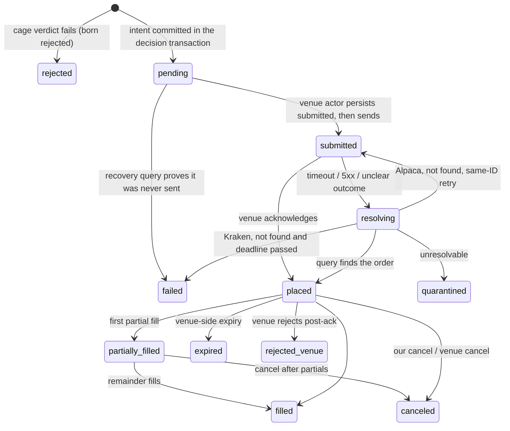

# Venues

Two venue actors own every conversation with an exchange: `kraken-primary` for crypto spot and `alpaca-primary` for US stocks and ETFs. Nothing else in the system may call a venue. This chapter exists because venues time out mid-request, restart our infrastructure without warning, and offer no durable idempotency. In that environment the system must never place an order twice, never lose one, and never disagree with the venue about what happened. The chapter specifies what each adapter does, the ambiguity protocol that makes retries safe, stop management, reconciliation, and the simulated fill model that dry run, backtests, and counterfactuals share. [The tick](./05-the-tick.md) hands a committed intent to a venue actor at its execution step; this chapter is what happens next, and it is the home of the order lifecycle from that handoff to a terminal state.

## What this chapter guarantees

- No code path can submit the same intent to a venue twice. Every retry is preceded by a query that establishes what the venue already knows. A blind resubmission does not exist as a code path.
- No order is sent before its intent row is committed in Postgres.
- The Kraken actor refuses to operate if its key holds withdrawal or withdrawal-address permissions. The Alpaca account has crypto transfers disabled as an account-hygiene measure, and the residual risk of a leaked key is stated rather than hidden.
- Every position the mandate covers has a venue-resident stop working within a fixed grace period of its first fill. If the grace expires, the unprotected quantity is exited at market and the sleeve halts.
- Every resting order carries a venue-side expiry. If the engine dies, its orders die at the venue without the engine's help.
- Activity at a venue that the system did not initiate is never silently adopted. It waits in a suspense record until the operator claims or flags it.
- Fill ingestion, stop management, ambiguity resolution, and reconciliation continue while a sleeve is paused or halted. Pause and halt gate new entries only.
- Dry run, backtests, and counterfactual books execute against one versioned fill model, so all three produce comparable evidence.

## What a venue actor is

A venue actor serializes all private calls for one API key. Serialization solves a venue requirement directly: Kraken requires a strictly increasing nonce per key with no reset, and one single writer issuing every call satisfies that structurally ([Kraken REST authentication](https://docs.kraken.com/exchange/guides/rest/authentication)). The actor owns the credential (a Worker secret only it reads), a rate budget, order execution, live-order polling, stop management, and the reconciliation alarm. It translates typed intents into venue calls and venue events into typed rows. It decides nothing about trading.

The actor's protection duties never stop. When a sleeve is paused or halted, the actor continues ingesting fills, managing stops, resolving ambiguous orders, and reconciling. Only new entries are gated. This rule is defined with the tick's gates in [The tick](./05-the-tick.md); it is restated here because every mechanism in this chapter runs under it.

Public market-data endpoints need no key and no nonce, so they need no serialization. Sleeve actors fetch their own candles directly from public endpoints, as specified in [The tick](./05-the-tick.md). The venue actor handles private calls only.

## Client order IDs

Every intent ID is a UUIDv7, like every other ID in the system. The intent ID doubles as the venue client order ID: Kraken's `cl_ord_id` and Alpaca's `client_order_id` both carry it unchanged. UUIDv7 was chosen system-wide partly for this seam: Kraken's `cl_ord_id` accepts a UUID or at most 18 ASCII characters, so a 26-character ULID would be rejected ([Kraken client-order identifiers](https://docs.kraken.com/api/blog/cl-ord-id/)).

A client order ID is a collision guard, not a durable idempotency key. Both venues enforce uniqueness only among open or active orders. An order that filled and closed no longer blocks its own ID from being reused. The intent ledger in Postgres owns idempotency; the venue-side ID exists so the system can query a venue about a specific attempt and so an accidental duplicate fails loudly while the first order is live.

## The Kraken adapter

### Key posture

On start, the actor calls the API-key introspection endpoint and verifies the key's permissions ([Get API Key Info](https://docs.kraken.com/api/docs/rest-api/get-api-key-info)). The deny list covers withdrawal and withdrawal-address permissions, not withdrawal alone, because a key that can edit withdrawal addresses can redirect funds without a withdrawal permission of its own. If the key holds either permission, the actor refuses every operation and raises a `critical` feed event. The no-withdrawal guarantee is proven at boot, not assumed.

Tax exports use a separate read-only key. That key has its own nonce sequence, so bulk history pulls never contend with the trading actor's nonce, and the trading actor remains the only writer for its own key.

### Nonce discipline

The actor computes each nonce as `max(previous + 1, now_ms)` and persists it in its durable storage before use. Persist-before-use means a crash between persisting and sending wastes at most one nonce value; it can never reuse one. The `now_ms` floor keeps nonces near wall-clock time after long idle periods, and the `previous + 1` floor survives a clock rollback. Kraken documents the strictly-increasing requirement per key ([REST authentication](https://docs.kraken.com/exchange/guides/rest/authentication)); nonce recovery after restart and clock rollback is a required launch fixture.

### Order placement

An entry maps to `AddOrder` ([Add Order](https://docs.kraken.com/api-reference/trading/add-order)) with:

- `cl_ord_id` set to the intent UUIDv7. Kraken enforces uniqueness against open orders, so an accidental duplicate submission fails loudly while the first is live.
- `deadline` set to the venue request timeout plus 5 seconds. Kraken rejects the order server-side if it arrives after this instant. This bound is what makes the ambiguity protocol's Kraken branch sound (below).
- A venue-side expiry (`expiretm`) mirroring the intent's fill window. The engine cancels unfilled remainders at the fill window itself; the venue-side expiry is the backstop that holds even if the engine is dead. **VERIFY:** confirm against a recorded fixture that `expiretm` cancels the remainder of a partially filled order as expected.
- `oflags` including `post` for limit entries. A post-only limit that would cross the book is rejected rather than paying taker fees.
- Fee flags left default. The fill's fee asset is captured from the response, never assumed, because Kraken's fee currency varies with order flags.

Market orders, where the mandate permits them, reserve a buffered worst-case notional before submission. The buffer is a mandate value with no default; the reservation rules are defined in [The tick](./05-the-tick.md).

Kraken offers a validate-only mode (`validate: true`) that checks order shape without placing. It still requires an order-capable key, which constrains how local environments use it; [Operations](./12-operations.md) covers that. There is no generally available Kraken spot sandbox; a test environment exists for qualified clients only ([Advanced API FAQ](https://support.kraken.com/articles/advanced-api-faq)).

### Rate budget

Kraken's REST counter allows roughly 15 tokens decaying at 0.33 per second at the starter tier, with ledger and history calls costing 2 tokens. **VERIFY:** confirm the tier's counter parameters against the account. The actor meters itself to at most 1 call per 3 seconds sustained (proposed). This system's cadence never approaches that budget outside history backfills, and backfills pace themselves to the same budget. Public endpoints have separate limits and are metered separately.

### Market data and history

The public OHLC endpoint returns at most 720 rows per timeframe and always includes a trailing uncommitted candle, so at most 719 returned rows are usable as closed candles ([OHLC](https://docs.kraken.com/api-reference/market-data/get-ohlc-data)). Candle fetching itself belongs to the sleeve actor; deep-history backfill belongs to [Workbench](./10-workbench.md).

Bulk history for tax uses the export API: request an export, poll until ready, download a zip before it expires ([Request export](https://docs.kraken.com/api-reference/account-data/request-export-report)). The ledger export is the spine of tax normalization, with trades joined for pair and fee detail; [Tax](./09-tax.md) owns that pipeline. The export pull runs on the read-only key.

## The Alpaca adapter

### Key posture

Alpaca offers no scoped API keys and no key-permission introspection, so there is no boot assertion equivalent to Kraken's. The Trading API does expose crypto wallet-whitelisting and transfer routes ([crypto transfer](https://docs.alpaca.markets/us/reference/createcryptotransferforaccount), [changelog](https://docs.alpaca.markets/us/changelog/2026-05-28-chain-79031d0)). Simply not calling those routes from our code would not constrain a stolen key at all.

The no-withdrawal posture is therefore achieved at the account, not at the key: crypto is disabled on the account as a one-time setting, which removes the transfer surface a stolen key could reach. The sleeve trades US ETFs only, so the setting costs nothing. This is account hygiene, not a restriction on the operator's own money movements; the operator funds and withdraws through their own channels as before. The setting and its date are recorded in the platform-assumption register in [Operations](./12-operations.md). **VERIFY:** confirm on the live account that disabling crypto disables the transfer and whitelisting API routes, not only the product UI.

The residual risk is stated plainly: a leaked Alpaca key can still trade and liquidate positions. It cannot exfiltrate funds with crypto disabled, but the asymmetry with Kraken's provable key permissions remains, and the register records it rather than papering over it.

### Order placement

`client_order_id` is the intent UUIDv7, unique among active orders, with direct lookup by client order ID supported ([Create Order](https://docs.alpaca.markets/us/reference/postorder), [Get by client ID](https://docs.alpaca.markets/us/reference/getorderbyclientorderid)). Orders use day time-in-force, which mirrors the fill window at the venue: the engine cancels an unfilled remainder at the fill window, and if the engine is dead the order dies at the session close. That backstop is coarser than Kraken's per-order expiry; the chapter says so rather than pretending the two are equivalent.

Alpaca's fractional-order documentation conflicts with its current create-order schema ([Fractional trading](https://docs.alpaca.markets/us/docs/fractional-trading)). The safe envelope until conformance tests prove more: market orders with day time-in-force, carrying exactly one of quantity or notional. **VERIFY:** exercise fractional and notional constraints against the paper environment before any reliance.

### Event ingestion and the paper environment

Order updates are burst-polled, the same as Kraken's (below). If push delivery is ever adopted, the SSE event stream with cursor resume is the mechanism, because the WebSocket stream cannot replay missed events. That adoption is recorded as a later option, not a v1 feature.

The paper environment uses separate credentials and the same broad API shape, but it does not simulate several live-market and distribution behaviors ([Paper trading](https://docs.alpaca.markets/us/v1.4.2/docs/paper-trading)). It exists to integration-test this adapter, and for nothing else. Dry run does not use it: paper fills are optimistic, and dry run must share one fill model with backtests and counterfactuals (below).

Account activities (fills, dividends, withholding, corporate actions) are cursor-paged and feed the tax pipeline ([Account activities](https://docs.alpaca.markets/us/docs/account-activities)). The activity-code catalog carries a **VERIFY** in [Tax](./09-tax.md) because branch sources disagree on the current codes; a real activities pull resolves it.

## The order lifecycle

The tick commits an intent in state `pending` inside its decision transaction, then hands it to the venue actor. From that moment the venue actor owns the intent's state. Transitions are applied by compare-and-set on the intent's state column, with an append-only transition row written in the same transaction; [Data](./03-data.md) specifies that mechanism.



The diagram's semantics in prose:

- **`pending` → `submitted`.** The venue actor persists `submitted` before the HTTP request leaves. From that moment the order is presumed possibly known to the venue, and every path forward starts with a query.
- **`pending` → `failed`.** A recovery scan finds an intent still `pending` past a recovery expiry (60 s, proposed). The actor queries the venue by client order ID. If no such order exists and the intent was never marked `submitted`, the ordering guarantee proves no venue call was made. The intent fails and its reservation is released.
- **`submitted` → `placed`.** A normal acknowledgment. Burst polling starts.
- **`submitted` → `resolving`.** A timeout, a 5xx, or a dropped connection after send. The ambiguity protocol below takes over.
- **`resolving` → `quarantined`.** The protocol could not prove placement or non-placement. The reservation stays held, no new risk-increasing intent forms on that instrument, and the operator gets an incident with the evidence from both sides. Only reconciliation evidence or the operator resolves a quarantined intent.
- **`placed` and beyond.** Fills accumulate through `partially_filled` to a terminal state. On any terminal state the reservation's remainder is committed or released, per the reservation rules in [The tick](./05-the-tick.md).

While an intent is anywhere between `pending` and a terminal state, the sleeve sees it in the record and declines to form a new risk-increasing intent on that instrument. A resting order never blocks later ticks as such; it blocks only new risk-increasing intents on its own instrument.

## Resolving ambiguity

This is the one non-trivial thing a venue actor does. It runs whenever an order call's outcome is unknown. The principle: ask the venue what it knows, and never resubmit on a guess. Time alone never proves an order was not placed.

```
resolve(intent):
  1. Query the venue for an order with client order ID = the intent UUIDv7.
     Kraken: open orders AND closed orders, closed-orders lookback 24 h,
       because an order that filled instantly is not open when we ask.
     Alpaca: GET /orders:by_client_order_id.
  2. Found -> adopt the venue's truth: record the transition the venue
     reports, ingest any fills, continue the normal lifecycle.
  3. Not found:
     Kraken: if now > the order's deadline, the original can no longer
       execute (the venue rejects late arrivals server-side). The intent
       -> failed; its reservation is released; the strategy may issue a
       NEW intent with a NEW ID at the next tick. If now <= deadline,
       wait until the deadline passes, then repeat from 1.
     Alpaca: retry the submission with the SAME client order ID. If the
       original landed in a race, the venue's own uniqueness check turns
       the duplicate into a rejection we can read, and the next resolve
       finds the original.
  4. Query failure: retry the query with backoff (3 attempts, 1 s doubling).
     If the venue stays unreachable, leave the intent resolving, raise a
     venue-unreachable warning, and re-enter resolve from the actor's alarm.
  5. Still unprovable after the escalation window -> quarantined.
```

Sources for the load-bearing venue facts: Kraken's open and closed order queries filter by client order ID ([Open Orders](https://docs.kraken.com/api-reference/account-data/get-open-orders), [Closed Orders](https://docs.kraken.com/api-reference/account-data/get-closed-orders)), and a lookup miss alone does not prove non-placement, which is why the Kraken branch also requires the passed deadline. The `deadline` parameter bounds how late a request may reach the matching engine ([Add Order](https://docs.kraken.com/api-reference/trading/add-order)); it does not prove an earlier request never executed, which is why the query comes first.

The two venue branches differ deliberately. Kraken has a server-side deadline, so a failed intent is genuinely dead and the safe recovery is a new intent with a new ID. Alpaca has no deadline mechanism, so the only safe retry is one the venue itself can deduplicate: the same client order ID, where an active original turns the retry into a readable rejection. **VERIFY:** against the paper environment, that a same-ID retry is also rejected when the original reached each terminal state (filled, canceled, expired, rejected). Until that is proven, a same-ID retry is permitted only after the client-order-ID lookup returns nothing, and an unprovable case goes to `quarantined` rather than relying on rejection behavior the venue has not demonstrated.

The sleeve's in-flight marker stays set through all of this, so no new intent forms on the instrument while resolution runs.

## Fills and polling

While any order is live, the actor polls its status every 2 seconds for the first 30 seconds, then every 10 seconds until terminal (proposed). The polling schedule rides the actor's alarm, so it survives restarts and deploys.

Each response's fills are ingested idempotently. The unique key `(intent_id, venue_fill_id)` drops duplicates: applying the same fill twice changes no balance, position, reservation, or feed count. Each fill row captures quantity, price, fee amount, and fee asset, because Kraken's fee currency varies with order flags and is captured, never assumed. Where a venue lacks an immutable fill ID, the adapter derives a documented composite key and must certify it against recorded fixtures before live trading.

Fill ingestion commits the fill row and its feed event in one Postgres transaction, per the commit rules in [Data](./03-data.md). It then triggers, in order: the system-cage commit for the filled quantity, stop placement or resize (below), and the sleeve's monitors.

At the intent's fill window (default 30 minutes, a mandate value) the actor cancels any unfilled remainder and releases its reservation on venue confirmation of the cancel. The same window is mirrored venue-side at placement: Kraken through the order's `expiretm`, Alpaca through day time-in-force. The mirror is the reason a dead engine leaves no immortal orders behind.

In the worked example (the canonical trade, fixed across chapters 05–07 and traced in full in [examples/crypto-trend-order.md](./examples/crypto-trend-order.md)): intent `018f6b2a-7c4e-7d31-a2f0-3b9d4e8c1a55` runs in the dry-run book, so the "venue" is the simulated adapter and every fill row carries `simulated = true`. The limit order fills A$600 of its A$1,000 partially: 0.006 BTC at its limit price of about A$100,000, filled on a strict cross per the fill model below. The remainder cancels at the 30-minute fill window. The reservation commits A$600 and releases A$400. Had the intent run live, the identical sequence would arrive through Kraken burst polls instead of the simulator, with the same rows and the same state transitions.

## Stops

Stops are venue-resident. Intra-candle protection must not depend on our infrastructure being awake; the venue's matching engine makes no such assumption.

**Placement and resize.** After an entry's first fill, the actor places the stop from the intent's stop instruction as a real venue stop order, sized to the filled quantity. Every further partial fill resizes the stop to the cumulative filled quantity immediately; protection never waits for the parent order to finish. In the worked example, the stop rests at A$94,000 sized 0.006 BTC after the partial fill. A position is not considered protected until the venue acknowledges its stop as working. Stop placement, every move, and every trigger are blotter events.

**Replacement.** A stop move (a trailing adjustment, a resize) places the successor first and cancels the predecessor only after the venue confirms the successor is working. During the overlap both stops rest, which briefly doubles coverage. On spot, a redundant sell stop is benign: the worst case is the second stop firing against a position the first already closed, which the venue rejects for insufficient balance. **VERIFY:** per venue in fixtures, that double coverage of this shape is accepted, and what the venue does if both trigger in one instant. Where a venue cannot support double coverage, the fallback is cancel-then-place, completed inside a 60-second grace; during that grace the position is briefly uncovered, which is why place-first is the default wherever the venue allows it.

**The unprotected response.** When a stop cannot be confirmed working — rejected at placement, canceled externally, lost in a replacement — the actor retries. If the position is still unprotected after `STOP_GRACE` (120 seconds of retries), the actor exits the unprotected quantity at market and halts the sleeve. The mandate's protection not being in force is itself a breach; the response removes the unprotected exposure rather than hoping. While any position in a sleeve is unprotected, no new entries are accepted on any instrument in that sleeve.

**Stop fills against a live parent.** If a stop fills while its parent entry still has an unfilled remainder, the actor immediately cancels the remainder and keeps the reservation until the cancel is confirmed terminal. A late parent fill can reopen exposure after the stop has already fired. The actor records it, immediately places venue-resident protection for the newly exposed quantity, and halts the sleeve; it never assumes the earlier stop still applies.

**No capability access.** No AI capability output can touch a stop. Clamping applies to entries only; exits and stops are outside every capability's reach.

## Reconciliation

Reconciliation exists because the blotter and the venue can drift: a fill polled late, a transfer landing, the operator acting at the venue by hand, or a genuine defect. The rule that governs everything here: the system never trades on numbers in dispute, and it never adopts external activity on its own authority.

Each venue actor reconciles on a schedule (every 6 hours, proposed), on engine startup, and after any connectivity loss.

1. Recompute expected balances, positions, and open orders from the blotter, independently of the positions projection, so the projection is audited too.
2. Fetch the venue's actual state through uncached private endpoints.
3. Compare within tolerances: quantities to the venue's precision, cash to one minor unit.
4. Classify each difference.

The classifications:

- **Match.** Write a reconciliation record; vitals stay healthy.
- **Explained by our own trail.** A fill we polled late, or a pending transfer's arrival or departure that matches a recorded transfer. Adopt and settle normally; transfers settle here, where the capital ledger meets reality ([Domain](./02-domain.md)).
- **External activity.** A trade or movement the system did not make, identified because it carries no Ironcage client order ID. It is never auto-adopted. It lands in a suspense record, new entries pause for the affected scope, and a feed event asks the operator to claim it (it becomes external-activity rows in the record) or flag it (it becomes an incident). Order-level activity attributes to a sleeve through instrument and account context where possible. An account-level discrepancy that cannot be attributed to one sleeve pauses every sleeve on that account, because sleeves share the venue account and no sleeve's numbers are trustworthy while the account's are not.
- **Unexplained mismatch.** Declared only after two consecutive identical mismatching snapshots with no in-flight order between them. A single snapshot can catch a fill in flight, so one disagreement is recorded as `inconclusive` and retried; two identical disagreements with a quiet account between them cannot be in-flight noise. A declared mismatch halts the affected scope with winddown `keep-all`, raises a `critical` event, and generates an incident report carrying both sides of the disagreement.

A reconciliation-mismatch halt always winds down as `keep-all`, regardless of the mandate's winddown policy. The system does not sell what it is not sure it owns. A flatten command from the operator during an attribution dispute is never refused, but it executes only against confirmed quantities. The operator may assert a quantity explicitly, and the assertion is recorded as theirs.

Reconciliation never rewrites history. It appends observations and correction records, then rebuilds projections.

An overdue system-cage reservation with an intent row also lands here: it becomes `reconciliation_required` and blocks entries for its sleeve until a proven terminal venue outcome resolves it. The reservation rules themselves live in [The tick](./05-the-tick.md).

## The simulated fill model

This section is the canonical definition of simulated fills. Dry run, backtests, and the counterfactual books all execute against one simulated adapter, versioned in `packages/engine` (currently `fill@3`). Every simulated fill row records the model version, so a model change is visible in the data and cross-version comparisons say so. Dry-run and backtest fills price identically. There is no live-quote path: one yardstick across backtest, dry run, and counterfactual is the point, because scorecards and trial verdicts compare numbers produced by this model against each other.

The rules err pessimistic on purpose. A strategy that only works with optimistic fills must die in simulation, not in production. Rounding always disadvantages the simulated trader: buys round up to the venue price increment, sells round down. Fees apply at the venue's real schedule for the account's tier.

### Fill rules

- **Market orders** fill in full at the next candle's open after the intent, worsened by the slippage parameter for the order's side, then rounded against the trader, then charged fees. If no next candle exists yet, the order waits for one; it never fills at the last known price.
- **Limit orders** fill only on a strict cross: a buy limit `L` fills when a candle's low is strictly below `L`, a sell limit when the high is strictly above. Touching the price is not a fill, because queue priority at a touched price is unknowable. An eligible limit fills at `L` exactly; the model grants no price improvement.
- **Stops** trigger when the candle range crosses the stop level. The base fill price is the worse of the trigger and a gap through it: for a sell stop `S`, `min(S, candle.open)`. Adverse slippage and rounding then apply on top, because real stops fill past their trigger.
- **Intrabar ordering** is pessimistic. When one candle could trigger two instructions and their real ordering is unknowable, the simulator chooses the sequence that ends with the lower equity and records that it did so.
- **Time-in-force** follows a named venue calendar. A crypto day order expires at the next 00:00 UTC boundary; a US-equity day order expires at the certified session close. A good-till-canceled order stays eligible until fill, cancel, or the run's end. An immediate-or-cancel limit is evaluated against the next candle's open only, and expires if not marketable there. The model admits no good-till-canceled market order: market instructions are day or immediate-or-cancel, and durable price control must be expressed as a limit.

### Worked fill examples

Illustrative, not defaults:

- A two-unit buy market order sees the next candle open at 100.00 with 20 basis points of adverse slippage: the raw fill is `100 × (1 + 20/10,000) = 100.20`. At a 0.01 increment it stays 100.20. At an example 0.25% fee rate, the notional is 200.40 and the fee is 0.501 quote units before fee-precision rounding.
- A buy limit at 100.00 does not fill when a candle's low is exactly 100.00. It fills at 100.00 when a later low is 99.99, with no improvement to 99.99.
- A sell stop at 95.00 sees the next candle open at 92.00 (a gap through the stop). The base is `min(95, 92) = 92`; with 20 basis points of adverse slippage the raw fill is `92 × (1 − 20/10,000) = 91.816`, rounded down to the venue increment.
- The canonical trade: the worked example's dry-run limit order fills 0.006 BTC at its limit price of about A$100,000 on a strict cross, with the remainder canceled at the 30-minute fill window.

Slippage parameters come from the cost model in [Workbench](./10-workbench.md): proposed 5 basis points for crypto majors, 2 for liquid US ETFs, and 10 for stop fills beyond the market slippage.

### What is not simulated

The model does not simulate queue position, partial-fill dynamics, liquidity depth, latency inside a candle, venue outages, or dividends. That list is data in `packages/engine`, and the trial report's simulation-caveats section is generated from it, so the product's statements about dry-run limits cannot drift from what the code actually skips. Partial fills enter simulation only through fill-window mechanics, not through a liquidity model; the open question below covers the gap.

## Values set in this chapter

| Value                                 | Default                                                       | Owner                      | Status              |
| ------------------------------------- | ------------------------------------------------------------- | -------------------------- | ------------------- |
| Venue request timeout                 | 10 s                                                          | engine config              | proposed            |
| Kraken order `deadline`               | request timeout + 5 s                                         | adapter rule               | decided             |
| Kraken closed-orders lookback         | 24 h                                                          | adapter                    | decided             |
| Pending-intent recovery expiry        | 60 s                                                          | adapter                    | proposed            |
| Sustained Kraken call rate            | ≤ 1 per 3 s                                                   | adapter                    | proposed            |
| Burst poll cadence                    | 2 s × 30 s, then 10 s                                         | adapter                    | proposed            |
| Ambiguity query retries               | 3, backoff 1 s doubling                                       | adapter                    | proposed            |
| Fill window                           | 30 min                                                        | mandate                    | decided (default)   |
| Venue-side expiry                     | mirrors the fill window (Kraken `expiretm`; Alpaca day TIF)   | adapter rule               | decided             |
| `STOP_GRACE`                          | 120 s of retries                                              | engine config              | decided             |
| Stop cancel-then-place fallback grace | 60 s                                                          | engine config              | decided             |
| Market-order reservation buffer       | no default; the mandate must set one                          | mandate                    | decided (rule)      |
| Reconciliation schedule               | every 6 h + startup + reconnect                               | engine config              | proposed            |
| Reconciliation tolerances             | venue precision (qty), 1 minor unit (cash)                    | engine config              | proposed            |
| Mismatch quiescence                   | 2 consecutive identical snapshots, no in-flight order between | engine config              | decided             |
| Fill-model slippage                   | 5 bps crypto majors, 2 bps liquid US ETFs                     | engine config (cost model) | proposed            |
| Stop-fill slippage                    | 10 bps                                                        | engine config (cost model) | proposed            |
| Fill-model version                    | `fill@3`                                                      | engine                     | decided (mechanism) |

## Alternatives considered

- **Persistent private WebSockets for fills.** Rejected for v1. Kraken idles connections out at about 60 seconds and its stream cannot replay; the platform pins an outbound socket for at most 15 minutes. Burst polling covers a slow system's needs with no reconnect machinery. Alpaca's SSE-with-cursor is the recorded re-entry path if push is ever needed.
- **Client-side stops.** Rejected. Watching the price and firing our own exit is a promise that Ironcage is awake, connected, and fast during the worst minute of the month. The venue's matching engine makes no such assumption. The cost is venue stop semantics — slippage past the trigger — which the fill model prices in.
- **Venue client-order IDs as durable idempotency keys.** Rejected. Both venues enforce uniqueness only against open or active orders. The intent ledger owns idempotency; the venue IDs are collision guards and query handles.
- **Blind retry on timeout.** Rejected without qualification. Assuming a timeout meant failure and resubmitting is exactly the double-order bug this chapter exists to make unwritable. Every retry path starts with a query.
- **Live-quote pricing for dry-run fills.** Rejected. Pricing dry-run fills at the venue's current quote would make dry run a different yardstick from backtests and counterfactuals, and every comparison across them would carry a hidden methodological seam. All three run one fill model: market and stop fills at next-candle-open, limit fills at the limit on a strict cross.
- **Cancel-then-place as the default stop replacement.** Rejected as the default because it opens a deliberate unprotected window on every stop move. Place-first with brief double coverage is the default; cancel-then-place survives only as the fallback where a venue cannot accept double coverage, bounded by the 60-second grace.
- **Alpaca's paper environment as the dry-run mechanism.** Rejected. Paper fills are optimistic (no slippage, infinite liquidity, no dividends), Kraken has no equivalent at all, and dry run must share one fill model with backtests. Paper is the adapter's integration-test target, nothing more.
- **Auto-adopting external venue activity.** Rejected. Silently folding an unrecognized trade or transfer into the books would let a venue error, a mislabeled transfer, or a compromise flow into equity unexamined. Claim-first costs the operator a confirmation and buys an inspection point on every unexplained fact.

## Open questions

1. **Kraken synthetic-pair fills.** A BTC/AUD order can route synthetically with a consolidated taker fee and a fill price matching no single order book. Safe fallback: the fill row carries the venue's synthetic marker when present, and tax/cost reporting treats the fill at face value. Must close before: live trading on Kraken. Evidence: a real synthetic fill in fixtures plus a decision on whether cost reporting needs special handling.
2. **Alpaca fractional and notional constraints.** The venue's docs contradict its schema. Safe fallback: market/day orders with exactly one of quantity or notional. Must close before: live trading on Alpaca. Evidence: paper-environment conformance tests for each order shape the mandate vocabulary permits.
3. **Alpaca terminal-state duplicate rejection.** Does a same-client-order-ID retry get rejected when the original reached a terminal state, and for which states? Safe fallback: same-ID retry only after a client-order-ID lookup returns nothing, and `quarantined` on anything unprovable. Must close before: live trading on Alpaca. Evidence: paper-environment tests submitting duplicate IDs against orders in filled, canceled, expired, and rejected states.
4. **Double stop coverage per venue.** Is a briefly redundant stop accepted on each venue, and what happens if both trigger in one instant? Safe fallback: cancel-then-place inside the 60-second grace on any venue where double coverage is unproven. Must close before: live trading on the affected venue. Evidence: recorded replacement fixtures on each venue, including a both-trigger race.
5. **Simulated partial-fill determination.** The v1 model has no liquidity model, yet the canonical example shows a partial fill at the fill window; the rule that determines a simulated partial quantity (full-fill-or-expire versus a volume-participation cap) is unspecified, as is the candle granularity the simulator uses for fill evaluation when the decision cadence is coarse. Safe fallback: full-fill-or-expire, with partial fills appearing only where the fill window cancels a remainder the model has priced. Must close before: dry-run activation. Evidence: a written fill-model spec for partial quantity and evaluation granularity, plus golden fixtures exercising it.

## Build checklist

- [ ] Kraken adapter: boot permission assertion (withdrawal and withdrawal-address deny list), nonce `max(prev + 1, now_ms)` persisted before use with restart/rollback tests, `AddOrder` mapping with `cl_ord_id`, `deadline`, and `expiretm`, export-API history pull on the read-only key
- [ ] Alpaca adapter: order mapping with `client_order_id`, day-TIF mirror, fractional constraints behind their VERIFY, activities ingestion for tax; account crypto-disable recorded in the platform-assumption register
- [ ] The lifecycle state machine driven through every transition by property tests, including crash injection at each boundary, asserting no path submits without a committed intent and no path retries without a query
- [ ] The resolve algorithm with fixture tests: timeout-then-found, timeout-then-absent-past-deadline (Kraken), same-ID-retry race (Alpaca), query-failure escalation to quarantine
- [ ] Burst polling with idempotent fill ingestion: `(intent_id, venue_fill_id)` unique-key conflict tests, fee-asset capture from real fixtures
- [ ] Stop lifecycle: place on first fill, resize on each partial, place-first replacement with confirmation before predecessor cancel, cancel-then-place fallback, `STOP_GRACE` market-exit-and-halt, stop-fill-with-live-parent cancellation, late-parent-fill reprotection
- [ ] Reconciliation with all classifications against seeded venue-state fixtures: own-trail adoption, external-activity suspense (never auto-adopted), account-level scope blocking, two-snapshot mismatch declaration, keep-all winddown, confirmed-quantity flatten
- [ ] The simulated adapter: golden fill fixtures for gaps, touches, stop slippage, rounding, fees, pessimistic intrabar ordering, and TIF calendars; the not-simulated list as data feeding the trial-report caveats; model version recorded on every simulated fill
