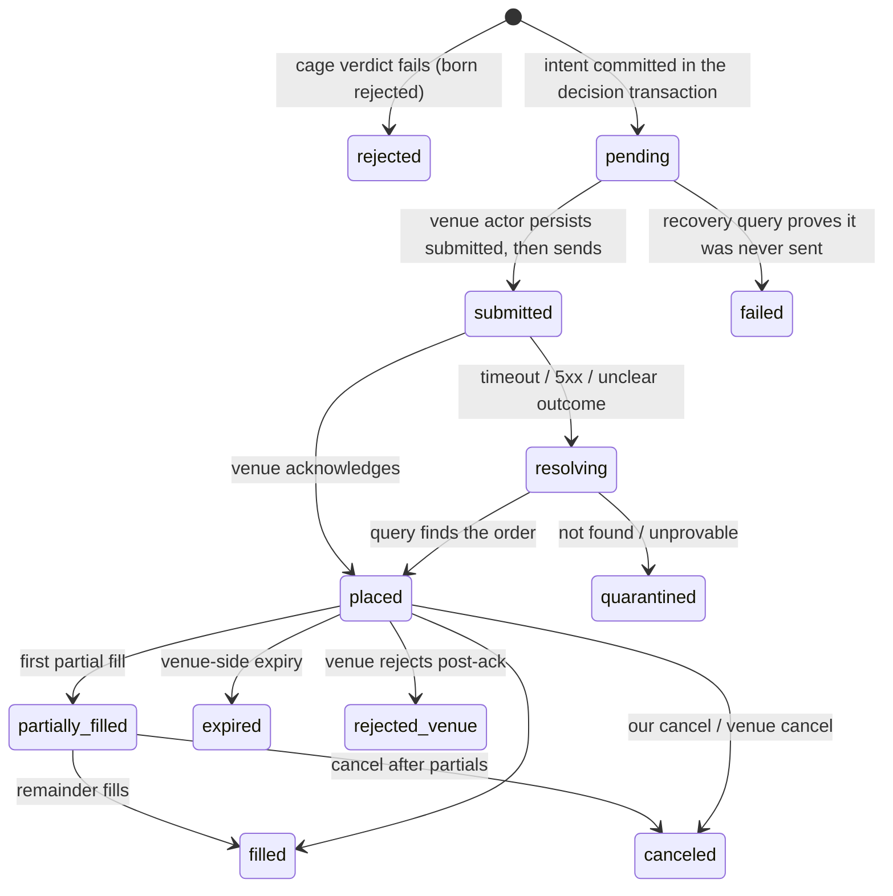

Two venue actors own every private conversation with an exchange: `kraken-primary` for crypto spot and `alpaca-primary` for US stocks and ETFs. Nothing else may call a private venue API.

Venues can time out mid-request, and neither venue publishes a durable contract that turns a negative lookup into proof. Ironcage therefore never resubmits an ambiguous intent. It finds and adopts the venue's fact, or it quarantines the intent while holding its reservation.

This chapter specifies each adapter, the ambiguity protocol, stop management, reconciliation, and the simulated fill model. [The tick](/technical/the-tick) hands execution a committed intent. This chapter owns its lifecycle after that handoff.

## What this chapter guarantees

- No code path submits an ambiguous intent twice. Query retries may repeat; an order submission whose outcome is unknown remains resolving or quarantined until independent venue evidence settles it.
- No order is sent before its intent row is committed in Postgres.
- The Kraken actor refuses to operate unless the key's exact permission set and IP restrictions match the recorded trading-key policy. Alpaca's broad key and wallet/transfer surface remain an explicit residual risk until the production-account gate proves otherwise.
- A mandate may activate live only for venue/product combinations whose stop placement and replacement envelope has passed paper and low-value live conformance. Within that certified envelope, an unprotected quantity exits after the grace interval and the sleeve halts.
- Kraken resting entries use `GTD` plus `expiretm`. Alpaca day orders have only a coarser session-close backstop; the engine's own fill-window cancel remains authoritative.
- Activity at a venue that the system did not initiate is never silently adopted. It waits in a suspense record until the operator claims or flags it.
- Fill ingestion, stop management, ambiguity resolution, and reconciliation continue while a sleeve is paused or halted. Pause and halt gate new entries only.
- Dry run, backtests, and counterfactual books execute against one versioned fill model, so all three produce comparable evidence.

## What a venue actor is

A venue actor is the sole owner of one private API key. Durable Object handlers may interleave across external awaits, so the actor persists private operations into one durable FIFO. It drains exactly one call at a time. For Kraken, the drainer allocates and persists the increasing nonce immediately before send ([Kraken REST authentication](https://docs.kraken.com/exchange/guides/rest-authentication)).

The actor owns the credential, endpoint rate budgets, execution, order-state polling, activity ingestion, stop management, and reconciliation. It translates typed intents into venue calls and venue facts into typed rows. It decides nothing about trading.

The actor's protection duties never stop. When a sleeve is paused or halted, the actor continues ingesting fills, managing stops, resolving ambiguous orders, and reconciling. Only new entries are gated. This rule is defined with the tick's gates in [The tick](/technical/the-tick); it is restated here because every mechanism in this chapter runs under it.

Kraken public market data needs no key. Alpaca equity market data does require a data credential and plan entitlement, so a credential-owning market-data adapter fetches it. Market-data calls use budgets separate from private trading calls; [The tick](/technical/the-tick) consumes the adapter's certified closed candles rather than assuming all venues expose anonymous endpoints.

## Client order IDs

Every intent ID is a UUIDv7, like every other ID in the system. The intent ID doubles as the venue client order ID: Kraken's `cl_ord_id` and Alpaca's `client_order_id` carry it unchanged. Kraken documents a generic UUID shape or at most 18 ASCII characters, so UUIDv7 acceptance is a validate/live fixture rather than an inference from the word UUID ([Kraken client-order identifiers](https://docs.kraken.com/api/blog/cl-ord-id/)).

A client order ID is a correlation handle, not a durable idempotency key. Kraken documents uniqueness for open orders; Alpaca documents uniqueness without an active-only, reuse, retry, or visibility guarantee. Ironcage never deliberately reuses an intent ID and never relies on duplicate rejection to recover an ambiguous submission. Postgres owns application idempotency; the venue ID lets reconciliation ask about one attempt.

## The Kraken adapter

### Key posture

On start, the actor calls API-key introspection and compares the returned permission/restriction set, IP allowlist, and current nonce with the recorded key policy ([Get API Key Info](https://docs.kraken.com/api-reference/account-data/get-api-key-info)). The allowed set is exact, not merely a deny list: it excludes `withdraw-funds`, `add-withdraw-address`, `update-withdraw-address`, and every unnecessary funding/earn scope. An address-edit permission cannot withdraw by itself but can redirect a later withdrawal, so it is still forbidden. Any mismatch refuses all operations and raises a `critical` event.

Tax exports use a separate read-only key. That key has its own nonce sequence, so bulk history pulls never contend with the trading actor's nonce, and the trading actor remains the only writer for its own key.

### Nonce discipline

At boot, the actor advances its durable nonce to at least the current nonce returned by API-key introspection. For each drained call it computes `max(previous + 1, now_ms)` and persists before send. A crash may waste a nonce but cannot reuse one; the wall-clock floor survives long idle periods and the increment survives clock rollback. Restart, clock rollback, and server-ahead nonce fixtures are launch gates.

### Order placement

An entry maps to `AddOrder` ([Add Order](https://docs.kraken.com/api-reference/trading/add-order)) with:

- `cl_ord_id` set to the never-reused intent UUIDv7, after the UUIDv7 fixture has passed.
- `deadline` set to request timeout plus 5 seconds and validated inside Kraken's 2–60 second bounds. It prevents late arrival; it does not prove that an earlier accepted order is visible to a subsequent query.
- `timeinforce=GTD` and `expiretm` set to the intent fill-window deadline, within Kraken's 5-second-to-one-month expiry bounds. Both fields are recorded. Live activation requires a fixture proving expiry of unfilled and partially filled remainders.
- `oflags` including `post` for limit entries. A post-only limit that would cross the book is rejected rather than paying taker fees.
- Fee flags left default. The fill's fee asset is captured from the response, never assumed, because Kraken's fee currency varies with order flags.

Market orders, where the mandate permits them, reserve a buffered worst-case notional before submission. The buffer is a mandate value with no default; the reservation rules are defined in [The tick](/technical/the-tick).

Kraken offers a validate-only mode (`validate: true`) that checks order shape without placing. It still requires an order-capable key, which constrains how local environments use it; [Operations](/technical/operations) covers that. There is no generally available Kraken spot sandbox; a test environment exists for qualified clients only ([Advanced API FAQ](https://support.kraken.com/articles/advanced-api-faq)).

### Rate budget

Kraken exposes separate public, private REST, and trading counters. The current documented verified-tier private counter has a maximum of 20 and decays by 0.5 per second. Ledgers, TradesHistory, and ClosedOrders cost 4; ordinary private calls cost 1. Trading calls use a separate per-account, per-pair counter ([REST limits](https://support.kraken.com/articles/206548367-what-are-the-api-rate-limits-), [trading limits](https://support.kraken.com/articles/360045239571-trading-rate-limits/)).

The adapter models those resources separately and reads the actual account tier at launch. A 429 preserves the operation in resolving state; it is never evidence of non-placement.

### Market data and history

The public OHLC endpoint returns at most 720 rows and always includes the current uncommitted interval, so at most 719 returned rows are closed candles ([OHLC](https://docs.kraken.com/api-reference/market-data/get-ohlc-data)). Downloadable OHLCVT archives omit intervals with no trades; the normalizer distinguishes confirmed zero-trade intervals from missing source coverage and never calls every absent timestamp a data gap. Deep-history policy belongs to [Workbench](/technical/workbench).

Bulk history for tax uses the export API: request, poll, retrieve, then remove the archive. [Kraken identifies Ledger as authoritative](https://support.kraken.com/articles/115000302707-differences-between-ledger-and-trades-history) for exact fee amount/currency and balance-changing type/subtype; trades supplement pair and execution context via `refid`. The pull runs on the dedicated read-only key with the exact Ledger/Closed Trades query permissions ([Kraken export API](https://support.kraken.com/articles/360025484891-how-to-export-your-account-history-via-api)).

## The Alpaca adapter

### Key posture

Alpaca offers no scoped API keys or permission introspection equivalent to Kraken. Its Trading API exposes wallet, whitelist, and transfer routes, and the public account-config contract exposes no switch guaranteed to remove them ([account configuration](https://docs.alpaca.markets/us/reference/patchaccountconfig-1), [wallet API changelog](https://docs.alpaca.markets/us/changelog/2026-05-28-chain-79031d0)). Not calling those routes does not constrain a stolen key.

[Alpaca's current availability page](https://alpaca.markets/support/countries-alpaca-is-available) publishes no supported-country list and directs applicants to support. The production gate therefore requires an approved and funded Australian-resident securities Trading API account. The account must have no crypto agreement or activation. Where the account API exposes a crypto state, it must show that crypto is not enabled. Production tests must reject wallet enumeration, whitelist creation, and transfer creation, and Alpaca must confirm the result in writing.

Until that evidence exists, the wealth sleeve cannot enter live mode. If Alpaca provides no enforceable boundary, the product states that a leaked key may trade, liquidate, and potentially transfer funds. Venue selection then reopens.

At boot the actor also asserts the long-only/cash account posture (`no_shorting`, margin multiplier compatible with cash-only operation, account not trading-blocked) rather than relying on intent logic alone.

### Order placement

`client_order_id` is the never-reused intent UUIDv7, with direct lookup supported but no promised visibility or retry-idempotency SLA ([Create Order](https://docs.alpaca.markets/us/reference/postorder), [Get by client ID](https://docs.alpaca.markets/us/reference/getorderbyclientorderid)). Orders use day time-in-force. The engine cancels at its shorter fill window; if it is dead, session close is only a coarse outer backstop.

The initial certified envelope is market/day with exactly one of quantity or notional, only when the asset is `fractionable`, within the account's documented precision/minimums ([fractional trading](https://docs.alpaca.markets/us/docs/fractional-trading)). Paper tests precede a low-notional live canary. Fractional stops remain unavailable until their contradictory documentation is resolved by live conformance.

### Event ingestion and the paper environment

Order state is polled/queried. Executions and other financial activities come from two versioned sources: legacy Account Activities REST for older history and Activity SSE/REST for activity booked after its documented 2026-02-11 boundary. Activity SSE has resumable event IDs and correction/bust links but does not carry accepted/canceled/expired/replaced lifecycle events, so it supplements rather than replaces order-state polling. No claim is made that the trading WebSocket has a replay contract.

The paper environment uses separate credentials and the same broad API shape, but omits realistic market impact, latency/slippage, queue position, price improvement, regulatory fees, and dividends; it uses IEX market data ([Paper trading](https://docs.alpaca.markets/us/docs/paper-trading)). It integration-tests the adapter but cannot certify live matching, key security, entitlement, or Australian account availability. Dry run uses the shared fill model instead.

Legacy Account Activities are page-token paged with immutable IDs and legacy codes. New Activity SSE uses a different type/subtype vocabulary and stable `ref_id`; corrections/busts reference previous activity. Both streams feed the tax pipeline through separate normalizers ([legacy activities](https://docs.alpaca.markets/us/docs/account-activities), [Activity SSE](https://docs.alpaca.markets/us/docs/activity-sse)).

## The order lifecycle

The tick commits an intent in state `pending` inside its decision transaction, then hands it to the venue actor. From that moment the venue actor owns the intent's state. Transitions are applied by compare-and-set on the intent's state column, with an append-only transition row written in the same transaction; [Data](/technical/data) specifies that mechanism.



The diagram's semantics in prose:

- **`pending` → `submitted`.** The venue actor persists `submitted` before the HTTP request leaves. From that moment the order is presumed possibly known to the venue, and every path forward starts with a query.
- **`pending` → `failed`.** A recovery scan finds an intent still `pending` past a recovery expiry (60 s, proposed). The actor queries the venue by client order ID. If no such order exists and the intent was never marked `submitted`, the ordering guarantee proves no venue call was made. The intent fails and its reservation is released.
- **`submitted` → `placed`.** A normal acknowledgment. Burst polling starts.
- **`submitted` → `resolving`.** A timeout, a 5xx, or a dropped connection after send. The ambiguity protocol below takes over.
- **`resolving` → `quarantined`.** The protocol could not prove placement or non-placement. The reservation stays held, no new risk-increasing intent forms on that instrument, and the operator gets an incident with the evidence from both sides. Only reconciliation evidence or the operator resolves a quarantined intent.
- **`placed` and beyond.** Fills accumulate through `partially_filled` to a terminal state. On any terminal state the reservation's remainder is committed or released, per the reservation rules in [The tick](/technical/the-tick).

While an intent is anywhere between `pending` and a terminal state, the sleeve sees it in the record and declines to form a new risk-increasing intent on that instrument. A resting order never blocks later ticks as such; it blocks only new risk-increasing intents on its own instrument.

## Resolving ambiguity

This is the one non-trivial thing a venue actor does. It runs whenever an order call's outcome is unknown. The principle: ask the venue what it knows, never turn a negative snapshot into proof, and never resubmit an ambiguous intent.

```txt resolve
resolve(intent):
  1. Preserve the reservation and block risk-increasing intents on the instrument.
  2. Query by client order ID over a bounded reconciliation interval.
     Kraken: Open Orders + Closed Orders, then Trades/Ledger evidence.
     Alpaca: order lookup plus immutable Activities evidence.
  3. Found -> adopt the venue's state and ingest executions from the venue's
     authoritative activity source.
  4. Query failure -> retry the query with backoff from the actor's alarm;
     maintenance, 429, 5xx, and transport failure never imply non-placement.
  5. Repeated negative snapshots -> quarantined. The reservation remains held.
     Reconciliation evidence or a recorded operator resolution is the only exit.
```

Kraken's queries can filter by client order ID ([Open Orders](https://docs.kraken.com/api-reference/account-data/get-open-orders), [Closed Orders](https://docs.kraken.com/api-reference/account-data/get-closed-orders)), and `deadline` rejects requests that arrive late. None of those sources promises that an order accepted earlier is visible by the time a query runs. Alpaca likewise documents create and lookup but no lookup visibility or same-ID retry guarantee. Quarantine is therefore the contract for both venues; a future written consistency/idempotency guarantee may narrow it, but a paper observation alone may not.

The sleeve's in-flight marker stays set through all of this, so no new intent forms on the instrument while resolution runs.

## Fills and polling

While any order is live, the actor polls state under an account-wide endpoint budget: every 2 seconds for the first 30 seconds, then every 10 seconds until terminal (proposed), coalescing open-order reads when several orders are active. Alpaca's documented 200 requests/minute/account ceiling is enforced with backoff. The schedule rides the durable operation queue/alarm and survives restarts.

Order-status responses drive lifecycle state, not the execution ledger. Kraken executions are reconciled to authoritative trade/ledger records; Alpaca executions come from legacy Activities or Activity SSE. The unique key `(intent_id, venue_fill_id)` uses Kraken's immutable execution identity or Alpaca activity `id`/`ref_id`, so replay and correction processing are idempotent. A correction or bust appends a linked reversal/correction; it never edits the original fill. Each final fill fact captures quantity, price, exact fee amount, and fee asset from the authoritative financial source.

Fill ingestion commits the fill row and its feed event in one Postgres transaction, per the commit rules in [Data](/technical/data). It then triggers, in order: the system-cage commit for the filled quantity, stop placement or resize (below), and the sleeve's monitors.

At the intent's fill window (default 30 minutes) the actor cancels any unfilled remainder and releases its reservation only on a proven terminal state. Kraken mirrors that exact window with `GTD`+`expiretm`. Alpaca day TIF does not mirror 30 minutes; it only prevents the order surviving the session close. The product displays that coarser backstop rather than calling the venues equivalent.

:::note[The worked example]
The canonical trade, fixed across chapters 05–07 and traced in full in [Crypto trend order](/technical/examples/crypto-trend-order): intent `018f6b2a-7c4e-7d31-a2f0-3b9d4e8c1a55` runs in the dry-run book, so the "venue" is the example's scripted adapter and every fill row carries `simulated = true`. The limit order fills A$600 of its A$1,000 partially: 0.006 BTC at its limit price of about A$100,000. The price follows the fill model's strict-cross limit rule below; the partial quantity is scripted, because the fill model fills or expires an order whole (open question 5). The remainder cancels at the 30-minute fill window. The reservation commits A$600 and releases A$400. Had the intent run live, the identical sequence would arrive through Kraken burst polls instead of the simulator, with the same rows and the same state transitions.
:::

## Stops

Stops are venue-resident. Intra-candle protection must not depend on our infrastructure being awake; the venue's matching engine makes no such assumption.

**Placement and resize.** After an entry's first fill, the actor places the stop from the intent's stop instruction as a real venue stop order, sized to the filled quantity. Every further partial fill resizes the stop to the cumulative filled quantity immediately; protection never waits for the parent order to finish. In the worked example, the stop rests at A$94,000 sized 0.006 BTC after the partial fill. A position is not considered protected until the venue acknowledges its stop as working. Stop placement, every move, and every trigger are blotter events.

**Replacement.** The replacement algorithm is certified per venue and product. Place-successor-first is used only where paper and low-value live fixtures prove overlapping stops are accepted, how quantity is reserved, and what simultaneous triggers do. Everywhere else the adapter cancels then places inside a 60-second grace while blocking all new entries. No generic claim says redundant stops are benign or that insufficient balance resolves every race.

**The unprotected response.** When a stop cannot be confirmed working — rejected at placement, canceled externally, lost in a replacement — the actor retries. If the position is still unprotected after `STOP_GRACE` (120 seconds of retries), the actor exits the unprotected quantity at market and halts the sleeve. The mandate's protection not being in force is itself a breach; the response removes the unprotected exposure rather than hoping. While any position in a sleeve is unprotected, no new entries are accepted on any instrument in that sleeve.

**Stop fills against a live parent.** If a stop fills while its parent entry still has an unfilled remainder, the actor immediately cancels the remainder and keeps the reservation until the cancel is confirmed terminal. A late parent fill can reopen exposure after the stop has already fired. The actor records it, immediately places venue-resident protection for the newly exposed quantity, and halts the sleeve; it never assumes the earlier stop still applies.

**No capability access.** No AI capability output can touch a stop. Clamping applies to entries only; exits and stops are outside every capability's reach.

## Reconciliation

Reconciliation exists because the blotter and the venue can drift: a fill polled late, a transfer landing, the operator acting at the venue by hand, or a genuine defect. The rule that governs everything here: the system never trades on numbers in dispute, and it never adopts external activity on its own authority.

Each venue actor reconciles on a schedule (every 6 hours, proposed), on engine startup, after connectivity loss, and after any ambiguous submit. Before a new order it also checks venue/account operability: Kraken system status must permit trading; Alpaca must not be `trading_blocked`, and the session/TIF combination must be valid. Maintenance, throttle, and account-block responses preserve reservations and enter resolving/quarantine.

<Steps>
  <Step title="Recompute">
    Expected balances, positions, and open orders from the blotter, independently of the positions
    projection, so the projection is audited too.
  </Step>
  <Step title="Fetch">
    The venue's actual state through uncached private endpoints. Kraken spot holdings come from
    Balance/Extended Balance plus open spot orders and ledger facts; Open Positions is a margin
    endpoint and is never used as spot inventory. Pending withdrawals/transfers are recorded
    separately so their exclusion from available balance does not look like unexplained drift.
  </Step>
  <Step title="Compare">
    Within tolerances: quantities to the venue's precision, cash to one minor unit.
  </Step>
  <Step title="Classify">Each difference, per the classifications below.</Step>
</Steps>

The classifications:

- **Match.** Write a reconciliation record; vitals stay healthy.
- **Explained by our own trail.** A fill we polled late, or a pending transfer's arrival or departure that matches a recorded transfer. Adopt and settle normally; transfers settle here, where the capital ledger meets reality ([Domain](/technical/domain)).
- **External activity.** A trade or movement the system did not make, identified because it carries no Ironcage client order ID. It is never auto-adopted. It lands in a suspense record, new entries pause for the affected scope, and a feed event asks the operator to claim it (it becomes external-activity rows in the record) or flag it (it becomes an incident). Order-level activity attributes to a sleeve through instrument and account context where possible. An account-level discrepancy that cannot be attributed to one sleeve pauses every sleeve on that account, because sleeves share the venue account and no sleeve's numbers are trustworthy while the account's are not.
- **Unexplained mismatch.** Declared only after two consecutive identical mismatching snapshots with no in-flight order between them. A single snapshot can catch a fill in flight, so one disagreement is recorded as `inconclusive` and retried; two identical disagreements with a quiet account between them cannot be in-flight noise. A declared mismatch halts the affected scope with winddown `keep-all`, raises a `critical` event, and generates an incident report carrying both sides of the disagreement.

A reconciliation-mismatch halt always winds down as `keep-all`, regardless of the mandate's winddown policy. The system does not sell what it is not sure it owns. A flatten command from the operator during an attribution dispute is never refused, but it executes only against confirmed quantities. The operator may assert a quantity explicitly, and the assertion is recorded as theirs.

Reconciliation never rewrites history. It appends observations and correction records, then rebuilds projections.

An overdue system-cage reservation with an intent row also lands here: it becomes `reconciliation_required` and blocks entries for its sleeve until a proven terminal venue outcome resolves it. The reservation rules themselves live in [The tick](/technical/the-tick).

## The simulated fill model

This section is the canonical definition of simulated fills. Dry run, backtests, and the counterfactual books all execute against one simulated adapter, versioned in `packages/engine` (currently `fill@3`). Every simulated fill row records the model version, so a model change is visible in the data and cross-version comparisons say so. Dry-run and backtest fills price identically. There is no live-quote path: one yardstick across backtest, dry run, and counterfactual is the point, because scorecards and trial verdicts compare numbers produced by this model against each other.

The rules err pessimistic on purpose. A strategy that only works with optimistic fills must die in simulation, not in production. Rounding always disadvantages the simulated trader: buys round up to the venue price increment, sells round down. Fees apply at the venue's real schedule for the account's tier.

### Fill rules

- **Market orders** fill in full at the next candle's open after the intent, worsened by the slippage parameter for the order's side, then rounded against the trader, then charged fees. If no next candle exists yet, the order waits for one; it never fills at the last known price.
- **Limit orders** fill only on a strict cross: a buy limit `L` fills when a candle's low is strictly below `L`, a sell limit when the high is strictly above. Touching the price is not a fill, because queue priority at a touched price is unknowable. An eligible limit fills at `L` exactly; the model grants no price improvement.
- **Stops** trigger when the candle range crosses the stop level. The base fill price is the worse of the trigger and a gap through it: for a sell stop `S`, `min(S, candle.open)`. Adverse slippage and rounding then apply on top, because real stops fill past their trigger.
- **Intrabar ordering** is pessimistic. When one candle could trigger two instructions and their real ordering is unknowable, the simulator chooses the sequence that ends with the lower equity and records that it did so.
- **Time-in-force** follows a named venue calendar. A crypto day order expires at the next 00:00 UTC boundary; a US-equity day order expires at the certified session close. A good-till-canceled order stays eligible until fill, cancel, or the run's end. An immediate-or-cancel limit is evaluated against the next candle's open only, and expires if not marketable there. The model admits no good-till-canceled market order: market instructions are day or immediate-or-cancel, and durable price control must be expressed as a limit.

### Worked fill examples

:::note[Illustrative, not defaults]

- A two-unit buy market order sees the next candle open at 100.00 with 20 basis points of adverse slippage: the raw fill is `100 × (1 + 20/10,000) = 100.20`. At a 0.01 increment it stays 100.20. At an example 0.25% fee rate, the notional is 200.40 and the fee is 0.501 quote units before fee-precision rounding.
- A buy limit at 100.00 does not fill when a candle's low is exactly 100.00. It fills at 100.00 when a later low is 99.99, with no improvement to 99.99.
- A sell stop at 95.00 sees the next candle open at 92.00 (a gap through the stop). The base is `min(95, 92) = 92`; with 20 basis points of adverse slippage the raw fill is `92 × (1 − 20/10,000) = 91.816`, rounded down to the venue increment.
- The canonical trade: the worked example's dry-run limit order fills 0.006 BTC at its limit price of about A$100,000 on a strict cross, with the remainder canceled at the 30-minute fill window. The partial quantity itself comes from the example's scripted adapter, not this model, which fills or expires whole.

:::

Slippage parameters come from the cost model in [Workbench](/technical/workbench): proposed 5 basis points for crypto majors, 2 for liquid US ETFs, and 10 for stop fills beyond the market slippage.

### What is not simulated

The model does not simulate queue position, partial-fill dynamics, liquidity depth, latency inside a candle, venue outages, or dividends. That list is data in `packages/engine`, and the trial report's simulation-caveats section is generated from it, so the product's statements about dry-run limits cannot drift from what the code actually skips. Partial fills enter simulation only through fill-window mechanics, not through a liquidity model; the open question below covers the gap.

## Values set in this chapter

| Value                                 | Default                                                        | Owner                      | Status              |
| ------------------------------------- | -------------------------------------------------------------- | -------------------------- | ------------------- |
| Venue request timeout                 | 10 s                                                           | engine config              | proposed            |
| Kraken order `deadline`               | request timeout + 5 s                                          | adapter rule               | decided             |
| Kraken reconciliation query window    | repeated Open/Closed/Trades/Ledger until settled or quarantine | adapter                    | decided             |
| Pending-intent recovery expiry        | 60 s                                                           | adapter                    | proposed            |
| Kraken endpoint budgets               | public + private REST + per-pair trading                       | adapter                    | decided (mechanism) |
| Alpaca Trading API budget             | ≤ 200 requests/min/account                                     | adapter                    | platform limit      |
| Burst poll cadence                    | 2 s × 30 s, then 10 s                                          | adapter                    | proposed            |
| Ambiguity query retries               | 3, backoff 1 s doubling                                        | adapter                    | proposed            |
| Fill window                           | 30 min                                                         | mandate                    | decided (default)   |
| Kraken venue-side expiry              | `GTD` + `expiretm` at fill-window deadline                     | adapter rule               | decided             |
| Alpaca venue-side backstop            | day TIF/session close; not the fill window                     | adapter rule               | decided             |
| `STOP_GRACE`                          | 120 s of retries                                               | engine config              | decided             |
| Stop cancel-then-place fallback grace | 60 s                                                           | engine config              | decided             |
| Market-order reservation buffer       | no default; the mandate must set one                           | mandate                    | decided (rule)      |
| Reconciliation schedule               | every 6 h + startup + reconnect                                | engine config              | proposed            |
| Reconciliation tolerances             | venue precision (qty), 1 minor unit (cash)                     | engine config              | proposed            |
| Mismatch quiescence                   | 2 consecutive identical snapshots, no in-flight order between  | engine config              | decided             |
| Fill-model slippage                   | 5 bps crypto majors, 2 bps liquid US ETFs                      | engine config (cost model) | proposed            |
| Stop-fill slippage                    | 10 bps                                                         | engine config (cost model) | proposed            |
| Fill-model version                    | `fill@3`                                                       | engine                     | decided (mechanism) |

## Alternatives considered

- **One push stream for everything.** Rejected. Order lifecycle remains recoverable through REST state queries. Alpaca Activity SSE is adopted for replayable executions/corrections but does not contain the full order lifecycle. No unsupported replay/idle guarantee is assigned to either trading WebSocket.
- **Client-side stops.** Rejected. Watching the price and firing our own exit is a promise that Ironcage is awake, connected, and fast during the worst minute of the month. The venue's matching engine makes no such assumption. The cost is venue stop semantics — slippage past the trigger — which the fill model prices in.
- **Venue client-order IDs as durable idempotency keys.** Rejected. Published uniqueness and lookup behavior do not establish a retry contract. The intent ledger owns idempotency; venue IDs are correlation handles and are never reused.
- **Order resubmission after an ambiguous timeout.** Rejected. Queries can repeat; the order submission cannot. Negative snapshots quarantine because neither venue publishes the required consistency/idempotency guarantee.
- **Live-quote pricing for dry-run fills.** Rejected. Pricing dry-run fills at the venue's current quote would make dry run a different yardstick from backtests and counterfactuals, and every comparison across them would carry a hidden methodological seam. All three run one fill model: market and stop fills at next-candle-open, limit fills at the limit on a strict cross.
- **One stop-replacement rule for both venues.** Rejected. Place-first is enabled only for a certified venue/product envelope; cancel-then-place is the fail-closed default elsewhere, bounded by the 60-second grace and an entry block.
- **Alpaca's paper environment as the dry-run mechanism.** Rejected. Paper omits material live matching/distribution behavior and uses IEX. It is the adapter's first integration target; the shared fill model remains the product's simulation yardstick.
- **Auto-adopting external venue activity.** Rejected. Silently folding an unrecognized trade or transfer into the books would let a venue error, a mislabeled transfer, or a compromise flow into equity unexamined. Claim-first costs the operator a confirmation and buys an inspection point on every unexplained fact.

## Open questions

1. **Alpaca production eligibility and transfer boundary.** Safe fallback: the wealth sleeve cannot enter live mode. Must close before: any live Alpaca order. Evidence: approved/funded Australian securities account, production negative tests for wallet/whitelist/transfer routes, and written provider confirmation.
2. **Venue ambiguity guarantees.** Safe fallback: repeated negative lookups quarantine forever until reconciliation/operator evidence settles them; no resubmission. Must close before: any relaxation of that rule. Evidence: a written provider consistency/idempotency contract plus forced-timeout live fixtures.
3. **Alpaca fractional and stop envelope.** Safe fallback: market/day qty/notional on `fractionable` assets; no fractional stop reliance; cancel-then-place replacement. Must close before: enabling each wider order shape. Evidence: paper followed by a low-notional live canary.
4. **Double stop coverage per venue/product.** Safe fallback: cancel-then-place inside the grace interval. Must close before: place-first activation. Evidence: recorded paper and low-value live races, including both triggers.
5. **Simulated partial-fill determination.** The v1 model has no liquidity model. Safe fallback: full-fill-or-expire. Must close before: dry-run activation. Evidence: a written quantity/granularity rule and golden fixtures.

## Build checklist

- [ ] Kraken adapter: exact boot permission/IP/nonce assertion; one durable private-call drainer; UUIDv7 fixture; `AddOrder` with bounded `deadline` and `GTD`+`expiretm`; separate endpoint budgets; export history with Ledger fee authority
- [ ] Alpaca adapter: Australian-account and transfer-surface launch gate; cash/long-only boot assertion; authenticated/pinned market-data feed; market/day fractional envelope; legacy Activities + new Activity SSE normalizers
- [ ] Lifecycle property tests with crash injection, asserting no send before committed intent and no second submission after any ambiguous outcome
- [ ] Resolve fixtures: timeout-then-found, repeated negative snapshots to quarantine on both venues, maintenance/429/5xx, and later reconciliation evidence — no same-ID retry path
- [ ] State polling separated from immutable execution ingestion; correction/bust fixtures; `(intent_id, venue_fill_id)` idempotency; fee authority from Ledger/Activities
- [ ] Stop lifecycle certified per venue/product: place, resize, cancel-then-place default, optional proven place-first, simultaneous triggers, grace exit-and-halt, and late-parent-fill reprotection
- [ ] Reconciliation with all classifications against seeded venue-state fixtures: own-trail adoption, external-activity suspense (never auto-adopted), account-level scope blocking, two-snapshot mismatch declaration, keep-all winddown, confirmed-quantity flatten
- [ ] The simulated adapter: golden fill fixtures for gaps, touches, stop slippage, rounding, fees, pessimistic intrabar ordering, and TIF calendars; the not-simulated list as data feeding the trial-report caveats; model version recorded on every simulated fill
