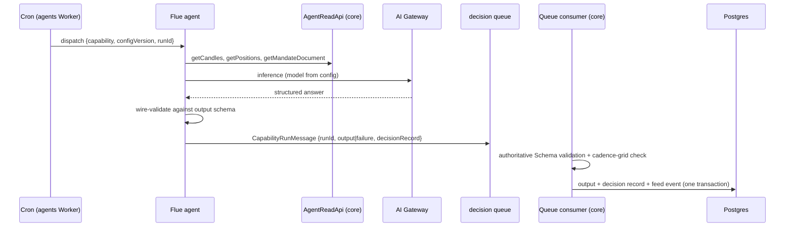
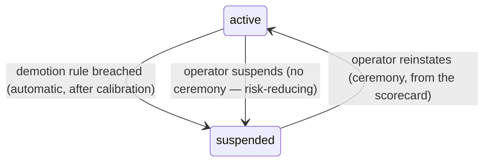

Every line of AI code lives in `ironcage-agents`, a Flue application. The engine never calls a model. It reads rows that agents produced earlier and that core validated on arrival. This chapter exists because a model's output is sometimes brilliant, sometimes wrong, and occasionally shaped by hostile input data, and the system must extract value from it without ever letting its words become actions. The chapter specifies the capability registry, the two baselines every capability declares, the run pipeline from dispatch to consumed row, logical-time staleness, the permanent evidence, the AI Gateway configuration, the initial capabilities, scorecards and demotion, and the design-time agents. The queue contract's full definition lives in [Contracts](/technical/contracts); how the clamp applies throttle output lives in [The tick](/technical/the-tick); the gate pipeline that judges proposals lives in [Workbench](/technical/workbench); the conversation surface lives in [App](/technical/app).

## What this chapter guarantees

- The model's words never touch the engine. Only rows that passed the agent's wire validation and core's authoritative Schema validation exist as far as the engine is concerned.
- Agents have exactly two paths: the read-only context API in and the decision queue out. There is no agent write path to Postgres, R2, or any venue.
- A failed, stale, absent, or suspended output can only make a sleeve more cautious. Every consumer degrades to the capability's declared safe default.
- Killing the agents Worker entirely leaves trading running. Every capability's output expires on schedule, its consumers apply safe defaults, and the degradation is visible.
- Every consequential AI output has a permanent decision record: what was asked at decision grain, what was decided, the stated rationale, model and configuration version, timing, estimated cost, Gateway Log IDs when captured, and application-owned trace IDs.
- Every runtime capability is scored by the engine against the counterfactual of its own absence, never against its fail-closed default, and never by the model itself. A capability that cannot beat its absence is suspended by machinery.
- No AI failure mode makes the system bolder, and none makes it less auditable.

## The capability contract

A capability is one typed AI authority. Its registry entry is code in `packages/domain`, reviewed and versioned like the engine:

```ts registry.ts
// packages/domain/src/ai/capability/registry.ts
export interface CapabilityDefinition<Output> {
  readonly name: string; // "regime-assessment"
  readonly version: number; // registry entries are immutable; changes create a new version
  readonly safetyClass: "throttle" | "proposal" | "observer" | "trade-proposer";
  readonly consumes: ReadonlyArray<ContextRequirement>; // what AgentReadApi data it may read
  readonly output: Schema.Schema<Output>; // the ONLY shape core will accept
  readonly consumer: EngineConsumer; // which deterministic component reads it
  readonly trigger: CapabilityTrigger; // what one run answers: a schedule slot or a batch of work
  readonly safeDefault: Output | Absent; // fail-closed behavior when no valid output exists
  readonly noAiIdentity: Output | Absent; // the capability absent — the scorecard's control
  readonly materialChange: MaterialChangeRule<Output>; // when a fresh output emits a feed notice
  readonly demotion: DemotionRule; // when the engine stops listening
}

export type CapabilityTrigger =
  | {
      // The agents Worker's cron dispatches one run per slot on the grid.
      readonly _tag: "schedule";
      readonly cadence: Duration; // the schedule grid runs are dispatched on
      readonly validFor: Duration; // valid_until = scheduled_at + validFor (default 1.5 × cadence)
      readonly dispatchDeadline: Duration; // delivery after scheduled_at + this is rejected
    }
  // Core dispatches a run when the triggering work arrives. Batch output has
  // no validity window: it does not decay, it waits for its consumer.
  | { readonly _tag: "batch" };
```

A run answers exactly one trigger. Runtime trading capabilities use a `schedule` trigger: a tick consumes their newest valid output, so freshness must be computable, and the clock is the candle grid the tick already reads. A `batch` capability is dispatched by core when its work arrives — Money's categorization runs once per import batch — and its output carries no validity window, because a suggestion waits in a review queue rather than gating a tick.

The four safety classes are closed. A new capability must fit one of them. Adding a fifth class changes the product's safety model and is a product decision, never an ordinary registry edit.

Two things are data, not code. **Per-sleeve parameters** live in the mandate: which capabilities a sleeve holds, at which registry version, with which thresholds. A mandate may shorten a capability's validity window for its own sleeve; it may never lengthen one. **Model selection** lives in versioned configuration rows:

```ts capability-config.ts
export interface CapabilityConfig {
  readonly capability: string;
  readonly version: number; // stamped on every output and decision record
  readonly model: string; // a Flue model specifier
  readonly parameters: { temperature?: number; maxTokens?: number };
  readonly budget: { maxCostPerRunUsd: number; maxRunsPerDay: number };
}
```

Changing a model is a recorded configuration act. Every output row carries its `configVersion`, so a scorecard is always attributable to the exact configuration that earned it.

## Safe default and no-AI identity

Every runtime capability declares two distinct behaviors, and confusing them corrupts both safety and measurement.

The **safe default** is the capability failing closed. It is what consumers apply when the expected output is missing, stale, invalid, late, or suspended. It minimizes risk. For the regime assessment the safe default is multiplier 0: no entries.

The **no-AI identity** is the capability absent. It is what the sleeve would do if the capability had never been added, and it leaves the deterministic strategy's output unchanged. Per throttle primitive: a multiplier's identity is 1; a lock's identity is no lock; a tightening's identity is the mandate's original limit. For observers and proposers the identity is nothing produced.

:::warning[Never confuse the two]
Scorecards always compare actual behavior against the no-AI identity, never against the safe default. The reason is mechanical. The safe default for the regime assessment is "stand down". A scorecard measured against standing down would credit a broken capability with every dollar the underlying strategy earned, because the control would be a sleeve that never trades. Measured against the identity, the scorecard answers the only question that matters: did this capability improve the strategy it was attached to?
:::

The two values also behave differently on suspension. A suspended capability gets its safe default, not its identity, because an automatic act may only reduce authority. Restoring the identity is the operator's decision, made by removing the capability from the mandate.

## One run, end to end

The regime assessment is the worked example; every capability follows the same pipeline.



<Steps>
  <Step title="Dispatch">
    A run is dispatched by its trigger: the agents Worker's cron fires on a
    scheduled capability's cadence, and core dispatches a batch capability when
    the triggering work arrives. The run ID is derived deterministically: the
    run identity `(capability, config_version, trigger_anchor)` is hashed into
    a name-based UUID (UUIDv5-style over the run identity). A schedule run's
    anchor is the scheduled time on the capability's cadence grid. A batch
    run's anchor is the identity of the work — for categorization, the
    import's bundle digest and the batch index. A duplicate dispatch re-derives
    the same ID and re-enters the same run. This is the one deliberately
    deterministic ID in the system; idempotent re-dispatch requires that the
    same inputs yield the same identity, which a random time-ordered ID cannot
    provide. Core validates the anchor on arrival: a schedule anchor must lie
    on the capability's grid and not in the future, and a batch anchor must
    name work that exists — for categorization, a recorded import. An identity
    that fails its check is rejected as invalid.
  </Step>
  <Step title="Context">
    The agent reads exactly what its `consumes` declaration names, through
    `AgentReadApi` and nowhere else. What it read is summarized into the
    decision record at decision grain.
  </Step>
  <Step title="Inference">
    The model and parameters come from the capability's configuration row. For
    the regime assessment the asked shape is: per instrument, the named axes on
    the quantized ladder `{0, ¼, ½, ¾, 1}`, each with a one-sentence rationale
    and cited source records.
  </Step>
  <Step title="Wire validation">
    The agent validates the answer against the output schema at its own
    boundary, retrying malformed answers up to **2 times** (proposed). Still
    malformed → the run is a **failed run**, and the failure itself is the
    delivery.
  </Step>
  <Step title="Delivery">
    One queue message carries the output or failure and the decision record.
    The queue is the agents Worker's only application write path; that Worker
    holds neither R2 nor Postgres. The complete serialized envelope must fit
    Ironcage's 120,000-byte budget below Cloudflare's 128,000-byte limit. An
    oversized output is a failed run at v1. A staging-bucket pattern is
    recorded as a future option, not built. [Contracts](/technical/contracts)
    defines at-least-once delivery, batch size one, transactional run-ID
    idempotency, and the DLQ consumer that surfaces `decision_record_lost`.
  </Step>
  <Step title="Acceptance">
    Core's consumer re-validates with the authoritative Schema from
    `packages/contracts`, regardless of what the agent checked. It then
    writes, in one Postgres transaction: the `capability_outputs` row — with
    `valid_until` precomputed for a scheduled run, and no validity window for a
    batch run — the decision record, and the feed event (`notice` when the
    registry's material-change rule says the output changed something,
    `warning` for a failed run). A duplicate run ID inside that transaction is
    a no-op. The same run ID arriving with a different payload hash is not a
    duplicate; it is an invariant violation and raises a critical event. Where
    a capability's output includes an aggregate derived from its own parts —
    the regime assessment's combined entry multiplier derived from its axes —
    core recomputes the aggregate from the parts and rejects a mismatch.
  </Step>
  <Step title="Consumption">
    For a scheduled capability, the next tick reads the newest valid row,
    defined precisely: among rows that are accepted, unexpired at the tick's
    logical time, unsuspended, and matched to the current mandate and
    configuration, the tick consumes the greatest `(scheduled_at, run_id)`.
    Stale, absent, or failed resolves to the safe default. A failed AI run may
    never delay, block, or alter a tick. A batch capability's consumer is its
    own surface: categorization suggestions land in Money's review queue.
  </Step>
</Steps>

In the worked example: the regime run scheduled at `2026-08-07T00:00Z` produced `BTC/AUD: {trend ¾, volatility ½, liquidity 1, news ½}` at `00:07Z`. The mandate's combiner takes the minimum axis, so the entry multiplier is ½ (illustrative, not a default). The `04:00Z` tick consumes it. The combiner is the engine's arithmetic, not the agent's; the agent's own derived multiplier is checked against the recomputation and rejected on mismatch.

## Staleness is logical time

Staleness is a schedule-trigger concern. A batch run's output has no validity window: a categorization suggestion waits until it is reviewed or superseded, and never expires. A scheduled output's lifetime anchors on when the run was scheduled, not on when the model happened to finish. This matters because a slow provider must not be able to stretch an assessment's relevance.

- `valid_until = scheduled_at + validFor` from the registry's schedule trigger. The default `validFor` is 1.5 × cadence (proposed). A mandate may shorten the window for its sleeve, never lengthen it.
- A late run loses lifetime. A run scheduled at `00:00Z` with `validFor` 6 h that completes at `05:30Z` is valid until `06:00Z` regardless; it has thirty minutes of usable life, not six hours.
- A delivery arriving after `scheduled_at + dispatchDeadline` is rejected outright. The proposed default sets the deadline equal to the validity window: a delivery that could never be consumed is refused rather than stored as current.
- A late arrival never rewrites a tick that has reached a terminal outcome. If the `04:00Z` tick ran against the safe default because the output was missing, and the output then arrives at `04:05Z`, the tick's record stands. The output becomes eligible only for later ticks, if it is still within its window.
- Consumption is ordered: the greatest eligible `(scheduled_at, run_id)` wins, so an out-of-order delivery of an older run can never displace a newer accepted output.

Retries and late completion never make old context fresh. The consumer checks database time against the stored boundary; there is no grace beyond the window.

The rules above, drawn on one clock — a run scheduled at `00:00Z` with `validFor` 6 h that completes late at `05:30Z`:

```mermaid
gantt
    dateFormat HH:mm
    axisFormat %H:%M
    section The window
    validity anchors on the schedule (six hours) : active, 00:00, 6h
    section The run
    model runs late — nothing usable exists yet : crit, 00:00, 5h30m
    output lands with 30 minutes of life left : done, 05:30, 30m
    section The ticks
    the four-hour tick — output missing, safe default : milestone, 04:00, 0m
    the late arrival cannot rewrite that tick : milestone, 05:35, 0m
    the eight-hour tick — window expired, safe default : milestone, 08:00, 0m
```



The window never moved: a slow provider spent the assessment's lifetime, it did not extend it. Had the run completed after `06:00Z`, the dispatch deadline would have rejected the delivery outright.

## The permanent evidence

The system keeps two different kinds of AI record, with a sharp line between them, and the line is the same for every capability class.

**The decision record is ours and permanent.** For every run, including a failed run, core stores what was asked at decision grain and a summary of the material inputs. It stores the decision, stated rationale, model and configuration version, timing, and estimated cost. It also stores each returned `cf-aig-log-id` and the application's OpenTelemetry trace and parent-span IDs. AI Gateway does not return a Gateway-owned span ID, and no permanent dashboard URL is promised. The record commits in the same transaction as the output row, so an output cannot become visible without its decision record.

**The deeper platform records have two different retention contracts.** AI Gateway logs are retained according to the gateway's plan, count limit, and storage/oldest-log deletion settings — not for a promised number of days ([logging](https://developers.cloudflare.com/ai-gateway/observability/logging/), [limits](https://developers.cloudflare.com/ai-gateway/reference/limits/)). Ironcage enables logging and oldest-log deletion, monitors whether logging stops, and resolves a retained log by `gateway_log_id` through the [Logs API](https://developers.cloudflare.com/api/resources/ai_gateway/subresources/logs/). The UI offers that lookup only while it succeeds.

Flue state is durable. On Cloudflare, each agent instance stores an append-only canonical conversation stream in Durable Object SQLite. Accepted submissions, attachment references or bytes, workflow inputs, results, errors, and durable events may also persist ([Cloudflare deployment](https://flueframework.com/docs/ecosystem/deploy/cloudflare/), [durable execution](https://flueframework.com/docs/concepts/durable-execution/), [routing](https://flueframework.com/docs/api/routing-api/), [events](https://flueframework.com/docs/api/events-reference/)).

V1 treats research conversations as sensitive records retained for the life of their Flue agent instance. It makes no per-session deletion promise. Only the Access-protected app and the agents Worker can reach them. They are not the financial audit record and must contain no credentials.

A runtime capability stays inactive until a pinned-version fixture inventories the state persisted by its non-conversational path. The fixture must also prove that durable events do not copy unnecessary raw context.

The product promise is accountability of decisions, not uniform retention for every platform record. Every consequential answer can be explained from the permanent Postgres decision record. Gateway logs may be evicted by count policy. Flue conversations can persist longer, so their retention and protection are stated separately.

## AI Gateway

Every model call routes through AI Gateway. Flue's default providers ship straight to the vendor, so the agents Worker registers gateway-fronted providers at startup: same provider IDs, base URLs pointed at our gateway. An integration test fails the build if any configured provider resolves to a vendor-direct URL, because this rule regresses silently otherwise.

Each call is intended to carry capability name, run ID, and config version as metadata, and to return `cf-aig-log-id`. Flue's [provider contract](https://flueframework.com/docs/api/provider-api/) does not promise that it exposes provider response headers or arbitrary per-call metadata, so a pinned-version integration fixture must prove both before the first capability activates. Until it does, application trace IDs remain the correlation authority and the capability stays off.

The agents Worker's durable budget counter enforces `maxRunsPerDay` and the per-run token and model ceiling before a call. This is separate from the optional core-owned run-identity ledger below.

[AI Gateway spend-limit rules](https://developers.cloudflare.com/ai-gateway/features/spend-limits/) provide a second, eventually consistent backstop. They may overshoot during a burst. Gateway currently permits 20 such rules per gateway, so the release check rejects a larger configuration. Gateway cost analytics are estimates rather than invoices, and both the weekly review and Portfolio label them that way. A budget-exhausted run fails visibly and resolves to its safe default.

Gateway response caching is disabled for capability calls. A cached regime assessment is a stale assessment carrying a fresh timestamp, which defeats the staleness machinery above.

## The initial capabilities

| Capability                              | Class          | Cadence                   | Safe default                   | No-AI identity           | Consumer                                    |
| --------------------------------------- | -------------- | ------------------------- | ------------------------------ | ------------------------ | ------------------------------------------- |
| Regime assessment                       | throttle       | sleeve cadence            | multiplier 0 (no entries)      | multiplier 1             | the clamp                                   |
| Event veto                              | throttle       | 1 h (inactive; see below) | no new locks                   | no locks                 | the clamp (locks)                           |
| Risk-officer overlay                    | throttle       | daily                     | no tightenings                 | the mandate's own limits | the clamp (tightenings, monitor thresholds) |
| Calibration audit                       | observer       | weekly                    | absent report, `warning` event | absent                   | the reports library                         |
| Parameter corridors / strategy variants | proposal       | on demand                 | nothing proposed               | nothing proposed         | the gate pipeline                           |
| Trade proposer                          | trade-proposer | — (no v1 entry)           | no proposal                    | no proposal              | the tick's proposal pull                    |

Money's categorization is deliberately absent from this table. It is a Money-owned workflow, not a sleeve capability; its placement is described below.

Throttle outputs reduce to three primitives, and core converts validated outputs into them: a **multiplier** on the quantized ladder, a time-boxed **lock**, or a temporary **tightening** of a mandate limit. Core rejects a multiplier off the ladder, a lock outside the mandate's universe or beyond its maximum duration, and a tightening that is not at least as restrictive as the active mandate value. Multipliers compose by minimum; the composition rule and the delta clamp it feeds are defined in [The tick](/technical/the-tick). No throttle primitive can touch an exit or a stop, and no capability of any class touches the system cage.

### Regime assessment

Per instrument in the sleeve's universe: named axes on the ladder `{0, ¼, ½, ¾, 1}`, each with a one-line rationale and cited source records. The mandate names the allowed axes and the combiner; the initial combiner is the minimum axis per instrument. Core recomputes the combined multiplier from the axes and rejects a mismatch. Safe default: multiplier 0. Identity: multiplier 1.

### Event veto

The event veto writes time-boxed entry locks: instrument or whole-sleeve scope, a reason, a structured source snapshot reference, and an expiry within the mandate's cap on duration and concurrent count. Only expiry or the operator removes an accepted lock; the model can neither prolong nor lift one.

The safe default is no new locks. A lock is an action, and a capability that has failed must not act. When a veto run fails or goes stale, existing locks continue to their expiry and no new ones appear; the failure surfaces as a warning, not as a lock.

The capability ships inactive. Runtime agents have no web-search or arbitrary provider tools, so veto context must come from core-owned observations produced by named calendar, venue-status, and news data adapters. Until those adapters exist — with their licensing, source identity, dedupe and correction rules, polling cadence, and outage behavior specified and accepted — the capability has no data to read and stays off.

One interaction is worth naming. The operator's break-glass override may pierce an AI-written lock; the operator outranks the AI, and the ceremony, cooling-off, and single consumption preserve the evidence trail. An override is additionally voided by any new mandate version for the sleeve, bounded by a stated maximum action size, and consumed by compare-and-set in the verdict's transaction. The override ceremony itself is specified in [Operations & control](/product/operations) and its consumption in [The tick](/technical/the-tick).

### Risk-officer overlay

Once daily, the risk officer reviews the sleeve's book adversarially and may apply temporary tightenings of the sleeve's own limits. Tightenings cover both trading limits and monitor thresholds, including the daily-loss halt. Letting an AI move a halt threshold is an explicit product decision, not an oversight: the system is built on calibrated trust in AI judgment, and a tightened tripwire can only make protection fire sooner than the mandate already requires.

One consequence is stated plainly. When a tightened monitor threshold fires, the resulting halt executes the mandate's winddown, and a winddown can sell positions. This is the one indirect channel from an AI output to a trade. It is accepted as designed, and it stands until scorecard evidence says otherwise.

The mechanics keep the channel bounded. Every tightening is expressed relative to the mandate baseline and carries an expiry; a new tightening replaces the previous one rather than compounding on it, so repeated runs cannot ratchet a limit toward zero. Core rejects any value that would loosen the active mandate limit. Exits and stops remain untouchable by this and every other capability, and the system cage is out of reach entirely.

The risk officer may also recommend flattening. A recommendation is a `critical` feed event and an attention item for the operator's one-click controls. It is never an execution command.

### Trade proposer

The trade proposer is the one class in which AI originates a possible individual trade. It is quarantined by wiring: its output is still data, and the data is inert.

- An accepted proposal is a row: sleeve, instrument, side, effect, order instruction, required stop, validity interval, and a thesis with source record IDs. Queue delivery never initiates engine activity; nothing happens when the row lands.
- The next scheduled tick pulls eligible proposals deterministically: unexpired, unconsumed, matched to the current mandate version, selected by the same ordered rule as any capability output. The tick treats the proposal as its desired action and runs it through the ordinary clamp, sleeve cage, and system-cage reservation, exactly as a strategy signal. A stale proposal expires; it is never refreshed implicitly, and a late one never rewrites a tick that has reached a terminal outcome.
- The per-day budget counts proposals accepted for cage evaluation. Model attempts, invalid outputs, and rejected proposals are recorded but do not consume budget.
- The budget and the permanent capital cap are mandate-authored, with no default. A Piloted sleeve cannot leave dry run until its mandate states both.

No entry of this class ships in v1. The class is fully specified so that the quarantine shape is designed before anything inhabits it. Its authoritative evidence follows the same rule as every class: the Postgres decision record, returned Gateway Log IDs when captured, and application-owned trace IDs. Any additional Flue durable state is non-authoritative and governed by the inventory above.

## Scorecards: paired simulation

The product's rule that capital follows evidence applies to the AI itself, and the engine holds the pen. The AI is never asked to grade itself.

For each sleeve, alongside the real book, the sleeve actor maintains a **joint no-AI book**: a simulated portfolio in which every runtime capability sits at its no-AI identity, evaluated with the same strategy, the same cage rules, the same market data, and the same versioned fill model as everything else. The book carries its own positions, cash, open orders, and strategy state forward tick by tick. A skipped entry today changes cash and positions tomorrow, and the simulation carries that divergence rather than comparing isolated ticks.

Both legs of the comparison are simulated. The "actual" leg is re-simulated from the posture the sleeve actually chose, through the same fill model as the counterfactual leg, so the delta isolates the decision difference rather than mixing it with live-versus-simulated fill noise. Realized live P&L is reported separately and never enters the delta. Counterfactual books never touch real system-cage reservations; their cage checks evaluate against a read-only snapshot without reserving headroom.

Scorecard deltas accrue per capability per evaluation window $W$:

$$
\begin{aligned}
\text{pnl delta}(W) &= \text{net pnl}_{\text{actual}}(W) - \text{net pnl}_{\text{identity}}(W) \\[2pt]
\text{drawdown delta}(W) &= \text{max dd}_{\text{actual}}(W) - \text{max dd}_{\text{identity}}(W) \\[2pt]
\text{cost delta}(W) &= \text{costs}_{\text{actual}}(W) - \text{costs}_{\text{identity}}(W) \quad \text{(fees + AI spend)}
\end{aligned}
$$

At v1 there is one joint no-AI book per sleeve. While a sleeve holds at most one runtime capability, the joint book and the leave-one-out book are the same thing, so the joint delta is that capability's marginal delta. Per-capability leave-one-out books arrive when a sleeve first holds two runtime capabilities; from that point the report shows the joint delta and each marginal delta, and it never presents the marginal deltas' sum as the total AI effect, because interacting capabilities make them non-additive.

Scorecards segment on material configuration change. A new model, prompt, registry entry, mandate version, fill-model version, or execution mode starts a new segment, and deltas never straddle a boundary. A scorecard therefore always describes one attributable configuration. Recomputing a segment from its beginning must reproduce the same result.

Design-time capabilities carry the analogous scorecard over their proposals — submitted, gates passed, survived live — computed from the proposals table, never self-reported.

## Demotion

The demotion rule reads the scorecard nightly and suspends a capability that is not earning its keep:

:::note[The proposed rule]
Suspend when the cumulative P&L delta versus the identity over the trailing **30 days** is worse than **−0.5% of the sleeve's allocation**, with at least **100 scored ticks** in the window (all proposed). A mandate may tighten these numbers, never loosen them.
:::

Automatic demotion activates only after a dry-run calibration period has shown the thresholds fire sensibly. Until then, scorecards inform the operator and nothing suspends automatically.



Suspension is engine-side state, and the diagram's semantics are these. A breach or an operator act moves the capability to suspended; the agent may keep running and writing rows, but the engine stops listening and applies the **safe default** — not the identity, because an automatic act may only reduce authority. Suspension raises a `critical` feed event and an attention item. While suspended, the capability keeps being shadow-scored against its identity, so a reinstatement ceremony has evidence to stand on rather than a gap.

## Categorization

Money's transaction categorization reuses the capability runtime — the same queue path, authoritative validation, and decision records — as the system's first batch-triggered capability. A categorization run answers one import batch: its run ID anchors on the bundle digest and batch index, and its suggestions carry no validity window. It is not a sleeve capability. It has no sleeve, no mandate, and no baseline book; it lives in Money's own workflow and its registry entry is Money-owned. Operator-created rules short-circuit the model: a rule-matched transaction never reaches an agent. Automatic application of model categorizations is off at launch; it turns on at a confidence threshold derived from the operator's correction corpus, and that threshold is owned by [Money](/technical/money).

## Design-time agents

The proposal producers and the operator's research agent differ from runtime capabilities in three ways.

- **They may hold a Computer workspace**: files, git, code execution on the Worker-based backends, with reference data mounted read-only. Runtime capabilities never get one; nothing on the order path executes code. Proposed code is untrusted and runs first inside the compute isolation boundary with no secrets and no live network authority.
- **Their output is a proposal bundle**: the mandate diff or strategy variant, rationale, and supporting analysis. The complete envelope travels through the same decision queue as every capability output, within the same 120,000-byte budget; an oversize bundle is a failed run at v1. Core validates the bundle and stores it content-addressed in the R2 quarantine bucket, then creates the proposal row. An agent cannot advance its own proposal's state; only the gate pipeline and the operator write those transitions ([Workbench](/technical/workbench)).
- **The operator can talk to them.** The Workbench UI mounts a conversation over the app Worker's direct binding to the agents Worker; conversations never route through core ([App](/technical/app)). The binding carries conversations only, and the agents Worker has no mutation path behind it. The canonical Flue conversation stream is durable DO state with the access and retention posture above; anything that matters still graduates to a proposal or permanent decision record.

## Failure posture

The agents Worker is designed to be losable. The table summarizes the standing behavior; each row follows the same shape: the failure is recorded, the consumer degrades to the safe default, and the operator sees it.

| Failure                               | Automatic response                                                                             | Operator sees                                       |
| ------------------------------------- | ---------------------------------------------------------------------------------------------- | --------------------------------------------------- |
| Model returns unparseable output      | Failed run recorded; safe default at next tick                                                 | `warning`; AI-runs vital degraded                   |
| Agents Worker down or out of budget   | Outputs expire on schedule; all consumers at safe defaults; trading continues more cautiously  | Vital degraded; per-run warnings                    |
| Queue backlog or outage               | Producer retries; dead-letter after max attempts becomes a `decision_record_lost` warning      | Vital degraded if prolonged                         |
| Delivery after the dispatch deadline  | Rejected; the run is failed                                                                    | `warning`                                           |
| Same run ID, different payload hash   | Rejected as an invariant violation                                                             | `critical` event                                    |
| Schema-valid but absurd values        | The primitives bound the damage: multipliers cap at 1, locks and tightenings only reduce       | Scorecard bleeds; demotion suspends it              |
| Capability suspended                  | Safe default applies; agent keeps writing, engine stops listening; shadow-scoring continues    | `critical` + attention item; reinstatement ceremony |
| Gateway spend cap hit                 | Failed runs until reset or raise                                                               | `warning` per run; cost display shows the cap       |
| Gateway log is evicted or unavailable | Decision record renders alone; optional log lookup disappears                                  | No behavioral effect                                |
| Flue durable state unavailable        | Runtime output already accepted in Postgres remains authoritative; conversation is unavailable | AI vital/conversation degraded                      |

There is no AI failure mode that makes the system bolder, and none that makes it less auditable.

## Values set in this chapter

| Value                                           | Default                                                                                                  | Owner                                         | Status                      |
| ----------------------------------------------- | -------------------------------------------------------------------------------------------------------- | --------------------------------------------- | --------------------------- |
| Validity window (`validFor`)                    | 1.5 × cadence                                                                                            | registry, per capability; mandate may shorten | proposed                    |
| Dispatch deadline                               | equal to the validity window                                                                             | registry, per capability                      | proposed                    |
| Wire-validation retries                         | 2                                                                                                        | agents config                                 | proposed                    |
| Queue envelope budget                           | 120,000 bytes below 128,000-byte platform limit; oversize = failed run                                   | engine config / platform                      | proposed / decided          |
| Demotion rule                                   | trailing 30 d, worse than −0.5% of allocation vs identity, ≥100 scored ticks, evaluated nightly          | registry, tightenable per mandate             | proposed                    |
| Auto-demotion activation                        | only after dry-run calibration                                                                           | operator                                      | decided                     |
| Suspension behavior                             | safe default (never the identity)                                                                        | engine                                        | decided                     |
| Counterfactual books                            | one joint no-AI book per sleeve; per-capability books when a sleeve first holds two runtime capabilities | engine config                                 | decided                     |
| Gateway response caching (capability calls)     | disabled                                                                                                 | gateway config                                | decided                     |
| Gateway log retention                           | plan/count/storage policy; oldest-log deletion enabled; no day promise                                   | gateway config                                | decided (shape)             |
| Flue conversation retention                     | lifetime of the agent instance; no per-session deletion promise                                          | agents Worker                                 | decided for v1              |
| Trade-proposer per-day budget and capital cap   | none — mandate-authored, required before any Piloted sleeve leaves dry run                               | mandate                                       | decided (shape; no default) |
| Event-veto max lock duration / concurrent count | none — mandate-authored; capability inactive until data adapters exist                                   | mandate                                       | proposed                    |
| Categorization auto-apply                       | off at launch; threshold later from the correction corpus                                                | operator ([Money](/technical/money))          | decided                     |
| Initial model per capability                    | deferred (leaning Cloudflare-hosted)                                                                     | capability config                             | open                        |

## Alternatives considered

- **Direct model calls for simple capabilities, Flue only for agents.** Rejected: a simple capability may grow skills, context, or follow-up judgment, and starting in Flue means growth never requires migration. A Flue agent may stay a plain question-and-answer wrapper indefinitely. The safety boundary does not move with this choice; validation and the clamp are indifferent to what produced the payload.
- **Scoring against the safe default.** Rejected: the safe default for most throttles is "stand down", so the control would be a sleeve that never trades, and a broken capability would be credited with the whole strategy's profit. The identity is the only control that answers whether the capability improved the strategy.
- **Pretending prompts and transcripts exist only in short-lived Gateway logs.** Rejected because Flue durably persists conversation and execution state. Postgres still stores only decision-grain evidence, while Flue state is inventoried, access-controlled, disclosed, and kept out of the financial authority path.
- **Comparing a simulated counterfactual against realized live fills.** Rejected: the delta would mix the decision difference with fill-model noise. Both legs run through one fill model; realized live P&L is reported beside the scorecard, not inside it.
- **Per-capability leave-one-out books from day one.** Rejected for v1: with at most one runtime capability per sleeve the joint book already equals leave-one-out, and the extra books would be untested machinery. They arrive when a sleeve first holds two.
- **Letting the AI compute its own scorecard.** Rejected: the graded party does not hold the pen.
- **A failure lock as the event veto's safe default.** Rejected: a lock is an action, and an absent or broken capability must not act. Failure surfaces as a warning; existing locks run to their expiry.
- **Forbidding the risk officer from touching monitor thresholds.** Rejected: the system is built on calibrated trust in AI judgment, and a tightened tripwire can only make protection fire sooner than the mandate already requires. The indirect path from a tightened threshold to winddown selling is documented above and revisited only on scorecard evidence.
- **A core-owned dispatch ledger creating every run identity before dispatch.** Deferred, not rejected: the agent-derived deterministic hash with core-side cadence-grid validation gives the same dedupe with less machinery at v1. The ledger is recorded as the upgrade that must land before the trade-proposer class activates, because proposals warrant a core-side record that a run was asked for.
- **Cloudflare Artifacts for proposal bundles.** Rejected: bundles live in the R2 quarantine bucket with content-addressed keys, written by core after validation, which keeps the no-agent-write-path rule intact.

## Open questions

1. **Model and provider per capability.** Safe fallback: a capability with no configuration is inactive. Must close before: the first capability is configured for dry run. Closed by: a recorded cost-and-quality trial per capability.
2. **The core-owned dispatch ledger.** Safe fallback: agent-derived run identity with cadence-grid validation. Must close before: the trade-proposer class activates. Closed by: a working ledger prototype and the decision to adopt it as the run-identity source.
3. **Event-veto data adapters** (calendar, venue status, news): licensing, retention, source identity, dedupe and correction, polling cadence, outage behavior, snapshot construction. Safe fallback: the capability stays inactive. Must close before: the event veto is enabled for any sleeve. Closed by: an accepted integration contract per adapter.
4. **Demotion calibration.** Safe fallback: scorecards inform the operator; nothing auto-suspends. Must close before: automatic demotion is enabled on a live sleeve. Closed by: a dry-run calibration window showing the proposed thresholds fire where the operator agrees they should.
5. **Trade-proposer budget and capital cap values.** Safe fallback: the class has no entry and no Piloted sleeve exists. Must close before: a Piloted sleeve leaves dry run. Closed by: the operator authoring both values into that sleeve's mandate.
6. **Pinned Flue/Gateway contract.** Safe fallback: every capability stays inactive and research chat is unavailable. Must close before: the first AI surface. Closed by: a deployed fixture proving gateway-only routing, metadata, `cf-aig-log-id` header extraction, application OTEL correlation, exact Flue persisted fields, and observed Gateway count/deletion behavior.

## Build checklist

- [ ] `CapabilityDefinition` registry with the field set above (including `noAiIdentity`, `materialChange`, `dispatchDeadline`) and the initial entries with their Schemas
- [ ] Pinned Flue/Gateway fixture: gateway-fronted provider registration, direct-URL rejection, caching disabled, metadata and `cf-aig-log-id` extraction, application OTEL IDs, and persisted-state inventory
- [ ] Deterministic run-identity derivation, duplicate-dispatch re-entry, and core-side cadence-grid validation
- [ ] Queue and DLQ consumers: authoritative validation, one-transaction writes, run-ID idempotency, payload-hash-mismatch critical event, DLQ → `decision_record_lost`
- [ ] Logical-time staleness: `valid_until` precomputation, dispatch-deadline rejection, ordered consumption, and boundary tests at exactly `valid_until`
- [ ] Combined-multiplier recomputation from axes with mismatch rejection
- [ ] Decision-grain Postgres evidence plus explicit Flue durable-state access/retention controls; rendering tested after Gateway log eviction
- [ ] Joint no-AI book with paired simulation, scorecard accrual against the worked example, segment boundaries on each material-change kind, and snapshot-only cage checks (no real reservations)
- [ ] Nightly demotion evaluation, calibration gating, safe-default suspension, shadow-scoring while suspended, reinstatement ceremony
- [ ] Trade-proposer path tests: inert rows, tick-pull eligibility and ordering, accepted-for-evaluation budget counting, mandate-required caps
- [ ] Proposal bundles through the queue into the quarantine bucket, content-addressed, with agents unable to advance proposal state
