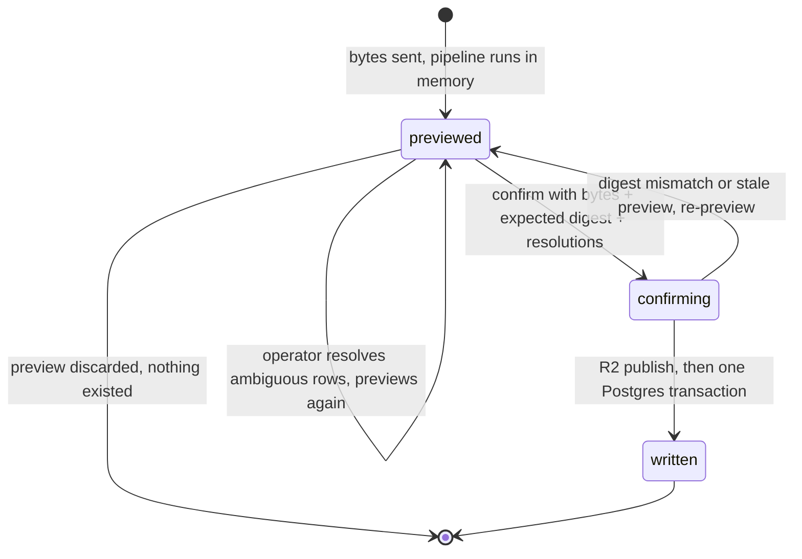

# Money

A bank import turns one exported file into transaction rows the operator can trust. The pipeline is fixed: parse → normalize → dedupe → preview → confirm → write. Nothing is written before the confirm, and the preview itself writes nothing anywhere. This chapter covers the import pipeline, deduplication, categorization, own-transfer matching, and the analysis built on the resulting record. Storage conventions and migrations live in [Data](./03-data.md); the categorization capability's dispatch machinery lives in [AI](./07-ai.md); tax interpretation of these rows lives in [Tax](./09-tax.md). Everything here reads and computes; nothing trades.

## What this chapter guarantees

- Importing the same file twice writes zero transaction rows the second time. Confirm is idempotent on the account and the file's content hash.
- Two exports covering a shared window yield the same balance chain over that window. Any disagreement blocks the import and is never auto-resolved.
- The raw narrative is stored exactly as received. Every derived column is recomputable from it by replaying the versioned normalizer.
- Nothing is written before the operator confirms. The preview is a pure computation over the file bytes and the current record; it touches neither Postgres nor R2.
- An uncertain duplicate is shown to the operator. It is never silently dropped, and it is never silently counted as new.
- A file for the wrong account is refused before any row is written. Cross-account contamination is the one Money error that reimporting cannot repair, so the identity check runs first.
- Model categorization applies nothing automatically at launch. Every suggestion queues for operator review until a calibrated threshold is deliberately enabled.
- A window the record does not cover is recorded as a coverage gap and rendered as a hole. It is never rendered as zero spending.

## The running example

One overlapping pair of CommBank exports threads through this chapter. Fixed facts, used everywhere:

> Account `01986e60-a2b4-7c11-8f3e-2d9a41c07b5a` ("the Smart Access account", a deposit account). Export A covers 01/07/2026–20/07/2026 and is already imported. Export B covers 14/07/2026–05/08/2026 and is the file being previewed now.
> The overlap holds **two identical A$4.50 coffees on 14/07/2026**. Export B also holds **one balance-chain violation** on 22/07/2026.
> The import ID assigned at confirm, if the import ever confirms: `01988f10-52c3-7a8e-b1d4-7e2f90c3a614`.

## 1. Account identity and format

Two checks run before any parsing verdict matters. They exist because the dedupe and analysis machinery below is only sound within one account and one export format, and because a file imported into the wrong account poisons every downstream computation in a way no reimport can undo.

**The account-identity fingerprint is checked before any import.** The operator selects the target account for every import. An OFX file carries account identity fields (`BANKACCTFROM/BANKID`, `ACCTID`, `ACCTTYPE` for deposits; `CCACCTFROM/ACCTID` for cards); the parser compares them against the selected account's stored fingerprint, and a mismatch blocks the preview with an `AccountMismatch` error. Only the minimum fingerprint needed for this check is stored, and displayed identifiers are masked. A CSV file carries no account identity, so the selected account is the only boundary; the balance chain is the backstop, because a wrong-account deposit CSV almost always breaks the chain against the stored record. If a wrong-account card CSV happens to parse cleanly, nothing structural catches it, which is one reason card imports carry the extra ambiguity handling in section 4.

**One canonical format per bank account, enforced at import.** An account's first confirmed import fixes its format (CSV or OFX). A later file in the other format for the same account is rejected at preview with instructions to re-export in the canonical format. The reason is that cross-format dedupe is unsolved: CSV and OFX render the same transaction's narrative differently, so content keys derived from them do not collide, and pretending otherwise would silently duplicate the overlap. If the bank ever withdraws a format, migrating an account to the other format is an explicit operator decision that starts a new coverage segment; it is not a code path that exists today.

## 2. Parse

Two formats are supported and auto-detected from the file's content, never from the file extension: CSV and OFX, both from NetBank web export. Detection examines decoded structure. A file beginning with an OFX header goes to the OFX parser. A file whose first meaningful line is a QIF type marker is rejected with an explanation (QIF is not supported). Other text is parsed as RFC 4180-style CSV and must match exactly one accepted profile. A file matching no profile, or more than one, is rejected before any row verdict is computed.

**Parser profiles and the fixture discipline.** Each accepted format is a named, versioned parser profile (for example `cba-netbank-deposit-csv-v1`, `cba-netbank-card-csv-v1`, and the OFX equivalents). A profile records its account types, its grammar, its fixture hashes, and its verification date, and it is accepted for production import only once its fixtures are real redacted exports, not synthetic examples. CommBank can change an export without telling anyone; a changed file stops matching its profile and is rejected rather than reinterpreted by a looser grammar. The parser has no database access. It returns source facts or typed errors; the importer owns everything after that.

**VERIFY: the fixture list.** Every empirical claim in this chapter about NetBank exports is unconfirmed until it passes against real fixtures. The required set: two overlapping deposit-account exports whose overlap includes a day with multiple identical rows; the same overlapping pair for a credit-card account; each pair captured in both CSV and OFX where the export screen offers both; an export containing non-ASCII text, quoted commas, and both signs; an empty export; and the largest export the NetBank UI will produce. CommBank's public export guidance describes exporting up to 600 transactions per file in CSV/plain text, MYOB, Microsoft Money, and Quicken formats ([CommBank export guidance](https://www.commbank.com.au/support.digital-banking.export-transaction-information.html)). "Microsoft Money" and "Quicken" presumably correspond to OFX and QIF, but the page guarantees no dialect, and the 600-transaction figure is the reason this chapter assumes chunked overlapping exports rather than any fixed history window. Earlier drafts of this specification stated the CSV quirks below as established facts; they are hypotheses until the fixture list confirms them, and each becomes a parser contract test at that point.

The CSV is headerless. Deposit accounts export four columns; credit cards export three (**VERIFY:** column order, headerlessness, and the card column count, per the fixture list).

| #   | Column          | Format                        | Quirks                                                                                                                                                                                                                                                   |
| --- | --------------- | ----------------------------- | -------------------------------------------------------------------------------------------------------------------------------------------------------------------------------------------------------------------------------------------------------- |
| 1   | Posted date     | `DD/MM/YYYY`                  | The posting date, not the authorization date. Day-first always; `03/04` is 3 April.                                                                                                                                                                      |
| 2   | Amount          | signed decimal                | Credits often carry an explicit `+`. Thousands separators appear. Sign carries direction; there is no separate debit/credit column. **VERIFY:** the credit-card sign convention (whether a purchase is negative) per account type, per the fixture list. |
| 3   | Narrative       | free text, quoted when needed | Embeds `Value Date: DD/MM/YYYY`, card suffixes (`Card xx1234`), and batch IDs. Merchant names are truncated and padded with variable whitespace.                                                                                                         |
| 4   | Running balance | signed decimal                | **Absent on credit-card exports** (**VERIFY** per the fixture list). Present on deposit accounts only, which is what scopes tier 3 of dedupe.                                                                                                            |

Two facts about the export itself shape the whole design, and both carry **VERIFY** against the fixture list. **Exports contain posted transactions only**, so no pending-to-posted mutation path exists in v1. **The export window is volume-dependent** and can be far shorter than two years, so chunked overlapping exports are the normal case rather than an edge case.

OFX carries the same facts in named fields, plus one opportunity. `<DTPOSTED>` becomes the posted date, with the Sydney local date derived by the profile's stated rule rather than by discarding the offset blindly. `<TRNAMT>` is the signed amount. `<NAME>` and `<MEMO>` are stored as **separate source fields**; the display narrative joins the non-empty ones with a fixed separator, and matching normalization may inspect each independently. `<LEDGERBAL><BALAMT>` feeds the account's latest-known balance observation. `<TRNTYPE>` is preserved as a hint that nothing reads. The account-identity fields feed the fingerprint check in section 1. The exact OFX dialect, timestamp tokens, and balance fields carry **VERIFY** per the fixture list.

**`<FITID>` is the opportunity, behind a trust gate.** `FITID` is stored whenever present. It becomes a dedupe key only when the account type's profile is marked verified, which requires all of: overlapping fixture exports repeat the same `FITID` for the same transaction; distinct transactions never share one in the fixture corpus; and the deposit and card profiles are verified separately, because the bank is never assumed to apply one policy to both. A repeated `FITID` whose amount, date, or narrative differs is a source-integrity error that blocks the import; it is never treated as a duplicate.

Export A's tail and export B's whole file, verbatim:

```csv
# CSVData-2026-07-20.csv (export A, already imported) — tail
14/07/2026,-4.50,"Card xx4291 CAMPOS COFFEE      NEWTOWN        AU Value Date: 13/07/2026",3120.55
14/07/2026,-4.50,"Card xx4291 CAMPOS COFFEE      NEWTOWN        AU Value Date: 13/07/2026",3116.05
15/07/2026,+2450.00,"Direct Credit 019283 ACME PTY LTD    SALARY",5566.05
16/07/2026,-89.90,"Direct Debit 445120 ORIGIN ENERGY",5476.15
17/07/2026,-120.00,"Transfer to xx8830 CommBank app",5356.15

# CSVData-2026-08-05.csv (export B, being previewed)
14/07/2026,-4.50,"Card xx4291 CAMPOS COFFEE   NEWTOWN   AU Value Date: 13/07/2026",3120.55
14/07/2026,-4.50,"Card xx4291 CAMPOS COFFEE   NEWTOWN   AU Value Date: 13/07/2026",3116.05
15/07/2026,+2450.00,"Direct Credit 019283 ACME PTY LTD SALARY",5566.05
16/07/2026,-89.90,"Direct Debit 445120 ORIGIN ENERGY",5476.15
17/07/2026,-120.00,"Transfer to xx8830 CommBank app",5356.15
21/07/2026,-15.60,"Card xx4291 UBER *TRIP HELP.UBER.CO Value Date: 20/07/2026",5340.55
22/07/2026,-52.40,"Card xx4291 WOOLWORTHS 1425 NEWTOWN AU Value Date: 21/07/2026",5250.15
```

The same five transactions appear in both files with different whitespace padding. Whitespace is rendering, not delimiting.

## 3. Normalize

Normalization is an ordered list of transformations. Order matters: each step assumes the previous ones ran. The raw narrative is never modified; every output below is a new column beside it.

1. **Decode and split.** Strip a UTF-8 BOM if present, decode as UTF-8 with a Windows-1252 fallback (**VERIFY:** the real encoding, per the fixture list), split rows on `\r\n` or `\n`, and parse fields with RFC 4180 quoting.
2. **Parse the date.** `14/07/2026` → `2026-07-14`. Stored as a date in `Australia/Sydney`, not a timestamp; the bank publishes no time.
3. **Parse the amount.** `+2,450.00` → `2450.00`. Signs and separators are removed before decimal parsing; the value is `NUMERIC`, never a float.
4. **Parse the balance.** `3120.55` → `3120.55`, or null when the column is absent. A null balance disables tier 3 for that account.
5. **Extract the value date.** `… AU Value Date: 13/07/2026` → column `value_date = 2026-07-13`, and the fragment is removed from the working narrative. Value-date stamps appear on non-card rows too.
6. **Extract the card suffix.** `Card xx4291 CAMPOS COFFEE …` → column `card_suffix = 4291`, fragment removed.
7. **Extract batch and reference IDs.** `Direct Credit 019283 ACME PTY LTD SALARY` → column `reference = 019283`, working narrative `Direct Credit ACME PTY LTD SALARY`. The transaction-type words are kept; only the digits move.
8. **Collapse whitespace.** `CAMPOS COFFEE      NEWTOWN        AU` → `CAMPOS COFFEE NEWTOWN AU`. Runs of any whitespace become one space, then trim.
9. **Uppercase.** ASCII-fold and uppercase with an invariant locale, so `Woolworths` and `WOOLWORTHS` collide.
10. **Derive the dedupe key.** `sha256(account_id | posted_date | amount | normalized_narrative)`, truncated to 128 bits, stored beside the **normalizer version** that produced it.

The normalizer is versioned because it will improve. The raw narrative is the durable fact and the key is a derived column, so a normalizer change is a backfill job that recomputes keys, not a data migration that loses information. The import row also records the parser profile that decoded it, so old keys remain explainable under old rules.

Normalization output for the four distinct rows in the overlap:

| Posted     | Amount   | Normalized narrative                | Value date | Card | Ref    | Balance |
| ---------- | -------- | ----------------------------------- | ---------- | ---- | ------ | ------- |
| 2026-07-14 | −4.50    | `CAMPOS COFFEE NEWTOWN AU`          | 2026-07-13 | 4291 | —      | 3120.55 |
| 2026-07-14 | −4.50    | `CAMPOS COFFEE NEWTOWN AU`          | 2026-07-13 | 4291 | —      | 3116.05 |
| 2026-07-15 | +2450.00 | `DIRECT CREDIT ACME PTY LTD SALARY` | —          | —    | 019283 | 5566.05 |
| 2026-07-16 | −89.90   | `DIRECT DEBIT ORIGIN ENERGY`        | —          | —    | 445120 | 5476.15 |

## 4. Dedupe

Three tiers run in order, all scoped to one account. Tier 1 is an accelerator, tier 2 is the workhorse, tier 3 is the proof. Every incoming row ends in exactly one verdict: `duplicate`, `new`, or `ambiguous`. An ambiguous row is resolved by the operator at confirm; it is never auto-dropped and never auto-counted as new.

```
# one import file, one account, rows in file order
claimed = ∅                    # stored rows already matched by THIS import
seen    = {}                   # content key → count within this file

for row in rows:
  key = sha256(account | row.posted_date | row.amount | row.normalized)
  seen[key] += 1
  row.occurrence = seen[key]           # 1-based, per key, per file

  # tier 1 — FITID, only where the account type's trust gate is verified
  if row.fitid and account.fitid_verified:
     hit = stored(account, fitid = row.fitid)
     if hit and hit.content ≠ row.content:
        integrity_error(import, row)   # same ID, different facts: blocks, never a duplicate
     if hit and hit ∉ claimed:
        claim(hit); row.verdict = duplicate(tier 1); continue

  # tier 2 — content key + occurrence index
  hit = stored(account, content_key = key, occurrence = row.occurrence)
  if hit and hit ∉ claimed:
     claim(hit); row.verdict = duplicate(tier 2); continue

  row.verdict = new

# tier 2 group check — where counting is not proof
for group in rows grouped by key, where incoming_count(group) ≠ stored_count(group):
  if account.type = credit_card:                    # no balance chain to catch a miscount
     mark every row in group ambiguous
  else if group.posted_date ∈ {first_date(file), last_date(file)}:
     mark every row in group ambiguous               # window edge: the day may be cut mid-group

# tier 3 — balance chain, whole file, deposit accounts only
orient     = orientation(rows)          # test the full chain in BOTH directions
violations = chain_check(orient.rows) ∪ overlap_check(orient.rows, stored)
if violations ≠ ∅:
   block(import, violations)            # never auto-resolved

def chain_check(rows):                  # amounts are NUMERIC, so equality is exact
  for n in 1 .. len(rows)-1:
     residual = rows[n].balance − rows[n−1].balance − rows[n].amount
     if residual ≠ 0: yield { at: rows[n], residual }

def overlap_check(rows, stored):        # duplicates must agree with what we stored
  for row where row.verdict is duplicate and row.balance is not null:
     if row.balance ≠ stored_match(row).balance: yield { at: row, kind: "overlap" }
```

- **Claim-once makes duplicates countable.** Each stored row is claimed by at most one incoming row per import. Without it, N identical incoming rows collapse onto one stored row and N−1 real transactions vanish.
- **The occurrence index makes identical same-day rows survive.** Two identical coffees are two rows with occurrences 1 and 2. A re-import assigns the same indices in the same order and maps onto them stably. This assumes the bank emits identical same-day rows in a consistent order across exports; that assumption is unproven and carries **VERIFY** per the fixture list, which is exactly why the two rules below refuse to lean on it where nothing can catch a miscount.
- **The card ambiguity rule.** Count-based auto-resolution (occurrence ≤ stored count means duplicate, above it means new) is allowed only on deposit accounts, because the balance chain catches the silent failure case. On a credit card there is no chain, so an identical-row group whose incoming count differs from its stored count is flagged ambiguous, and the operator resolves each row as duplicate or new.
- **The window-edge count rule.** On any account, when an identical-row group's posted date is the first or last date in the file and its incoming count differs from the stored count, the group is flagged ambiguous. The export window may have cut that day mid-group, so an "extra" incoming row is not provably new and a "missing" one is not provably absent.
- **Orientation is tested both directions.** Deposit rows may arrive ascending or descending. The whole-file chain is tested in both orientations; exactly one must hold. When both hold (too few rows to distinguish), file order is kept and a warning records that orientation was not proven. When neither holds, the import blocks.
- **The per-day permutation fallback is fixture-gated.** One earlier draft asserted that CommBank emits same-day rows out of chain order and prescribed searching each failing day's permutations for a consistent chain. That behavior is unproven, so the fallback ships disabled (**VERIFY:** a real deposit fixture whose multi-row day fails the naive chain in both orientations but has exactly one consistent permutation). Until such a fixture exists, a within-day chain failure blocks the import like any other violation. If the fixture appears, the fallback is enabled for days only, and a day with more than one consistent permutation still blocks.
- **Tier 3 is the only check that can see a gap.** A hash scheme can prove a row it holds was seen before; it cannot prove a row it lacks never existed. The running balance can, because a missing transaction leaves a residual equal to its amount.

Dedupe of export B against the stored record:

| Row | Key (first 12 hex) | Occurrence | Tier | Verdict   |
| --- | ------------------ | ---------- | ---- | --------- |
| 1   | `9f2c14ab77d0`     | 1          | 2    | duplicate |
| 2   | `9f2c14ab77d0`     | 2          | 2    | duplicate |
| 3   | `41ba0e93c5d7`     | 1          | 2    | duplicate |
| 4   | `c08d7742f19a`     | 1          | 2    | duplicate |
| 5   | `7e6510cc2b84`     | 1          | 2    | duplicate |
| 6   | `2ad9f00e61b3`     | 1          | —    | new       |
| 7   | `b3417cae9082`     | 1          | —    | new       |

Rows 1 and 2 share a key and differ only by occurrence index. Their group sits at the file's first date, but the incoming count equals the stored count (two and two), so the window-edge rule stays quiet and both match cleanly. Row 7 then fails the chain: `5250.15 − 5340.55 − (−52.40) = −38.00`. A debit of A$38.00 is missing from the export between 21/07 and 22/07, and the import blocks with that exact diff rather than guessing a cause.

**Coverage gaps.** A new import need not overlap the stored record, but the record must say so. When an import's window does not touch stored coverage, the confirm records a **coverage gap** for the uncovered span, and every coverage view renders it as a hole. On a deposit account the chain names the gap's size: the difference between the stored chain's closing balance and the incoming file's implied opening balance is the net amount of the missing transactions. Illustrative, not a default: if a later export began at 01/09/2026 with a first row of −A$40.00 and balance A$5,066.15, the implied opening balance is A$5,106.15; the stored chain ends at A$5,356.15, so the gap row records a missing net of −A$250.00 across the uncovered window. The gap is information, not a blocker; entries in the gap can arrive later from a fuller export, and the gap row closes when the chain connects.

## 5. Preview, confirm, write

The problem this lifecycle solves: the operator must see exactly what an import will do before it does anything, and the system must never hold half-imported state. The solution is a stateless preview. The preview is a pure function of the file bytes and the current database; it creates no rows, no R2 objects, and no server-side session. Durable state begins at confirm, and confirm is one transaction.

**Preview.** The app sends the file bytes, the file name, and the selected account. The server runs parse → normalize → dedupe entirely in memory and returns the verdicts, the counts, any violations, and the file's SHA-256 content hash. Discarding a preview discards nothing durable, because nothing durable exists. An unreadable file is rejected at this stage with a typed error naming the failing record; no import record of the attempt is kept.

**Confirm.** The app re-sends the same bytes together with the expected content hash and the operator's row resolutions (each ambiguous row resolved as duplicate or new; a gap acknowledgment where the operator accepts a blocked chain with a stated reason). The server verifies the digest against the re-sent bytes; a mismatch means the file changed and the confirm is rejected. The server then re-runs the whole pipeline against the current database. If the recomputed result differs materially from the previewed one, another overlapping import landed in between, and the confirm is rejected as stale; the app previews again against the new record. This is the stale-preview rejection: a preview can never commit conclusions the database no longer supports. Commits are serialized per account with an advisory lock, so two overlapping files cannot both classify the same stored row as unmatched.

**Write.** The raw bytes are published to R2 first, under a content-addressed key, because R2 and Postgres cannot commit atomically. If publication fails, no database row is written and the confirm fails cleanly. Then one Postgres transaction inserts the import row, the new `bank_transactions` rows, the duplicate claims and operator resolutions, any gap acknowledgment and coverage-gap rows, the balance observations, and one `notice` feed event. If that transaction fails, the R2 object is an unreferenced content-addressed blob; a retry reuses it, and a periodic scan collects orphans. The idempotency key is `(account_id, content_hash)`: re-confirming the same file returns the prior import and writes nothing, which is also what makes a double-click harmless.



The prose above is the definition; the diagram restates it. A blocked preview (a chain violation, an integrity error, or an unresolved ambiguity) simply has no valid confirm: the operator's route forward is a fuller re-export, an explicit per-row resolution, or a recorded gap acknowledgment supplied with the confirm.

The preview reports five counts. **Found** is the file's row count; **new**, **duplicate**, and **ambiguous** come from the dedupe verdicts; **needing review** counts new rows matching no categorization rule. That last count is the set the model will judge.

Export B's preview:

```
file            CSVData-2026-08-05.csv
digest          sha256:7c1f0a…                       account  01986e60-…  (Smart Access)
found           7
duplicate       5     (tier 2, content key + occurrence index)
new             2
ambiguous       0
needing review  2     (no rule matched)
chain           VIOLATION  row 7, 22/07/2026, residual −A$38.00
confirm         unavailable until re-export or a recorded gap acknowledgment
```

An imported source fact is never edited afterward. A parser correction creates a replacement import and a supersession relationship, then rebuilds derived views; the original bytes and the original interpretation stay inspectable.

## 6. Categorization

Rules run first and short-circuit the model. A rule-matched transaction never reaches an agent, which makes the common case free, instant, and inspectable. Everything the rules miss goes to the categorization capability, whose dispatch path, decision record, and delivery queue are the capability runtime in [AI](./07-ai.md). Categorization is a Money-owned workflow on that runtime: no sleeve, no baseline book, no scorecard.

```ts
// packages/contracts/src/categorization.ts
export interface CategorizationRequest {
  readonly importId: ImportId;
  readonly rows: ReadonlyArray<{
    readonly transactionId: TransactionId;
    readonly postedDate: LocalDate;
    readonly amount: Money<"AUD">;
    readonly narrative: string; // normalized, never raw
    readonly accountType: "transaction" | "savings" | "credit_card";
  }>;
}

export interface CategorizationAssignment {
  readonly transactionId: TransactionId;
  readonly category: CategoryId; // must be a member of the operator's taxonomy
  readonly confidence: number; // 0.00–1.00
  readonly rationale: string; // one sentence, shown in the review queue
}
```

Three rules belong here rather than in the AI chapter.

- **Auto-apply is off at launch.** Every model suggestion lands in the review queue with its rationale visible; none is applied automatically. The threshold that later enables auto-apply is not a number picked today. It is derived from the operator's correction corpus: once enough suggestions have been reviewed, the corpus measures the model's actual precision at each candidate threshold, and enabling auto-apply at a chosen precision target is a reviewed configuration change affecting future assignments only. A provider's raw confidence number is never accepted as calibration evidence, because an uncalibrated 0.9 means nothing. Until then the cost of "off" is a longer review queue, which is the correct price for not silently miscategorizing the record.
- **Batch size: 200 rows per request** (proposed). Larger imports split into sequential batches so one failure does not lose the rest. A model failure leaves the affected rows uncategorized and reviewable; the import itself is unaffected.
- **Provenance: `rule`, `ai`, or `manual`** on every assignment. A correction writes an exact normalized-payee rule by default, with its future scope shown before the operator confirms; the correction and the new rule commit in one transaction. Rules are editable rows, not model behavior, and a rule never silently rewrites historical operator assignments; reclassification is an explicit bulk action with a previewed row set.

## 7. Own transfers

A transfer between the operator's own accounts is not spending, so detection pairs rows across accounts and records the pairing on both. Two rows are candidates when all four hold: opposite signs; **exactly equal absolute amounts**, with no tolerance, because a same-bank transfer posts the same figure on both sides; different accounts both owned by the operator; and posted dates within **3 calendar days**. A candidate auto-confirms only when a normalized reference on both rows agrees, or when it is the only possible pairing inside the window. Any other case — several candidates, no distinguishing reference — is surfaced for operator confirmation, never guessed. A row belongs to at most one effective match; rejecting a candidate suppresses that exact pairing without blocking better ones later. A paired row is excluded from every spending aggregate.

A bank-to-Kraken or bank-to-Alpaca funding row is not an own transfer here, because its opposite leg is not a bank transaction. Money exposes it as a candidate to the capital and tax matching processes; venue settlement and any cross-currency treatment (including when an achieved FX rate may attach to a conversion) are specified in [Tax](./09-tax.md).

## 8. Analysis

Analysis is SQL over the record. Every aggregate is one query from its rows, so every number on screen drills down to the transactions behind it. A month the record does not cover shows as incomplete coverage, never as zero spending; the coverage-gap rows from section 4 are what the views consult.

```sql
-- monthly spend by category against the trailing three-month average
with monthly as (
  select date_trunc('month', posted_date) as month, category_id,
         sum(-amount) filter (where amount < 0) as spend
    from bank_transactions where transfer_pair_id is null group by 1, 2
)
select month, category_id, spend,
       avg(spend) over (partition by category_id order by month
                        rows between 3 preceding and 1 preceding) as trailing_avg
  from monthly;
```

**Recurring charges** are detected per (account, normalized payee) group, and a detected charge is a row whose amount history is the thing worth watching. A group qualifies when all three hold, each value proposed:

1. At least **3** occurrences within a **400-day** lookback, every amount within **±5%** of the group's median.
2. The median gap between consecutive occurrences falls in one cadence bucket: 7±2, 14±3, 30±4, 91±7, or 365±10 days.
3. The standard deviation of gaps is **≤ 20%** of the median gap.

A price change fires a `notice` feed event when the newest amount differs from the previous one by **more than 1% and at least A$1.00** (proposed). Both conditions must hold, so a A$0.40 move on a A$12 subscription stays quiet.

**Anomalies** are threshold rules over the same rows, each surfaced in the view and as a `notice` event. All three thresholds are proposed.

- **Large transaction**: `abs(amount) > max(A$500, 4 × the 90-day median absolute amount for that account)`.
- **New payee**: the normalized payee is unseen in the trailing 730 days **and** `abs(amount) ≥ A$200`.
- **Category spike**: month-to-date category total `> 1.5 ×` the trailing three-month average **and** the excess is `≥ A$150`.

Anomaly events are deduplicated on `(rule, subject, month)`, so re-importing an overlapping file never re-fires an alert the operator already saw.

## 9. What tax reads

Money is one source among many for the tax engine, and the interface is a read of two row sets. Interest lines are bank transactions whose narrative matches the interest patterns; AUD funding legs are bank transactions that pair with a broker or exchange arrival. Both are selected by the tax normalizer from `bank_transactions` directly, using the normalized narrative and the raw narrative together. The patterns and the matching rules are specified in [Tax](./09-tax.md); Money's obligation is only to keep the raw narrative intact and the rows immutable.

## Values set in this chapter

Every number above, its owner, and its status. "Proposed" means: pick differently and only configuration changes.

| Value                        | Default                                                                                                                      | Owner                 | Status   |
| ---------------------------- | ---------------------------------------------------------------------------------------------------------------------------- | --------------------- | -------- |
| Supported formats            | CSV, OFX, content-detected, fixture-gated parser profiles                                                                    | parser                | decided  |
| Canonical format per account | one, fixed at first confirmed import; other formats rejected                                                                 | importer              | decided  |
| Account-identity check       | OFX fingerprint match before preview; CSV explicit selection with chain backstop                                             | importer              | decided  |
| Balance-chain comparison     | exact equality on `NUMERIC`                                                                                                  | importer              | decided  |
| Chain orientation            | whole file tested both directions; exactly one must hold                                                                     | importer              | decided  |
| Per-day permutation fallback | disabled; enabled only by a proving fixture, days only                                                                       | importer              | decided  |
| Tier-1 `FITID` use           | per account type, only after fixture verification; content conflict is an integrity error                                    | importer              | decided  |
| Dedupe key inputs            | account, posted date, amount, normalized narrative                                                                           | importer              | decided  |
| Ambiguity flags              | card count mismatch; window-edge count mismatch; never auto-dropped                                                          | importer              | decided  |
| Normalizer version           | v1                                                                                                                           | importer              | decided  |
| Confirm idempotency key      | `(account_id, content_hash)`                                                                                                 | importer              | decided  |
| Max import file size         | 10 MB                                                                                                                        | importer config       | proposed |
| Categorization auto-apply    | off at launch; enabled later at a threshold calibrated from the correction corpus                                            | categorization config | decided  |
| Categorization batch size    | 200 rows                                                                                                                     | categorization config | proposed |
| Own-transfer pairing         | exact amount, ≤3 calendar days, unique-pairing-or-reference, else operator confirmation                                      | analysis config       | decided  |
| Recurring: qualification     | 3 occurrences / 400 days, ±5% of median, stdev of gaps ≤ 20% of median gap                                                   | analysis config       | proposed |
| Recurring: cadence buckets   | 7±2, 14±3, 30±4, 91±7, 365±10 days                                                                                           | analysis config       | proposed |
| Price-change alert           | > 1% and ≥ A$1.00                                                                                                            | analysis config       | proposed |
| Anomaly thresholds           | large > max(A$500, 4 × 90-day median); new payee unseen 730 days and ≥ A$200; spike > 1.5 × trailing 3-month avg and ≥ A$150 | analysis config       | proposed |
| Anomaly event dedupe key     | (rule, subject, month)                                                                                                       | analysis config       | proposed |

## Alternatives considered

- **QIF import.** Rejected: QIF carries no transaction IDs and its date format is ambiguous. It is strictly worse than the CSV offered on the same export screen.
- **PDF statements.** Deferred, not rejected. CommBank PDFs are text-based, so OCR is never required, and they matter only for history older than the export window. That makes them a later deliberate addition rather than a v1 dependency.
- **Automatic sync via the Consumer Data Right.** Deferred: it requires an accredited intermediary. It becomes worth revisiting only if manual export proves to be the system's limiting annoyance.
- **`FITID` as the primary dedupe key.** Rejected: card accounts may not carry one, and no account's `FITID` behavior is trusted before fixtures. A key that works on some accounts is an accelerator, not a scheme.
- **Hash-only dedupe without the balance chain.** Rejected: it cannot detect a missing row, and chunked overlapping exports make missing rows the realistic failure.
- **Auto-resolving a chain violation.** Rejected: inserting a plausible missing transaction is the exact failure this system exists to prevent. The import blocks with a diff.
- **Count-based auto-resolution on credit cards.** Rejected: counting occurrences is only safe where the balance chain catches a silent miscount, and cards have no chain. Card count mismatches are flagged for the operator instead.
- **A staging table for imports.** Rejected: staged rows are a second, stale copy of the file that must be cleaned up and can drift from the record. A stateless preview plus a digest-verified re-send of the same bytes gives the same operator experience with no intermediate state to reconcile.
- **Cross-format dedupe.** Not attempted: CSV and OFX render the same transaction's narrative differently, so content keys cannot collide across formats. One canonical format per account is the enforced substitute, and this document does not pretend the general problem is solved.
- **A fixed auto-apply confidence threshold at launch (e.g. 0.80).** Rejected: a provider's confidence number is uncalibrated against this operator's data. Auto-apply starts off and is enabled only at a threshold the correction corpus justifies.
- **Nearest-date wins and amount tolerances in transfer pairing.** Rejected: same-bank transfers are exact, so a tolerance only admits false pairs, and picking the nearest date among several candidates is a guess. Ambiguity goes to the operator.
- **Pending-transaction handling.** Not built: exports contain posted rows only, as far as current evidence goes. The design leans on this deliberately and must be revisited if a fixture ever shows a pending row.

## Open questions

1. **`FITID` verification.** Does CommBank OFX carry `FITID`, and is it stable across two exports of the same period, for each account type? Safe fallback: tier 1 stays disabled for the account type, tier 2 and 3 carry the load. Must close before: enabling tier 1 for that account type, part of the phase-1 fixture homework in [ROADMAP](../ROADMAP.md). Evidence: two overlapping real OFX exports per account type showing repeated, unique `FITID`s.
2. **Same-day row ordering and the permutation fallback.** Does NetBank order identical same-day rows stably, and do same-day rows ever arrive out of chain order? Safe fallback: the permutation fallback stays disabled; a within-day chain failure blocks the import. Must close before: the first real deposit import that hits a multi-row day violation. Evidence: the fixture list's multi-row-day exports, tested in both orientations.
3. **The blocked-import escape.** Is a recorded gap acknowledgment sufficient, or must a blocked file always be replaced by a fuller re-export? Safe fallback: both routes exist and the acknowledgment is a recorded row with a reason. Must close before: the end of the first year of real imports. Evidence: how often blocks occur and whether acknowledgments ever hid a real error.
4. **Credit-card dedupe confidence.** Cards have no balance chain and may have no `FITID`, leaving tier 2 plus ambiguity flags. Does that suffice? Safe fallback: the card ambiguity rule sends every count mismatch to the operator. Must close before: relying on card history for tax or long-range analysis. Evidence: a year of card imports, plus the card `FITID` verification result.
5. **The auto-apply calibration threshold.** At what measured precision, and therefore what threshold, is categorization auto-apply enabled? Safe fallback: auto-apply stays off and every suggestion is reviewed. Must close before: nothing forces it; it closes when review volume becomes the constraint. Evidence: a correction corpus large enough to measure precision per candidate threshold on this operator's data.
6. **The real export contract.** Encoding, column order, sign conventions, window size, and the format list versus CommBank's published guidance. Safe fallback: fixture-gated parser profiles reject anything unproven rather than guessing. Must close before: the first production import of each profile, per the phase-1 fixture homework. Evidence: the fixture list in section 2.

## Build checklist

- [ ] CSV and OFX parsers as versioned fixture-gated profiles with content detection, and a contract test per quirk in the grammar table once its fixture exists
- [ ] Account fingerprint storage and the pre-preview identity check; canonical-format lock per account
- [ ] The ten normalizer steps as pure functions, versioned, with a key-backfill job
- [ ] Three-tier dedupe with claim-once, the card ambiguity rule, and the window-edge count rule; property test: any file re-imported yields zero new rows
- [ ] Balance-chain orientation (both directions) and overlap checks; property test: deleting one row always produces a residual equal to its amount
- [ ] Coverage-gap recording with the named net-amount residual on deposit accounts
- [ ] Stateless preview and digest-verified confirm; tests: preview performs no write, a stale preview cannot commit, confirm is idempotent on `(account_id, content_hash)`
- [ ] The worked example as an integration test: same two files, byte-identical preview, blocked confirm
- [ ] Rule matcher that short-circuits dispatch, the correction-writes-a-rule path, and auto-apply hard-disabled until the calibration config exists
- [ ] Own-transfer pairing (exact amount, unique-pairing-or-reference), recurring detection, and the three anomaly rules as SQL with fixture data
- [ ] Feed events for: import written, chain violation acknowledged, price change, each anomaly
