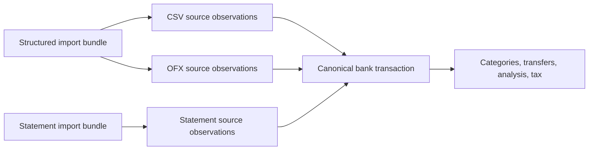
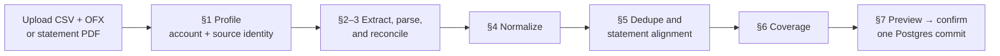
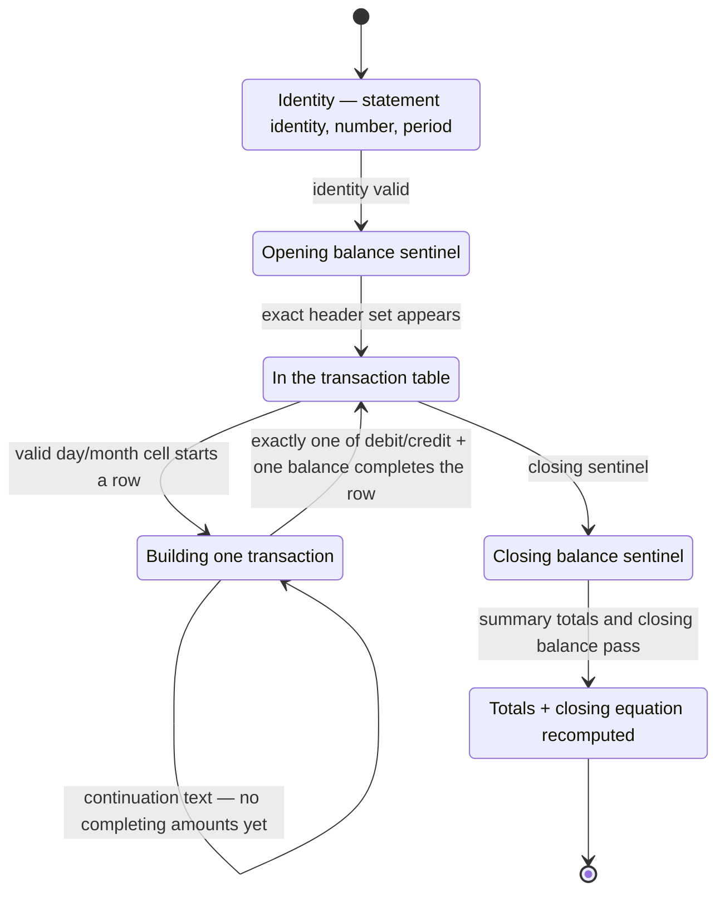
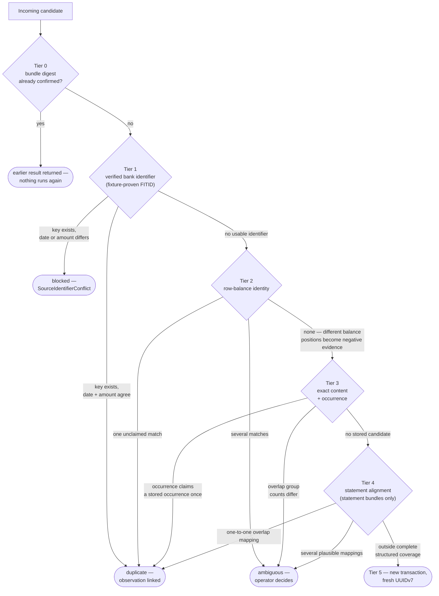
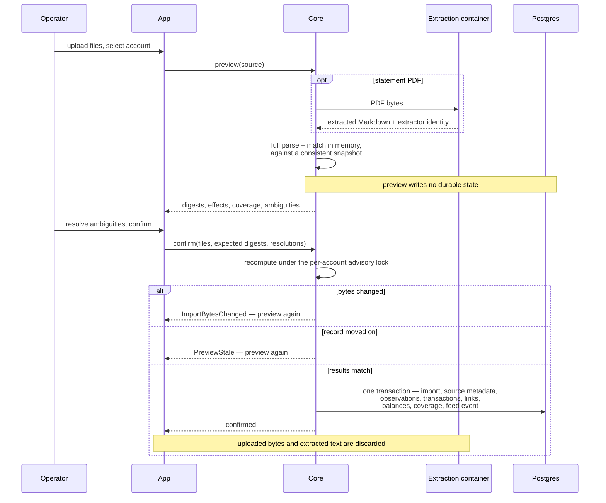

Money turns bank-supplied files into one transaction record that can survive repeated uploads, overlapping windows, and several source formats. The import boundary treats every file as untrusted evidence. A transaction becomes usable only after account identity, source reconciliation, deduplication, and coverage have all produced explicit results.

This chapter owns CommBank import, source evidence, transaction identity, coverage, categorization, transfers, and spend analysis. [Data](/technical/data) owns shared storage conventions. [AI](/technical/ai) owns capability dispatch and decision records. [Tax](/technical/tax) owns the tax interpretation of bank rows.

## What this chapter guarantees

- A canonical bank transaction contributes to analysis once, regardless of how many files describe it.
- Reconfirming an identical import bundle returns the earlier result and writes nothing new.
- An overlapping export can add later rows without duplicating the overlap.
- Every source observation retains the bank-supplied fields needed to explain it after confirmation.
- A structured CSV/OFX pair must agree row for row before either file can affect the record.
- A supported statement must prove account identity, every balance step, summary totals, and structured overlap before it can affect the record.
- A file for the wrong account is rejected before transaction matching begins.
- An unresolved identity collision is reported as ambiguous. It is never silently counted or discarded.
- A truncated or missing window creates no complete-coverage claim.
- Analysis excludes incomplete months from comparisons and never represents a coverage gap as zero spending.
- Import preview is stateless. No import row is stored until confirm succeeds.
- CSV, OFX, PDF, and extracted Markdown bytes are transient and are discarded after processing.

## The record's language

A **bank transaction** is one posted movement in one owned account. It is the row that categorization, analysis, Portfolio, and Tax read.

A **source observation** is one bank-supplied representation of that movement. A CSV row and its paired OFX row are separate observations that link to one bank transaction. A supported statement may add another observation.

An **import bundle** is the transient set of files submitted together for one account and source window. The enabled CommBank profiles accept a paired CSV/OFX bundle or one offset-statement PDF.

The distinction prevents format choice from becoming transaction identity.



A source observation is never itself counted as spending. Uploaded files exist only while the import is being evaluated.

Both enabled imports run through the same preview and confirm interface, and nothing is stored until the last stage commits:



## 1. Account profiles and source profiles

Every import is interpreted by one named and versioned source profile. A profile declares the account types it accepts, file grammar, character decoding, sign normalization, identifier policy, and fixture corpus that proves those rules.

The first account profiles are:

| Product account | Internal type | Structured evidence                                                | Analysis treatment                                       |
| --------------- | ------------- | ------------------------------------------------------------------ | -------------------------------------------------------- |
| Spending offset | `deposit`     | CSV running balance, OFX account identity and stable `FITID`       | Income, cash spending, and cash balance                  |
| Savings offset  | `deposit`     | CSV running balance, OFX account identity and stable `FITID`       | Savings balance and owned-transfer matching              |
| Mastercard      | `credit_card` | Empty CSV balance, OFX account identity, empty observed `FITID`    | Purchases and refunds; repayments are owned transfers    |
| Home loan       | `credit_line` | CSV negative balance, OFX account identity, empty observed `FITID` | Liability; principal is a transfer, interest is spending |

The CDIA and share accounts remain unconfigured while unused. Super is outside Money.

Account identity is stored as a keyed HMAC of the bank, product type, and bank-supplied account identifier. The user interface stores only the product label and masked suffix. Changing the application key requires a deliberate fingerprint re-key job.

The operator selects the expected account during upload. OFX identity must map to that account and no other. CSV never chooses the account because the observed CSV files contain no identity. A statement must independently prove that its printed account identity maps to the selected account before adding observations.

The enabled source profiles are:

- `cba-netbank-paired-v1` for an exact CSV/OFX pair.
- `cba-offset-statement-v1` for a text-based CommBank offset statement.

Mastercard and home-loan statements remain unsupported until representative PDFs pass their own fixture gates. Uploading an unsupported statement fails visibly and retains no file.

The empirical basis and collection procedure live in [CommBank export evidence](/technical/examples/commbank-exports). Fictional syntax examples live in [CommBank fixture shapes](/technical/examples/commbank-fixtures).

## 2. Structured bundle parsing

Recent history arrives as CSV and OFX exported from one account without changing the selected date window. Neither file is accepted on its own. The pairing lets CSV contribute its row balance and OFX prove the account.

### CSV grammar

The observed CSV is headerless and uses CRLF line endings. Every observed account type has four columns.

```text
DD/MM/YYYY,"signed decimal","narrative","running balance or empty"
```

The parser uses an RFC 4180-compatible CSV library. It does not split on commas manually. It rejects a header, an unexpected column count, an invalid date, a non-decimal amount, or a populated field that its account profile forbids.

Observed behavior is part of the fixture contract:

- Rows are newest first.
- Purchases and other debits are negative.
- Payments, credits, and refunds are positive and carry an explicit `+` prefix, as do positive running balances.
- Deposit and home-loan rows contain a balance.
- Mastercard rows contain an empty fourth cell.
- Mastercard purchase narratives are fixed-width padded merchant, city, and state columns; the internal space runs are significant and must survive parsing to pair against the OFX `MEMO`.
- Home-loan balances are negative.
- The downloaded filename is generic and carries no authority.

The raw text of every cell and the zero-based source row ordinal are retained. Decimals are parsed directly to `BigDecimal`. A JavaScript `number` never holds a financial value.

The CSV carries no encoding declaration. The paired profile decodes it as Windows-1252, matching the character set declared by NetBank's OFX export and preserving every source cell without an ASCII-only acceptance rule.

### OFX grammar

The observed OFX is SGML 1.02, not XML. Scalar elements do not have closing tags. The parser must therefore use an OFX SGML parser or a profile-specific tokenizer rather than an XML parser.

The observed header declares `OFXHEADER:100`, `VERSION:102`, `ENCODING:USASCII`, and `CHARSET:1252`. The decoder obeys the declared character set.

Deposit and home-loan files use `BANKMSGSRSV1`. Mastercard uses `CREDITCARDMSGSRSV1`. Account identity comes from `BANKACCTFROM` or `CCACCTFROM` as appropriate.

The observed home-loan file contains a bank-writer quirk: inside `BANKMSGSRSV1` it opens `CCSTMTRS` and closes `STMTRS`. The home-loan profile accepts exactly that pair. Other mismatched aggregates remain malformed; the fixture is not normalized into a shape the bank did not emit.

Each observed transaction carries `DTPOSTED`, `DTUSER`, `TRNAMT`, `FITID`, `MEMO`, and `TRNTYPE`. The samples contain no `NAME` field. Both transaction date fields contain eight date digits rather than a transaction time. `DTUSER` is the value date and may differ from `DTPOSTED`; where the narrative prints a `Value Date`, `DTUSER` matches it. `TRNAMT` prints credits without a sign.

The importer preserves `TRNTYPE` as source metadata. No analysis rule relies on it.

`DTSTART` and `DTEND` contain midnight timestamps in the observed files. Their first eight digits matched the explicit inclusive date range selected in two tested exports. The profile uses those dates as the requested coverage window.

File-level ledger and available balances are retained as separate balance observations. Available balance is never substituted for ledger balance.

### Row pairing

The pair is accepted only when its transaction multisets are identical on:

```text
(posted_date, signed_amount, raw_narrative, occurrence_within_equal_rows)
```

Occurrence is counted in source order within equal `(date, amount, narrative)` groups. Pairing consumes each row once. One missing, extra, or conflicting row blocks the whole bundle.

`signed_amount` compares numerically. The CSV prints an explicit `+` on credits while the OFX prints them unsigned, so amount text never participates in equality.

The pairing result produces one incoming transaction candidate with two source observations. The CSV observation may supply a row balance. The OFX observation may supply `FITID` and always supplies the account fingerprint.

The upload declares no window of its own. `DTSTART` and `DTEND` are the source window, because OFX is the file that states one and row pairing proves the CSV describes the same rows.

The bundle is also blocked when any of these conditions holds:

- The OFX identity does not match the selected account.
- The source window falls outside the selected account's configured lifetime.
- Either file's rows are not newest first.
- The CSV and OFX row counts differ.
- The logical transaction count is 600 or greater.
- A populated CSV balance chain fails.
- The newest CSV balance disagrees with a comparable OFX ledger balance.

NetBank returned exactly 600 rows and omitted older rows in a broad observed search. A 600-row file cannot prove whether the selected window had exactly 600 rows or was capped, and a larger result is outside the proven profile. Both produce `ExportTruncated`, followed by a smaller re-export.

### Balance-chain validation

The CSV is reversed into chronological order before validation. For every row after the first:

```text
expected_balance[i] = balance[i - 1] + amount[i]
```

Equality is exact at decimal precision. The first row has no predecessor inside the file, so the chain starts at its recorded balance.

:::note[Illustrative, not a default]

```text
prior balance  A$2,000.00
amount            -A$45.20
row balance    A$1,954.80
```

The OFX ledger balance is a moment rather than a window total. `DTASOF` records when the export was produced, so an export made after `DTEND` may include later account movement that the requested rows do not describe.

The newest row balance must equal the ledger balance only when the ledger's as-of date falls on or after the newest posted row and no later than `DTEND`. Otherwise the ledger balance remains a balance observation but is not reconciled against that row. Mastercard has no per-row CSV balance, so its latest balance comes from OFX alone.

Every observed liability export already signs its balance the way Portfolio reads it. The importer stores that sign exactly as supplied. A future profile that prints a liability unsigned needs its own normalization rule and a fixture that proves it; account type alone never authorizes sign rewriting.

## 3. Statement extraction and parsing

Statements recover history beyond the two-year transaction-search window. They are not a looser form of CSV. Each account and statement layout has its own source profile.

The observed offset statement is an eight-page, text-based PDF. It supplies full account identity, a statement period, opening and closing balances, transaction rows, and summary totals. Each transaction has a day/month date, multi-line narrative, one debit or credit amount, and a running balance. It supplies no per-transaction identifier or transaction time.

The transaction year is inferred from the statement period. A row outside that period is invalid. A statement that crosses a calendar year must assign each day/month to the unique in-period date.

CommBank states inside the observed statement that statement transaction dates can differ from dates shown in other transaction lists. The offset profile therefore aligns structured overlap by exact amount and running balance, with a bounded date drift only at coverage edges.

### AnyDoc boundary

[AnyDoc](https://github.com/firecrawl/anydoc) 0.1.9 is selected for PDF-to-Markdown extraction. A local evaluation succeeded on the real text-based statement and both observed CSV shapes. Its PDF output retained the statement tables, but a single visual transaction could span several Markdown table rows.

AnyDoc is an extractor, not the financial parser. The pinned native package runs in an isolated compute container with network access disabled and no database credentials. Core sends the PDF bytes directly to that container and validates the returned Markdown with the deterministic offset-statement parser.

PDF bytes, container-local files, and extracted Markdown are request-scoped. They are discarded when processing finishes. The confirmed import records file digests, sizes, display names, source roles, and the exact extractor identity alongside durable row-level observations; it does not retain either file body.

AnyDoc is not used for structured CSV at runtime. A direct CSV parser preserves the empty fourth Mastercard cell that Markdown rendering can hide. AnyDoc is also not used for OFX because the evaluated version rejects OFX input.

The PDF API produces Markdown rather than a structured AnyDoc document. The statement state machine must therefore reconstruct visual rows from table fragments before it parses financial fields.

An image-only or extraction-empty PDF blocks the import and is discarded. The first release does not send private statements to a hosted OCR service.

### Deterministic statement parser

AnyDoc renders the observed visual table in three shapes across pages: prose, Markdown rows, and separated column blocks. The parser normalizes those shapes into a page-ordered token stream, identifies statement sentinels and transaction dates, and reconstructs each row from the running-balance chain. Printed debit and credit amounts independently corroborate every derived balance step.



Page furniture may be ignored only where the profile's observed extraction shape identifies it. Every transaction date, balance, and printed amount between the opening and closing sentinels must be consumed exactly once.

A debit becomes a negative amount. A credit becomes a positive amount. A `CR` balance is normalized according to the account profile while its printed form is preserved.

The statement must satisfy both equations:

```text
balance[i] = balance[i - 1] + amount[i]
closing = opening - total_debits + total_credits
```

The totals are recomputed from parsed rows. Printed totals are not trusted merely because they were extracted.

### Source precedence

Structured CSV/OFX is authoritative inside any window already marked complete by the paired profile. A statement import still parses and reconciles its entire period. Its overlap must align to the existing structured transactions under a fixture-proven statement alignment profile.

Only rows outside complete structured coverage can create canonical transactions from a statement. Rows inside the overlap add statement observations to the existing transactions. A missing or extra overlap row blocks the statement profile instead of creating a second transaction.

This precedence converts cross-format deduplication into a validation problem. It avoids choosing between descriptions whose formatting differs by source.

The offset statement profile is enabled under this rule. Mastercard and home-loan statement profiles remain disabled until representative PDFs and overlap fixtures exist.

## 4. Normalization

Normalization creates matching and display fields beside immutable source fields. It never rewrites source evidence.

The versioned normalizer performs these operations:

1. Parse dates under the source profile's explicit rule.
2. Parse signed amounts and balances to `BigDecimal`.
3. Unicode-normalize derived narrative text with NFKC.
4. Collapse whitespace and trim it.
5. Apply locale-independent case folding for matching.
6. Derive the payee under the source profile's narrative grammar.
7. Retain all digits and punctuation in the conservative narrative fingerprint.

Description normalization does not remove reference numbers, merchant locations, or value-date text from the matching fingerprint. Removing those tokens would make unrelated rows more likely to collide.

### The derived payee

The fingerprint answers whether two rows are the same movement. It cannot also answer who was paid, because the observed narratives carry value dates, card suffixes, and per-transaction references that change between occurrences of one charge. Recurring-charge detection, price-change notices, savings suggestions, payee rules, and new-payee anomalies therefore group by a separately derived payee.

The payee is presentation, never transaction identity. Mastercard narratives use the observed fixed-width merchant field. Deposit and home-loan narratives drop the known card and value-date suffixes. Both grammars then drop whitespace-delimited tokens containing six or more digits, which removes observed bank references without erasing shorter digits that are part of a payee's name.

Every derived row records its parser-profile version and normalizer version. Reprocessing creates a new parse result linked to the same source observation. Canonical transaction identity never depends on the current presentation string alone.

## 5. Transaction identity and deduplication

Deduplication evaluates evidence in a fixed order. It does not compute a fuzzy weighted score. Each tier either proves a link, finds no link, reports a contradiction, or leaves an ambiguity.

Every incoming candidate ends as `new`, `duplicate`, `ambiguous`, or `blocked`. `Blocked` is a bundle-level validation failure. `Ambiguous` means the source is valid but transaction identity needs a decision.

The diagram reserves the fixture-gated statement tier in the intended full cascade. Phase one executes bundle replay and tiers 1–3, then treats an unmatched candidate as new.



### Tier 0: exact bundle identity

Each file has `sha256(raw_bytes)`. The bundle digest is:

```text
sha256(profile_version | selected_account_id | sorted(role + file_digest))
```

An earlier confirmed bundle with the same digest is returned directly. No parser, category rule, or coverage mutation runs again.

### Tier 1: verified bank identifier

A non-empty `FITID` is authoritative only for a source profile whose overlap fixtures proved stability and uniqueness. The current deposit profile meets that gate. The observed Mastercard and home-loan profiles do not emit a usable identifier.

The lookup key is `(bank_account_id, source_profile, fitid)`.

When the key exists and date and amount agree, the candidate links to the existing transaction. A description difference adds the new observation and a warning because banks may render narrative text differently. It does not create a new transaction.

When the key exists and date or amount differs, the import blocks with `SourceIdentifierConflict`. The identifier is not allowed to overwrite earlier facts.

### Tier 2: row-balance identity

For a source profile with a per-row balance, the signature is:

```text
(bank_account_id, posted_date, amount, normalized_row_balance)
```

An exact unclaimed match links the observation. The narrative is corroborating evidence. A narrative difference is shown in the preview but does not outweigh an exact balance position.

More than one unclaimed match is ambiguous. Zero matches continue to the next tier carrying negative evidence: a different recorded row balance proves that an otherwise identical stored transaction with its own balance position is not this movement. Those transactions are excluded from the weaker tiers below. Stored transactions without balance evidence remain eligible.

This tier applies to the offsets, home loan, and fixture-proven statement layouts with row balances. It does not apply to Mastercard CSV.

### Tier 3: exact content and occurrence

The fallback signature is:

```text
(bank_account_id, posted_date, amount, conservative_narrative_fingerprint)
```

Rows with the same signature receive a one-based occurrence in source order. An incoming occurrence can claim the corresponding stored occurrence once.

Claim-once is mandatory. Without it, two genuine identical purchases could both link to one earlier row.

This tier is decisive only where stronger evidence is absent, including tier 2's balance-based exclusion. For Mastercard, an equal group count across overlapping exports can link occurrences. When incoming and stored group counts differ in an overlap, the whole group becomes ambiguous. The operator decides which occurrence is new.

The observed 218-row sample had no repeated `(date, amount)` pair. That result explains why exact composite matching will usually be uneventful. It does not remove the occurrence and ambiguity rules needed for the first collision.

### Tier 4: statement alignment

Statement alignment is profile-specific because statement dates may differ from structured exports. It first requires the same account and exact amount. It then uses exact running balance and ordered sequence when both sources supply them.

A date or value-date relationship may narrow candidates only when the overlap fixture has proven that relationship. The description may corroborate or contradict a candidate. It never wins against amount, balance, and sequence.

Every overlap row must map one-to-one. Several plausible mappings are ambiguous and block profile certification. An already certified profile that later produces such ambiguity blocks that statement import.

### Tier 5: new transaction

A candidate is new only after every applicable stronger tier finds no stored candidate. A new canonical transaction receives its own UUIDv7. All source observations in the bundle link to it.

The matching pass owns a set of stored transaction IDs already claimed by that bundle. One canonical transaction cannot satisfy two incoming candidates.

## 6. Coverage and reconciliation

Coverage describes where the transaction record is complete. It is independent of whether a file was successfully stored.

`bank_coverage_segments` records an account, inclusive start and end dates, source profile, confirming import, and status. Only `complete` segments satisfy analysis. A blocked export or one with 600 or more rows writes no segment.

For a paired structured bundle, the segment comes from OFX `DTSTART` and `DTEND` after exact row pairing and reconciliation. For a statement, the segment comes from the statement period after the profile passes opening, closing, summary, row-chain, and overlap validation.

Overlapping complete segments merge in the coverage view but remain separate source records. Gaps are computed from the union rather than mutated as independent truth.

The four configured accounts are required for a complete Money month. A month is complete only when every calendar day in that month is covered for each required account. Opening an account or closing one creates an effective date so it is not required outside its life.

Pending transactions are absent from the observed exports. The monthly rolling overlap is what captures a pending transaction after it posts. The displayed freshness time is the latest confirmed import time, while the data-through date is the latest covered posted date.

The collection runbook uses these windows:

- Monthly routine: first day of the previous month through the fifth day of the current month.
- Weekly alternative: rolling 21 calendar days.
- Structured backfill: up to two years, split into quarters when a query reaches 600 rows.
- Busy quarter: split into calendar months.
- Adjacent backfill windows: overlap by seven calendar days.

Backfill runs oldest to newest. A final coverage view, not the number of imported files, determines completion.

## 7. Preview, confirm, and write

The whole exchange, including both ways a confirm can bounce and what a mid-write failure leaves behind:



Preview performs the full parse and match in memory against a consistent database snapshot. It writes no durable state.

The preview response contains:

- selected and detected account;
- source profile and inclusive source window;
- file digests and bundle digest;
- logical source transactions and physical observation counts;
- `new`, `duplicate`, and `ambiguous` canonical effects;
- balance reconciliation results;
- coverage added, overlap retained, and gaps remaining;
- narrative variants and other warnings; and
- rows needing category review.

Confirm resends the same files, expected bundle digest, expected preview fingerprint, and explicit ambiguity resolutions. Core recomputes the import against the current record while holding a per-account advisory lock.

If the digest changes, confirm returns `ImportBytesChanged`. If the database result differs from the preview, confirm returns `PreviewStale`. The app then runs preview again.

Core commits the import, source metadata, observations, canonical transactions, links, balance observations, coverage segments, ambiguity decisions, and one feed event in one Postgres transaction. The request retains uploaded bytes only long enough to recompute and commit that graph.

An imported observation is immutable. A parser correction uses a new source-profile version; re-uploading the input under that profile produces new evidence without rewriting earlier observations.

## 8. Stored shapes

The tables below follow the shared UUIDv7, timestamp, money, and append-only conventions in [Data](/technical/data).

| Table                        | Required fields and invariant                                                                                                   |
| ---------------------------- | ------------------------------------------------------------------------------------------------------------------------------- |
| `bank_accounts`              | product label, type, masked suffix, identity HMAC, currency, effective dates; identity HMAC unique per bank profile             |
| `bank_imports`               | account, profile version, bundle digest, source window, status, confirmed time; bundle digest unique per account                |
| `bank_source_files`          | import, role, media type, byte digest, byte size, original display name, extractor identity; metadata only                      |
| `bank_observations`          | source file, source ordinal, raw fields, parsed fields, parser version, parse status; one row per bank-supplied representation  |
| `bank_transactions`          | account, posted date, signed amount, preferred display narrative, derived payee, creation import; counted once                  |
| `bank_observation_links`     | observation, transaction, match tier, decision provenance; one effective transaction per observation                            |
| `bank_balance_observations`  | account, kind (`row`, `ledger`, `available`, `opening`, `closing`), source-signed value, as-of date/time, observation or file   |
| `bank_coverage_segments`     | account, inclusive window, profile, confirming import, status; only complete segments satisfy coverage                          |
| `transaction_splits`         | transaction, category or system `uncategorized`, signed amount, provenance; effective splits sum exactly to transaction amount  |
| `categorization_rules`       | versioned predicate and category action with effective dates; a correction may create a future rule                             |
| `categorization_assignments` | run, transaction, category, rationale, decision record, status `applied`/`kept`/`overridden`; one `applied` row per transaction |
| `transfer_matches`           | two opposite transaction IDs, status, method, provenance; each transaction has at most one effective owned-transfer match       |

Raw narratives live on observations. `bank_transactions.display_narrative` holds the preferred rendering, and `derived_payee` applies the source profile's presentation grammar to it. Rebuilding either cannot lose source text, and neither participates in transaction identity.

The application boundary presents one import interface with profile-specific source variants:

```ts bank-import.ts
type BankImportSource =
  | {
      readonly kind: "commbank_structured";
      readonly accountId: BankAccountId;
      readonly csv: UploadedBytes;
      readonly ofx: UploadedBytes;
    }
  | {
      readonly kind: "commbank_statement";
      readonly accountId: BankAccountId;
      readonly pdf: UploadedBytes;
    };

interface PreviewBankImportRequest {
  readonly source: BankImportSource;
}

interface ConfirmBankImportRequest {
  readonly source: BankImportSource;
  readonly expectedBundleDigest: Sha256;
  readonly expectedPreviewFingerprint: Sha256;
  readonly resolutions: ReadonlyArray<AmbiguityResolution>;
  readonly requestId: UUIDv7;
}
```

`getImportHistory` returns import counts and coverage effects without returning raw narratives by default. `getBankCoverage` returns required-account intervals and gaps. `getMoneyAnalysis` refuses comparison series that contain incomplete months. `listTransactions` reads the ledger in one of two scopes: a calendar month, or `attention` — every row still `uncategorized` or filed by the AI, uncategorized first — each row carrying its effective splits, its provenance, and the AI's rationale where it did the filing.

## 9. Categorization and splits

Rules run before AI and stop further dispatch when they match. Rules inspect derived payee, narrative tokens, account, amount range, and direction. They never mutate the source observation.

Every transaction has one or more effective splits. An unsplit transaction has one split for its full signed amount. A split transaction can allocate across several categories, but the signed split sum must equal the transaction amount exactly.

`uncategorized` is a system-owned category and the initial split for a new row that no rule matches. It contributes to total net spending and sorts first in the ledger's attention scope. It cannot be renamed or deleted by the operator.

Each split records `system`, `rule`, `ai`, or `manual` provenance. A row's effective provenance is the strongest among its effective splits, and the ledger shows it on every row.

Categorization is a batch-triggered capability: each run answers one import batch of `uncategorized` rows, and its run ID derives from the capability, its configuration version, the bundle digest, and the batch index, so a redispatched batch collides with its earlier self instead of filing twice ([AI](/technical/ai)). The capability receives normalized narrative text and account labels rather than raw statement pages or account identifiers.

When a run's output passes authoritative validation, core applies it: for every answered transaction whose effective split is still `uncategorized`, one new split revision is written with the model's category, the full transaction amount, and `ai` provenance, and one `categorization_assignments` row is written with status `applied`, the model's rationale, and the decision-record link. A transaction a rule or the operator filed between dispatch and delivery is left alone; the model never overwrites a stronger provenance. One `ai_categorized` feed event summarizes the run. A failed run emits an `ai_run_failed` warning, and its rows stay `uncategorized` — those are what the operator sees first.

The operator's own categorization writes a `manual` split revision and settles the row's applied assignment as `kept` (same category) or `overridden`. Those two statuses are the correction corpus. Correcting a transaction can also create an exact-payee rule for future rows; the preview shows that scope before confirm. Historical rows change only through a separate bulk reclassification preview.

## 10. Transfers, refunds, and loan movements

An owned transfer consists of two transactions in different owned accounts with opposite signs and exactly equal absolute AUD amounts. Candidate dates may differ by at most three calendar days.

A candidate auto-confirms when it is the only possible one-to-one pairing in that window or when a normalized bank reference agrees on both legs. Several possible pairings require operator confirmation. A transaction can belong to one effective transfer match.

Mastercard repayments are owned transfers between the paying account and the card. Home-loan principal movements are owned transfers between the paying account and the loan. Neither contributes to spending or income.

Home-loan interest and fees remain expense splits in housing or fees. They have no opposite owned-account leg.

A refund is a positive split assigned to the expense category of the original purchase. It reduces that category's net spend. It is not income.

A venue funding row has no opposite bank transaction. Money exposes it to the capital and tax matching processes rather than marking it as an owned bank transfer.

## 11. Analysis

Analysis reads canonical transactions and effective splits. Source observations never enter an aggregate directly.

For a category and month:

$$
\begin{aligned}
\text{net spend} &= -\sum \text{expense split signed amounts} \\[2pt]
\text{income} &= \sum \text{income split signed amounts} \\[2pt]
\text{savings rate} &= \frac{\text{income} - \text{net spend}}{\text{income}}, \quad \text{when income} > 0
\end{aligned}
$$

The spend sum includes both negative purchases and positive refunds. It excludes owned transfers and income splits.

:::note[Illustrative, not a default]

```text
income splits                 +A$5,000
expense purchases             -A$1,900
expense refunds                 +A$100
owned loan/card transfers      excluded
net spend                      A$1,800
savings rate                       64%
```

:::

Net spend can be negative when refunds in a category exceed purchases. The interface shows that result rather than coercing it to zero.

Trailing averages use only complete calendar months. A three-month trailing average requires three earlier complete months. Missing months do not shorten the denominator silently.

Recurring-charge detection groups expense splits by case-folded derived payee. A group qualifies under the proposed analysis configuration when all conditions hold:

1. It has at least three occurrences inside 400 days.
2. Every absolute amount is within 5% of the median.
3. The median gap fits a configured cadence bucket.
4. Gap standard deviation is no more than 20% of the median gap.

The proposed cadence buckets are 7±2, 14±3, 30±4, 91±7, and 365±10 days. A price-change notice requires a change greater than 1% and at least A$1.00.

The proposed anomaly rules are:

- Large expense: greater than the larger of A$500 or four times that account's trailing 90-day median absolute expense.
- New payee: unseen in the trailing 730 days and at least A$200.
- Category spike: more than 1.5 times the trailing three-complete-month average and at least A$150 above it.

Anomaly events deduplicate on `(rule, subject, calendar_month)`. Importing overlapping evidence does not emit the event again.

Savings suggestions may cite recurring charges, price changes, anomalies, and complete-month trends. They must link to their effective transaction set and state the data-through date. They are unavailable when the supporting window has a required-account gap.

## 12. What Portfolio and Tax read

Portfolio reads the latest ledger balance for each configured account and its as-of time. It includes offset cash as assets and Mastercard and home-loan balances as liabilities. Available balance remains separately visible but does not replace ledger balance in net worth.

Tax reads canonical transactions, linked source narratives, categories, and coverage. Money does not decide whether a row is taxable interest or how a venue transfer should be treated. Those rules live in [Tax](/technical/tax).

## Values set in this chapter

| Value                              | Default                                                                                | Owner                 | Status   |
| ---------------------------------- | -------------------------------------------------------------------------------------- | --------------------- | -------- |
| Required accounts                  | spending offset, savings offset, Mastercard, home loan                                 | operator              | decided  |
| Recent-history source              | exact CSV + OFX bundle for one account and window                                      | importer              | decided  |
| Statement source                   | parse one offset-statement PDF under `cba-offset-statement-v1`                         | importer              | decided  |
| PDF extractor                      | AnyDoc 0.1.9 in an isolated, network-disabled compute image                            | compute image         | decided  |
| CSV and OFX parser                 | direct RFC 4180 CSV and OFX SGML parsers                                               | importer              | decided  |
| CSV line endings                   | CRLF only; a bare line feed blocks the file                                            | importer              | decided  |
| CSV character decoding             | Windows-1252                                                                           | importer              | decided  |
| OFX character decoding             | declared `ENCODING:USASCII` with `CHARSET:1252`, and no other pair                     | importer              | decided  |
| OFX currency                       | `CURDEF` must be AUD                                                                   | importer              | decided  |
| Bundle idempotency                 | SHA-256 over profile, account, and sorted source-role digests                          | importer              | decided  |
| Structured row pairing             | exact date, signed amount, raw narrative, and equal-row occurrence                     | importer              | decided  |
| Source row order                   | newest first in both files; any other order blocks the bundle                          | importer              | decided  |
| Truncation signal                  | 600 or more logical transactions block coverage                                        | importer              | decided  |
| Dedupe order                       | bundle, verified ID, row balance, content occurrence; statement alignment when enabled | importer              | decided  |
| Description role                   | supporting evidence except in the content-occurrence fallback                          | importer              | decided  |
| Balance equality                   | exact decimal equality                                                                 | importer              | decided  |
| Balance sign                       | stored as the bank supplied it; account type does not rewrite it                       | importer              | decided  |
| Card payee grammar                 | the first 25 characters, the observed merchant-field width                             | importer              | decided  |
| Deposit payee grammar              | text before ` Card xx####` and before ` Value Date:`                                   | importer              | decided  |
| Opaque reference token             | six or more digits in one whitespace-delimited token                                   | importer              | decided  |
| Ledger reconciliation scope        | only when `DTASOF` falls between the newest posted row and `DTEND`                     | importer              | decided  |
| Structured-over-statement priority | structured observations control canonical fields inside complete structured coverage   | importer              | decided  |
| Routine import cadence             | fifth day of each month                                                                | operator              | proposed |
| Routine import window              | first day of previous month through import day                                         | operator              | proposed |
| Weekly alternative window          | rolling 21 calendar days                                                               | operator              | proposed |
| Backfill overlap                   | seven calendar days                                                                    | operator              | proposed |
| Preview persistence                | none                                                                                   | importer              | decided  |
| Upload retention                   | none; uploaded bytes and extracted text are request-scoped                             | importer              | decided  |
| Confirm serialization              | advisory lock per bank account                                                         | importer              | decided  |
| AI categorization                  | applied on delivery to rows still uncategorized; never over a rule or the operator     | operator              | decided  |
| Categorization batch size          | 200 transactions                                                                       | categorization config | proposed |
| Owned-transfer date window         | three calendar days, exact amount                                                      | analysis config       | decided  |
| Recurring qualification            | 3 occurrences/400 days, ±5% median, gap deviation ≤20%                                 | analysis config       | proposed |
| Recurring cadence buckets          | 7±2, 14±3, 30±4, 91±7, 365±10 days                                                     | analysis config       | proposed |
| Price-change notice                | >1% and ≥A$1.00                                                                        | analysis config       | proposed |
| Anomaly thresholds                 | A$500/4× median; A$200/730 days; 1.5× average plus A$150                               | analysis config       | proposed |
| Anomaly event identity             | rule, subject, calendar month                                                          | analysis config       | proposed |
| Savings suggestion floor           | A$120 a year for a steady charge; a price rise carries no floor                        | analysis config       | proposed |
| Savings suggestion impact          | a price rise quotes the rise annualised, not the charge's annual spend                 | analysis config       | decided  |

## Alternatives considered

- **CSV alone.** Rejected for recent history. The observed CSV has no account identity and the Mastercard CSV has no row balance.
- **OFX alone.** Rejected for recent history. The observed OFX has no per-row running balance, and Mastercard and home-loan `FITID` values are empty.
- **AnyDoc for every format.** Rejected. Its Markdown form can hide a trailing empty CSV cell, and the evaluated version does not accept OFX. Direct parsers preserve more structured evidence.
- **AnyDoc as the statement parser.** Rejected. It extracts text and tables but does not validate statement identity, reconstruct every transaction, or prove the balance equations.
- **Hosted OCR for failed PDFs.** Deferred. It would send private financial statements to another service. Manual extraction is the safe fallback until a privacy and retention decision exists.
- **QIF.** Rejected. The observed options carry neither account identity, running balance, nor a useful stable transaction identifier.
- **Description-first or weighted fuzzy matching.** Rejected. Narrative formatting varies between bank surfaces, and an arbitrary score can silently merge distinct transactions.
- **One narrative form for identity and grouping.** Rejected. Identity needs every source reference, while grouping needs stable payee text. Combining them gives each occurrence of a recurring charge a different payee.
- **Amount and timestamp matching.** Rejected because the observed CSV, OFX transaction fields, and statements contain dates rather than transaction times.
- **One canonical source format per account.** Rejected. It prevents statement backfill and throws away complementary evidence from a paired export.
- **Creating statement transactions inside complete structured coverage.** Rejected. It turns formatting differences into duplicate risk. Statement overlap validates and links instead.
- **Automatic resolution of ambiguity.** Rejected. A visible unresolved row is recoverable. A silently dropped or duplicated transaction contaminates every analysis built on it.
- **Automatic CDR sync.** Deferred. Manual exports deliver the first useful release without storing bank credentials or committing to a regulated data-access arrangement.

## Open questions

1. **Mastercard statement profile.** What row and balance structure does a representative Mastercard PDF expose? Unsupported PDFs fail without retaining their bytes. Must close before: Mastercard history older than the structured window is added. Closing evidence: redacted PDFs from at least two layout periods, including one structured overlap, with all statement equations passing.
2. **Home-loan statement profile.** Does the home-loan statement preserve per-row balances and principal/interest detail consistently? Unsupported PDFs fail without retaining their bytes. Must close before: home-loan history older than the structured window is added. Closing evidence: redacted PDFs from at least two layout periods and a structured overlap.
3. **Categorization batch size versus the queue envelope.** Does a 200-transaction batch, with its decision record, fit the 120,000-byte queue envelope in [Contracts](/technical/contracts)? Safe fallback: shrink the batch until it fits; an import simply produces more runs. Must close before: the categorization capability is configured. Closing evidence: measured envelope bytes for a maximum-size batch through the real serializer.

## Build checklist

- [x] Add redacted, parser-shape-preserving paired fixtures for all four observed account profiles and the overlapping spending-offset windows.
- [ ] Add deterministic fixtures for a same-day equal-row collision, quoted commas, Windows-1252 text, an empty result, and the 600-row edge.
- [x] Implement direct CSV and OFX SGML decoders with exact source-cell preservation.
- [x] Implement account identity HMAC storage and require identity match before row processing.
- [x] Implement exact CSV/OFX multiset pairing, 600-row rejection, balance chains, and ledger reconciliation.
- [x] Package native AnyDoc 0.1.9 in the isolated, network-disabled compute image.
- [x] Record the exact extractor package and version with statement source metadata.
- [x] Implement the offset statement parser and prove its balance equations and structured-overlap behavior.
- [x] Keep uploaded files and extracted text transient; persist only digests, source metadata, and row-level observations.
- [ ] Add Mastercard and home-loan statement profiles only after their own fixtures close the open questions.
- [x] Create the source-metadata, observation, canonical-transaction, link, balance, and coverage tables.
- [x] Implement the enabled ordered dedupe tiers with claim-once and explicit ambiguity results.
- [ ] Property-test idempotency under repeated bundles, arbitrary overlapping windows, and repeated equal rows.
- [ ] Property-test that deleting or changing a balanced row fails reconciliation.
- [x] Implement stateless preview and digest-verified confirm with stale-preview rejection and an account advisory lock.
- [x] Test that preview writes nothing and exact reconfirm writes nothing new.
- [x] Implement categories, exact splits, rule-first dispatch, AI application on delivery, and provenance.
- [x] Implement owned-transfer matching, refund treatment, home-loan principal treatment, and complete-month analysis.
- [x] Emit feed events for confirmed imports, coverage gaps and closures, recurring price changes, and anomalies; prove blocked previews emit none.
