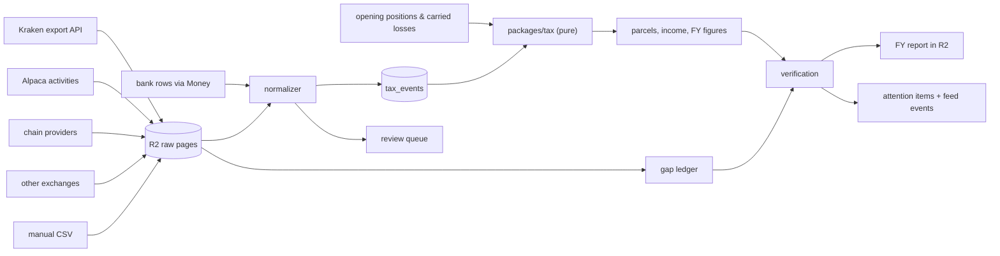

# Tax

The tax engine turns raw source history into the financial-year figures an Australian resident individual files from. Four layers run in order: **sync** pulls raw records, **normalize** turns them into canonical events, **compute** turns events into parcels and figures, and **verify** checks the result against independent evidence. The chapter stops at accountant-review material. The engine prepares figures and the evidence behind them; the operator or their accountant lodges the return, and the engine never labels a report ready to lodge.

Scope is deliberate: an individual investor with crypto on exchanges and self-custody wallets, US-listed stocks and ETFs, and Australian bank accounts. DeFi, NFTs, derivatives, and trader-basis accounting are out of scope. Storage conventions and migrations live in [Data](./03-data.md); the fields that carry meaning are named here. The golden test cases that pin the hardest rules are in [examples/tax-cases.md](./examples/tax-cases.md).

## What this chapter guarantees

- **Every figure walks back to events.** Each line on the FY report names the event IDs that produced it. A figure with no events behind it is a defect that fails the run.
- **Every event walks back to a raw source.** Each event names an R2 object and a record within it. The object must exist and must still contain that record.
- **Nothing is guessed.** An unrecognized or low-confidence source record produces a review item and no event. The computation cannot ingest a guess because the guess is never written.
- **A mismatch is visible, never absorbed.** Any reconciliation failure produces an attention item and a feed event. No code path rounds, ignores, or plugs a difference.
- **Full recomputation is deterministic.** Two runs of the same code version over the same event set produce byte-identical figures. Recomputation is total, never incremental. Parcels are outputs of a run, not a mutable inventory.
- **Readiness is stated, not implied.** A report is `draft`, `reconciled`, or `accountant_review_ready`, and the state is computed from coverage, reconciliation, and open review items. No state means "ready to lodge"; lodging is the accountant's judgment.

## 1. The pipeline



Each layer has one job and one output shape. Sync writes raw pages and coverage rows and nothing else. The normalizer writes events or review items and never both for the same record. `packages/tax` is pure: events, elections, and operator-supplied opening inputs in, figures out, no I/O and no clock. Verification reads both sides and writes only findings.

One date rule governs the whole chapter, so it is stated here once: **financial-year assignment uses the Australia/Sydney local date** of the event's source timestamp. Every FY boundary, discount holding period, and report line in this chapter uses that local date. No other date basis appears anywhere in the computation.

## 2. Sync and the gap ledger

Each source has a sync Workflow, running on schedule or on demand. The step shape is identical across sources, which is what makes a new source a mapping table rather than a new subsystem.

1. **Plan.** Read the source's coverage rows, compute the windows still missing, and emit one work item per window.
2. **Fetch.** Pull one page, with the source's own pagination or export mechanism.
3. **Archive.** Write the page verbatim to a content-addressed key under `tax/{source}/{sync_id}/…` in R2. The object is immutable once written; the bucket-lock and key conventions are in [Data](./03-data.md).
4. **Record coverage.** Append a `tax_source_coverage` row for the window just fetched.
5. **Normalize.** Map each raw record to events or a review item.
6. **Upsert.** Write events idempotently, keyed on `(system, account, record_id, leg)`.
7. **Advance.** Move the cursor and repeat, or finish.

The Workflow is orchestration and never the record. Every step writes its real output to Postgres or R2 and returns a pointer, so a Workflow whose history has expired leaves nothing behind that mattered.

**The gap ledger records what was actually fetched.** Each coverage row carries source, account, window start and end, method (`api | export | statement | manual`), the sync that fetched it, and a status of `complete`, `partial`, or `hole`. A window nobody fetched is a hole, and a hole renders as a hole rather than as an absence of transactions. An empty API page is not proof of an empty window; the adapter must distinguish a proven-empty interval from an incomplete response before marking it `complete`.

Per-source facts the sync must honor:

- **Ironcage's own venues** are native: the blotter already is the record, and a thin mapper emits events from committed live fills, including each fill's fee asset. Dry-run, shadow, and backtest fills are excluded.
- **Kraken full history** uses the export API (`AddExport` / `RetrieveExport`) for bulk trades and ledgers rather than the paged endpoints. The export API returns a zip; the compute container downloads, unzips, and parses it, because the archives outgrow Worker limits. **The ledger export is the spine**: deposits, withdrawals, staking and earn rewards appear only as ledger entries. The trades export supplements pair and fee detail, and trade records join their ledger entries by the shared `refid`. These exports run under a **dedicated read-only Kraken key with its own nonce sequence**, separate from the trading key; the venue key posture is specified in [Venues](./06-venues.md).
- **External exchanges** use read-only API keys in the same shape. Where an API cannot reach old history, a statement file is ingested and the file itself is recorded as the source.
- **Wallets** are tracked by xpub for UTXO chains and by address for account chains including tokens, through a configured chain-data provider. Per-chain staking-reward reconstruction is its own normalizer concern. An address or xpub is an observation mechanism, not proof of ownership; the operator records the ownership interval.
- **Alpaca** uses the account-activities stream, cursor-paged from the beginning of the account. The annual 1042-S is a manual upload archived in R2 and reconciled, which makes it evidence rather than a source of events.
- **Bank interest and AUD funding legs** come from the imported bank rows described in [Money](./08-money.md), selected by narrative pattern rather than re-imported.
- **Manual CSV** gets the same normalization and the same audit trail as any API source.

## 3. Opening positions and carried losses

History does not start at the first synced record. Assets acquired before any reachable export, and capital losses from prior returns, are real inputs the computation needs.

Both enter as **evidenced operator-supplied inputs**, not as permanent warnings. An opening position names the asset, quantity, custody location, acquisition date, and AUD cost base, and attaches its evidence (a statement, a contract note, a prior tax return schedule). A carried loss names its financial year of origin and its amount, with the prior return as evidence. The computation consumes these inputs exactly like events: they are part of the frozen input set of a run, they appear in the report's traceability, and correcting one produces a new run.

The zero-basis flag still exists, but it marks a genuinely untracked disposal. It is the failure mode for missing history, not the standing treatment of known-but-old history.

## 4. The canonical event

Nine event kinds, one shape. Every kind carries when, what, how much, what it is worth in AUD, how that value was determined, and which raw record it came from.

```ts
// packages/domain/src/tax/TaxEvent.ts
export interface EventBase {
  readonly id: TaxEventId; // UUIDv7
  readonly at: Instant; // the source's timestamp, UTC — never our clock
  readonly source: SourceRef;
  readonly matchGroup: Option<MatchGroupId>; // transfer legs, funding flows, dividend+withholding
  readonly normalizer: NormalizerVersion; // which mapping produced this row
}

export interface SourceRef {
  readonly system: "ironcage" | "kraken" | "exchange" | "alpaca" | "chain" | "bank" | "manual";
  readonly account: SourceAccountId;
  readonly syncId: SyncId;
  readonly r2Key: string; // the archived page or file
  readonly recordId: string; // the source's own ID, unique within (system, account)
}

export interface Valuation {
  readonly aud: Money<"AUD">;
  readonly basis: ValuationBasis; // never optional; see §6
}

export type ValuationBasis =
  | { readonly _tag: "NativeAud" }
  | { readonly _tag: "ActualAchieved"; readonly conversion: TaxEventId; readonly rate: Decimal }
  | { readonly _tag: "RbaDaily"; readonly rateDate: LocalDate; readonly rate: Decimal }
  | { readonly _tag: "RbaMonthlyAverage"; readonly month: YearMonth; readonly rate: Decimal }
  | { readonly _tag: "MarketPrice"; readonly provider: PriceProviderId; readonly at: Instant };

type Kind<T extends string, F> = { readonly _tag: T } & Readonly<F>;
type Leg = { asset: AssetCode; quantity: Decimal; location: CustodyLocationId };
type Held = { value: Valuation; against: TaxEventId; kind: WithholdingKind };
type Corp = { asset: AssetCode; action: CorporateActionKind; ratio: Option<Decimal> };

export type TaxEvent = EventBase &
  (
    | Kind<"Acquisition", Leg & { value: Valuation; costs: Money<"AUD"> }>
    | Kind<"Disposal", Leg & { proceeds: Valuation; costs: Money<"AUD">; reason: DisposalReason }>
    | Kind<"Spend", Leg & { proceeds: Valuation; personalUse: boolean }>
    | Kind<"Gift", Leg & { proceeds: Valuation }>
    | Kind<"Transfer", Leg & { direction: "in" | "out" }>
    | Kind<"Income", Leg & { value: Valuation; kind: IncomeKind }>
    | Kind<"Withholding", Held>
    | Kind<"Fee", Leg & { value: Valuation; against: Option<TaxEventId> }>
    | Kind<"CorporateAction", Corp & { resolve: boolean }>
  );

// `costs` is the event's incidental costs in AUD: brokerage, transfer charges, and the like.
export type DisposalReason = "sale" | "crypto_for_crypto" | "network_fee" | "wrap";
export type WithholdingKind = "us_treaty" | "us_nra" | "au_tfn";
export type CorporateActionKind = "split" | "spinoff" | "merger" | "reorg" | "return_of_capital";
export type IncomeKind =
  "staking" | "airdrop" | "dividend" | "cg_distribution" | "interest_au" | "interest_us";
```

Rules the types cannot express, stated once:

- **`Disposal`, `Spend`, and `Gift` are the disposal class.** All three consume parcels by the same algorithm. They are distinct kinds because they are distinct return-line facts.
- **`Transfer` is never a disposal.** A transfer between the operator's own accounts moves a parcel to a new custody location, keeping its acquisition date and cost base. The network fee consumed by that transfer is a separate `Disposal`.
- **A fee is counted exactly once.** A fee reported on the same source record as its trade becomes that event's `costs`. A fee arriving as its own record becomes a `Fee` event, added to the parcel's cost base, and a fee charged in the asset rather than in cash additionally emits a `Disposal` of the fee quantity. Where Kraken reports the same fee in both the trades export and the ledger export, the `refid` join deduplicates it: one fee fact, whichever export carried it.
- **`Withholding` records the amount actually withheld** on the source's own activity line, and it must name the event it was withheld against. No withholding amount is ever derived by applying an assumed rate to income. An unattached withholding row is a review item, because a gross-up with no gross is not a figure.
- **Zero-cost entries are acquisitions, not income.** An initial-allocation airdrop or a chain-split coin enters as an `Acquisition` valued at A$0. Established-token airdrops and staking rewards are `Income` at market value on receipt.
- **A match group relates events without changing them.** Transfer legs, funding flows, and dividend-plus-withholding pairs share a match group. A crypto transfer's legs match on asset, quantity net of the known network fee, and a timestamp window of **72 hours** (proposed). An ambiguous match is a review item, never an automatic pairing.

## 5. Source to event

Every mapping is a table, and every table has a final row. An unlisted code produces a review item and no event.

**Kraken ledger and trade records:**

| Source record                                      | Events emitted                                     | Notes                                                              |
| -------------------------------------------------- | -------------------------------------------------- | ------------------------------------------------------------------ |
| `trade` (asset out)                                | `Disposal` (`sale` or `crypto_for_crypto`)         | paired to the asset-in row by the shared `refid`                   |
| `trade` (asset in)                                 | `Acquisition`                                      | same `refid`, same match group                                     |
| `spend` / `receive`                                | `Disposal` / `Acquisition`                         | the two sides of a fiat-pair order                                 |
| ledger `fee` column, fee asset ≠ AUD               | `Fee` + `Disposal` (`network_fee` or trading fee)  | the fee asset is captured, never assumed; counted once per `refid` |
| `deposit`                                          | `Transfer` in                                      | matched to the sending leg; not income                             |
| `withdrawal`                                       | `Transfer` out, plus `Disposal` of the network fee | the fee quantity comes from the withdrawal record                  |
| `staking`, `reward`, `earn`                        | `Income` (`staking`)                               | the ledger is the only place these appear                          |
| `transfer` between the operator's own Kraken books | no event                                           | same beneficial owner, no change in holdings                       |
| `margin`, `rollover`, `settled`, any unlisted type | review item, no event                              | out of declared scope, or a shape we do not know                   |

**Alpaca account activities.** **VERIFY:** the branch sources for this table contradict each other on the corporate-action codes (`SPLIT`/`SPIN` versus `SSP`/`SSO`) and on which of `DIVNRA` and `DIVTW` carries the treaty-rate line. The table below is the working mapping; a real activities pull from the operator's account confirms the codes and their semantics before any of these rows is trusted.

| Code                             | Events emitted                          | Notes                                                                          |
| -------------------------------- | --------------------------------------- | ------------------------------------------------------------------------------ |
| `FILL`                           | `Acquisition` or `Disposal`             | USD amounts; translated per §6                                                 |
| `DIV`                            | `Income` (`dividend`)                   | grossed up by its actual withholding lines, never by an assumed rate           |
| `DIVNRA`                         | `Withholding`                           | attached to the `DIV` by symbol and pay date; treaty/NRA semantics VERIFY      |
| `DIVTW`                          | `Withholding`                           | same attachment; semantics VERIFY against the real stream                      |
| `DIVCGL`                         | `Income` (`cg_distribution`)            | classified apart from ordinary dividends                                       |
| `DIVROC`                         | `CorporateAction` (`return_of_capital`) | reduces cost base with a floor at zero; the excess past zero is a capital gain |
| `INT`                            | `Income` (`interest_us`)                | broker cash interest is foreign income                                         |
| `FEE`                            | `Fee`                                   | charged in USD, so an incidental cost, not a disposal                          |
| `CSD` / `CSW`                    | `Transfer` in / out                     | matched to the AUD bank leg by amount and date                                 |
| `SPLIT` (or `SSP`)               | `CorporateAction` (`split`)             | `resolve: false`; code identity VERIFY                                         |
| `SPIN` (or `SSO`), `MA`, `REORG` | `CorporateAction` + review item         | `resolve: true`; never silently processed; code identity VERIFY                |
| any other code                   | review item, no event                   | including codes Alpaca adds after this table ships                             |

**Bank narratives**, matched case-insensitively against the normalized narrative:

| Pattern                                                                                                            | Event emitted                                             |
| ------------------------------------------------------------------------------------------------------------------ | --------------------------------------------------------- |
| `CREDIT INTEREST`                                                                                                  | `Income` (`interest_au`)                                  |
| `BONUS INTEREST`                                                                                                   | `Income` (`interest_au`)                                  |
| TFN withholding narratives, **including the bank's own misspelled variant**, recorded verbatim in the pattern list | `Withholding` (`au_tfn`)                                  |
| an AUD debit or credit that matches a broker or exchange arrival                                                   | `Transfer` out or in, one match group across both systems |

## 6. FX valuation precedence

Every non-AUD amount gets an AUD value, and every AUD value gets a recorded basis. The rules are tried in order; the first that applies wins.

1. **Native AUD.** The amount is already AUD. Basis `NativeAud`, no rate.
2. **Actual achieved rate.** A real conversion in the operator's own accounts backs this flow, and source evidence ties that conversion to this movement inside one match group. Use that conversion's own rate; basis `ActualAchieved` naming the conversion event. A conversion that merely happened near the same time does not qualify: without evidence linking it to the movement, the legs stay related and this rule does not fire.
3. **RBA daily rate for the transaction date.** The default for everything else. Basis `RbaDaily` with the rate and the date it was published for.
4. **RBA monthly average.** Used only when the operator has elected it for the whole financial year, recorded per event as `RbaMonthlyAverage`. It is never mixed silently with rule 3 inside one year.
5. **Nearest prior published rate.** When no rate exists for the date, use the most recent earlier publication and record its actual date. A gap wider than **4 days** (proposed) additionally raises a review item.

Crypto valuation uses `MarketPrice` from the configured provider at the event's timestamp, and the provider identity is part of the basis. A missing price is a review item and no event, because a disposal valued at a guess is worse than a disposal the operator has to look at.

## 7. Parcels and CGT

`packages/tax` is pure, deterministic, and versioned like the engine. Two structural rules come before the algorithm:

**Parcels are run outputs, not inventory.** A computation run freezes its inputs (events, elections, opening positions, carried-loss vintages, code version), derives every parcel and consumption from scratch, and stores them keyed by the run. There is no mutable parcel table that later syncs edit. A corrected source record produces a new run with new parcels, and the previously accepted report remains reproducible from its own run.

**Parcel selection is location-scoped FIFO.** Specific identification is applied per asset per custody location (venue or wallet), with FIFO as the default selection order within a location; the practice is recorded on the report so the accountant can see exactly which identification was used. Transfers move parcels between locations with acquisition dates and cost bases intact, so scoping by location never resets a holding period. HIFO and LIFO are available as recorded specific-identification variants with a records-adequacy caveat.

```
function computeParcels(events, openingPositions, method = FIFO):
  parcels  = Map<(Asset, Location), List<Parcel>>  # each: {id, asset, location, acquiredDate, qty0, qtyLeft, costBase0}
  legs     = []                                    # one per parcel consumed by a disposal

  for p in openingPositions:
    push Parcel{ p.acquiredDate, p.location, qty0: p.quantity, qtyLeft: p.quantity, costBase0: p.costBaseAud }

  for e in events sorted by (at, source.recordId):  # total order, no ties
    match e:
      Acquisition:
        push Parcel{ e.date, e.location, qty0: e.quantity, qtyLeft: e.quantity, costBase0: e.value.aud + e.costs }
      Fee where e.against is an Acquisition:
        that parcel.costBase0 += e.value.aud        # element-2 incidental cost
      Income:
        push Parcel{ e.date, e.location, qty0: e.quantity, qtyLeft: e.quantity, costBase0: e.value.aud }  # clock starts now
      Transfer (matched pair):
        move the parcel quantity to the destination location; acquiredDate and costBase unchanged
      CorporateAction(split, ratio r):
        for p in parcels[e.asset, *]:
           p.qty0 *= r; p.qtyLeft *= r              # cost base and acquiredDate unchanged
      CorporateAction(return_of_capital, amount a):
        allocate a across held parcels pro-rata by quantity
        for each parcel share s: reduce costBase0 by min(s, costBase remaining)
        any excess past zero cost base is a capital gain leg in this FY   # floor at zero
      CorporateAction(other):
        halt this asset's computation; the review item must be resolved first
      Disposal | Spend | Gift:
        consume(e)

function consume(e):
  remaining = e.quantity
  proceeds  = e.proceeds.aud
  order     = parcels[e.asset, e.location] sorted by method  # FIFO: acquiredDate asc, then parcel id
  for p in order while remaining > 0 and p.qtyLeft > 0:
     take      = min(p.qtyLeft, remaining)
     costBase  = p.costBase0 * (take / p.qty0) + e.costs * (take / e.quantity)
     share     = proceeds * (take / e.quantity)
     gain      = share - costBase
     eligible  = gain > 0 and e.date > p.acquiredDate + 12 months   # Sydney local dates; see below
     legs.push({ event: e.id, parcel: p.id, take, costBase, share, gain, eligible })
     p.qtyLeft -= take; remaining -= take
  if remaining > 0:
     legs.push(zeroBasisLeg(e, remaining))          # costed at zero, flagged, never silent
```

**The discount holding rule is a month rule, not a day count.** The 50% discount requires the asset to have been acquired at least 12 months before the CGT event, with **both the acquisition day and the CGT-event day excluded** from the count. In date arithmetic on Sydney local dates: a disposal is eligible only when its date is strictly after the acquisition date plus 12 calendar months. An asset bought on 16 September 2024 and sold on 16 September 2025 misses the discount; sold on 17 September 2025, it qualifies. No "365 days" or "366 days" comparison appears anywhere in the computation, because the statutory test is expressed in months. The boundary is pinned by a golden fixture in [examples/tax-cases.md](./examples/tax-cases.md).

**Loss application is the taxpayer's choice, with vintages kept separate.** Current-year losses and carried-forward losses are distinct pools, and each carried vintage keeps its financial year of origin. The statutory ordering between pools is fixed: current-year losses apply before carried losses, and carried vintages apply in the order they were incurred. The direction — which gains absorb the losses — is the taxpayer's choice. Applying losses to non-discountable gains first is our **recorded default optimization**, because a dollar of loss against an undiscounted gain saves more tax than the same dollar against a gain about to be halved. It is a default the operator can override, and an override is a recorded act, not a setting.

```
function netCapitalGain(legs, carriedVintages, direction = non_discountable_first):
  discountable = gains where eligible;  plain = gains where not eligible
  pools = [ currentYearLosses(legs) ] ++ carriedVintages sorted by origin FY
  for pool in pools:                                # statutory pool order
     apply pool against gains in `direction` order  # taxpayer's choice; default recorded
     record per pool: amount applied, target legs, remainder
  net          = Σ remaining plain + Σ remaining discountable × 0.50
  carryForward = per-vintage remainders             # each keeps its origin FY
```

The report shows, per vintage: opening amount, amount applied and to which gains, and the remainder carried forward. A lumped "losses" number never appears.

Intermediate arithmetic is unrounded decimal. Each per-disposal ledger line rounds half-even to the cent, and the rounding rule is part of the computation version.

## 8. Worked CGT example

One BTC position, three events, two financial years.

> **2024-03-12** — buy 0.1 BTC on Kraken. Consideration A$5,985, trading fee A$15.00, both AUD-native.
> **2024-11-08** — withdraw 0.1 BTC to a cold wallet. Network fee 0.0002 BTC. BTC market value A$116,000 that day.
> **2026-01-20** — sell 0.05 BTC for A$4,800 gross, exchange fee A$12.00 charged in AUD.

Events emitted, in order:

| #   | Event                          | Detail                                                                               |
| --- | ------------------------------ | ------------------------------------------------------------------------------------ |
| 1   | `Acquisition`                  | 0.1 BTC, value A$5,985.00, costs A$15.00 from the same record                        |
| 2   | `Transfer` out / `Transfer` in | 0.0998 BTC, one match group, **no CGT event**; the parcel moves to location `wallet` |
| 3   | `Disposal` (`network_fee`)     | 0.0002 BTC, proceeds A$23.20 at A$116,000/BTC                                        |
| 4   | `Disposal` (`sale`)            | 0.05 BTC, proceeds A$4,800.00, costs A$12.00                                         |

Parcel P1 is created by event 1 with quantity 0.1 BTC and cost base A$6,000.00, a unit cost of A$60,000 per BTC.

| Step                  | Consumed | Cost base  | Proceeds   | Gain       | Holding                   | Discount | P1 left                |
| --------------------- | -------- | ---------- | ---------- | ---------- | ------------------------- | -------- | ---------------------- |
| Event 3, fee disposal | 0.0002   | A$12.00    | A$23.20    | A$11.20    | under 12 months           | no       | 0.0998 BTC, A$5,988.00 |
| Event 4, sale         | 0.05     | A$3,012.00 | A$4,800.00 | A$1,788.00 | past 2025-03-12, eligible | yes      | 0.0498 BTC, A$2,988.00 |

The sale's cost base is `0.05 × 60,000 = 3,000.00` plus the A$12.00 incidental fee. The fee is not itself a disposal because it was charged in AUD. The sale's discount test: acquisition 2024-03-12 plus 12 months is 2025-03-12, and the disposal date 2026-01-20 is strictly after it, so the discount applies.

**FY2025** (year ended 30 June 2025) holds the fee disposal alone: gain A$11.20, held under 12 months, not discountable. Net capital gain A$11.20.

**FY2026** holds the sale: gain A$1,788.00, discount eligible. With no losses and nothing carried forward, the net capital gain is `1,788.00 × 0.50 = A$894.00`.

A transfer back from the wallet before the sale would carry its own network fee, and that fee would be a further disposal by the same rule. It is left out here so the arithmetic stays legible.

## 9. Division 775 and the USD balance

The USD cash balance is itself an asset under the forex rules. How it is treated depends on an election only the operator can make, and the engine never assumes the election was made.

**Without an election, full forex tracking is the computation.** Currency amounts form lots consumed FIFO, and realization gains and losses are ordinary income rather than capital gains.

**The limited balance election disregards FX movements on qualifying accounts, and it has strict formalities.** The election is prospective from its effective date, it must be written and signed, and it applies per nominated account. The engine's role is bounded:

- It **drafts** the election document with the nominated accounts and effective date, for the operator's signature. A draft has no effect; only the signed artifact, archived with its date, activates the treatment, and only from that date forward. Nothing is backdated.
- It **tests credit and debit balances separately** against the statutory limits, per the provision's own structure, using daily peak AUD-translated balances across the nominated accounts.
- It **monitors thresholds** and makes any approach or breach unmissable:

| Condition                                  | Behavior                                                                                           |
| ------------------------------------------ | -------------------------------------------------------------------------------------------------- |
| Peak AUD-translated balance < A$200,000    | Nothing. The headroom figure shows on the running FY estimate.                                     |
| Peak ≥ **A$200,000** (proposed buffer)     | `warning` feed event and an attention item naming the headroom to the threshold.                   |
| Peak ≥ **A$250,000** (the statutory limit) | `critical` feed event, an attention item, and every subsequent USD flow marked `election_at_risk`. |

The consequence of a breach is a question for the operator's accountant. The engine's job is to make the breach unmissable and its date exact, and to keep computing both modes so the accountant can compare them.

## 10. Foreign income and withholding

US dividends are assessable foreign income recorded **gross of the amounts actually withheld**, taken from the broker's own withholding activity lines. The engine never imputes a withholding amount from a rate: when only net cash is visible and no withholding line exists, that is a missing-evidence review item, not a 15% assumption. The year's computed withholding reconciles against the uploaded 1042-S.

W-8BEN validity is a dated fact. The form normally remains valid through the end of the third calendar year after signature, and can end earlier on a change of circumstances. The engine stores the signature date, computes the expiry, and raises an attention item **90 days** (proposed) before lapse. After a lapse, the broker withholds at the 30% non-treaty rate; the engine records the actual 30% amounts, flags the lapsed form, and marks the portion above the treaty rate for accountant review rather than claiming it as an offset. The lapsed-form case is a golden fixture in [examples/tax-cases.md](./examples/tax-cases.md).

Foreign tax paid feeds the **foreign income tax offset**. Up to A$1,000 of foreign tax may be claimed directly with no limit calculation. Above that, the offset limit must be computed, and the limit depends on the operator's whole income position, which the investment ledger cannot see. The **operator tax profile** supplies it: salary and other non-Ironcage income, a deductions estimate, Medicare levy status, and the HELP debt flag, entered per financial year and versioned like any setting. With a profile, the FITO figure is computed and the report names the profile version it used. Without one, the **restricted A$1,000 direct claim is the recorded fallback**, and the report says the claim was capped for that reason. Unused FITO is lost, not carried, and the report says so when it happens.

The myTax **A$50,000 foreign-assets question** is answered with an **operator-reviewed assist**, never automatically. The engine computes the peak AUD value of foreign holdings across the year — shares, ETFs, and foreign cash — and presents it with its components as a suggested answer. The question covers overseas interests and valuation rules beyond what the ledger holds, so the operator confirms or corrects the answer, and the confirmation is recorded.

Broker cash interest is foreign income; Australian bank interest is domestic. They stay on their separate return items.

## 11. Verification and readiness

Verification runs with every recomputation. Checks split into two classes: **run-failing** checks, where a failure means the computation itself cannot be trusted and no report is produced, and **finding-producing** checks, where the figures stand but carry attention items and feed events. The class of each check is explicit in code.

| Check                   | Class             | Computation                                                                                                                                                 | On failure                                                                        |
| ----------------------- | ----------------- | ----------------------------------------------------------------------------------------------------------------------------------------------------------- | --------------------------------------------------------------------------------- |
| Rate coverage           | run-failing       | every non-AUD event has a `ValuationBasis` with a rate or price                                                                                             | the run fails; a missing basis is a defect, not a finding                         |
| Traceability            | run-failing       | every figure names events, every event names an existing R2 object and record                                                                               | the run fails                                                                     |
| Ledger identity         | run-failing       | Σ parcel quantity remaining = opening + Σ acquisitions − Σ disposal-class quantities, per asset                                                             | the run fails                                                                     |
| Balance reconciliation  | finding           | per source and asset: opening + acquisitions + transfers in − disposals − transfers out − consumed fees, versus the live exchange, chain, or broker balance | `warning` event, attention item, and the source marked unreconciled on the report |
| Zero-basis disposal     | finding           | disposal quantity exceeding tracked acquisitions and opening positions for that asset                                                                       | costed at zero base, `warning` event, and the report line flagged                 |
| Gap ledger              | finding           | union of coverage windows per source vs the financial-year window                                                                                           | attention item per hole; the FY report renders as incomplete                      |
| 1042-S cross-check      | finding           | Σ US withholding events for the US calendar year vs the uploaded form                                                                                       | attention item itemizing the difference where it exceeds **A$1.00** (proposed)    |
| Carried-loss continuity | finding           | each vintage's closing remainder this year equals its opening amount next year                                                                              | attention item naming the vintage and the delta                                   |
| Oracle comparison       | finding, one-time | per-disposal diff against the prior tax service's export                                                                                                    | every difference itemized and individually resolved or explained                  |

The balance-reconciliation identity is stated per source so a mismatch localizes: the reconstructed closing quantity must equal the source's reported balance within the declared tolerance, and a mismatch reports both values, the delta, and the last point at which they agreed. It never creates a balancing event.

The oracle runs once and is never merged. Its export is evidence about our computation, not an input to it.

**Readiness is a computed state, not a mood.** A completed run is:

- `draft` — the arithmetic completed, but coverage holes, unresolved review items, or unreconciled sources remain;
- `reconciled` — every configured source's coverage is complete for the year, balances reconcile, and no material review item is open;
- `accountant_review_ready` — reconciled, plus every required election document and opening-position evidence is attached, and the readiness checklist passes.

There is no higher state. The engine never labels a report "ready to lodge"; accountant review can return issues, and each returned issue produces a new computation run.

## 12. The review queue

An unrecognized shape produces a review item and **no event**. That is the whole implementation of "flagged, never guessed": the computation cannot ingest a guess because the guess was never written.

A review item carries the raw record, its R2 key, the reason it could not be mapped, and the mapping the normalizer would have used if it were confident. Reasons are a closed set: `unknown_code`, `unmatched_transfer`, `unattached_withholding`, `missing_rate`, `missing_price`, `corporate_action`, `below_confidence`.

Resolution is an operator act, and it writes events with a source reference pointing at the same raw record plus a `manual` resolution note. The next recomputation includes them like any other event, because recomputation is total.

Open review items do not block computation. They hold the run at `draft`, mark the FY report incomplete, and show their count, so no figure is quietly final while an unresolved record sits behind it.

## 13. The report and retention

One financial-year report, shaped as myTax asks, generated into R2 like any report. The mapping from computed figures to return items:

| Computed figure                                                                                          | myTax destination                                                                  |
| -------------------------------------------------------------------------------------------------------- | ---------------------------------------------------------------------------------- |
| Total current-year gains; net capital gain after losses and discount; per-vintage losses carried forward | Item 18, with the CGT-schedule flag where required                                 |
| Assessable foreign income (dividends gross of actual withholding, broker interest); the FITO claim       | Item 20, with the A$50,000 foreign-assets question as an operator-confirmed answer |
| Australian bank interest                                                                                 | Item 10                                                                            |
| Forex gain/loss lines                                                                                    | Only where full forex tracking applies                                             |

Behind the headline figures sit the ledgers the accountant works from: per-disposal with parcel consumption and discount eligibility, income by type and source, withholding, closing holdings with AUD cost bases per custody location, the carried-loss position by vintage, and the recorded parcel-identification practice. The report names the computation run, code version, and tax-profile version behind every figure.

**Retention is permanent as a product policy.** Every raw archive, event, run, election document, W-8BEN record, and 1042-S is kept forever. The legal requirement is not summarized here as a flat five-year clock, because asset records, crypto records, and carried-loss records can require retention well past five years from lodgment; keeping everything makes the question moot.

## Values set in this chapter

Every number above, its owner, and its status. "Proposed" means: pick differently and only configuration changes.

| Value                             | Default                                                              | Owner                        | Status         |
| --------------------------------- | -------------------------------------------------------------------- | ---------------------------- | -------------- |
| FY date basis                     | Australia/Sydney local date of the source timestamp                  | computation config           | decided        |
| Parcel method                     | FIFO specific identification, scoped per custody location            | computation config           | decided        |
| Parcel lifecycle                  | run outputs, recomputed each run; never mutable inventory            | computation config           | decided        |
| CGT discount                      | 50%; acquired ≥ 12 months before the event, both end days excluded   | statute                      | decided        |
| Loss pools                        | current-year first, then carried vintages in origin order            | statute                      | decided        |
| Loss direction                    | non-discountable gains first (operator-overridable, recorded)        | computation config           | decided        |
| Rounding                          | intermediates unrounded; disposal lines half-even to the cent        | computation config           | decided        |
| FX default basis                  | RBA daily for the transaction date                                   | computation config           | decided        |
| Division 775 mode                 | full forex tracking unless a signed prospective election is archived | operator election            | decided        |
| Limited-balance threshold / alert | A$250,000 statutory, A$200,000 warning                               | statute / computation config | alert proposed |
| FITO direct-claim threshold       | A$1,000                                                              | statute                      | decided        |
| FITO fallback without a profile   | restricted A$1,000 direct claim, stated on the report                | computation config           | decided        |
| W-8BEN expiry warning             | 90 days before lapse                                                 | computation config           | proposed       |
| Transfer match window             | 72 hours                                                             | normalizer config            | proposed       |
| Stale-rate review trigger         | no published rate within 4 days                                      | computation config           | proposed       |
| Reconciliation tolerances         | 1042-S A$1.00; balances 1 minor unit or 0.01%                        | verification config          | proposed       |
| Kraken export poll interval       | 60 s                                                                 | engine config                | proposed       |
| Container recompute threshold     | run in the compute container above ~10,000 events                    | engine config                | proposed       |
| Event idempotency key             | (system, account, record_id, leg)                                    | normalizer                   | decided        |
| Recomputation strategy            | total, from the full event set and opening inputs                    | computation config           | decided        |
| Personal-use exemption            | off, per-transaction opt-in with warning                             | operator setting             | decided        |
| Wrapping treatment                | disposal, with a recorded override                                   | operator setting             | decided        |

## Alternatives considered

- **The prior service's export as a data source.** Rejected: importing another engine's conclusions inherits its errors and destroys traceability to raw records. It is imported once as a verification oracle, compared, and every difference resolved or explained.
- **Incremental recomputation.** Rejected: incremental parcel state invalidates subtly on any historical correction, and corrections are routine. At one individual's volume the full recomputation is cheap, and totality is what makes the determinism guarantee checkable.
- **Global FIFO across venues and wallets.** Rejected: it fabricates identification choices the operator's records cannot substantiate, which is exactly what specific identification must avoid. Location-scoped selection matches the records that exist, and it is recorded on the report as the identification practice.
- **Treating the limited-balance election as the software default.** Rejected: the election is prospective, written, signed, and per nominated account, and assuming it would let a computation depend on a legal act that never happened. The engine drafts the document and tracks the thresholds; the operator makes the election.
- **Imputing withholding at the 15% treaty rate.** Rejected: the broker's activity lines carry the actual amounts, and imputation invents a figure exactly where the 1042-S cross-check needs an independent one. A missing withholding line is a review item.
- **A single lumped loss pool.** Rejected: the return asks for carried losses by continuity, the statutory ordering distinguishes current-year from carried losses, and a lumped pool cannot show which vintage a remainder belongs to.
- **Kraken's paged endpoints instead of the export API.** Rejected for bulk history: the export API returns complete trade and ledger sets in one artifact, which is both faster and easier to archive as a single immutable object.
- **Averaging cost base.** Not offered: it is unavailable to Australian individuals for these assets. HIFO and LIFO are offered as specific-identification variants with a records-adequacy caveat.
- **Deciding investor versus trader.** Rejected as a toggle. Trader status is a different computation model, so the engine computes on the investor basis, marks high-frequency sleeve activity distinctly, and states the question for the accountant.
- **Storing figures rather than recomputing them.** Rejected: a stored figure outlives the code that produced it and becomes unfalsifiable. Figures are derived on every run and carry the code version and run that derived them.

## Open questions

1. **Kraken ledger type coverage.** Which ledger entry types and subtypes appear in the operator's real full-history export. _Safe fallback:_ any type not in the mapping table lands in the review queue with no event. _Must close before:_ the first FY computation on real data. _Evidence:_ a real full-history export ingested and every row mapped or reviewed.
2. **Alpaca activity-code identity and semantics.** Whether the corporate-action codes are `SPLIT`/`SPIN` or `SSP`/`SSO`, and which of `DIVNRA`/`DIVTW` carries the treaty-rate line. _Safe fallback:_ unlisted codes produce review items; withholding events attach by symbol and pay date regardless of code. _Must close before:_ the first FY computation on real data. _Evidence:_ a real activities pull from the operator's account, archived as fixtures.
3. **The consequence of a limited-balance breach.** Whether the election ceases from the breach date, from the start of the year, or under a temporary-excess allowance. _Safe fallback:_ the engine records the exact breach date, marks subsequent flows `election_at_risk`, and computes both modes. _Must close before:_ the first FY in which a breach occurs. _Evidence:_ accountant advice against the provision for the operator's facts.
4. **FITO treatment of over-treaty withholding after a W-8BEN lapse.** Whether the portion above 15% is claimable, recoverable from the IRS, or lost. _Safe fallback:_ claim only the treaty-limited portion; flag the excess for accountant review. _Must close before:_ the first FY report containing a lapsed-form dividend. _Evidence:_ accountant confirmation for the operator's facts.
5. **Chain-data and price providers.** Which provider backs xpub and address tracking, and whether crypto valuation uses the trade timestamp or the daily close. _Safe fallback:_ wallet history enters by manual CSV; valuations without a price are review items. _Must close before:_ wallet sync ships. _Evidence:_ provider output validated against a known wallet's full history.
6. **ETF distribution components.** Whether the Alpaca stream distinguishes every component the return requires, or whether the annual statement must supplement it. _Safe fallback:_ unclassifiable distribution lines are review items. _Must close before:_ the first FY report containing ETF distributions. _Evidence:_ a full distribution year of the real stream reconciled against the issuer's annual statement.

## Build checklist

- [ ] `TaxEvent` union and `ValuationBasis` as Effect Schemas in `packages/domain`, with the idempotency key as a unique index and UUIDv7 IDs
- [ ] One sync Workflow shape, instantiated per source, with the seven steps and the coverage rows; the Kraken export path running the zip through the compute container under the dedicated read-only key
- [ ] Opening-position and carried-loss input surfaces, with attached evidence and per-vintage loss records
- [ ] The three mapping tables as data-driven normalizers, each with a fixture per row, a final unknown-code case, and the Kraken `refid` join with its fee-once rule
- [ ] FX precedence as a pure function; property test: every event leaves the normalizer with a basis or does not exist
- [ ] `packages/tax`: location-scoped parcels as run outputs, consumption, the 12-month discount rule on Sydney local dates, loss vintages with the recorded direction default, carry-forward by vintage, DIVROC floor
- [ ] The worked CGT example and every case in [examples/tax-cases.md](./examples/tax-cases.md) as golden tests: same events, byte-identical figures
- [ ] Division 775 election drafting, the signed-artifact gate, separate credit and debit balance tests, and both alert levels
- [ ] The operator tax profile per FY, the computed FITO limit, and the recorded A$1,000 fallback
- [ ] Verification checks with the run-failing and finding-producing classes separated in code; readiness states `draft` / `reconciled` / `accountant_review_ready`
- [ ] Review queue with the closed reason set, and the resolution path that writes events
- [ ] FY report generation shaped as myTax asks, with the per-disposal, income, withholding, per-vintage carried-loss, and closing-holdings ledgers behind it and the foreign-assets operator confirmation recorded
