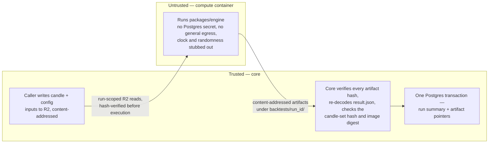
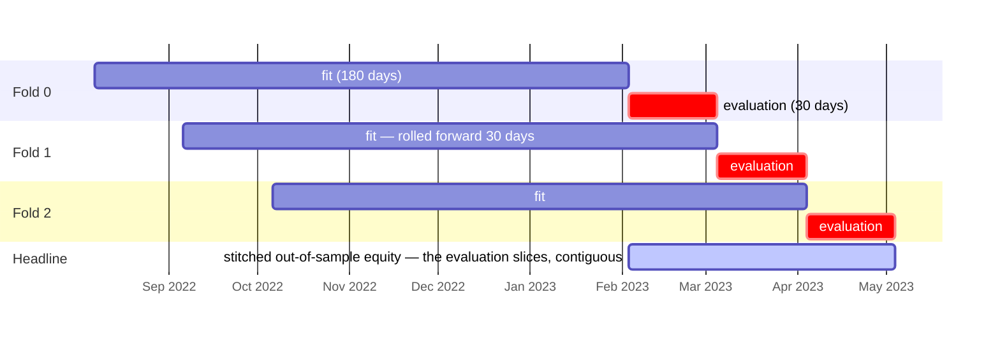
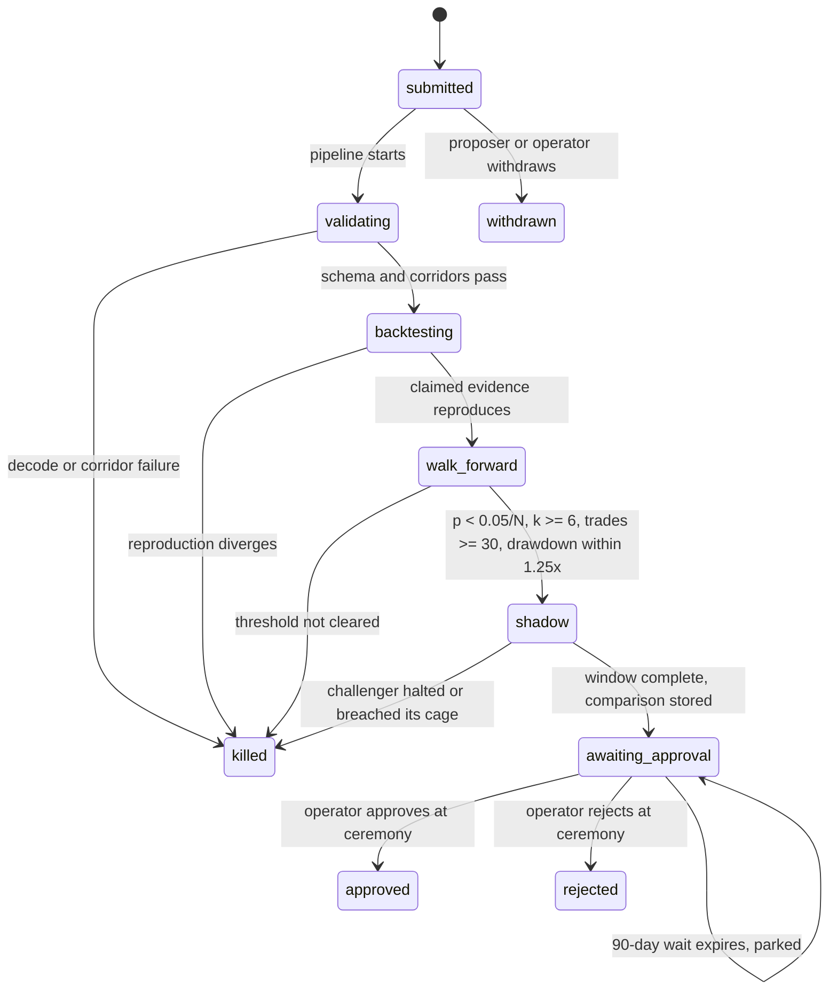

The workbench is the research surface: the candle store that holds history, backtests that run the real engine against it, the trial counter that prices multiplicity, and the gate pipeline that decides whether a proposal reaches a ceremony. It exists against one failure above all others: a system that encourages many candidates manufactures its own luck, because run enough variants and one will look brilliant by accident, and either the operator or a prolific proposing agent could turn that fluke into a funded sleeve. Its automated customer is the proposal system; its interactive customer is the operator. Both drive the same machinery, and neither has a path that skips it. The workbench stops at evidence. The fill model it consumes is defined in [Venues](/technical/venues), the capability that authors proposals in [AI](/technical/ai), the storage schemas in [Data](/technical/data), and promotion itself remains dry run plus the operator's ceremony.

## What this chapter guarantees

- A run re-executed from its stored manifest produces a byte-identical `result.json`, under the container image digest the manifest pins.
- A costless backtest does not exist. The cost model is mandatory and cannot be zeroed.
- A result whose data window touches a gap or a disputed candle says so in its stored body and in every rendering of that body.
- No comparative number renders without the trial count that produced it, and acceptance thresholds tighten as that count rises.
- The headline of every evaluation is out-of-sample by construction. In-sample results stay viewable and stay labeled.
- Proposal bundles arrive through the decision queue; core writes the validated bundle to a quarantine bucket, and agents never hold a write path to it.
- No workbench number promotes a sleeve or changes live behavior by itself. The paths to live are dry run and the ceremony.

## The running example

One proposal threads through this chapter. The numbers are illustrative, not defaults. Fixed facts, used everywhere:

:::info[The fixed proposal]
Proposal **P** targets the **crypto-trend** sleeve (mandate v3). It changes three `trend-follow@2` parameters: `fast` 20 → 14, `slow` 60 → 55, `atrStopMultiple` 2.5 → 3.0.

Its strategy family is `trend-follow::slv_crypto_trend`, whose trial count stands at **12**.

Its data window is `2022-08-07` → `2026-08-07` on BTC/AUD 4h: 8,766 candles in the window, plus 200 warm-up candles.

Proposal ID: `019fd989-56aa-7c3e-9b21-4d8f0a6e2c17`. Backtest run ID: `019fd98a-1e02-7b4d-a3c9-8f5b2d7e0c44`. Both are UUIDv7, like every ID in the system.
:::

## 1. The candle store

The candle store is one table, written by two kinds of act. The tick's own fetch is the collector at trading timeframes: each sleeve writes the closed candles it fetched for its universe, tagged `source: api`. Backfill extends the same table backward.

**Backfill is a recorded act, never an ambient job.** Each act writes a row carrying source, venue, instrument, timeframe, requested range, fetched-at, the R2 key of the raw archive, and four counts: candles read, written, matched, conflicting. Two sources are supported at launch.

- **Kraken quarterly OHLCV CSVs.** Kraken's public OHLC endpoint returns at most 720 candles and cannot serve deep history, so the CSV archive is the expected path for crypto and not a fallback.
- **Alpaca history API**, paged from the requested window under a recorded feed, adjustment, as-of, currency, and sort policy. Timestamp anchoring is established by fixed fixtures across session and daylight-saving boundaries rather than asserted from undocumented behavior.

**Backfill decoding runs in the compute container; trusted core commits it.** Kraken archives can be multi-gigabyte, beyond Worker memory and CPU limits. The raw archive first lands in R2 under a content-addressed key. Narrow compute-Worker outbound handlers let the container read that object. A versioned importer writes normalized chunks and a manifest back to a run-scoped R2 prefix, all content-addressed.

The container has no Postgres credential and no general internet egress. Core verifies every chunk hash and schema before streaming bounded batches into Postgres under the recorded backfill act. The match and conflict rules below apply at commit. A credential-owning trusted adapter pages Alpaca, then sends its raw pages through the same R2 decoder path. This keeps one normalization path without giving untrusted code authority over the record.

**The uniqueness key is `(venue, instrument, timeframe, close_ts)`.** A write that collides with an existing row must compare all five OHLCV fields at the venue's stored precision. Equal on all five is a match and a no-op. Unequal on any field is a conflict, and the resolution is fixed:

- The existing row must not be overwritten. The store appends a `candle_conflicts` row holding both payloads, both sources, and both fetched-at stamps.
- The `(instrument, timeframe, close_ts)` triple is marked **disputed** in the gap ledger. A disputed candle counts as absent for coverage.
- A `warning` feed event fires naming the instrument, timeframe, and count of disputed candles in the act.

**Gaps are computed from source semantics, not row counts.** The store expands the affected range into the expected grid, then classifies each absent timestamp as `source_missing`, `market_closed`, or `confirmed_no_trade`. Kraken archives omit intervals with no trades; those become explicit zero-trade intervals under the chosen previous-close/zero-volume normalization (or nontradable intervals), never source corruption. Equity grids come from a versioned venue calendar, so a holiday is not a gap and a calendar correction is visible.

**Coverage renders from the ledger.** Per `(venue, instrument, timeframe)` the workbench shows earliest close, latest close, every gap range with its detection time, the disputed count, and the coverage ratio `present ÷ expected` over the rendered window. A backtest whose window intersects any gap or disputed candle carries that intersection in its stored result and in every view of it. Interpolation does not exist as a code path.

## 2. The backtest manifest

Every run starts from a manifest, stored beside its result and sufficient to reproduce it. The manifest is the run's identity.

```ts backtest.ts
// packages/contracts/src/workbench/backtest.ts
export interface BacktestManifest {
  readonly manifestVersion: 1;
  readonly runId: RunId; // UUIDv7, minted before anything is read
  readonly family: StrategyFamilyId; // the trial counter's key
  readonly config: ConfigRef;
  readonly engineVersion: string; // "@ironcage/engine@0.4.2+g7f3a91c"
  readonly fillModelVersion: string; // "fill@3"
  readonly imageDigest: string; // container image digest the run executes under
  readonly window: { readonly from: Instant; readonly to: Instant };
  readonly warmupCandles: number; // the strategy's declared candleWindow
  readonly instruments: ReadonlyArray<{
    readonly venue: VenueId;
    readonly instrument: Instrument;
    readonly timeframe: Timeframe;
  }>;
  readonly candleSetHash: string; // lowercase hex SHA-256, see below
  readonly costModel: CostModel;
  readonly shape: Shape;
  readonly benchmarks: ReadonlyArray<BenchmarkRef>; // buy-and-hold always present
  readonly tolerances: ReadonlyArray<MetricTolerance>; // per-metric, for grown-data reproduction only
  readonly manifestHash: string; // SHA-256, see below
}

export type ConfigRef =
  | { readonly _tag: "MandateVersion"; readonly sleeve: SleeveId; readonly version: number }
  | { readonly _tag: "Candidate"; readonly proposal: ProposalId; readonly bundleHash: string }; // SHA-256 key in the agent-artifacts bucket

export type Shape =
  | { readonly _tag: "SingleWindow" } // permanently labeled in-sample
  | {
      readonly _tag: "WalkForward";
      readonly fitDays: number;
      readonly evaluationDays: number;
      readonly rollDays: number;
      readonly searchSpace: ReadonlyArray<ParameterGrid>; // what the fit is allowed to vary
    };

export interface CostModel {
  readonly fees: { readonly makerBps: number; readonly takerBps: number; readonly tier: string };
  readonly slippageBps: number; // applied by the fill model; see Venues
  readonly minCommission: Money<"AUD"> | null;
}

export interface MetricTolerance {
  readonly metric: string; // e.g. "totalReturnPct", "maxDrawdownPct"
  readonly kind: "absolute" | "relative";
  readonly bound: number;
  readonly requireSameSign: boolean;
}
```

Rules the type cannot express, stated once:

- The cost model **must** be present and **must not** be zeroed. A costless backtest does not exist in this system.
- `searchSpace` **must** be a subset of the strategy's declared parameter corridors. A fit that could leave its corridor is rejected at validation.
- `seed` does not exist as a field, because no code path under a backtest may consume randomness.
- A tolerance applies only to grown-data reproduction (gate 2's second tier, below). A metric without a declared tolerance must match exactly. There is no global "close enough."

There are no timeless fee defaults. Each manifest pins the fee schedule, pair, maker/taker side, and account tier observed for that run. Kraken's live applicable tier/pair schedule supplies the assumption and realized Ledger fees remain authoritative. For Alpaca, an eligible commission-free order is still not cost-free: applicable regulatory, clearing, and activity `FEE` rows are modeled and later reconciled. Slippage starts at **5 bps** for crypto majors and **2 bps** for liquid US ETFs (proposed), then is calibrated from actual fills. The fill model that consumes these values is specified in [Venues](/technical/venues).

### Canonicalization and hashing

Two implementations must agree on both hashes, so both algorithms are fully specified here, and both carry golden fixtures that every runtime touching them must reproduce.

**The candle set** is exactly the set of candles the run is permitted to read: for each manifest instrument, every row whose `close_ts` falls in `[from, to]`, extended backward by `warmupCandles` grid positions before `from`. The hash is computed as follows.

<Steps>
  <Step title="Sort">
    Ascending by `venue`, then `instrument`, then `timeframe`, each compared byte-wise over its
    UTF-8 encoding, then by `close_ts` as an integer.
  </Step>
  <Step title="Render each candle">
    As one line of nine fields joined by `|` (U+007C) and terminated by `\n` (U+000A):
    `venue|instrument|timeframe|close_ts_ms|open|high|low|close|volume`.
  </Step>
  <Step title="Render decimals">
    In plain notation: no exponent, no leading `+`, one leading zero at most, trailing zeros after
    the point stripped, no point on an integral value, and zero as `0`.
  </Step>
  <Step title="Concatenate">
    The lines with no separator, no header, and no trailing byte beyond the final `\n`.
  </Step>
  <Step title="Hash">
    The concatenation with SHA-256, rendered as lowercase hex. An empty candle set is a
    manifest-validation failure, not a hash.
  </Step>
</Steps>

One rendered line from the example, verbatim:

```text
kraken|BTC/AUD|4h|1659672000000|31245.5|31402|31180.25|31366|18.4213
```

**The manifest hash** is SHA-256 over the RFC 8785 JSON canonicalization of the manifest object with `manifestHash` and `imageDigest` omitted, rendered as lowercase hex. The manifest hash is the run's deduplication key and the trial counter's unit. `imageDigest` is omitted because it pins execution, not the experiment: rebuilding the image without changing the engine must not mint a new trial, while a real engine change already changes `engineVersion` and therefore the hash.

**The golden fixtures are cross-runtime.** One committed fixture holds a small candle set, its canonical lines, its candle-set hash, one manifest, its RFC 8785 bytes, and its manifest hash. The Workers runtime, the container's Node runtime, and CI each recompute all of it and must match byte for byte. A canonicalization change is a new version with new fixtures; it never reinterprets old run identities.

**A re-run recomputes the candle-set hash from the store before executing.** A hash that differs from the manifest's is a data-integrity finding: the run aborts, writes the finding with both hashes and the differing ranges, and fires a `warning` feed event. It must not quietly proceed on different data.

## 3. Execution: the compute container contract

Backtests run in the `ironcage-compute` container, which executes `packages/engine` — the same strategy, clamp, cage, and fill code the live engine runs. The caller is a gate-pipeline Workflow or an operator action, the contract is the same for both, and the caller stores pointers rather than payloads.

The trust boundary, in one picture — everything the untrusted container touches is content-addressed, and nothing it produces has authority until trusted core has re-verified it:



```ts compute.ts
// packages/contracts/src/workbench/compute.ts
export interface BacktestRequest {
  readonly manifest: BacktestManifest;
  readonly candleInput: R2Key; // canonical lines from §2, written by the caller
  readonly configInput: R2Key; // the mandate document, or the validated candidate bundle by its content hash
  readonly outputPrefix: R2Prefix; // backtests/{run_uuid}/
}

export type BacktestReceipt =
  | {
      readonly _tag: "Completed";
      readonly runId: RunId;
      readonly resultKey: R2Key;
      readonly resultSha256: string; // of result.json, the byte-identity subject
      readonly recomputedCandleSetHash: string;
      readonly configuredImageDigest: string; // injected by the release and returned by the trusted compute Worker
      readonly artifactManifestKey: R2Key;
    }
  | { readonly _tag: "Aborted"; readonly runId: RunId; readonly reason: AbortReason };
```

Outputs land under one prefix, split so that identity is testable:

| Object           | Contents                                                        | Deterministic |
| ---------------- | --------------------------------------------------------------- | ------------- |
| `manifest.json`  | the manifest as run, RFC 8785 canonical                         | yes           |
| `result.json`    | headline stats, benchmark comparisons, risk statistics, caveats | yes           |
| `equity.csv`     | stitched out-of-sample equity, one row per evaluation candle    | yes           |
| `folds/{k}.json` | per fold: fitted parameters, in-sample stats, evaluation stats  | yes           |
| `receipt.json`   | release-configured image digest, started-at, duration, run ID   | no            |

Determinism requirements, enforced in the container entrypoint:

- `Date.now`, `new Date()` with no argument, `performance.now`, and `Math.random` **must** be replaced with throwing stubs before engine code loads. Every timestamp the engine sees is a candle timestamp from its inputs.
- Every input the container reads **must** verify against its recorded SHA-256 before execution. A candidate bundle that fails verification aborts the run.
- Iteration over any map or set that reaches an output **must** be sorted explicitly. Insertion order is not a specification.
- The container has no Postgres secret and no general network egress. Its only external operations are run-scoped reads and conditional writes exposed by the compute Worker's narrow R2 outbound handlers. A manifest naming candles absent from `candleInput` aborts the run.
- Execution timeout is **30 minutes** wall clock, and container concurrency is **2 runs**. A timed-out run may leave unreferenced objects in its run prefix, but no summary row exists and garbage collection may remove them later.
- The release injects `EXPECTED_IMAGE_DIGEST` into the trusted compute Worker beside the container binding configured to that immutable tag. The Worker rejects a manifest naming another digest and returns the configured value. The container cannot self-attest its runtime image, so the receipt never claims that it can; deployment verification of the binding configuration plus the injected value is the authority.
- On completion, trusted core reads the artifact manifest, verifies every object hash, re-decodes `result.json`, checks the returned candle-set hash and configured image digest, and only then writes the run summary plus artifact pointers in one Postgres transaction. A container receipt alone has no authority.

The whole-system deployment blocks new compute dispatch before replacing the image and unblocks it only after the release verification sees the expected digest. Existing runs finish under their originally pinned digest or abort; no run is silently moved across images.

## 4. Walk-forward construction

Walk-forward is the default shape, and its headline number is out-of-sample by construction. Proposed defaults: fit window **180 days**, evaluation window **30 days**, rolled forward by **30 days**.

Fold `k` (zero-based) is constructed from the window start `W`:

```text
fit_k        = [W + 30k,        W + 30k + 180)
evaluation_k = [W + 30k + 180,  W + 30k + 210)
folds        = floor((total_days − 180) ÷ 30)
```

The first three folds of the running example's window, drawn to scale — each fit sees only its own slice, each evaluation follows its fit, and only the evaluation slices reach the headline:



Construction rules that bind every fold:

- The fit **must** see only its own fit slice plus warm-up. The container builds the slice and passes nothing else; there is no path by which evaluation candles reach the fit.
- The fit searches only `searchSpace`, and the selected parameters are written to `folds/{k}.json` before evaluation runs.
- Each fold starts flat. Its opening equity is the previous fold's closing equity, so the stitched curve is continuous while positions never cross a fold boundary.
- The headline is the stitched evaluation equity across all folds. In-sample statistics are stored per fold and **must not** be presented as the headline.
- A window supporting fewer than **6 folds** is rejected at manifest validation. At the defaults, that is 360 days plus warm-up.

Single-window runs remain available for exploration. Their `shape` is `SingleWindow`, and the label `in-sample` is a stored field on the summary row, not a rendering decision. Every view, export, and report carrying such a result carries the label.

In the example: the window spans 1,461 days, warm-up is 200 candles at 4h, and the run produces **42 folds** of 30-day out-of-sample evaluation.

## 5. Trial counting and multiplicity correction

**The counter is keyed by strategy family.** A family is the strategy idea and lineage whose candidates compete for the same claim. Its display name is `{registry strategy name}::{lineage root}`, where the lineage root is the sleeve ID for sleeve-attached work or the root proposal ID for a novel strategy.

**Family identity is rename-proof.** The family row is created the first time its lineage is seen, keyed by an immutable family UUID; the strategy name and lineage root are attributes on the row, never the key. Renaming a registry strategy updates the attribute and keeps the counter. A proposal forked from an existing line joins its parent's family when the economic hypothesis is unchanged; the fork's manifests carry the parent family ID. Family assignment happens when the run row is created and is immutable thereafter. There is no operation that resets a family's history.

**The counter increments once per distinct manifest hash within the family.** The increment happens in the same Postgres transaction that creates the run row, so a run cannot exist uncounted. It counts regardless of who started the run: the operator's ad-hoc experiments consume looks at the data exactly as an agent's do. Three consequences are deliberate:

- Re-running a manifest already seen is a reproduction and adds nothing. Reproductions are exactly the runs that consumed no new look at the data, and they never increment `N`.
- A run that aborts after the container starts still counts. The look happened.
- There is no decrement, no delete, and no operator path to either. A family's count only rises.

**Concurrent trials per family are capped at 3.** The cap is enforced in the run-creation transaction: a fourth trial for a family queues behind the running ones and starts when a slot frees. The cap exists so best-of-many luck cannot be manufactured in parallel faster than the counter can price it.

**Every comparative rendering must carry N.** The read model returns `trialCount` as non-nullable on every comparison, and trial-report generation fails with a recorded error if the count is absent. "Best of 12" renders with the 12 or does not render.

**The correction is Bonferroni, with floors no significance can substitute for.** A candidate must clear its benchmark at significance `α = 0.05 ÷ N`, where `N` is the family's trial count read at gate evaluation and recorded verbatim on the verdict. The test is fully specified:

<Steps>
  <Step title="Fold excesses">
    For each evaluation fold, compute the candidate's return net of the
    manifest's cost model, minus the mandate's primary benchmark return over
    the same fold. Buy-and-hold of the universe is always a benchmark.
  </Step>
  <Step title="Observations">
    Those `k` fold excesses are the observations. `k` **must** be at least 6.
  </Step>
  <Step title="Trade floor">
    The stitched out-of-sample result **must** contain at least **30 closed
    trades**. Below the floor the gate fails whatever the p-value, because a
    handful of trades supports no inference.
  </Step>
  <Step title="The test">
    Apply a one-sided Student's t-test on the mean excess, with null hypothesis
    "mean excess ≤ 0" and `k − 1` degrees of freedom.
  </Step>
  <Step title="The verdict">
    The gate passes when `p < α`. `N` is floored at 1, so a first-ever trial
    faces `α = 0.05`.
  </Step>
  <Step title="The risk companion">
    A companion risk threshold applies independently: the stitched
    out-of-sample maximum drawdown **must not** exceed **1.25 ×** the
    benchmark's drawdown over the same window.
  </Step>
</Steps>

In the example: `N = 12`, so `α = 0.05 ÷ 12 = 0.004167`. Across 42 folds the mean monthly excess is **+1.42%** with standard deviation **2.60%**, giving `t = 3.54` on 41 degrees of freedom and `p = 0.0005`. The stitched result closed 138 trades, above the floor. The candidate clears. Its drawdown is 18.3% against the benchmark's 31.1%, inside the 38.9% ceiling.

The t-test assumes fold excesses are roughly independent, and overlapping fit windows strain that assumption. The recorded upgrade path is a stationary block bootstrap over folds with Holm's step-down correction across a family's candidates. It is an open question below, with its trigger, and it is not v1 machinery: at one operator's trial volumes the blunt correction costs little power and can be checked by hand.

## 6. Proposal bundles

A design-time agent delivers its proposal bundle through the same decision queue as every capability output, within the same 120,000-byte serialized-envelope budget; an oversize bundle is a failed run at v1. Core validates the delivered bundle and writes it into a dedicated R2 bucket, `agent-artifacts`. This is the bundle path's one store, and its trust semantics are fixed:

- Only core writes it, and only core reads it. Agents never hold an R2 binding. Keys are content-addressed by SHA-256, and an object is immutable once any proposal references it.
- The bucket is a quarantine zone. Everything in it is agent-authored output, and nothing in it means anything until the gate pipeline accepts it.
- The bundle hash rides in the proposal row and in every `Candidate` manifest, so a bundle that changes after submission is detectable by construction.

This bucket serves the design-time proposal path only. Runtime capability outputs travel through the same queue and land directly in Postgres; they never touch the bucket ([AI](/technical/ai)).

## 7. The gate pipeline

One Workflow class runs every proposal. It advances the proposal row's state, stores each gate's verdict with its artifact pointers, and orchestrates nothing else — every computation happens in the container or in a shadow sleeve.



Gates 1 through 4 end a failing proposal in `killed`, written by the Workflow. Only the operator's ceremony writes `approved` or `rejected`.

| Gate                     | Runs where        | Verdict artifact                                             | Advances when                                                        | Ends it when                                              |
| ------------------------ | ----------------- | ------------------------------------------------------------ | -------------------------------------------------------------------- | --------------------------------------------------------- |
| 1. Schema validation     | Workflow step     | decode report: field errors, corridor breaches               | bundle verifies, decodes, and every value sits in corridor           | hash mismatch, decode error, or corridor breach           |
| 2. Backtest reproduction | compute container | both manifests, both result hashes, the diff                 | byte-identical (same data), or declared tolerances hold (grown data) | divergence beyond the declared tolerances                 |
| 3. Walk-forward          | compute container | `result.json` pointer, `N`, `α`, `t`, `p`, trades, drawdowns | the §5 test passes with `k ≥ 6` and ≥ 30 closed trades               | `p ≥ α`, `k < 6`, `< 30` trades, or drawdown above 1.25 × |
| 4. Shadow run            | shadow sleeve     | comparison record, both equity curves, divergence log        | window complete and comparison stored                                | challenger halts, breaches its cage, or errors            |
| 5. Operator approval     | Workflow step     | ceremony record                                              | operator approves                                                    | operator rejects                                          |

Gate 1 reads the bundle from `agent-artifacts` by its content hash and verifies the hash before decoding. A mismatch kills the proposal without spending compute.

Gate 2 has two tiers, because data legitimately grows under a proposal.

- **Same manifest hash.** The re-run's `result.json` must be byte-identical to the claim, under the manifest's pinned image digest. Any difference kills the proposal.
- **Different candle-set hash.** The window has accumulated new candles since the claim, so byte identity is impossible by construction. The candidate is re-run on current data, and each headline metric must land within the tolerance the manifest declares for it. Tolerances are metric-specific; a metric with no declared tolerance must match exactly, and no global tolerance exists. In the example, illustrative and not a default: stitched out-of-sample total return within ±2.0 percentage points with the same sign, maximum drawdown grown by no more than 3 percentage points. Beyond a declared bound, the proposal dies with the divergence recorded.

Gate 3 evaluates the walk-forward result against the corrected threshold, and runs the walk-forward itself when the proposer supplied only a single-window claim.

**The approval timeout parks, it does not fail.** Gate 5 waits for the ceremony's outcome with a **90-day** timeout. Expiry is caught: the proposal stays in `awaiting_approval`, a `notice` feed event nudges the operator, and the wait re-arms. Nudges repeat every **14 days**. A proposal never dies of operator silence.

**Every step is idempotent on `(proposal, step)`.** A step writes its verdict row before returning, and a resumed Workflow that finds a verdict for a step skips it. Container runs are keyed by manifest hash, so a resumed gate reuses the completed run rather than burning a fresh trial.

The proposal row, its bundle hash, and every verdict live in the schemas specified in [Data](/technical/data). The capability that authors proposals is specified in [AI](/technical/ai); it may read everything here and may start runs, and it must not start a live sleeve, skip a gate, or write a counter.

## 8. Shadow runs

**A shadow run is a real sleeve actor, flagged.** The Workflow creates an ordinary sleeve row in state `dry_run` from the candidate configuration, with `shadow_of` naming the incumbent sleeve and `proposal_id` naming the proposal. It ticks on live market data through the ordinary tick path, with the simulated venue adapter, `simulated: true` on every fill, and `mode = 'shadow'` on every intent it creates.

The flag governs four exclusions, each enforced at the reading site rather than by convention:

- It **must not** appear in the roster. It appears only in the workbench's gate view, labeled as a challenger.
- It **must not** receive an allocation, and the allocator's candidate query excludes flagged sleeves.
- It **must not** appear in capital accounting or net worth. Its equity is a simulation, and the nightly balance-sheet assertion never sees it.
- It **must not** reserve system-cage headroom. Its system-cage checks are evaluated against a read-only snapshot of the cage's state, taken at the check, without reserving anything.

The snapshot evaluation exists so the challenger still faces system-cage verdicts and the comparison stays like-for-like, while consuming nothing a real sleeve needs. It carries a recorded cost: a challenger never feels real headroom contention, because two real sleeves competing for the same headroom serialize through reservations and a shadow sleeve does not. A challenger that would have lost a reservation race in live trading can pass its shadow window without that friction, and the comparison record states this caveat.

Its own sleeve cage runs in full. A challenger that breaches a limit halts exactly as a real sleeve would, and that halt kills the proposal at gate 4.

**The comparison window is a proposed minimum of 28 days.** If fewer than **10 intents** were created across champion and challenger combined, the window extends by **14 days** at a time to a cap of **84 days**. At the cap the comparison is stored with an insufficient-activity caveat, which renders wherever the comparison renders, and the pipeline advances.

**Champion and challenger are compared simulation to simulation.** A live champion's real fills are not comparable to a challenger's simulated ones, so the champion's counterfactual simulated equity is computed over the same window with the same fill-model version, and the headline comparison uses both simulated curves. The champion's real equity is shown beside them, labeled real.

The comparison record holds, for each side: total return, maximum drawdown, intent count, fill rate, realized cost, and the agreement rate — the fraction of shared ticks on which both produced the same desire class per instrument. Every tick where they disagreed is listed in the divergence log with both desires.

In the example: 31 days of shadow, 14 intents combined. Challenger **+3.9%** simulated against champion **+2.1%** simulated and **+2.4%** real; drawdowns 6.2% against 7.8%; agreement rate 0.87; six divergences, all of them earlier entries from the shorter `fast` window.

## Values set in this chapter

| Value                          | Default                                        | Owner                 | Status                 |
| ------------------------------ | ---------------------------------------------- | --------------------- | ---------------------- |
| Fit window                     | 180 days                                       | workbench config      | proposed               |
| Evaluation window              | 30 days                                        | workbench config      | proposed               |
| Roll step                      | 30 days                                        | workbench config      | proposed               |
| Minimum folds                  | 6                                              | gate pipeline config  | decided                |
| Minimum closed trades          | 30                                             | gate pipeline config  | decided                |
| Base significance level        | 0.05                                           | gate pipeline config  | decided                |
| Multiplicity correction        | Bonferroni, `0.05/N`                           | gate pipeline config  | decided                |
| Drawdown ceiling vs benchmark  | 1.25 ×                                         | gate pipeline config  | decided                |
| Concurrent trials per family   | 3                                              | gate pipeline config  | decided                |
| Gate 2, same manifest          | byte-identical `result.json`                   | gate pipeline         | decided                |
| Gate 2, grown data             | metric-specific tolerances in the manifest     | gate pipeline         | decided                |
| Gate 2 tolerance values        | none set                                       | manifest, per metric  | proposed               |
| Container run timeout          | 30 min                                         | compute config        | proposed               |
| Container concurrency          | 2 runs                                         | compute config        | proposed               |
| Venue fee assumption           | pinned current pair/tier/schedule per manifest | cost model, per venue | decided (source shape) |
| Slippage (crypto / liquid ETF) | 5 bps / 2 bps                                  | cost model, per venue | proposed               |
| Shadow window minimum          | 28 days                                        | gate pipeline config  | proposed               |
| Shadow activity floor          | 10 intents                                     | gate pipeline config  | proposed               |
| Shadow window extension / cap  | 14 days / 84 days                              | gate pipeline config  | proposed               |
| Approval wait timeout          | 90 days                                        | gate pipeline config  | proposed               |
| Approval nudge interval        | 14 days                                        | gate pipeline config  | proposed               |
| Candle-set hash                | SHA-256 over canonical lines                   | workbench             | decided                |
| Manifest hash                  | SHA-256 over RFC 8785, image digest excluded   | workbench             | decided                |
| Image digest pinning           | manifest + release-injected binding config     | workbench             | decided                |
| Trial counter unit             | distinct manifest hash; reproductions exempt   | workbench             | proposed               |
| Proposal bundle store          | `agent-artifacts` R2 bucket, SHA-256 keys      | platform              | decided                |

## Alternatives considered

- **Deflated Sharpe ratio instead of Bonferroni.** Bailey and López de Prado's deflated Sharpe accounts for the number of trials, the non-normality of returns, and the length of the track record in one statistic. It was rejected because it needs skewness and kurtosis estimates that 42 fold observations support poorly, and because a threshold nobody can compute by hand is a threshold nobody audits. The recorded upgrade path is the block bootstrap with Holm correction, in Open questions.
- **A fixed high bar, no correction.** Rejected: it punishes the first honest trial exactly as hard as the fiftieth lucky one, which is the wrong shape of pressure.
- **Hashing the candle rows as stored JSON.** Rejected: JSON number rendering varies across runtimes and precision settings, so two correct implementations would disagree. The fixed-format line and the decimal rules exist to remove that freedom.
- **A global relative tolerance for grown-data reproduction.** An earlier draft allowed the re-run headline to land within 10% relative of the claim. Rejected: one number cannot fit both a return and a drawdown, and a tolerance chosen after seeing the divergence is no tolerance at all. Tolerances are now declared per metric in the manifest, before the run.
- **Cloudflare Artifacts as the proposal bundle store.** Rejected: bundles need an immutable, content-addressed drop point, not git semantics, and Artifacts added a preview-grade platform dependency for a flow a plain R2 bucket serves with the right trust boundary already in place.
- **Shadow runs as a container simulation over recorded live candles.** Rejected: a real sleeve actor exercises the tick, the clamp, the cage, and the persistence path, and those are the parts a backtest cannot test. The cost is one more actor to exclude from four places.
- **Real system-cage reservations for challengers.** Rejected: a shadow sleeve holding real headroom would starve the sleeves that carry real exposure, and a challenger could block a champion's entries. The read-only snapshot keeps the verdicts and drops the contention, and the lost contention is recorded on the comparison rather than ignored.
- **Letting the approval wait fail the pipeline.** Rejected: an expired wait is information about the operator's week, not about the proposal.

## Open questions

1. **Whether fitted parameters carry forward between folds.** Each fold currently refits from scratch inside its search space; seeding from the previous fold is cheaper and arguably more realistic, and it also makes folds statistically dependent. Safe fallback: refit from scratch. Must close before: the first gate-pipeline walk-forward runs in production. Evidence that closes it: a comparison of seeded and fresh fits over the golden windows, showing whether the seeded results differ enough to matter.
2. **Upgrading the significance machinery to a block bootstrap with Holm correction.** Overlapping fit windows correlate adjacent folds, which the t-test ignores, and Bonferroni treats every candidate as independent. The upgrade is a stationary block bootstrap over fold excesses with Holm's step-down across a family's candidates, both fully deterministic from a recorded seed. Safe fallback: the Bonferroni t-test composite of §5, which errs conservative. Must close before: any family's trial count reaches roughly 100, where Bonferroni's power loss starts to bite. Evidence that closes it: a family approaching the trigger, plus deterministic bootstrap fixtures proving two implementations agree.
3. **The trial-counter unit.** Counting distinct manifest hashes means a one-character parameter change counts as a fresh look, which is correct, while re-running last month's manifest on a longer window also counts, which may be too strict. Safe fallback: count distinct manifest hashes, which errs toward a higher N and a stricter bar. Must close before: the first proposal ceremony. Evidence that closes it: the accumulated trial log, showing whether window-growth re-runs meaningfully inflate N.
4. **Champion counterfactual cost.** Computing the champion's simulated equity beside its real equity doubles its fill simulation for the shadow window. Safe fallback: compute both curves; the cost is bounded and the comparison needs them. Must close before: the roster reaches ten concurrent sleeves. Evidence that closes it: container cost metrics from real shadow windows.

## Build checklist

- [ ] `candle_conflicts` table, the compare-on-collision write path, and the disputed marking in the gap ledger
- [ ] Expected-grid gap detection, with the trading-calendar version recorded on equity gap rows
- [ ] Coverage query returning ranges, gaps, disputed counts, and the coverage ratio
- [ ] Backfill acts; trusted Alpaca pager; compute-container Kraken/raw-page decoders; content-addressed normalized chunks; core hash/schema verification and bounded Postgres commit
- [ ] `BacktestManifest` schema in `packages/contracts`, with corridor-subset validation of `searchSpace` and per-metric tolerance declarations
- [ ] Canonical line serializer, RFC 8785 manifest canonicalization, and both SHA-256 hashers, with cross-runtime golden fixtures the Workers runtime, the container runtime, and CI all reproduce
- [ ] Container entrypoint with clock/randomness stubs and input verification; no DB secret/general egress; narrow R2 outbound handlers; release-injected expected digest + binding verification; core receipt verification; timeout and deploy-time dispatch freeze
- [ ] Walk-forward fold builder; property test: no evaluation candle is reachable from any fit slice
- [ ] `strategy_families` table keyed by immutable family UUID, with the distinct-manifest increment and the 3-concurrent cap inside the run-creation transaction, and a rename test proving the counter survives
- [ ] Corrected significance test as a pure function; unit test at `N = 12`, `k = 42`, `t = 3.54`, including the 30-trade floor
- [ ] `agent-artifacts` bucket with content-addressed writes from core, hash-verified reads in gate 1, and a test that a mutated bundle is rejected
- [ ] Gate Workflow with per-step verdict rows, idempotent resume, and the parking timeout
- [ ] Shadow sleeve creation, the four exclusions asserted in tests, snapshot-based system-cage checks with the contention caveat on the comparison record
- [ ] The worked example as an integration test: same manifest, byte-identical `result.json`
