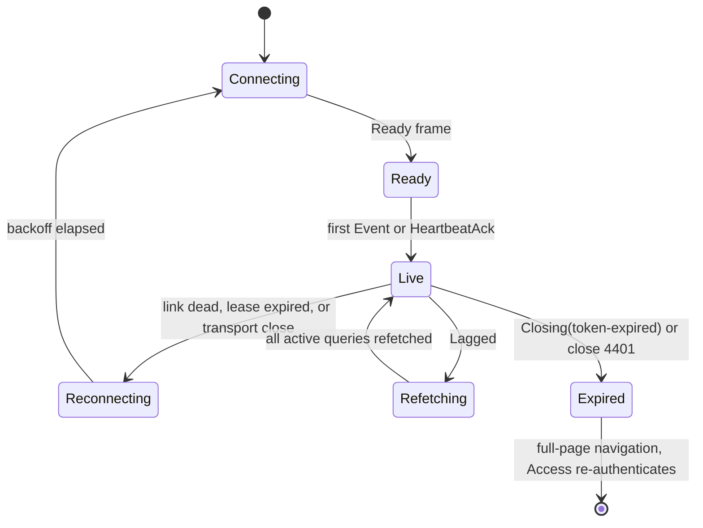

# App

The observatory exists so the operator can answer “is everything okay?” in seconds. Its evidence must never let dead data look live or dry-run money look real. It is a TanStack Start application deployed as the Worker `ironcage-app`.

Upstream currently labels [TanStack Start a Release Candidate](https://tanstack.com/start/latest/docs/framework/react/overview). The repository therefore pins an exact version, and the whole-release smoke test covers SSR, server functions, streaming, and the Worker entry point. A dependency upgrade is a deliberate platform change.

The app holds no state of its own. Its `CORE` service binding carries every product read and write. Its `AGENTS` binding carries research-conversation streaming only. Everything the app shows arrives from core's `AppApi`, the live feed, or a conversation stream.

This chapter owns the route tree, data paths, feed wire protocol, research chat, shell, and authentication. [Data](./03-data.md) defines the feed record and taxonomy. [Contracts](./04-contracts.md) defines the API catalog and error taxonomy. [Operations](./12-operations.md) defines deployment.

## What this chapter guarantees

- A cold load of Overview paints system vitals and the attention count within 2 seconds at the 95th percentile, with no interaction.
- No value renders as current without freshness evidence. Every datum crosses the wire with an as-of time and a staleness edge, and a value the app cannot refresh renders as stale or unknown.
- Dry-run and live data cannot be conflated. They carry distinct types end to end, so mixing them fails to compile rather than failing review.
- Every request is verified inside the Worker: Access JWT on everything, plus an Origin check on every mutation and on the WebSocket upgrade. No route to the app exists that this verification does not cover.
- A feed reconnect never silently loses events. The server replays the gap from the record, or declares the gap too large and forces a full refetch.
- The halt-all control works when everything else is broken. It depends on nothing but the core binding.
- The conversation path cannot mutate the product. The agents binding carries conversations only, and agents hold no mutation path into core.

## 1. The route tree

Routes map one-to-one onto the product's surfaces. The tree is the whole app; there is no surface reachable outside it.

```
routes/
  __root.tsx                          shell: mode, halt-all, criticals, override banner, connection
  index.tsx                           Overview — vitals, attention items, equity, sleeve summaries
  sleeves/
    index.tsx                         the roster
    $sleeveId/
      route.tsx                       living view layout: mode tag, state, next action
      index.tsx                       Now — read, multipliers, distance to each cage limit
      capabilities.tsx                outputs, staleness, scorecards, suspensions
      positions.tsx                   open positions and orders
      performance.tsx                 equity, returns, drawdown, benchmarks, no-AI baseline
      decisions.tsx                   sleeve-filtered feed slice
      mandate.tsx                     current mandate and version history with diffs
      trial.tsx                       trial report, when one is pending
  activity/
    index.tsx                         the feed: filter by origin, category, severity, time, text
    trade.$correlationId.tsx          the trade story
    decision.$decisionId.tsx          the decision record
  portfolio/
    index.tsx                         net worth, whole-of-wealth toggle, the current book
    capital.tsx                       the capital ledger and allocation acts
    transfers.tsx                     transfer requests and pending arrivals
    costs.tsx                         venue fees, AI spend, infrastructure spend
    cage.tsx                          system cage: exposure, drawdown, venue concentration
  money/
    index.tsx                         monthly spending and trends
    import.tsx                        file import and its balance-chain result
    review.tsx                        categorization review queue
    recurring.tsx                     recurring charges and anomalies
  reports/
    index.tsx                         the library
    $reportId.tsx                     one rendered report
  workbench/
    index.tsx                         trial count, recent runs
    data.tsx                          candle coverage and gaps
    backtests.$runId.tsx              one run's manifest, results, artifacts
    proposals.$proposalId.tsx         one proposal and its gate verdicts
    research.tsx                      the research-agent conversation
  tax/
    index.tsx                         running estimate, source coverage
    sources.$sourceId.tsx             one source's sync history and gaps
    review.tsx                        unrecognized and low-confidence events
    report.$financialYear.tsx         the FY report
  decide.$ceremonyKind.$subjectId.tsx the decision ceremony, over any route
  api/
    feed.ws.ts                        WebSocket upgrade, proxied to the feed actor in core
    conversation.$.ts                 streaming conversation route, forwarded over the agents binding
```

Three rules bind the tree. Every attention item on Overview must link to the route that decides it. The mode tag must render in the `$sleeveId` layout, never only in a leaf. The ceremony route must be reachable from any surface without losing the caller's position.

## 2. Reads and writes

Every read and every write of product data goes through a server function. The browser holds no credential except its own Access session cookie.

A server function calls `AppApi` through the generated client in `packages/contracts`, over the `CORE` service binding. The call never leaves Cloudflare's network. Failures decode into typed errors that the route renders, not into thrown strings.

Every value that a human reads as a number crosses the wire wrapped. The wrapper is what makes the freshness guarantee structural rather than a habit.

```ts
// packages/contracts/src/observed.ts
export type Observed<A> =
  | {
      readonly _tag: "Fresh";
      readonly value: A;
      readonly asOf: Instant;
      readonly staleAfter: Instant;
    }
  | { readonly _tag: "Stale"; readonly value: A; readonly asOf: Instant }
  | { readonly _tag: "Unknown"; readonly since: Instant; readonly reason: string };
```

- `packages/ui` **must not** export a function of type `Observed<A> => A`. Rendering a value requires handling all three cases.
- `staleAfter` is set by core from the datum's own refresh budget. The default budget is **60 seconds** (proposed); a candle-derived value uses its timeframe instead.
- The client re-evaluates freshness against the browser clock every **5 seconds** (proposed), so a value goes stale on screen without a request.

TanStack Query owns caching. Query keys are prefix-hierarchical, so a feed event can invalidate a whole family by prefix.

```ts
// apps/app/src/data/keys.ts
export type Scope =
  { readonly _tag: "System" } | { readonly _tag: "Sleeve"; readonly id: SleeveId };

export const keys = {
  vitals: () => ["vitals"] as const,
  attention: () => ["attention"] as const,
  sleeves: () => ["sleeves"] as const,
  sleeve: (id: SleeveId) => ["sleeve", id] as const,
  blotter: (scope: Scope) => ["blotter", scope] as const,
  positions: (scope: Scope) => ["positions", scope] as const,
  equity: (scope: Scope, window: Window) => ["equity", scope, window] as const,
  feed: (filter: FeedFilter) => ["feed", filter] as const,
  capability: (id: CapabilityId, sleeve: SleeveId) => ["capability", id, sleeve] as const,
  capital: () => ["capital"] as const,
  money: (section: MoneySection) => ["money", section] as const,
  tax: (fy: FinancialYear) => ["tax", fy] as const,
} as const;
```

Four rules on this catalog:

- Default `staleTime` is **30 seconds** (proposed). `vitals` and `attention` use **10 seconds** (proposed), because they carry the five-second answer.
- Safety-critical aggregates — vitals, attention, equity, and the sleeve summaries — also poll every **60 seconds** while the tab is visible (proposed). This polling is a safety net under the feed, so a wedged socket cannot silently freeze the numbers the operator trusts. Nothing polls while the tab is hidden.
- The root loader and Overview's loader run during SSR and dehydrate into the client cache. First paint must not wait on a client round trip.
- Mutations **must not** optimistically write a financial value. A mutation invalidates and waits for the record.

## 3. The live feed

The browser opens one same-origin WebSocket to `/api/feed.ws`. The app Worker validates the Access session and the request's Origin on the upgrade, then proxies the upgrade to the feed actor in core.

This section is the single home of the frame protocol. Other chapters reference it; they must not restate it. The feed record the protocol carries is defined in [Data](./03-data.md).

```ts
// packages/contracts/src/feed-socket.ts
export type ClientFrame =
  | { readonly _tag: "Subscribe"; readonly since: FeedEventId | null; readonly filter: FeedFilter }
  | { readonly _tag: "Ack"; readonly through: FeedEventId }
  | { readonly _tag: "Heartbeat" };

export type ServerFrame =
  | {
      readonly _tag: "Ready";
      readonly cursor: FeedEventId;
      readonly replayed: number;
      readonly serverTime: Instant;
    }
  | { readonly _tag: "Event"; readonly event: FeedEvent } // UUIDv7 id, strictly increasing
  | { readonly _tag: "HeartbeatAck" }
  | { readonly _tag: "Lagged"; readonly from: FeedEventId } // replay exceeded the cap
  | {
      readonly _tag: "Closing";
      readonly reason: "token-expired" | "lease-expired" | "shutdown";
      readonly at: Instant;
    };
```

Resume semantics, stated once:

- On first connect the client sends `Subscribe` with `since: null`. The server answers `Ready` with the current cursor and replays nothing.
- On reconnect the client sends the ID of the last event it applied. The server replays every later event from Postgres in ID order, then answers `Ready` with the count in `replayed`.
- Replay is capped at **500 events** (proposed). Beyond the cap the server sends `Lagged`, and the client **must** refetch every active query instead of applying frames.
- Event IDs are UUIDv7, which is time-ordered, so ordering and de-duplication need no separate sequence number. An event ID the client already holds is dropped.

Durable Object handlers can [interleave whenever a handler awaits](https://developers.cloudflare.com/durable-objects/best-practices/rules-of-durable-objects/), so the inbox alone does not order a Postgres replay against a live push. The feed actor implements the ordering explicitly for each socket:

1. Before its first await, mark the socket as replaying and start an in-memory live-event buffer.
2. Read a Postgres high-water event ID, then read and cap the rows in `(since, high_water]`.
3. Without another await, merge those rows with the buffered live events, sort and de-duplicate by event ID, send the result, transition the socket to live, and send `Ready`.
4. A live push checks the per-socket state: it appends while replaying and sends immediately while live.

If the object restarts with a socket attachment still marked replaying, it closes that socket and lets the ordinary cursor reconnect recover it; it never guesses that the lost in-memory buffer was complete. This creates one ordered stream without holding `blockConcurrencyWhile` across a database query.

The actor uses the [WebSocket Hibernation API](https://developers.cloudflare.com/durable-objects/best-practices/websockets/). Each accepted socket serializes its filter, last acknowledged cursor, replay state, token expiry, and socket-lease expiry in its attachment. The browser sends the fixed `Heartbeat` frame every 30 seconds and the actor configures the fixed `HeartbeatAck` WebSocket auto-response pair, so a healthy idle socket does not wake the object. There is no server timer. The actor's single alarm is scheduled for the earliest token or lease expiry; it closes expired sockets, then schedules the next expiry.

Liveness numbers, all proposed:

| Parameter                     | Value                       |
| ----------------------------- | --------------------------- |
| Client `Heartbeat` interval   | 30 s                        |
| Client declares the link dead | 45 s without `HeartbeatAck` |
| Maximum socket lease          | 15 min                      |
| Reconnect backoff             | 1 s → 30 s cap              |
| Backoff jitter                | ±20%                        |

The connection lifecycle below is also stated in prose. A connection becomes live after `Ready`. A dead link (45 seconds without a heartbeat acknowledgement, or a transport close) triggers reconnect with backoff, and the reconnect resumes from the last applied event ID. Normal expiry of the 15-minute socket lease also reconnects and revalidates the current Access session. A `Lagged` frame moves the client into a refetch of every active query, after which it is live again. A `Closing(token-expired)` frame or close code 4401 ends the session; recovery is a full-page navigation, which lets Access re-authenticate.



The feed is also the cache-invalidation signal. Each event category invalidates a fixed set of key prefixes, and nothing else.

| Feed event category    | Query keys invalidated                                                    |
| ---------------------- | ------------------------------------------------------------------------- |
| Trading                | `blotter(sleeve)`, `positions(sleeve)`, `equity(sleeve, *)`, `sleeve(id)` |
| Capabilities & signals | `capability(id, sleeve)`, `sleeve(id)`                                    |
| Risk                   | `sleeve(id)`, `vitals`, `attention`, `capital`                            |
| Lifecycle              | `sleeves`, `sleeve(id)`, `attention`                                      |
| Capital                | `capital`, `sleeves`, `equity(System, *)`, `attention`                    |
| System                 | `vitals`, `attention`                                                     |
| Money                  | `money(*)`, `tax(*)`                                                      |

Three rules override the table. Every event of severity `critical` additionally invalidates `attention`. Every event is prepended to `feed(*)` rather than invalidating it, so the visible list never blanks. A `System` event of type `deploy completed` invalidates nothing and renders a banner offering reload.

## 4. Conversations

The Workbench's research chat streams from the agents Worker, not from core. Core holds financial authority, and an open-ended AI stream does not belong on its request path; a conversation outage must not share fate with product reads. The app therefore holds a second service binding, `AGENTS`, that carries conversations and nothing else.

`/api/conversation/*` validates the Access session and the request's Origin, then forwards over `AGENTS`. Response bodies stream unbuffered through the single hop. Agents hold no mutation path into the product: their only inputs to core are the read-only agent API and the queue, and their model spend is capped at the AI Gateway. [AI](./07-ai.md) defines both.

Flue's own client handles the conversation protocol: `@flue/sdk` for transport and `@flue/react` for state. The Vercel AI SDK is **not** used anywhere in this application.

Component sourcing is fixed. **shadcn/ui** supplies base components in `packages/ui`. **Vercel AI Elements** supplies chat chrome, copied into the repository rather than depended upon, so upstream changes arrive as deliberate diffs.

Conversations are a debugging-grade record. Anything that matters must graduate to a proposal or a decision record before it can affect the system; a chat message cannot call a mutation.

## 5. The shell

The shell is one layout component in `__root.tsx`, fed by one subscription. It renders system mode, the halt-all control, the unacknowledged-critical count, the override banner, the connection indicator, and the mode discipline.

Two implementation rules make the shell's guarantees real.

**Halt-all depends only on the binding.** The control is a server function calling core's always-available risk-reducing surface, behind one confirm. It **must not** read TanStack Query, the feed socket, or any route loader. It stays clickable when mode is unknown, because it must work when everything else is broken.

**Mode discipline is a type.** Every payload carrying sleeve data carries its mode, and the client's domain types preserve it.

```ts
// packages/domain/src/mode.ts
export type Moded<A> =
  { readonly _tag: "DryRun"; readonly value: A } | { readonly _tag: "Live"; readonly value: A };
```

- Components that render sleeve data accept `Moded<A>`, never `A`.
- `packages/ui` **must not** export a function of type `Moded<A> => A`, and **must not** export a component that accepts a bare mode string prop.
- Aggregations across modes are one function, which returns a pair, never a sum.

## 6. Auth

Cloudflare Access sits in front of everything. The Worker verifies every request regardless of what the edge did.

- **One Access application covers the whole subdomain.** Path-scoped applications are not used, so no sibling route can sit unprotected beside the pages. The Worker sets `workers_dev: false` and `preview_urls: false`, so no route to the app exists that Access does not front.
- **Login** is the Cloudflare identity provider, matching account members by email. Independent MFA requires a passkey or security key. One-time PIN remains the lockout fallback. Global and application sessions are set to **one month**.
- **The Worker verifies, always.** One early middleware validates the JWT against the team JWKS with the application's audience tag, then stashes the identity on request context. It reads the `cf-access-jwt-assertion` header, falling back to the `CF_Authorization` cookie. Edge enforcement without Worker-side verification is treated as no auth at all.
- **Origin is checked in the Worker.** The Access cookie travels automatically with any request the browser sends, including one a hostile page triggers cross-site. The middleware therefore verifies the `Origin` header on every state-changing request and on the WebSocket upgrade; a missing or foreign Origin is rejected with 403 before any handler runs. The upgrade is included because a cross-site page could otherwise open a socket and read the feed. Read-only GETs are exempt.
- **WebSocket upgrades carry the cookie** because they are same-origin, and are validated like any other request, including the Origin check. Each socket gets a 15-minute lease and must reconnect through that validation path; the actor also closes it no later than the JWT's `exp` with close code **4401**. Access does not revoke an already-upgraded origin socket immediately, so the lease is the accepted maximum revocation window. A handshake failure is probed once over HTTP and **must not** be retry-looped.
- **Expired sessions surface as 401.** Every fetch and server-function call sends `X-Requested-With: XMLHttpRequest`, which turns Access's redirect into a clean 401. The client answers with a full-page navigation, letting Access re-authenticate silently while the global session is valid.
- **Non-browser paths bypass HTTP entirely.** Service bindings and Durable Object stubs never traverse the edge, so Access is structurally irrelevant to Worker-to-Worker calls. Any future CLI client uses an Access service token. The middleware validates the expected application `aud`, then authorizes the caller against an exact [`common_name`/Client-ID](https://developers.cloudflare.com/cloudflare-one/access-controls/applications/http-apps/authorization-cookie/application-token/) allowlist, which ships empty. Authorization comes from being listed, never from inference about which claims a token lacks.

There is exactly one operator and no other role. Login attempts are in Access's audit log.

## Values set in this chapter

Every number above, its owner, and its status. "Proposed" means: pick differently and only configuration changes.

| Value                              | Default                      | Owner                  | Status   |
| ---------------------------------- | ---------------------------- | ---------------------- | -------- |
| Overview first paint budget        | 2 s at p95                   | app performance budget | proposed |
| Default datum refresh budget       | 60 s                         | core `AppApi`          | proposed |
| Client freshness re-evaluation     | every 5 s                    | app                    | proposed |
| Default query `staleTime`          | 30 s                         | app                    | proposed |
| `vitals` / `attention` `staleTime` | 10 s                         | app                    | proposed |
| Visible-tab poll interval          | 60 s                         | app                    | proposed |
| Client heartbeat interval          | 30 s                         | app                    | proposed |
| Client dead-link threshold         | 45 s                         | app                    | proposed |
| Maximum socket lease               | 15 min                       | app/feed actor         | proposed |
| Reconnect backoff                  | 1 s → 30 s, ±20% jitter      | app                    | proposed |
| Replay cap on resume               | 500 events                   | feed actor             | proposed |
| Expired-token close code           | 4401                         | feed actor             | decided  |
| Access session length              | 1 month                      | Access application     | proposed |
| Service-token Client-ID allowlist  | empty (no tokens authorized) | operator               | decided  |
| Chat chrome source                 | AI Elements, copied in       | app                    | decided  |

## Alternatives considered

- **A plain client-rendered SPA.** Rejected: the two-second budget is far easier to hold when the shell and Overview's vitals are server-rendered, and server functions keep every credential off the browser.
- **Proxying conversations through core.** Rejected: it would put an open-ended streaming AI workload on the Worker that holds financial authority, without adding any authorization core could usefully enforce, and a conversation failure would share fate with product reads. The direct agents binding costs one more binding and removes a hop.
- **Exposing agents directly to the browser.** Rejected: it would bypass the app's Access validation and place agents outside the private-binding boundary.
- **A signed WebSocket ticket issued before the upgrade.** Rejected: same-origin upgrades carry the Access cookie, so the upgrade is validated exactly like every other request, Origin check included. A second credential would add a second thing to expire.
- **Polling instead of a socket.** Rejected: the product requires new fills and vital transitions to appear within seconds, and polling that fast on every surface costs more than one hibernating socket. The client-initiated heartbeat uses an auto-response and does not keep the actor awake. The visible-tab poll survives only as a slow safety net under the socket.
- **The Vercel AI SDK for chat.** Rejected: Flue owns the conversation protocol, and a second client would need its own mapping of Flue's state to keep in sync.

## Open questions

1. **Replay cap value.** Is 500 events the right cap? Safe fallback: keep 500; exceeding it produces `Lagged` and a full refetch, which is always correct, only more expensive. Must close before: live mode. Evidence: the measured event volume of a one-hour disconnect on a busy dry-run day.
2. **Feed list virtualization.** At what length does the Activity view need windowing? Safe fallback: paginate the Activity view at a fixed page size. Must close before: the end of the engine's dry-run phase, when the feed first carries months of history. Evidence: scroll and memory measurements against a feed of realistic depth.
3. **Offline behavior.** Should a service worker serve a last-known snapshot, or is degrading to stale-everything enough? Safe fallback: the current behavior — every value renders stale or unknown, with no false liveness. Must close before: live mode. Evidence: dry-run field experience showing whether a last-known snapshot would ever have changed an operator action.

## Build checklist

- [ ] `Observed<A>` and `Moded<A>` in `packages/contracts` and `packages/domain`, with the two no-unwrap lint rules
- [ ] Route tree above, with the ceremony route mountable over any surface
- [ ] Server-function layer over the generated `AppApi` client, with typed error rendering
- [ ] Query-key catalog and the invalidation table as one tested mapping function
- [ ] Visible-tab safety-net polling on the safety-critical aggregates; a test proving nothing polls while hidden
- [ ] `/api/feed.ws` upgrade route: Access validation, Origin check, proxy to the feed actor, close-code handling
- [ ] Frame protocol schemas, replay-from-cursor, `Lagged` path that refetches every active query
- [ ] Feed-actor tests proving high-water replay plus a concurrent live push is sorted and gap-free, and a restart while replaying forces cursor recovery
- [ ] SSR dehydration of the root and Overview loaders; first-paint budget asserted in CI
- [ ] Shell with halt-all wired to nothing but the binding
- [ ] Hibernation attachments, WebSocket auto-response heartbeat, earliest-expiry alarm, and 15-minute socket-lease reconnect
- [ ] Access middleware: JWKS verification, application audience check, Origin check on mutations and the upgrade, service-token `common_name` allowlist, `X-Requested-With` 401 path
- [ ] Conversation route forwarding over the agents binding, streaming unbuffered end to end, verified with a slow response
