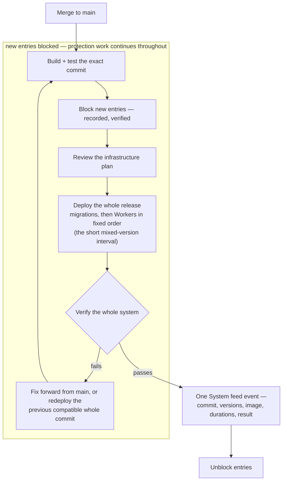

This chapter covers how Ironcage is developed, deployed, tested, watched, and recovered: the two environments, the monorepo, secrets, the deploy runbook, migrations, the test suites, vitals, backups, and the platform-assumption register. There is one operator, so every procedure here is designed to be routine, recorded, and reversible. The chapter stops at the machinery of running the system; what the system does when it runs is the business of chapters 01 through 11.

## What this chapter guarantees

- A deploy is an ordinary restart. Shipping while positions are open requires no special care, because a deploy restarts Durable Objects, and that is the crash the engine already survives.
- The whole repository is one release unit. A push to `main` builds, tests, migrates, deploys every Worker, verifies the system, and only then removes the temporary block on new entries. There are no percentage rollouts or operator-selected per-Worker releases.
- No flag can start, resume, or loosen anything. Flagship holds kill switches only; mode and lifecycle live in Postgres behind the ceremony.
- A restore is proven, not assumed. A scheduled restore test converts the backup from a guess into a fact, and a restore never replays obligations recorded before the restore point.
- A dead core is detected from outside core. An external dead-man monitor watches a signed health route, because vitals, the feed, and the halt-email outbox all live inside core.
- Local development can never hold a trade-capable venue key. Core asserts this at boot and refuses to start.
- Every production deploy is one feed event carrying the commit, release ID, Worker version IDs, container image identity, and verification result, so "what changed before this incident?" is a query.
- Every externally sourced platform fact in this specification carries its source and a review date, in the register at the end of this chapter.

## 1. Two environments

There are exactly two: local development and production. There is no staging tier, and adding one would be a mistake for two reasons.

**Dry run is the staging environment for strategies.** A strategy proves itself against live market data with simulated fills, which is stronger evidence than a second environment produces.

**The main-branch release pipeline is the code path to production.** It builds and tests the whole repository, then deploys the whole system as one release. Cloudflare applies the individual Worker updates sequentially rather than as one distributed transaction, so service-binding contracts evolve additively and new entries stay blocked across that short mixed-version interval. There is no staged percentage rollout, manual per-service promotion, or parallel environment.

Local never holds live venue keys. Core asserts that `ENVIRONMENT=local` accepts only the named Alpaca paper credential and refuses every Kraken or production Alpaca secret. Kraken's `validate: true` flag belongs to the order-capable Add Order endpoint and has no separately documented read-only permission, so local order-shape work uses recorded fixtures. An optional remote harness may run validate-only requests while keeping its order-capable key outside local code.

| Worker             | Binding or secret                                | Local                                     | Production                                                         |
| ------------------ | ------------------------------------------------ | ----------------------------------------- | ------------------------------------------------------------------ |
| `ironcage-app`     | `CORE` service binding                           | local dev registry                        | `ironcage-core`                                                    |
| `ironcage-app`     | `AGENTS` service binding                         | local dev registry, conversations only    | `ironcage-agents`, conversations only                              |
| `ironcage-app`     | `ACCESS_AUD` (config)                            | unset; Access not in front                | the Access application's tag                                       |
| `ironcage-core`    | `DB` (Hyperdrive, uncached)                      | `localConnectionString` → dev Postgres    | production branch, uncached                                        |
| `ironcage-core`    | `DB_CACHED` (Hyperdrive)                         | `localConnectionString` → dev Postgres    | production branch, cached                                          |
| `ironcage-core`    | R2 buckets (blobs, backups, proposal quarantine) | remote bindings → dev buckets             | production buckets                                                 |
| `ironcage-core`    | `KRAKEN_KEY` / `_SECRET`                         | unset; fixtures + remote validate harness | live key, withdrawal permissions absent, asserted at boot          |
| `ironcage-core`    | `KRAKEN_EXPORT_KEY` / `_SECRET`                  | unset                                     | read-only key for tax exports, own nonce sequence                  |
| `ironcage-core`    | `ALPACA_KEY` / `_SECRET`                         | paper-account keys                        | live keys; wallet/transfer posture proven by launch gate           |
| `ironcage-core`    | `MONEY_IDENTITY_KEY`                             | random local-only key                     | HMAC key for bank account identities                               |
| `ironcage-core`    | `AGENTS` service binding                         | local dev registry                        | `ironcage-agents`                                                  |
| `ironcage-core`    | `COMPUTE` DO (`script_name`)                     | external local compute Worker             | `ironcage-compute`                                                 |
| `ironcage-core`    | `DECISION_RECORDS` consumer                      | local queue                               | production queue                                                   |
| `ironcage-core`    | `EMAIL_KEY`                                      | unset; the one interruption logs only     | unavailable until the sending-provider launch gate closes          |
| `ironcage-agents`  | `CORE` service binding                           | local dev registry, read-only surface     | `ironcage-core`, read-only surface                                 |
| `ironcage-agents`  | `AI` / `AI_GATEWAY_ID`                           | dev gateway, $50/week sliding cap         | production gateway, $50/week sliding cap                           |
| `ironcage-agents`  | `DECISION_RECORDS` producer                      | local queue                               | production queue                                                   |
| `ironcage-compute` | backtest container + narrow R2 bindings          | local Docker + dev buckets                | immediate image rollout + production artifact buckets              |
| `ironcage-compute` | `EXPECTED_IMAGE_DIGEST` (config)                 | local image digest                        | immutable digest configured on the deployed binding                |
| `ironcage-compute` | `DUMP_DSN` (trusted backup profile only)         | unset                                     | dedicated read-only Postgres role, never exposed to candidate code |
| all                | Flagship kill switches                           | separate remote dev Flagship app          | production Flagship app, own change log                            |

The venue key posture is specified in [Venues](/technical/venues). Kraken permissions are asserted from the API. Alpaca publishes no equivalent scoped-key or documented account-level crypto-disable guarantee, so its transfer surface remains a launch gate rather than a claim in this table.

## 2. The monorepo

Packages are module boundaries first and build units second.

<FileTree>

- apps/
  - app/ ironcage-app (TanStack Start observatory)
  - core/ ironcage-core (engine Worker: actors, workflows, queue consumer)
  - agents/ ironcage-agents (Flue application)
  - compute/ ironcage-compute (backtest container)
- infra/ Alchemy Effect stack — every remote resource, local binding, and migration
- packages/
  - domain/ Effect Schemas and the ubiquitous language; imported by everything, imports nothing
  - engine/ strategy → cage → simulated fills, pure and deterministic
  - tax/ parcels, CGT, Division 775, FITO; pure, imports domain only
  - contracts/ Effect RPC groups, wire Schemas, clients and server adapters
  - ui/ shared shadcn/ui-based components for the observatory

</FileTree>

Dependency direction is one-way: `apps → contracts → domain`, and `apps → engine → domain`. Nothing in `packages/` imports from `apps/`, and `domain` imports nothing of ours.

`engine` and `tax` must stay free of Cloudflare APIs, I/O, clocks, and randomness. That purity is what lets one implementation serve live trading, dry run, and backtests.

## 3. Local development

Run the monorepo's general development command:

```sh
pnpm dev
```

Alchemy evaluates the development stage, starts all four Workers, and resolves service entrypoints, external Durable Objects, Workflows, Queues, R2, Hyperdrive, Flagship, and AI Gateway from the same dependency graph production uses. Worker, R2, and Queue state stays under `.alchemy/`; the development AI Gateway and Flagship app are separate remote resources.

The deployed Hyperdrive integration lane uses the same development stage with a
`-dev` suffix on every remote Cloudflare resource. Development and production
share the PlanetScale database deliberately, but development reaches only its
`dev` branch through development runtime roles. No development deployment owns
a production Worker, Hyperdrive configuration, bucket, queue, gateway, or flag.

The database story has three lanes. Ordinary local development uses the Alchemy-managed Hyperdrive development origin to connect directly to the PlanetScale `dev` branch; that is convenient but explicitly bypasses deployed Hyperdrive pooling and caching. CI uses Postgres 18.4 in Testcontainers, with one container per database test file and a drop-schema → apply-SQL cycle before every test, so pipelines are hermetic, parallel-safe, and exercise a cold schema. A deployed dev Worker runs the same integration suite through real dev Hyperdrive configurations before any database-sensitive change can merge. All three lanes use the same SQL files and public contract tests.

The backtest container needs a local Docker daemon. Work that does not touch backtests may skip it.

## 4. Configuration and secrets

Secrets enter the Alchemy Effect configuration as redacted values and are emitted as Worker secrets in the same whole-stack deployment as their consumers. They must not appear in code, committed files, or the database. Production secret creation or rotation is a release operation: the root workflow blocks entries first, reconciles and verifies the entire stack, then unblocks. Direct one-Worker secret mutation in production is not an allowed path. Alchemy-generated identity and health keys are stable random resources held in encrypted remote state.

| Secret                          | Holder                           | Rotation             | Notes                                                                                  |
| ------------------------------- | -------------------------------- | -------------------- | -------------------------------------------------------------------------------------- |
| `KRAKEN_KEY` / `_SECRET`        | `ironcage-core`                  | quarterly (proposed) | withdrawal and withdrawal-address permissions absent, asserted at boot                 |
| `KRAKEN_EXPORT_KEY` / `_SECRET` | `ironcage-core`                  | quarterly (proposed) | read-only, used only by the tax-export workflow, own nonce sequence                    |
| `ALPACA_KEY` / `_SECRET`        | `ironcage-core`                  | quarterly (proposed) | broad trading credential; production transfer-surface gate must be current             |
| `EMAIL_KEY`                     | `ironcage-core`                  | on compromise only   | unavailable until a provider contract and duplicate-safe delivery fixture are selected |
| `DUMP_DSN`                      | trusted backup container profile | quarterly (proposed) | dedicated read-only Postgres role; never enters the untrusted backtest environment     |
| `HEALTH_SIGNING_KEY`            | `ironcage-core`                  | on compromise only   | signs the health route's response                                                      |
| `MONEY_IDENTITY_KEY`            | `ironcage-core`                  | on compromise only   | at least 32 bytes; rotation requires a deliberate bank-identity re-key job             |
| Postgres credentials (engine)   | Hyperdrive configs               | PlanetScale-managed  | held by the Hyperdrive configuration, not by Workers                                   |
| Access signing keys             | Cloudflare                       | Cloudflare-managed   | the Worker verifies against public JWKS                                                |

Three configuration rules bind everything else.

**Safety-relevant configuration is never a dashboard knob.** Mandates, system-cage limits, and every sleeve's mode and lifecycle live in Postgres behind ceremonies. Flagship holds only kill switches. Those switches are brake-only: they are checked in series before any action, an unreadable flag reads as "kill", and no flag can start, resume, or loosen anything. Turning a kill flag off does not resume trading; resumption always goes through the un-halt ceremony in Postgres. Everything else is code. No admin surface exists whose compromise loosens a limit.

**Model selection is the one warm configuration.** Provider, model, and inference parameters are versioned rows, read at dispatch and recorded on every decision record. Changing a model is a recorded act, so scorecards stay attributable.

**Dependency upgrades are acts.** Effect, Flue, and pinned platform packages move deliberately: read the changelog, upgrade, run every suite, then soak in dry run before the new version reaches a live sleeve.

## 5. Deployment

The repository has one deployment action: merge to `main`. The release workflow builds and deploys app, core, agents, compute, configuration, routes, and Cron triggers together. There are no percentage rollouts, staged releases, pinpoint production deploys, or manual per-Worker promotion choices.

New Durable Object classes use current declarative `exports`. Alchemy derives class migrations from the Durable Object bindings and publishes them through the direct Worker deployment path required by those exports ([Durable Object migrations](https://developers.cloudflare.com/durable-objects/reference/durable-objects-migrations/)).

The container image is published under an [immutable content-addressed tag](https://developers.cloudflare.com/containers/platform-details/image-management/). The release freezes compute dispatch and uses the [immediate rollout option](https://developers.cloudflare.com/containers/platform-details/rollouts/). It waits for the configured image to become ready, then checks that the binding configuration and injected `EXPECTED_IMAGE_DIGEST` agree. Dispatch resumes only after that check. The design assumes no platform-supplied runtime digest attestation.

Cloudflare does not offer a transaction spanning several Workers. The pipeline therefore has a short mixed-version interval while its fixed deploy sequence runs. Internal HTTP and queue contracts evolve additively, and a system-wide entry block prevents the interval from creating new exposure. Protection work — fills, stops, ambiguity resolution, and reconciliation — continues throughout ([The tick](/technical/the-tick)).

The shape of every release — the entry block is a span, not a step, and a failed verification leaves the system inside it:



The runbook, in order:

<Steps>
  <Step title="Build and test the exact commit">
    Typecheck, lint, every suite in section 6 except `venues/live`, the Alchemy stack, and image
    builds must pass. Only one production workflow may run at a time.
  </Step>
  <Step title="Block new entries">
    The workflow calls the recorded system-wide entry-block operation and verifies it. Exits, stops,
    fill ingestion, ambiguity resolution, and reconciliation continue.
  </Step>
  <Step title="Review the infrastructure plan">
    `pnpm plan` evaluates the whole Effect program and shows database migrations and resource
    changes together. Code remains compatible with both the old and expanded schema.
  </Step>
  <Step title="Deploy the whole release">
    One root `pnpm deploy` reconciles the Alchemy dependency graph. PlanetScale migrations run
    before their dependent Hyperdrive and Worker resources; the same command applies secrets,
    routes, domains, Cron triggers, bindings, DO exports, Queues, storage policy, and container
    updates. The operator never selects a subset.
  </Step>
  <Step title="Verify the whole system">
    One release check asserts the signed health route and commit/release IDs, an `AppApi` decode,
    vitals, feed reconnect/replay, current DO export set, Cron/route configuration, container image
    identity, agents' gateway-only provider URLs, and the app shell. It also runs the protection
    pass and confirms no obligation was lost during restarts.
  </Step>
  <Step title="Record and unblock">
    A single `System` feed event records the commit, release ID, version IDs, container identity,
    migration, entry-block duration, and verification result. Only a fully verified release lifts
    the block.
  </Step>
  <Step title="Failure posture">
    Any failure leaves new entries blocked. The default is fix-forward from `main`. When the
    previous commit remains schema/binding compatible, the same whole-system command redeploys that
    commit; the pipeline never rolls back only one Worker. External state — Postgres, R2, DO
    storage, queues, and venue facts — is never rolled back.
  </Step>
  <Step title="Contract later">
    A destructive migration ships in a later whole-system release no earlier than **7 days**
    (proposed) after every reader and writer stopped using the old representation and a backup was
    verified.
  </Step>
</Steps>

Two guards keep whole-system rollback compatible:

- **Every migration is tested upgrade → previous release → upgrade.** A migration that makes the previous whole release unable to run is roll-forward-only and is marked that way before deployment.
- **Bindings and persisted formats are release compatibility boundaries.** Removing or renaming a Durable Object export, binding, queue, R2 bucket, or persisted Flue format can make the previous release unsafe. The workflow records that fact and disables previous-commit redeploy for that release.

For the rare change that cannot be expressed additively, the sequence is expand, migrate, contract:

1. Add the new columns, tables, or indexes alongside the old.
2. Deploy code that writes both representations where necessary.
3. Backfill in bounded, resumable batches with a durable cursor.
4. Verify counts, checksums, and read equivalence between the representations.
5. Switch reads to the new representation.
6. Stop the old writes.
7. Remove the obsolete structures in a later release, after the 7-day window and a verified backup.

**Deploying with positions open is safe only because protection is restart-safe and entries are blocked.** Durable Objects and sockets can restart during the release. Durable in-flight markers, conservative ambiguity resolution, at-least-once alarms, reconnect/replay, and startup reconciliation cover that restart. The release check must prove those mechanisms before the entry block lifts.

## 6. Testing

Named suites, each asserting one property. The suite name is the directory it lives in.

| Suite                   | Package              | Asserts                                                                                                                                                                                                                                                                                              | Runs                  |
| ----------------------- | -------------------- | ---------------------------------------------------------------------------------------------------------------------------------------------------------------------------------------------------------------------------------------------------------------------------------------------------- | --------------------- |
| `engine/cage.property`  | `packages/engine`    | `effective ≤ desired` under arbitrary capability outputs; entry checks reject on unknowns; thresholds trip at exactly `>` and `<`                                                                                                                                                                    | every push            |
| `engine/fills.property` | `packages/engine`    | simulated fills never exceed the requested quantity; fees are non-negative; no fill exists without an order                                                                                                                                                                                          | every push            |
| `engine/determinism`    | `packages/engine`    | the same backtest manifest run twice produces a byte-identical result hash                                                                                                                                                                                                                           | every push            |
| `tax/parcels.property`  | `packages/tax`       | parcel selection never consumes more than remains; disposals reconcile to acquisitions                                                                                                                                                                                                               | every push            |
| `tax/golden`            | `packages/tax`       | hand-verified scenarios, and one comparison against the prior service's oracle export                                                                                                                                                                                                                | every push            |
| `money/dedupe.property` | `apps/core`          | canonical transactions are invariant under repeated bundles, arbitrary overlapping windows, paired observations, and repeated equal rows; ambiguity never silently changes the count                                                                                                                 | every push            |
| `money/reconcile`       | `apps/core`          | paired CSV/OFX rows match one-to-one; changed or missing balanced rows fail; exports with 600 or more rows create no coverage; statement totals and opening-to-closing chains agree                                                                                                                  | every push            |
| `contracts/roundtrip`   | `packages/contracts` | every Schema satisfies `decode ∘ encode = identity`; the agents' wire schemas accept exactly what the authoritative schemas accept                                                                                                                                                                   | every push            |
| `core/actors`           | `apps/core`          | under workerd: duplicate alarms are idempotent; a tick arriving mid-flight no-ops; an overdue reservation with an intent row flags `reconciliation_required` and only an orphan reservation auto-releases; the `pending_effects` drainer retries across restart; duplicate queue run IDs are dropped | every push            |
| `core/recovery`         | `apps/core`          | against the CI Postgres container: the recovery scan resolves a marker-without-row and a row-without-outcome after a simulated crash between marker and commit                                                                                                                                       | every push            |
| `core/persistence`      | `apps/core`          | against disposable Postgres 18.4: repository migrations build a cold schema; real driver transactions roll back; concurrent idempotent mutations serialize to one stored result                                                                                                                      | every push            |
| `venues/fixtures`       | `apps/core`          | decoded real responses: partial fills, corrections/busts, exact Kraken Ledger fees, pending transfers, timeout-then-found, native-pair detection, and synthetic-pair rejection                                                                                                                       | every push            |
| `venues/live`           | `apps/core`          | Alpaca paper end to end plus launch-only low-notional live canaries; Kraken shape checks through the remote validate harness and launch fixtures (the order-capable key never enters local code)                                                                                                     | nightly / launch gate |
| `app/budget`            | `apps/app`           | Overview paints vitals and the attention count inside the chapter's budget                                                                                                                                                                                                                           | every push            |

**The standing soak is dry run itself.** A change that passes CI reaches a live sleeve only after the affected paths have run in production dry run for **7 days or 50 ticks, whichever is longer** (proposed). Both numbers matter: a slow sleeve needs the tick count, and a fast sleeve needs the calendar time.

## 7. Observability

Vitals are computed from Postgres rows, so a dead engine shows as a dead engine rather than a stale green light. A cron recomputes them every **60 seconds** (proposed) and writes a row, so every vital carries an as-of time and derives from the record. A vitals row older than **180 seconds** (proposed) renders the whole panel as unknown, not as its last healthy reading.

All thresholds below are proposed.

| Vital              | Computation                                                       | Degraded                                       | Failing                                             |
| ------------------ | ----------------------------------------------------------------- | ---------------------------------------------- | --------------------------------------------------- |
| Engine             | per active sleeve, `now − due(next tick)` over its cadence        | overdue by > 25% of the interval               | overdue by > 100% of the interval                   |
| Market data        | per venue, age of the newest closed candle over its timeframe     | > 25% past the next close                      | > 100% past, or any sleeve stood down for a gap     |
| Venue connectivity | per venue actor, time since the last successful private call      | > 5 min, or 1 failure in 3 attempts            | 3 consecutive failures, or > 15 min                 |
| AI runs            | per capability, status and age of the last scheduled run          | one failed run, or overdue by > 25% of cadence | 2 consecutive failed runs, or overdue by > 100%     |
| Decision queue     | `decision-records` depth and oldest message age                   | > 50 messages or oldest > 5 min                | > 500 messages or oldest > 30 min                   |
| Outbox lag         | age of the oldest undelivered `pending_effects` row               | > 60 s                                         | > 300 s                                             |
| Reconciliation     | per live sleeve, age of the last successful reconcile             | > 1.5 × its schedule                           | any open mismatch                                   |
| Database           | p95 `AppApi` query latency over the trailing 5 min                | > 250 ms                                       | > 1000 ms, or a connection error in the last minute |
| Backups            | age of the last successful dump; time since the last restore test | dump older than 26 h                           | dump older than 50 h, or last restore test failed   |

**The cron watchdog re-arms dead alarms.** Every tick-owning actor maintains a `next_due_at` row in Postgres. Every **5 minutes** (proposed) a cron compares those rows to the clock. When an actor is past due with no armed alarm, the watchdog re-arms it and writes a feed event recording that it did so. This matters because Durable Object alarm handlers receive at most six automatic retries; a persistently failing handler can end with no alarm armed at all, and only an outside observer can notice.

**Queue depth comes from the producer side.** Core's consumer binding does not own backlog metrics. The agents Worker reads the producer binding's best-effort `metrics()` result and exposes only depth, oldest age, and as-of time over the existing private core→agents binding. Core persists that observation for the vital. An unknown or stale metrics response renders the queue vital unknown; it is never treated as zero.

**An external dead-man monitor covers "core itself is down."** Vitals, the feed, and the halt-email outbox all live inside core, so none can report core's own death. The monitor is a named launch dependency. Its contract record must identify the polling API, independent alert channel, retention, and outage behavior.

Once selected, it polls the signed health route every **5 minutes** (proposed). The route returns the release ID, current time, and an HMAC signature under `HEALTH_SIGNING_KEY`. A cached or spoofed 200 therefore does not count as alive. Two consecutive failures (proposed) alert through a channel that shares nothing with the email path. Live capital remains unavailable until the provider is selected and that drill passes.

**Telemetry is stamped with our IDs.** Tick timings, venue latencies, and Workflow progress go to Workers observability with the intent, tick, and run IDs (UUIDv7) on their spans. Deep AI observability lives in AI Gateway. Both are debugging layers; neither is the record, and nothing reads them to make a decision.

**Costs distinguish usable telemetry from unavailable billing data.** AI Gateway's estimated spend is aggregated per capability daily at **01:00 UTC** (proposed), with provider billing remaining the exact authority. Cloudflare's account-usage endpoint is restricted Alpha and currently omits cost fields, so infrastructure cost is read from the billing dashboard and is not an automated product series. Usage metrics may be stored as usage but never relabeled as cost. Venue fees come from authoritative ledger/activity rows continuously.

**Alerting is the product's own attention system.** Degraded vitals surface on Overview. Critical events persist until acknowledged. A system halt sends the one contentless email through the outbox. No separate pager stack exists; the one thing the attention system cannot report, its own death, is the dead-man monitor's job.

## 8. Backups and recovery

Two independent copies of the record, with different failure modes.

**PlanetScale backups and point-in-time recovery are the first line.** Recovery is limited to the purchased retention window, and PlanetScale does not offer a target in the most recent five minutes. The selected plan, retention, cost, oldest recoverable point, and five-minute edge are recorded and tested; "restore to any chosen minute" is not the contract.

**A nightly logical dump is the second.** A scheduled workflow triggers the dump at **03:00 UTC** (proposed). A trusted backup container profile — not the untrusted backtest environment — runs `pg_dump` with `DUMP_DSN`, a dedicated read-only role. The engine credentials remain in Hyperdrive. The dump lands in R2 under `dumps/{yyyy-mm-dd}/`; the independent copy's RPO is **24 hours** (proposed). PITR improves that RPO only inside its configured window and not in its recent five-minute edge.

**R2 is ordinary object storage.** Content-addressed keys and application behavior avoid overwriting referenced objects, but an operator or administrator can still delete an artifact or dump. That is an accepted tradeoff for this personal system. Missing objects surface explicitly, Postgres remains the permanent financial truth, and PlanetScale backups remain the first recovery line.

**A restore test runs quarterly** (proposed). It creates an empty PlanetScale dev branch, applies the repository migrations, runs `pg_restore` from the most recent dump, and then works through a verification checklist. A normal UI-created branch is not assumed to clone production. A backup-created branch is a separate deliberate recovery path and must account for extensions not being restored.

- row counts per table match the source, and a checksum over the blotter tables matches;
- the ledger identity holds: system equity equals unallocated cash plus the sum of sleeve equities plus in-transit amounts ([Domain](/technical/domain));
- positions recomputed from fills match the positions view;
- a tax recompute over the restored record matches the last accepted run.

The result is a feed event either way, so a silently broken backup becomes a visible failure.

**Restoring for real follows one order**, because a restored Postgres is older than every Durable Object's projection of it, and possibly older than what a venue has already accepted:

<Steps>
  <Step title="Halt everything">
    The shell control, or the Flagship kill flag if core itself is the problem.
  </Step>
  <Step title="Restore Postgres">To the chosen point in time.</Step>
  <Step title="Rebuild every actor projection">
    `rebuild()` on sleeves, venues, and the system cage, so no projection is ahead of the record.
  </Step>
  <Step title="Reconcile every venue">
    The venue's state may include real activity from after the restore point. Anything the restored
    record does not explain surfaces as claim items for the operator ([Venues](/technical/venues)).
  </Step>
  <Step title="Quarantine pre-restore obligations">
    Every pending intent and every undelivered `pending_effects` row from before the restore point
    is marked quarantined, never re-driven. A venue may have accepted the order the restored
    database has forgotten sending; replaying it would double-order. Quarantined items resolve
    through reconciliation, not through the drainer.
  </Step>
  <Step title="Un-halt through the ceremony">
    From the incident report the halt generated, only after reconciliation is green.
  </Step>
</Steps>

**Retention: nothing in the durable record is deleted.** Transient processing inputs, including Money uploads and extracted statement text, are discarded by their owning request. The retained record for years fits in single-digit gigabytes. Two mechanism tables are the named exceptions, prunable by policy because they carry no history: the queue dedupe table, and `pending_effects` rows that have been delivered.

## 9. Incidents

The system's incident flow is the product's flow. Something breaches, the sleeve or the system halts, an incident report is generated, the one interruption sends, and the operator un-halts through the ceremony from that report.

There are therefore no runbooks to memorize for trading incidents. The runbook is rendered, each time, by the thing that halted.

The genuinely operational runbooks are a short list, living beside this file as they are written:

- Venue key rotation, including compromise.
- Restoring from the R2 dump (the six-step order above, with concrete commands).
- Rotating the AI Gateway token and re-registering providers.
- W-8BEN renewal.
- Recovering a Durable Object by `rebuild()` after suspected corruption.
- Access lockout recovery, for the day the identity provider locks the operator out.

## 10. Platform assumptions

This specification depends on externally sourced facts about Cloudflare, PlanetScale, and the venues. Platform behavior changes, and confidence is not evidence, so every such fact lives in this register with its primary source and the date it was last reviewed. The register has already caught three errors in earlier drafts of this specification: R2 was assumed to have object versioning (it does not), Alpaca was assumed to have no transfer surface (its trading API has one), and core was assumed to get preview URLs (Durable Object Workers do not). Keeping this table current is an operational duty, on a **quarterly** (proposed) review cadence. Venue-specific facts live in their own register in [Venues](/technical/venues).

All rows below were reviewed on 2026-08-08.

| Fact                                                                                                                                                                                                                      | Source                                                                                                                                                                                                                                 | Local validation                                                                             |
| ------------------------------------------------------------------------------------------------------------------------------------------------------------------------------------------------------------------------- | -------------------------------------------------------------------------------------------------------------------------------------------------------------------------------------------------------------------------------------- | -------------------------------------------------------------------------------------------- |
| Durable Object storage is transactional and strongly consistent; one alarm per object; alarm handlers are at-least-once with at most six automatic retries; external effects sit outside the local transaction            | [Alarms](https://developers.cloudflare.com/durable-objects/api/alarms/), [SQLite storage](https://developers.cloudflare.com/durable-objects/api/sqlite-storage-api/)                                                                   | crash tests at the DO/Postgres boundary; the watchdog covers exhausted alarm retries         |
| Queues deliver at-least-once with no ordering guarantee                                                                                                                                                                   | [Delivery guarantees](https://developers.cloudflare.com/queues/reference/delivery-guarantees/)                                                                                                                                         | consumer dedupe-in-transaction suite                                                         |
| Workflows: step retries, sleeps, and event waits up to 365 days; 1 MiB non-streaming step results; completed state is 3 days Free / 30 days Paid; metering begins 2026-08-10                                              | [Workflow limits](https://developers.cloudflare.com/workflows/reference/limits/), [pricing](https://developers.cloudflare.com/workflows/reference/pricing/)                                                                            | selected paid plan, retention, and cost verified in release configuration                    |
| Service bindings support private HTTP or RPC; Smart Placement applies to fetch handlers and ignores RPC                                                                                                                   | [Service bindings](https://developers.cloudflare.com/workers/runtime-apis/bindings/service-bindings/), [Placement](https://developers.cloudflare.com/workers/configuration/placement/)                                                 | we use HTTP only; latency through chained bindings measured before reliance                  |
| Containers are generally available, use ephemeral local disk, and are managed through a Worker/Durable Object control plane                                                                                               | [Architecture](https://developers.cloudflare.com/containers/platform-details/architecture/)                                                                                                                                            | startup, shutdown, duration, cost, and the R2 data path measured in the backfill prototype   |
| R2 object operations are strongly consistent; no native object versioning exists                                                                                                                                          | [Consistency](https://developers.cloudflare.com/r2/reference/consistency/)                                                                                                                                                             | content-addressed write fixtures; missing referenced objects surface explicitly              |
| Hyperdrive may cache eligible reads; writes do not invalidate cached reads; separate cached and uncached configurations are supported; local connection strings bypass Hyperdrive                                         | [Query caching](https://developers.cloudflare.com/hyperdrive/concepts/query-caching/), [Local bindings](https://developers.cloudflare.com/workers/local-development/bindings-per-env/)                                                 | real behavior runs in the deployed dev-Worker integration lane                               |
| Workers Vitest storage isolation is per test file and covers attached bindings, not an external Postgres server                                                                                                           | [Isolation and concurrency](https://developers.cloudflare.com/workers/testing/vitest-integration/isolation-and-concurrency/), [Test APIs](https://developers.cloudflare.com/workers/testing/vitest-integration/test-apis/)             | each Postgres test file owns a container; each test drops its schema and reruns migrations   |
| Access hands the origin a signed assertion to validate for issuer, audience, signature, and expiry                                                                                                                        | [JWT validation](https://developers.cloudflare.com/cloudflare-one/access-controls/applications/http-apps/authorization-cookie/validating-json/)                                                                                        | assertion behavior on WebSocket upgrades tested before reliance                              |
| Access application `aud` identifies the application; a service-token Client ID is carried in the application token's `common_name`                                                                                        | [application-token fields](https://developers.cloudflare.com/cloudflare-one/access-controls/applications/http-apps/authorization-cookie/application-token/)                                                                            | two-token fixture proves expected `aud` plus exact `common_name` authorization               |
| New Durable Object projects use declarative exports; `versions upload` is incompatible with exports; Alchemy uses the direct Worker deployment path and derives class migrations from bindings                            | [DO migrations](https://developers.cloudflare.com/durable-objects/reference/durable-objects-migrations/), [Alchemy Cloudflare](https://alchemy.run/providers/cloudflare/)                                                              | whole-release scratch deploy, failure, and previous-commit redeploy                          |
| Worker secret changes create and deploy a version immediately                                                                                                                                                             | [Workers secrets](https://developers.cloudflare.com/workers/configuration/secrets/)                                                                                                                                                    | rotation drill runs only inside the entry-blocked whole-release workflow                     |
| AI Gateway provides logging, cost tracking, and spend rules; spend enforcement is not an exact deterministic budget boundary                                                                                              | [Spend limits](https://developers.cloudflare.com/ai-gateway/features/spend-limits/), [Logging](https://developers.cloudflare.com/ai-gateway/observability/logging/)                                                                    | per-capability caps observed against real spend before live sleeves                          |
| Gateway logs follow plan/count/storage and oldest-log deletion settings; `cf-aig-log-id` is returned, while OTEL trace/parent IDs are caller supplied                                                                     | [Logging](https://developers.cloudflare.com/ai-gateway/observability/logging/), [OTEL](https://developers.cloudflare.com/ai-gateway/observability/otel-integration/)                                                                   | pinned Flue/Gateway fixture proves header extraction and observed eviction behavior          |
| Flagship is public beta; flag changes may take up to 30 seconds to propagate                                                                                                                                              | [Flagship](https://developers.cloudflare.com/flagship/)                                                                                                                                                                                | unreadable-flag-reads-as-kill behavior tested under forced evaluation failure                |
| Flue 1.0 is beta, with generated Cloudflare deployment classes and migration caveats                                                                                                                                      | [Flue 1.0 beta](https://flueframework.com/blog/flue-1-0-beta/), [Cloudflare deployment](https://flueframework.com/docs/ecosystem/deploy/cloudflare/)                                                                                   | generated-class migration and rollback exercised in the deploy prototype                     |
| The repository's Effect `4.0.0-beta.105` is pre-release and TanStack Start is Release Candidate at the reviewed versions                                                                                                  | [Effect releases](https://github.com/Effect-TS/effect/releases), [TanStack Start overview](https://tanstack.com/start/latest/docs/framework/react/overview)                                                                            | exact lockfile versions plus schema/client/SSR/server-function smoke tests; rollback fixture |
| Workers/DO invocations have hard memory, outbound-connection, CPU/duration, and per-object SQLite ceilings; headline limits include 128 MB isolate memory, six simultaneous outgoing connections, and 10 GB per SQLite DO | [Workers limits](https://developers.cloudflare.com/workers/platform/limits/), [DO limits](https://developers.cloudflare.com/durable-objects/platform/limits/)                                                                          | market-data burst and feed-replay load tests assert bounded concurrency and memory           |
| PlanetScale supports Postgres 17 and 18; PITR depends on configured retention and excludes the most recent five minutes; failovers can be extended by long queries                                                        | [Compatibility](https://planetscale.com/docs/postgres/postgres-compatibility), [PITR](https://planetscale.com/docs/postgres/backups/point-in-time-recovery), [Resilience](https://planetscale.com/docs/postgres/connection-resilience) | oldest-window/recent-edge restores; sub-three-second transactions; unknown-commit recovery   |

Two products are explicitly not dependencies: Cloudflare Artifacts is closed beta and Cloudflare Computer is preview-only. Neither appears in v1.

The Postgres major version is chosen only after Hyperdrive and the Effect driver pass the development compatibility suite against it. The CI containers pin 18.4 as the working default; that pin follows the chosen version rather than proving it. PlanetScale failover is not assumed to take one or two seconds; on connection loss with an unknown commit outcome, the outcome is queried by idempotency key before any retry.

## Values set in this chapter

Every number above, its owner, and its status. "Proposed" means: pick differently and only configuration changes.

| Value                          | Default                                                                      | Owner            | Status   |
| ------------------------------ | ---------------------------------------------------------------------------- | ---------------- | -------- |
| Environments                   | local + production only                                                      | operations       | decided  |
| CI database                    | local Postgres container                                                     | operations       | decided  |
| Human dev database             | PlanetScale dev branch via direct local connection                           | operations       | decided  |
| Hyperdrive integration lane    | deployed dev Worker                                                          | operations       | decided  |
| AI Gateway spend cap           | $50/week, sliding, gateway-wide                                              | gateway config   | decided  |
| Release unit                   | entire repository from `main`                                                | operations       | decided  |
| Deployment rollout             | no percentage rollout; immediate whole release                               | operations       | decided  |
| Entry block during deploy      | whole deploy-and-verify window                                               | operations       | decided  |
| Destructive migration delay    | ≥ 7 days after every reader and writer stops                                 | operations       | proposed |
| Failure recovery               | fix-forward; previous whole commit only when compatible                      | operations       | decided  |
| Dry-run soak before live       | 7 days or 50 ticks, longer of                                                | operations       | proposed |
| Secret rotation cadence        | quarterly                                                                    | operator         | proposed |
| Vitals recompute cron          | every 60 s                                                                   | core cron        | proposed |
| Vitals panel unknown threshold | row older than 180 s                                                         | core             | proposed |
| Engine vital thresholds        | > 25% / > 100% overdue                                                       | core             | proposed |
| Venue vital thresholds         | > 5 min / 3 failures or 15 min                                               | core             | proposed |
| Decision queue thresholds      | 50 msgs or 5 min / 500 or 30 min                                             | core             | proposed |
| Outbox lag thresholds          | 60 s / 300 s                                                                 | core             | proposed |
| Database latency thresholds    | p95 250 ms / 1000 ms                                                         | core             | proposed |
| Backup vital thresholds        | dump > 26 h / > 50 h or failed restore test                                  | core             | proposed |
| Watchdog cadence               | every 5 min, off Postgres `next_due_at`                                      | core cron        | proposed |
| Dead-man poll interval         | every 5 min, alert on 2 consecutive failures                                 | external monitor | proposed |
| AI estimated-cost pull         | 01:00 UTC daily                                                              | core cron        | proposed |
| Infrastructure cost            | Cloudflare billing dashboard; no automated API yet                           | operator         | decided  |
| Nightly logical dump           | 03:00 UTC, trusted backup-container profile                                  | backup workflow  | proposed |
| Independent-copy RPO           | 24 h                                                                         | operations       | proposed |
| Restore test cadence           | quarterly                                                                    | operations       | proposed |
| Register review cadence        | quarterly                                                                    | operator         | proposed |
| Retention                      | durable record retained; transient inputs discarded; mechanism rows prunable | data policy      | decided  |

## Alternatives considered

- **A staging environment.** Rejected: it would double the operational surface for one operator, and it tests strategies worse than dry run and code worse than a rollback-capable version.
- **Preview-URL verification for the whole release.** Rejected: DO-bearing Workers do not receive preview URLs, and a personal system does not need a second release topology. The whole release verifies behind the entry block.
- **Version upload, per-Worker promotion, and percentage rollout.** Rejected: declarative DO exports are incompatible with versions upload, and partial rollouts add operational states without value for one operator. One Alchemy reconciliation deploys the complete resource graph.
- **A separate alerting stack.** Rejected: a second definition of "something is wrong" drifts from the product's, and the product already interrupts the operator exactly once. The external dead-man monitor is not an alerting stack; it answers one question the product cannot answer about itself.
- **Pretending local Hyperdrive is production Hyperdrive.** Rejected: `localConnectionString` bypasses Hyperdrive. Humans get the dev branch, CI gets the container, and the deployed dev Worker owns proxy-specific integration proof.
- **Running `pg_dump` from a Worker or Workflow directly.** Rejected because Workers cannot run `pg_dump`. The workflow schedules; a separate trusted backup-container profile executes.
- **Reusing the engine's database credential for dumps.** Rejected: the compute boundary would then hold a writable credential to the record. The dump runs under a dedicated read-only role that can do nothing but read.
- **Backups to a second cloud provider.** Rejected for now: logical dumps in R2 plus PlanetScale's own backups are sufficient for this personal system, and a third vendor adds a credential to hold.

## Open questions

1. **The whole-release deploy prototype.** The exact root command and verification route are unproven. Safe fallback: the entry block stays until every check passes manually. Must close before: the first production deployment. Evidence: a scratch deployment of all four Workers with DO exports, routes, Cron, immediate container rollout, forced verification failure, and compatible previous-commit redeploy.
2. **Soak numbers.** 7 days or 50 ticks is a first guess. Safe fallback: the longer figure wherever in doubt. Must close before: the first live sleeve. Evidence: how many distinct code paths a sleeve's cadence exercises per day, measured in dry run.
3. **Dev-branch data.** Whether the PlanetScale dev branch carries a redacted copy of production or synthetic fixtures is unsettled; the restore test currently assumes it can be overwritten. Safe fallback: synthetic fixtures. Must close before: the first restore test against real data. Evidence: a decision on what production data may leave the production branch.
4. **Restore test cadence.** Quarterly is chosen for effort, not for evidence. Safe fallback: quarterly. Must close before: live capital. Evidence: if the test is fully automated, monthly costs nothing and the cadence should tighten.
5. **Email and dead-man providers.** Both are intentionally unnamed rather than guessed. Safe fallback: live capital remains unavailable. Must close before: live capital. Evidence: selected official contracts plus duplicate-email and two-failure alert drills.

## Build checklist

- [x] Alchemy stack foundation with all four Workers, PlanetScale migrations, storage, controls, and the currently implemented bindings
- [ ] Complete the binding matrix as the Workflow, Queue consumer, container, and scheduled handlers are implemented; the local trade-capable-key boot assertion is part of that work
- [ ] Root `pnpm dev` running the four-Worker Alchemy stage; direct development Postgres, local R2/Queues, and a separate deployed Hyperdrive integration lane
- [ ] Lint rule enforcing the one-way dependency direction, including the no-Cloudflare rule in `engine` and `tax`
- [ ] CI pipeline: every suite in section 6, the local Postgres container, Alchemy migration compatibility tests, the upgrade → rollback → upgrade migration test, and `venues/live` nightly
- [ ] The remote Kraken validate harness, holding the order-capable key it never releases
- [ ] One root `pnpm deploy` implementing the whole-release runbook: entry block, additive migration, every Worker/config/trigger, immediate container rollout, whole-system verification, and one release feed event
- [ ] Production secret rotation integrated into the same entry-blocked whole-release workflow; direct one-Worker secret deploys prohibited
- [ ] The signed health route with `HEALTH_SIGNING_KEY`, serving both deploy verification and the dead-man monitor
- [ ] Vitals cron, the vitals row, and the thresholds table as one tested pure function
- [ ] Queue vital sourced from the agents producer binding's best-effort metrics, with stale/unknown never coerced to zero
- [ ] Watchdog cron reading `next_due_at`, re-arming dead alarms, and recording each re-arm as a feed event
- [ ] External dead-man monitor configured against the health route, alerting through its own channel
- [ ] AI Gateway estimated-cost pull; Cloudflare infrastructure cost remains an explicit dashboard/manual input until a populated supported API exists
- [ ] Backup workflow: trusted backup-profile `pg_dump` under the read-only `DUMP_DSN`, writing to `dumps/{yyyy-mm-dd}/` in R2
- [ ] Restore-test workflow: dev-branch restore, the four-item verification checklist, feed event on both outcomes
- [ ] The restore runbook with the pre-restore quarantine step, written and rehearsed
- [ ] The platform-assumption register kept in this file with sources and review dates, reviewed on schedule
- [ ] The six operational runbooks written and committed beside this file
