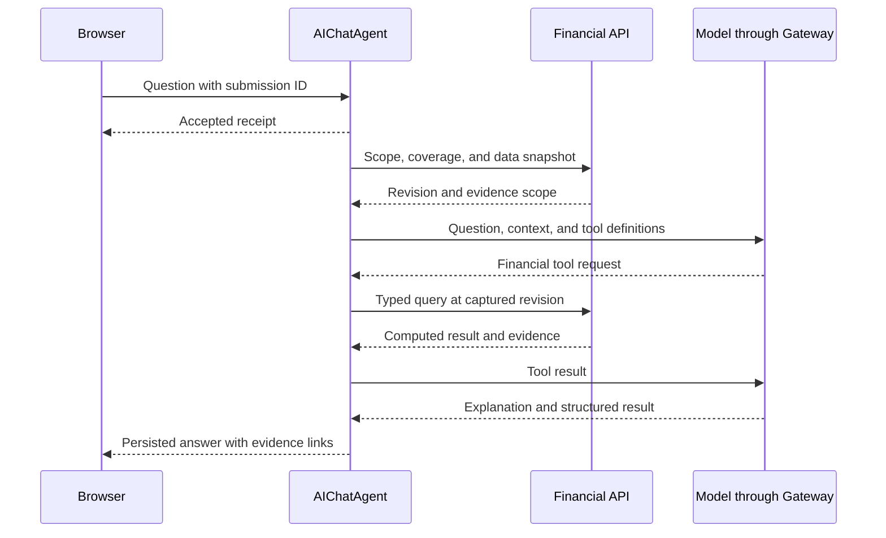

The selected stack is Cloudflare Agents SDK, AIChatAgent, and Vercel AI SDK. AI Gateway handles configured model access. Cloudflare Workflows owns explicit import and background-analysis jobs.

AIChatAgent supplies persisted messages and resumable streams. Its React client is `useAgentChat` from `@cloudflare/ai-chat/react`. Vercel AI SDK supplies model calls, typed tools, and structured output. The app uses one canonical conversation protocol rather than combining several chat stores. [Cloudflare chat agents](https://developers.cloudflare.com/agents/communication-channels/chat/chat-agents/)

[AI functionality](/technical/ai-functionality) specifies model inputs and outputs, tool arguments, mutation authority, run state, prompt requirements, budgets, and evaluation gates. This page explains runtime ownership and framework selection.

## Why this combination

The analyst needs typed numerical results, persistent conversations, clarification, and background work. Cloudflare's integrated chat lifecycle reduces the amount of runtime coordination the application must own, while Alchemy remains responsible for deployment.

Financial tools and the evaluation corpus establish answer quality. Conversation persistence handles message delivery and replay; the application still owns financial command receipts and investigation checkpoints.

## Agent responsibilities

The agent selects tools, assembles relevant context, follows an investigation, and explains results. It can request a structured clarification and apply an explicit user instruction through a validated command.

The API calculates financial values and commits changes. The model does not receive a write-enabled database connection, choose an authenticated owner, or replace metric definitions with generated arithmetic.

The [tool catalog](/technical/ai-functionality#analyst-tools) defines every tool's arguments, result, and allowed effect. JSON Schema adapters derive from the shared boundary schemas. Tool execution crosses from the SDK's Promise interface into Effect services at one boundary.

## Question execution

Each tool response identifies the data revision and query scope. Multi-tool investigations use a captured dataset or versioned evidence after the Postgres read transaction has closed. When an investigation needs a new revision, it restarts the affected calculation explicitly. It does not combine values from different snapshots without saying so.

The model can return an insight summary or narrative, but official numbers and chart datasets come from tool results. Client components accept typed result data. Model output does not become arbitrary executable UI code.

## Structured extraction and model policy

Batch enrichment uses schema-constrained SDK calls with explicit control flow. Known aliases and accepted rules bypass model calls. A smaller extraction model and a stronger analyst model can have different evaluation and usage policies.

The model registry records provider, model ID, capability requirements, prompt version, output schema version, and retry policy. Required capabilities include the relevant document inputs, tools, and structured output. Fallbacks must satisfy the same contract.

Exact model IDs are selected from current provider catalogs and tested against the checked corpus. Model changes rerun relevant evaluations before promotion. SDK schema validation checks structure. It does not prove transaction amounts or interpretations are correct.

## Durable state and recovery

Each conversation has a stable, owner-bound identity. Repeated submission IDs return the existing receipt. New submissions queue in accepted order by default. Browser disconnection detaches the client. An explicit stop records durable cancellation intent. Cancelled and failed runs remain terminal. Retrying creates a new run that can reuse compatible completed evidence.

AIChatAgent persists conversation and stream state. Application run metadata records the financial snapshot, job references, status, cancellation intent, and usage. Transcript text is not the sole record of whether a financial command committed.

A server tool can finish a database write before its result reaches the conversation. Recovery looks up the command's recorded outcome before repeating it. Postgres financial commits and Durable Object message persistence are separate transactions. A provider interruption can require another model call. Buffered text replay does not resume arbitrary JavaScript execution.

Long numerical or document work runs as a Workflow job. The agent stores the job reference and waits or reports progress. It does not keep a web request open as the only owner of that work.

Run limits cover model steps, elapsed time, tokens, and spend. Enforcement uses recorded usage and reservations for in-flight calls. A stopped or exhausted run preserves completed evidence and has an explicit terminal state. Provider retries and Workflow retries share one attempt budget.

## Clarification and corrections

A clarification contains a question ID, subject version, allowed response shape, and source evidence. Its record survives conversation compaction and browser reload.

An answer is consumed atomically with the corresponding correction where a correction is required. A stale subject version causes reevaluation against current data. Repeated answers return the original outcome.

Explicit user instructions can authorize the single-record category, merchant, and tag corrections defined in [Mutation authority](/technical/ai-functionality#mutation-authority). Other edits require an accepted structured action. Analyst-generated corrections remain proposals unless an existing accepted rule covers them. Automatic import categorization uses its separate evaluation gate. A broad rule change includes a preview of affected records and preserves transaction-specific exceptions.

## Personal context

Confirmed account roles, mortgage context, category rules, preferences, and tracked intentions live in application storage. Each fact records its source, effective interval, scope, and version.

Context retrieval begins with facts relevant to the selected accounts, dates, and question. Conversation summaries are lower-priority context. Contradictions with confirmed facts create review work rather than overwrite those facts.

Removing a fact excludes it from future context retrieval. Historical answers retain their original evidence basis and can be marked affected. Embeddings can assist retrieval later, but they do not replace structured account or date filters.

## Computational investigations

When ordinary tools cannot express a useful analysis, a job can create a controlled computational workspace with a frozen dataset. Native Python libraries run in a Cloudflare Container when required.

The workspace receives read-only inputs, bounded execution resources, and no production write credentials. Its outputs include the calculation, package versions, data revision, and result artifacts. The API validates returned result structures before displaying them as an analysis.

A useful calculation can become a saved reproducible analysis. Repeated domain behavior moves into the shared finance package once its rule is established. Independent investigations can use child runs with separate context and explicit budgets. A separate agent is not required for each category.

## Evidence handling

Bank descriptions, document text, web results, and saved notes are untrusted content. They cannot redefine tool permissions or authorize writes. External merchant research is explicit and excludes unnecessary account details.

Logs capture run IDs, tool names, timing, usage, and safe failure codes. Raw financial text and model prompts are excluded from routine telemetry. The [operations policy](/technical/operations) defines storage and provider boundaries.
