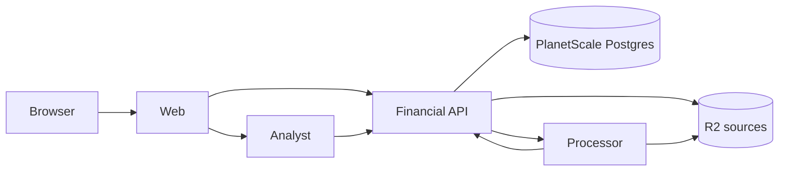

## System split

| Part      | Workspace           | Responsibility                                                                                                        | From stage |
| --------- | ------------------- | --------------------------------------------------------------------------------------------------------------------- | ---------- |
| Web       | `apps/web`          | Cloudflare Access validation, TanStack Start routes and server functions, query state, UI.                            | 1          |
| API       | `workers/api`       | Postgres records, R2 sources, matching and publication, commands, calculations, exports.                              | 1          |
| Processor | `workers/processor` | `ImportWorkflow`: parse one file with a library and call the API to publish. Later, classification and finding scans. | 1          |
| Analyst   | `workers/analyst`   | `AIChatAgent` Durable Object with read-only tools over the API.                                                       | 6          |

The API is the only Worker that writes financial records and the only one with a database binding. The processor reads R2 and calls the API. The analyst stores conversation messages in its own Durable Object storage through the SDK and reads financial data through the API.

## Shared packages

| Package              | Contents                                                                                                       |
| -------------------- | -------------------------------------------------------------------------------------------------------------- |
| `packages/contracts` | Effect schemas for values and payloads that two workspaces exchange. Branded IDs, Money, filters, results.     |
| `packages/finance`   | Deterministic money, date, matching, and calculation functions. Imported by the API, the processor, and tests. |
| `infra`              | The Alchemy stack. One module per service under `infra/src/`, composed by `infra/src/worker-bindings.ts`.      |

Parsers live in the processor. SQL lives in the API. UI lives in the web app. A Worker never imports another Worker's internals. Shared packages never import a Worker, a route, or infrastructure. Add a package when two workspaces need the same runtime code, and a Worker when there is a distinct execution or storage requirement.

## RPC chain

1. A Worker's `index.ts` composes its Effect services and returns a handler object.
2. Its Alchemy Worker class in `infra/src/` picks the exposed methods with `Pick`. The bridge infers argument, success, and tagged failure types for callers.
3. `infra/src/worker-bindings.ts` gives each Worker its bindings, including service bindings to other Workers.
4. The web app's server functions validate browser input with the contracts schemas and call the API through the typed binding.

Method signatures are defined once, in the implementation. Payload schemas are shared where two sides need them. There is no generated HTTP client and no handwritten interface file.

## Boundary rules

- The web Worker validates the Access JWT's signature, issuer, audience, and expiry on every request, including downloads, server functions, and analyst WebSocket upgrades. Local development uses a local identity only when the stage is `dev`.
- The API and processor have no public routes. Service bindings are the only way in.
- Responses carry what a screen or tool needs: record fields and evidence references. They never carry storage keys, credentials, or full bank account numbers beyond what the account settings screen shows.
- Browser input, stored JSON, and model output are validated at the boundary. Inside a Worker, decoded types are trusted.

## Background work

Cloudflare Workflows runs imports with a few steps and the platform's bounded retries. The API keeps a small import status and the Workflow instance ID; it asks the platform for instance status when the import has no summary yet. There is no application job table. Stage 7 adds a cron trigger on the processor for finding scans and reminders.

A failed step is visible on its owning screen with a retry action that starts new work. A retry may reparse a file or repeat a model call; publication and commands are what make repeats safe.

## Infrastructure ownership

Each service module under `infra/src/` declares the resources that service owns: the API declares Postgres, Hyperdrive, and the sources bucket; the processor declares the Workflow; the analyst declares its Durable Object namespace; the web module declares the site, domain, and Access application. Deployment values and secrets stay in the stack and never enter a runtime bundle. Runtime entry points may import their inferred binding types from `@repo/infra/worker-bindings` as type-only imports.
