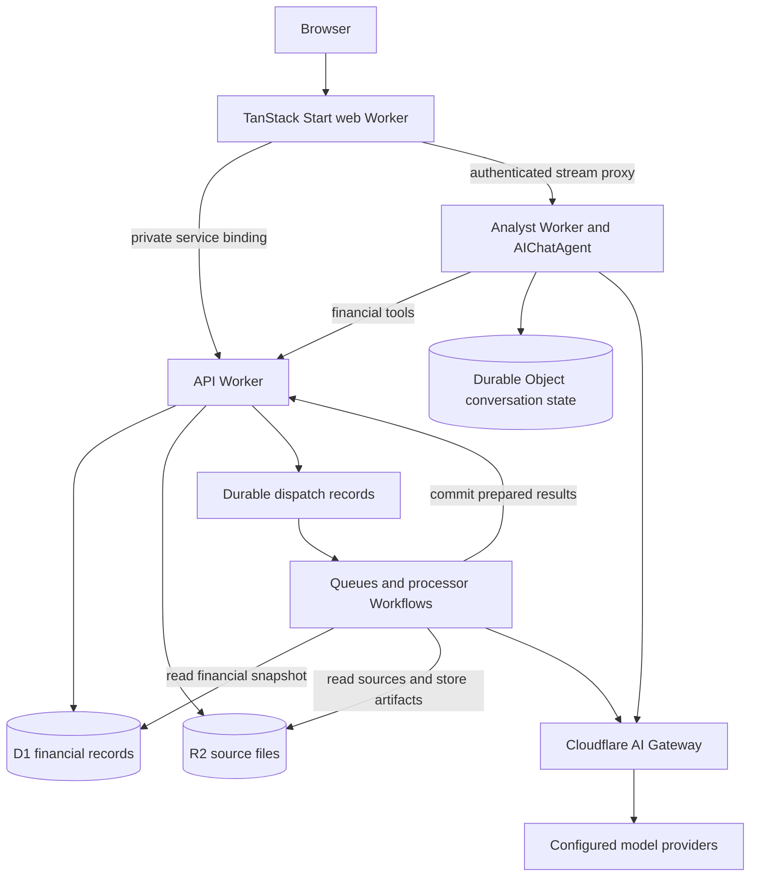

Ironcage needs consistent answers across several entry points. A chart, an import-triggered insight, and a conversation can ask the same financial question. Their calculations therefore share one application layer and one set of financial definitions.

## Runtime ownership

The target runtime consists of a public web Worker, a private financial API, a background processor, and a private analyst Worker. The analyst Worker exports the AIChatAgent Durable Object class. Imports and background analysis run through Cloudflare Workflows in the processor.

D1 owns financial records, corrections, review items, commitments, and completed analysis results. R2 owns original files and large artifacts. Durable Object storage owns conversation messages, stream state, and conversation-local execution state.

The browser does not query storage directly. The API owns financial writes, including publication of prepared imports. The processor performs extraction and analysis, then calls the API to commit validated results. One write boundary keeps concurrency and revision checks consistent.

## Modules and planned locations

The following locations are the target layout, not a claim that the modules already exist.

| Planned location                  | Responsibility                                                                                                                          |
| --------------------------------- | --------------------------------------------------------------------------------------------------------------------------------------- |
| `packages/finance/src/`           | Financial types, money arithmetic, matching rules, metric definitions, and statistical calculations. No Worker bindings or model calls. |
| `packages/contracts/src/finance/` | Boundary schemas for imports, queries, corrections, results, and failures.                                                              |
| `workers/api/src/finance/`        | Repositories, query services, financial commands, revisions, and dispatch records.                                                      |
| `workers/processor/src/imports/`  | Source extraction and staged reconciliation.                                                                                            |
| `workers/processor/src/analysis/` | Enrichment, recurring-cost detection, forecasts, insights, and saved-analysis refresh.                                                  |
| `workers/analyst/src/`            | Agent class, tools, context selection, stream data, and model policy.                                                                   |
| `apps/web/src/features/`          | Product views, query options, correction flows, and conversation UI.                                                                    |
| `infra/src/`                      | Alchemy graph for financial resources, Workflows, analyst bindings, and access policy.                                                  |
| `migrations/`                     | Financial schema and subsequent data migrations.                                                                                        |

`packages/finance` exists because the API and processor need the same numerical rules. Financial tools call the API rather than maintain an agent-specific copy of those rules. New modules are grouped by domain ownership, not by each step of a pipeline.

## Infrastructure and service boundaries

Alchemy owns runtime declarations, bindings, migrations, local emulation, and deployment. Effect owns service composition, typed failures, and cancellation inside each runtime. Worker RPC derives its method contracts from the service declarations.

Only the public web Worker accepts browser traffic. Other runtimes receive capability-specific bindings. The API holds financial write capabilities. The analyst receives financial query and command tools rather than direct storage access.

TanStack Start uses the Alchemy-managed Cloudflare integration. Runtime modules do not maintain independent deployment configurations. A local request cancellation does not establish that a remote financial command stopped. Command receipts determine the outcome.

## Durable work

A financial command commits its data change and a dispatch record together. A dispatcher delivers work using a stable job identity. Duplicate delivery returns the existing job or committed result.

Queues distribute work. Workflows own the ordered steps of an import or analysis job. Agent conversations own question-and-answer state. A job has one execution owner. The queue consumer does not independently repeat work that belongs to a Workflow.

Workflows persist progress and retry failed steps. The application still makes commit operations idempotent, because a step can complete an external effect before its result is recorded. [Cloudflare Workflow rules](https://developers.cloudflare.com/workflows/build/rules-of-workflows/)

## Revisions and stable answers

Every accepted financial change advances a dataset revision. An analysis captures a revision and its query definition before computation. Its result records that revision, metric version, assumptions, and evidence.

The API reads the required records and revision from a coherent snapshot. Longer analyses use an immutable extracted dataset, stored in R2 when too large for a bounded response. Subsequent writes cannot change that input silently.

A bounded read captures its revision and rows in one transactional batch. A paginated snapshot reads from the primary and verifies the revision before and after extraction. If the revision changed, extraction restarts before publishing the snapshot.

After publication, dependent live views refresh. Historical results remain available with their original basis. An older job cannot overwrite a newer result: publication checks the expected input revision and result identity.

## Extension beyond spending

Accounts, source evidence, money movements, and financial events can later support investment-related records. Holdings, orders, wallets, and execution APIs need their own product contracts before implementation.

Computational investigations can use a Cloudflare Container when native document or statistical libraries are needed. That runtime receives a bounded data snapshot and returns artifacts. It does not own the financial database.
