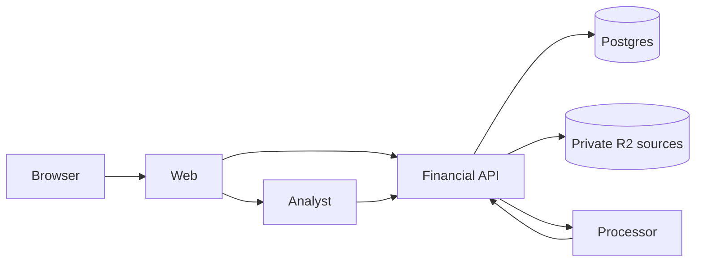

The application extends the existing React, TanStack Start, Effect, and Alchemy platform. [Delivery stages](/stages) determines which parts exist at each checkpoint. These pages describe the target, not shipped behavior.

## System split

| Part          | Responsibility                                                                                                               | Introduction |
| ------------- | ---------------------------------------------------------------------------------------------------------------------------- | ------------ |
| Web           | Authentication, upload and review screens, transaction browsing, and later financial views.                                  | Stage 1      |
| Financial API | Postgres records, evidence access, validation, financial writes, and calculations.                                           | Stage 1      |
| Processor     | Parse files using libraries and call the API to record validated results. Cloudflare Workflows handles background execution. | Stage 1      |
| Analyst       | AIChatAgent conversations and tools that call the existing financial API.                                                    | Stage 6      |

The API is the only financial database writer. The processor owns extraction, and the analyst owns conversation messages through the SDK. Logical modules stay within their owning workspace until another consumer or runtime requirement justifies extraction. [Monorepo and ownership](/technical/monorepo) defines the existing integration conventions.

## Prefer libraries and platform capabilities

Use csv-parse for CSV syntax and unpdf for PDF text. Evaluate an OFX parser against the supplied SGML files before writing syntax handling. Bank-specific amounts, dates, source identity, and reconciliation remain application logic. Use SDK structured output and agent persistence directly. Add a custom mechanism only when an actual input or user outcome demonstrates a gap in those capabilities.

## Recording and interpretation

Stages 1 and 2 record bank postings and source evidence. A posting requires no event, allocation, category, model call, or analyst. Stage 3 adds interpretation records and processes earlier postings without reuploading them. A failed classification leaves the bank record intact and available for manual categorization.

## Writes and reads

The [financial write protocol](/technical/financial-model#persistence-and-concurrency) protects exact amounts, repeated actions, and concurrent edits. Parsing, model calls, and file transfers finish outside database transactions. The API checks current matching evidence and publishes each file's accepted records and review dispositions in one short transaction.

Ordinary analysis reads current data. A response containing related totals uses a consistent database read so its components agree. TanStack Query invalidation refreshes visible views after changes. Saved analyses store definitions and run when opened or explicitly refreshed. Their date and evidence behavior is defined in [Analytics](/technical/analytics).

## Failure behavior

A failed action may require retry, reupload, or a user decision. It leaves accepted data consistent and cannot duplicate records when repeated. Cloudflare Workflows owns step execution and its built-in bounded retries. Application status records explain the result; they do not implement another workflow engine. A manual rerun may repeat parsing or a model call.

If a task cannot start or finish, show failure with an action to try again. A background interpretation, export, or finding failure never reverses a completed import. [Import protocol](/technical/import-protocol) defines the small amount of application state required for safe publication.
