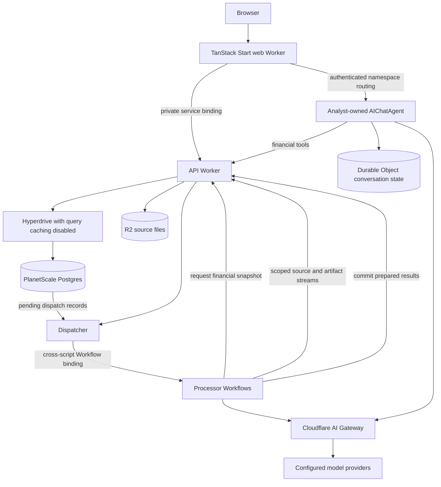

Ironcage needs consistent answers across several entry points. A chart, an import-triggered insight, and a conversation can ask the same financial question. Their calculations therefore share one application layer and one set of financial definitions.

The [RPC specification](/technical/rpc) defines service boundaries at method level. The [database schema](/technical/database-schema) and [shared contracts](/technical/contracts) define stored and transported values. [Import and job protocols](/technical/import-protocol) defines durable execution between runtimes.

## Runtime ownership

The target runtime consists of a public web Worker, a private financial API, a background processor, and a private analyst Worker. The analyst Worker exports the AIChatAgent Durable Object class. Imports and background analysis run through Cloudflare Workflows in the processor.

PlanetScale Postgres owns financial records, corrections, review items, commitments, dispatch records, and completed analysis metadata. R2 owns original files and large artifacts. Durable Object storage owns conversation messages, stream state, and conversation-local execution state.

The API owns financial queries and writes, including snapshot extraction and publication of prepared imports. The processor requests snapshots, performs extraction and analysis, then calls the API to commit validated results. The browser, processor, and analyst do not hold financial database credentials.

## Monorepo ownership

[Monorepo and ownership](/technical/monorepo) defines the workspace layout, package exports, allowed dependencies, and resource ownership. Shared contracts define boundary values. The finance package owns deterministic rules used by the API and processor. The AI package owns model execution policy used by the processor and analyst.

Each runtime owns its application behavior and infrastructure module. Financial repositories remain private to the API. Product views remain in the web app, document parsers in the processor, and conversation tools in the analyst.

## Infrastructure and service boundaries

Alchemy composes service-owned runtime declarations, resources, bindings, and migrations into one application graph. Each service has its own infrastructure module. The root graph wires only the capabilities its callers need. Effect owns service composition, typed failures, and cancellation inside each runtime. Worker RPC derives its method contracts from the service declarations.

Only the public web Worker accepts browser traffic. It authenticates SDK HTTP and WebSocket requests and routes directly through the analyst-owned Durable Object namespace. Alchemy declares a cross-script namespace reference in the web Worker; the analyst Worker owns the class and migrations and deploys first. Routing derives the instance name from the authenticated owner and conversation ID. The namespace capability is limited to the analyst and is never selected from arbitrary browser input. This removes the intermediate Worker HTTP hop while retaining ingress and reconnect tests. Other runtimes receive capability-specific bindings. The API holds financial write capabilities. The analyst receives financial query and command tools rather than direct storage access.

TanStack Start uses the Alchemy-managed Cloudflare integration. Service infrastructure lives under `infra/src/<service>/` and uses the shared stage configuration. A service can own additional storage when its lifecycle requires it. A local request cancellation does not establish that a remote financial command stopped. Command receipts determine the outcome.

## Financial database connection

The API uses `@effect/sql-pg` through Alchemy's Postgres integration and a Hyperdrive binding. Runtime connections target the PlanetScale primary with a role scoped to application tables. Migration credentials belong to the deployment process.

Hyperdrive query caching is disabled for this binding. Reads after a correction must see committed data. Hyperdrive retains connection pooling when caching is disabled. Explicit caches for immutable analysis results use their result identity and revision. [Hyperdrive caching](https://developers.cloudflare.com/hyperdrive/concepts/query-caching/)

Connections are scoped to a Worker execution. A transaction reserves one connection until commit or rollback. Transaction-local settings apply within that boundary, without relying on session state across requests. [Hyperdrive pooling](https://developers.cloudflare.com/hyperdrive/concepts/connection-pooling/)

Postgres lets financial commands read current records, validate a decision in Effect code, and commit related changes together. It also provides consistent snapshots across several queries. These capabilities support corrections and concurrent imports without encoding every application decision into a prepared SQL batch.

## Durable work

A financial command commits its data change and a dispatch record in one Postgres transaction. The API dispatcher leases pending records and starts the processor Workflow through a cross-script binding after releasing the transaction. Failed or ambiguous dispatch remains recoverable from the outbox. Durable job state and step receipts protect against repeats after platform instance retention expires.

Workflows own ordered import and analysis execution. Agent conversations own question-and-answer state. The API outbox owns dispatch obligations. The [dispatch protocol](/technical/import-protocol#delivery-retries-and-cancellation) defines leases, execution generations, retries, and stale-execution checks. This workload needs no separate queue or dead-letter queue.

Workflows persist progress and retry failed steps. The application still makes commit operations idempotent, because a step can complete an external effect before its result is recorded. [Cloudflare Workflow rules](https://developers.cloudflare.com/workflows/build/rules-of-workflows/)

## Revisions and stable answers

Every accepted financial change advances a dataset revision. An analysis requested against latest captures its actual revision when execution reaches snapshot extraction. Acceptance promises durable work, not the database state at submission time. A request against an existing snapshot retains that input. The job checkpoint records the frozen basis before computation. Its result records that revision, metric version, assumptions, and evidence.

The API captures the revision and required rows in a read-only `REPEATABLE READ` transaction on the primary. Every query in that extraction sees the same database snapshot. The API completes the database read before model calls or numerical analysis begin.

Longer investigations use an immutable extracted dataset, stored in R2 when it exceeds the bounded tool response. Tool pagination reads that saved dataset. It does not hold a database transaction open between browser requests or model turns. A revision number alone cannot reconstruct an earlier database state after commit.

After publication, dependent live views refresh. Historical results remain available with their original basis. Publication checks the current revision and saved-definition version before updating a live result pointer. A result from an earlier revision stays historical. Refresh dispatch coalesces pending work by saved definition and captures the latest revision at execution. If an unrelated change occurs while computation runs, publication schedules a new refresh rather than presenting the old basis as current.

## Extension beyond spending

Accounts, source evidence, money movements, and financial events can later support investment-related records. Holdings, orders, wallets, and execution APIs need their own product contracts before implementation.

Computational investigations can use a Cloudflare Container when native document or statistical libraries are needed. That runtime receives a bounded data snapshot and returns artifacts. It does not own the financial database.
