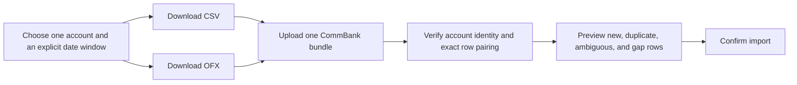

# CommBank export evidence and operating runbook

This note records the NetBank behavior observed on 8 August 2026 and turns it into a repeatable collection procedure for Money. It is empirical evidence for [Money](../08-money.md). Production parser contracts still require redacted byte-preserving fixtures.

No raw export or statement belongs in the repository. The files used for this investigation remain outside the workspace and contain private financial data.

## The decision this evidence supports

The recommended CommBank source is a **paired CSV + OFX export for one account and one explicit date window**.

CSV and OFX contribute different proofs:

| Evidence                              | CSV                              | OFX                                          |
| ------------------------------------- | -------------------------------- | -------------------------------------------- |
| Posted date, signed amount, narrative | yes                              | yes                                          |
| Per-row running balance               | offset accounts and home loan    | no                                           |
| Account identity in the file          | no                               | yes                                          |
| Stable transaction ID                 | no                               | offset accounts only in the observed samples |
| Final ledger and available balance    | final row implies ledger balance | explicit balance records                     |

The pair is one source bundle, not general cross-format deduplication. The importer accepts it only when every exported row matches one-to-one across the two files on posted date, signed amount, and narrative. This lets the CSV supply the balance chain while the OFX proves which account produced the CSV.



QIF remains rejected. NetBank offers three QIF dialects, but none carries account identity, a running balance, or a transaction identifier. It adds no evidence that the paired profile lacks.

The pair does not create two transactions. It creates two source observations linked to one canonical bank transaction.

## Accounts in scope

| Account                 | Money treatment   | Why                                                                              |
| ----------------------- | ----------------- | -------------------------------------------------------------------------------- |
| Spending offset         | import every run  | Primary cash, income, bills, and debit-card spending                             |
| Savings offset          | import every run  | Balance and own-transfer matching; its transfers are not spending                |
| Mastercard              | import every run  | Card purchases are spending; card repayments are own transfers                   |
| Home loan               | import every run  | Net-worth liability and the split between principal movement, interest, and fees |
| CDIA and share accounts | omit while unused | Empty accounts add collection work but no useful record                          |
| Essential Super         | omit from Money   | Useful later as a Portfolio balance source, not as a spending source             |

A payment from the spending offset to the Mastercard is not spending twice. The card purchase is the expense and the repayment is an own transfer. The same rule applies to home-loan principal: the movement between the offset and loan is a transfer, while home-loan interest and package fees are housing costs.

## Verified transaction formats

### CSV

NetBank produces headerless CSV with CRLF line endings. All observed account types use four columns:

```text
DD/MM/YYYY,"signed decimal","narrative","running balance or empty"
```

Observed account-specific behavior:

- Spending and savings offsets carry a running balance on every row.
- Mastercard rows leave the fourth column empty. Purchases are negative; payments and refunds are positive.
- Home-loan rows carry a negative running balance. Repayments are positive; interest, corrections, and fees use their economic sign.
- Rows are newest first in every observed file.
- Pending transactions are visible in NetBank but excluded from exports.
- The downloaded filename is generic (`CSVData.csv`) and cannot be trusted as account identity.
- Dates contain no transaction time.

### OFX

NetBank produces OFX 1.02 in SGML form, declared as Windows-1252 rather than XML. A parser must not require XML closing tags on scalar fields.

Observed fields include:

- Deposit and loan files: `BANKID`, `ACCTID`, and `ACCTTYPE` inside `BANKACCTFROM`.
- Mastercard files: `ACCTID` inside `CCACCTFROM`.
- Transactions: `TRNTYPE`, `DTPOSTED`, `DTUSER`, `TRNAMT`, `FITID`, and `MEMO`.
- File-level balances: ledger and available balance with an as-of time.

The samples contained no `NAME` field. `DTPOSTED` and `DTUSER` contained eight date digits rather than a transaction timestamp.

`DTSTART` and `DTEND` contained midnight timestamps. Their date portions matched both tested explicit inclusive export windows.

`LEDGERBAL/DTASOF` records when the export was produced, not necessarily the end of the requested window. Several observed exports were produced after `DTEND`, after the account had continued to move. The ledger balance is therefore comparable with the newest row balance only when its as-of date falls between the newest posted row and `DTEND`.

The observed home-loan file also contains a bank-writer quirk: inside `BANKMSGSRSV1` it opens `CCSTMTRS` and closes `STMTRS`. The home-loan profile accepts exactly that aggregate pair. Other mismatched aggregates remain malformed.

`FITID` behavior differs by account type:

- Both offset-account samples contained a non-empty `FITID` on every row.
- In two overlapping spending-offset exports, all 16 shared rows retained the same `FITID`.
- Mastercard and home-loan samples emitted an empty `FITID` for every row.

The identifier is therefore an accelerator for the verified deposit profile, never the only deduplication scheme. Mastercard and home-loan imports continue to use content, occurrence, overlap, and reconciliation evidence.

### Cross-format pairing result

The investigation compared each CSV with the OFX downloaded from the same account window:

| Account sample  | CSV rows | OFX rows | Exact date/amount/narrative pairs |
| --------------- | -------: | -------: | --------------------------------: |
| Spending offset |       40 |       40 |                                40 |
| Savings offset  |       40 |       40 |                                40 |
| Mastercard      |      102 |      102 |                               102 |
| Home loan       |       36 |       36 |                                36 |

These observations establish the initial profile. Deterministic fixtures may prove parser behavior such as quoting, character decoding, equal-row occurrence, empty results, and truncation. A newly observed bank shape becomes an additional regression fixture.

Across one sample from each account, 218 rows contained no repeated `(posted date, signed amount)` pair. Date and amount will therefore often narrow a match to one row. Deduplication still handles repeated pairs because this sample cannot prove they never occur.

## Regular collection procedure

Monthly is the recommended manual cadence. It is frequent enough for useful spend analysis, comfortably below the 600-row export ceiling in the observed accounts, and much less tedious than a weekly eight-file routine.

Run it on a consistent day, such as the fifth day of each month:

1. Log in to NetBank and open **View accounts**.
2. Select the first account in scope.
3. Open **Transactions** and choose an explicit custom date range. Do not rely on the default recent-transactions view.
4. Use a rolling window from the first day of the previous calendar month through today. A 5 August run therefore requests 1 July through 5 August. The overlap with the previous run is deliberate.
5. Export that filtered result as **CSV (e.g. MS Excel)**.
6. Without changing the account or dates, export it again as **OFX (MYOB, MS Money, Quicken 2005 and later)**.
7. Rename both files immediately, for example:

   ```text
   cba_spending-offset_2026-07-01_2026-08-05.csv
   cba_spending-offset_2026-07-01_2026-08-05.ofx
   ```

8. Repeat for savings offset, Mastercard, and home loan.
9. Upload each CSV/OFX pair as one account bundle. Review the import preview, then confirm.

The two NetBank interfaces differ slightly:

- Offset accounts use the newer transaction page: **Time frame** selects the date range and **Export** opens the format dialog.
- Mastercard uses the legacy transaction page: **Advanced search → Choose dates → Search**, followed by **Export** near the bottom.
- Home loan opens in My Property first: choose **View all transaction history**, then use the same legacy search and export controls.

If weekly freshness later becomes valuable, use the same procedure with a rolling 21-day window. A seven-day window is too brittle because pending card activity is excluded and some transactions post several days after authorization.

## Structured backfill: the last two years

The transaction search explicitly limits custom dates to the last two years. A broad spending-offset search returned exactly 600 rows and stopped at the cap, omitting older rows in the requested window. A result of 600 rows or more is therefore outside the proven profile and must never be imported as complete coverage.

Backfill one account at a time:

1. Start with a two-year query to measure volume.
2. If NetBank reports fewer than 600 results, download one paired CSV/OFX bundle for that window.
3. If it reports exactly 600, divide the history into calendar quarters.
4. Give adjacent quarters a seven-day overlap. Overlap is evidence for deduplication and avoids cutting a busy posting day at the boundary.
5. If any quarter reaches 600, divide that quarter into calendar months.
6. Export CSV and OFX for every final window and import them oldest to newest.
7. The import is not complete until the gap ledger covers the entire requested two-year interval for all four accounts.

Savings offset and home loan are low volume in the observed record and are likely to fit in one two-year bundle. Spending offset and Mastercard should be assumed to require multiple windows until their actual counts prove otherwise.

## Older backfill: statements

NetBank transaction exports cannot reach beyond two years, but the statement surface exposes up to seven years. The observed selectors reached FY2020 through FY2027 for the relevant accounts.

The downloaded spending-offset statement was a text-based PDF, not a scanned image. Its transaction table carried:

- statement period and full account identity;
- opening and closing balances;
- transaction date and multi-line narrative;
- separate debit and credit columns; and
- a running balance after each row.

That makes pre-export history recoverable, but statements are a separate parser profile. Their narrative rendering differs from CSV/OFX and they must not be pushed through the structured-export dedupe rules.

The safe older-history procedure is:

1. Open **Statements** from NetBank's account navigation.
2. Select one account in scope and one available financial year.
3. Download every listed statement PDF for that account and year.
4. Rename it immediately with the account label, statement end date, and statement number when shown. For example: `cba_spending-offset_2026-06-24_statement-042.pdf`.
5. Repeat every available year for the spending offset, savings offset, Mastercard, and home loan.
6. Keep the raw PDFs immutable even before a statement parser exists. The seven-year window rolls forward, so delay can permanently lose the oldest year.
7. Build and fixture-gate separate deposit, Mastercard, and home-loan statement parsers.
8. Include at least one statement that overlaps the structured two-year history. Use that overlap to verify row extraction, statement totals, and the balance-chain handoff.
9. Once the parser is proven, import only the pre-structured portion and close the corresponding historical gaps.

For a first useful Money release, two years of paired structured exports are sufficient. Older statements should still be archived immediately, then parsed as the next backfill tranche.

## AnyDoc evaluation

[AnyDoc](https://github.com/firecrawl/anydoc) 0.1.7 was evaluated locally against the private sample corpus.

| Input                | Result                                                                                       | Runtime decision                        |
| -------------------- | -------------------------------------------------------------------------------------------- | --------------------------------------- |
| Spending-offset CSV  | Parsed 40 rows and retained four cells in the structured document                            | Use direct CSV parsing instead          |
| Mastercard CSV       | Parsed 102 rows; structured output retained the empty fourth cell, but Markdown omitted it   | Do not use Markdown as the CSV contract |
| Offset statement PDF | Produced Markdown for all eight pages and retained the transaction tables and summary fields | Use as statement text extraction        |
| CommBank OFX         | Rejected as unsupported                                                                      | Use a direct OFX SGML parser            |

The statement output was useful but not transaction-ready. Multi-line visual transactions could become several Markdown table rows. The Money parser must reconstruct those fragments, validate account identity, and prove the opening-to-closing balance equations.

AnyDoc runs in an isolated compute image with network access disabled. The image is pinned to the exact evaluated version. Raw PDFs remain authoritative, and confirmed imports retain the extracted Markdown and extractor image digest for reproducibility.

No hosted OCR service is part of the initial design. A scanned or extraction-empty PDF remains archived and fails visibly until a separate privacy decision authorizes another extraction path.

## Import interface implied by the evidence

The CommBank import preview should accept:

```ts
interface CommBankExportBundle {
  readonly csv: File;
  readonly ofx: File;
  readonly expectedAccount: BankAccountId;
}
```

Before presenting any row verdict, preview must:

1. decode the OFX account fingerprint and map it to exactly one stored account;
2. read the source window from OFX `DTSTART` and `DTEND` and require it to fall within the account's configured lifetime;
3. require both row streams to be newest first;
4. pair every CSV row to exactly one OFX row on date, amount, and narrative;
5. reject a missing, extra, or conflicting row in either file;
6. retain the CSV running balance where present;
7. retain the OFX `FITID` where non-empty; and
8. run the account-specific deduplication and reconciliation rules.

The filename is display metadata only. It never decides the account.

## Fixture coverage

This investigation closes the choice of recent-history format. The redacted observed corpus covers paired samples for all four account profiles and three overlapping spending-offset windows. It lives at [`apps/core/tests/fixtures/money/commbank`](../../../apps/core/tests/fixtures/money/commbank/README.md). Deterministic fixtures are sufficient evidence for behavior that does not require another bank export: equal-row occurrence, CSV quoting and character decoding, empty results, and truncation rejection.

Statement work remains source-dependent:

- Verify the oldest statement layout for each account type; a seven-year archive may span multiple templates.
- Download a representative Mastercard and home-loan statement for parser assessment.
- Prove offset statement-to-structured date alignment on a shared period before enabling statement imports.
