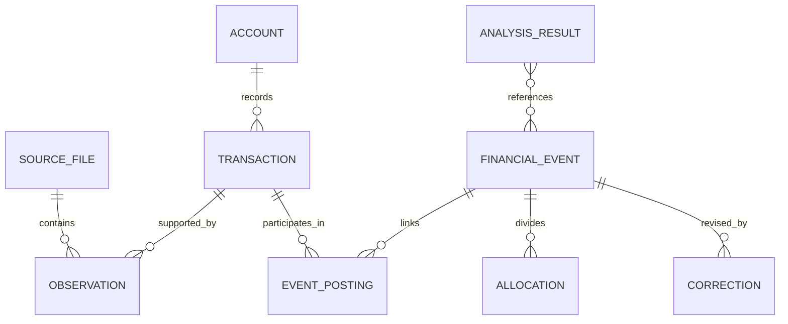

## Delivery scope

Stage 1 establishes identity, source evidence, exact values, and safe publication. Stage 3 introduces events, allocations, relationships, and the measures required by correction previews. Stage 4 adds current-data analysis queries and saved definitions; stage 5 adds ordinary-cost and schedule measures. Apply each invariant when its owning behavior exists.

[Stage boundaries](/technical/stage-boundaries) owns the precise allocation and contract evolution. [Delivery stages](/stages) defines the frontend and backend completion requirements.

This page defines the target data contract. SQL migrations and boundary schemas implement the contract. The names below are planned domain records.

The [database schema](/technical/database-schema) defines record groups and required constraints. [Shared contracts](/technical/contracts) specifies their wire representations. [Calculation rules](/technical/calculation-rules) defines event construction and metric algorithms.

## Record identity

| Record             | Meaning and identity                                                                                               |
| ------------------ | ------------------------------------------------------------------------------------------------------------------ |
| Account            | A bank account, card, or loan with stable identity. Names and roles can change over time.                          |
| Source file        | Immutable uploaded bytes, identified by a cryptographic content hash within the owner's data.                      |
| Source observation | One extracted record with file, row or page location, raw fields, and extraction version.                          |
| Transaction        | A canonical bank posting. Several observations can support the same transaction.                                   |
| Financial event    | A purchase, transfer, repayment, refund relationship, or other interpreted event linking postings and allocations. |
| Allocation         | A portion of an event assigned to a financial role, category, or personal share.                                   |
| Correction         | A user-authored change, with scope, prior version, and command identity.                                           |
| Review item        | A specific unresolved interpretation, supporting evidence, candidate choices, and resolution state.                |
| Commitment         | A recurring expense or income schedule with effective dates and evidence.                                          |
| Analysis result    | A calculated response with its query, time, assumptions, coverage, and evidence.                                   |

The diagram shows conceptual relationships. Link tables implement many-to-many evidence and event membership. Unresolved observations can exist before a transaction identity is established.

## Record versions

Mutable interpretations have a version. Source locators and command IDs remain stable across retries. An extraction rerun does not create a new bank transaction by itself. Matching establishes that relationship separately.

The [database schema](/technical/database-schema) defines required relationships; implemented migrations own exact fields and constraints.

## Amounts and dates

Amounts use signed integer minor units with an explicit currency. Postgres stores booked amounts as `BIGINT`. Domain arithmetic uses `bigint`, and JSON contracts encode minor units as decimal strings. Boundary schemas validate the stored range and decode values without conversion through a JavaScript `number`.

Parsing converts decimal strings directly to minor units. SQL aggregates and fractional calculations retain exact values through `NUMERIC`, decimal, or rational arithmetic. Rounding occurs only at a defined output boundary. A currency's exponent is explicit. Historical Australian-dollar totals use the bank's booked Australian-dollar amount. Supplied original-currency money has its own supporting observation and never replaces booked money. Proposed or confirmed fee associations preserve each fee as a separate cost.

Account balances use asset-positive and liability-negative signs. Credit-card exports that lack balances do not produce invented opening balances. A statement anchor can establish a balance, followed by reconciled postings.

Bank posting dates use Postgres `DATE` and calendar-date strings at application boundaries. Import times and command times use `TIMESTAMPTZ` and UTC instants. Display and calendar grouping use the settings timezone, initially Australia/Sydney. A selected timezone is part of an analysis definition. Driver decoding preserves calendar dates without converting them through midnight in a local timezone.

Posting date, supplied value date, and evidenced purchase date remain separate fields. Spending uses an evidenced purchase date when available, otherwise posting date. Value dates alone do not establish when a purchase occurred.

## Evidence and interpretation

Raw observations remain immutable. Reprocessing creates another extraction version and preserves the source location. A bank posting needs no interpretation record. From stage 3, an established cost with an unknown category remains in aggregate spending as unclassified.

Financial roles distinguish income, purchase cost, financing cost, internal transfer, borrowing, refund, reimbursement, non-personal amounts, and unresolved movement. Net principal reduction is derived over a loan period; it is not an allocation of a repayment to the date of an interest charge. Categories describe the purpose of a cost. They are not a substitute for financial roles.

An explicit user correction takes precedence over an inferred classification. A transaction-specific override takes precedence over a matching general rule. Rules have scope, effective dates, and versions. Conflicting rules create a review item rather than depend on incidental execution order.

Categories partition a cost allocation. Tags and events can overlap. A query that selects several tags includes each allocation once, even when it matches several selected tags.

## Relationships and conservation

Allocation amounts sum exactly to their event amount. A confirmed transfer records its owned endpoints and available postings without creating income or spending. A missing counterpart remains an evidence limitation, not an unknown role. Different posting dates are allowed when evidence identifies the same movement.

A card purchase creates a cost and increases liability. Its settlement reduces cash and liability. A mortgage payment reduces cash. The loan record distinguishes principal movement from interest and fees. The full repayment is not added to interest again as a second expense.

Refund and reimbursement relationships record the applied amount. Several partial credits can apply to one purchase, and a credit can be split across purchases. An applied amount cannot exceed the eligible amount without an explicit different role for the excess.

Splitting or relinking preserves the sum of recorded bank movements. Corrections change interpretation, not the amount the bank booked.

## Metric definitions

| Metric                                  | Definition                                                                                                                               |
| --------------------------------------- | ---------------------------------------------------------------------------------------------------------------------------------------- |
| Gross costs                             | Purchase, interest, and fee allocations before linked refunds and reimbursements.                                                        |
| Net personal costs                      | Gross costs minus the confirmed amounts refunded or reimbursed to the user.                                                              |
| Income                                  | Recognized earned or other income. Excludes borrowing, own transfers, refunds, and reimbursements.                                       |
| Surplus after costs                     | Income minus net personal costs on the selected spending date basis.                                                                     |
| Surplus rate                            | Surplus after costs divided by positive income. Unavailable when income is zero or negative.                                             |
| Cash balance change                     | Closing minus opening balances across included deposit accounts, with both anchors established.                                          |
| Net principal reduction from repayments | Repayments minus separately dated interest and fees in a fully covered loan period. New borrowing and other adjustments remain separate. |
| Ordinary monthly cost                   | Variable-cost baseline plus the monthly allocation of known recurring costs, with explicit event exclusions.                             |

Surplus is not a promise of available cash. Paying card balances, reducing loan principal, or moving funds to an investment can change available cash differently. Missing assets prevent a claim of complete net worth.

Linked refunds and reimbursements reduce the original purchase period in the net-cost view. The account view retains the credit's posting date. The next calculation shows the revised net cost. Earlier displayed messages retain their calculation time without promising a replayable historical database.

An unlinked refund is shown separately until its purchase or period is known. Unresolved money is disclosed alongside the affected metric. The result does not label itself complete when unresolved roles could materially change it.

## Query and result contracts

A financial query identifies a metric, date basis, date range, comparison, account scope, filters, and adjustment choices. Calendar ranges use an inclusive start and exclusive end internally.

A result contains values, units, covered intervals, unresolved counts and amounts, calculation version, and evidence references. Evidence lists use bounded pages when needed. A large result is not truncated without a visible count.

The same definition feeds chart datasets and agent tool results. Neither consumer recalculates official totals from formatted strings.

## Persistence and concurrency

This section owns the financial write protocol. Other pages link here instead of restating it. PlanetScale Postgres stores these records in relational tables, with indexes on account and posting date, source identity, event membership, and review state. Foreign keys, unique constraints, and row-level checks protect record relationships. Constraints that span several rows are checked within the financial command transaction.

Every financial mutation starts a transaction and acquires a shared per-owner write lock, such as a Postgres transaction-level advisory lock. Read affected records after acquiring the lock. This serializes short financial writes for the single-user workload and protects cross-record matching and conservation checks. It does not require a dataset revision record.

A command first checks its receipt. Repeated command ID and input return the accepted result. New commands validate expected record versions, then commit changes, correction history where applicable, and the receipt together. Reusing an ID with different input is a conflict. Source hashes and observation links protect imports repeated through new actions as well.

A stale expectation leaves data unchanged and asks the user to review current records. Record reads, validation, and writes use the same transaction connection. A lost commit response can be retried with the same command ID rather than assuming rollback.

Parsing, document processing, model calls, and R2 transfers happen outside financial transactions. Normal finite database retries are acceptable for transient failures; exhausted errors return to the user. There are no dependent dispatch records in the financial commit.

Related financial totals use a consistent read transaction when several queries contribute to one response. Live views recalculate from current records and invalidate their TanStack Query cache after writes. The application does not retain a snapshot for every read or reconstruct old database states from revision numbers.

Source observations and correction history preserve evidence without requiring ordinary reads to replay an event log. Interpretation records are introduced in stage 3; bank posting reads remain independent of them.
