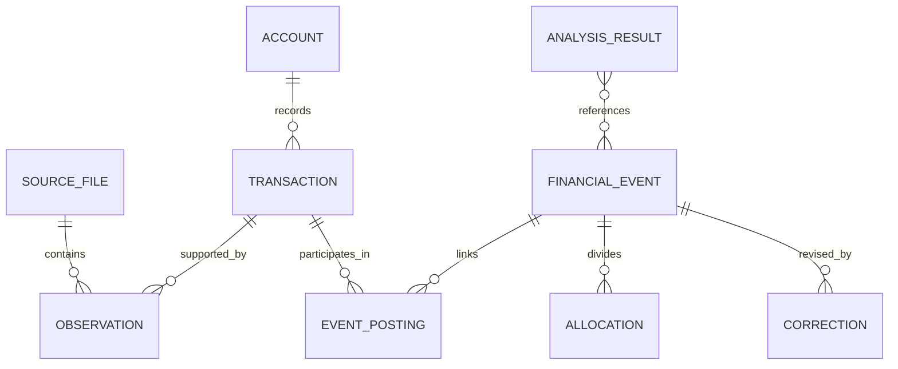

This page defines the target data contract. SQL migrations and boundary schemas implement the contract. The names below are planned domain records.

## Record identity

| Record             | Meaning and identity                                                                                               |
| ------------------ | ------------------------------------------------------------------------------------------------------------------ |
| Account            | A bank account, card, or loan with stable identity. Names and roles can change over time.                          |
| Source file        | Immutable uploaded bytes, identified by a cryptographic content hash within the owner's data.                      |
| Source observation | One extracted record with file, row or page location, raw fields, and extraction version.                          |
| Transaction        | A canonical bank posting. Several observations can support the same transaction.                                   |
| Financial event    | A purchase, transfer, repayment, refund relationship, or other interpreted event linking postings and allocations. |
| Allocation         | A portion of an event assigned to a financial role, category, or personal share.                                   |
| Correction         | A user-authored change, with scope, prior version, and command identity.                                           |
| Review item        | A specific unresolved interpretation, supporting evidence, candidate choices, and resolution state.                |
| Commitment         | A recurring expense or income schedule with effective dates and evidence.                                          |
| Analysis result    | A query result pinned to input revision, calculation version, assumptions, and evidence.                           |

The diagram shows conceptual relationships. Link tables implement many-to-many evidence and event membership. Unresolved observations can exist before a transaction identity is established.

## Stored fields and constraints

All owner-scoped records carry an opaque ID and creation time. Mutable interpretations also carry a version. Source locators and command IDs remain stable across retries.

| Record family            | Required stored fields                                                                                                    | Constraint                                                                                            |
| ------------------------ | ------------------------------------------------------------------------------------------------------------------------- | ----------------------------------------------------------------------------------------------------- |
| Sources and observations | Owner, hash, object key, format, extractor version, locator, raw values, parsed values, validation state                  | Unique owner and content hash. Unique source, extractor version, and locator.                         |
| Accounts and postings    | Account identity, account-role history, currency, posting date, optional evidenced dates, signed amount, optional balance | Posting identity is independent of merchant classification.                                           |
| Events and allocations   | Event kind, linked posting IDs, financial role, amount, category, personal share, effective dates                         | Allocations conserve the event amount. A posting can be linked without being counted as another cost. |
| Corrections and rules    | Target, expected version, scope, before and after values, source instruction, command ID                                  | One committed result per owner and command ID.                                                        |
| Review items             | Subject and version, issue kind, evidence IDs, candidates, resolution, resolved command                                   | A resolution applies to the stated subject version.                                                   |
| Commitments              | Subject, role, cadence, effective interval, amount or range, next date, confirmation source                               | Historical schedule segments remain available after changes.                                          |
| Jobs and dispatch        | Job kind, input revision, configuration version, status, attempt state, receipt, result reference                         | A stable job key deduplicates delivery.                                                               |
| Saved analyses           | Definition, snapshot reference, input revision, calculation versions, values, evidence manifest                           | Completed result content is immutable.                                                                |

An extraction rerun reuses its persisted locators. A new extraction version does not imply a new bank transaction. Matching establishes that relationship separately.

## Amounts and dates

Amounts use signed integer minor units with an explicit currency. Postgres stores booked amounts as `BIGINT`. Domain arithmetic uses `bigint`, and JSON contracts encode minor units as decimal strings. Boundary schemas validate the stored range and decode values without conversion through a JavaScript `number`.

Parsing converts decimal strings directly to minor units. SQL aggregates and fractional calculations retain exact values through `NUMERIC`, decimal, or rational arithmetic. Rounding occurs only at a defined output boundary. A currency's exponent is explicit. Historical Australian-dollar totals use the bank's booked Australian-dollar amount, not a later exchange rate.

Account balances use asset-positive and liability-negative signs. Credit-card exports that lack balances do not produce invented opening balances. A statement anchor can establish a balance, followed by reconciled postings.

Bank posting dates use Postgres `DATE` and calendar-date strings at application boundaries. Import times and command times use `TIMESTAMPTZ` and UTC instants. Display and calendar grouping use Australia/Sydney by default. A selected timezone is part of an analysis definition. Driver decoding preserves calendar dates without converting them through midnight in a local timezone.

Posting date, supplied value date, and evidenced purchase date remain separate fields. Spending uses an evidenced purchase date when available, otherwise posting date. Value dates alone do not establish when a purchase occurred.

## Evidence and interpretation

Raw observations remain immutable. Reprocessing creates another extraction version and preserves the source location. An accepted transaction can have an unknown category without losing its amount from aggregate spending.

Financial roles distinguish income, purchase cost, financing cost, internal transfer, debt principal, borrowing, refund, reimbursement, and unresolved movement. Categories describe the purpose of a cost. They are not a substitute for financial roles.

An explicit user correction takes precedence over an inferred classification. A transaction-specific override takes precedence over a matching general rule. Rules have scope, effective dates, and versions. Conflicting rules create a review item rather than depend on incidental execution order.

Categories partition a cost allocation. Tags and events can overlap. A query that selects several tags includes each allocation once, even when it matches several selected tags.

## Relationships and conservation

Allocation amounts sum exactly to their event amount. A transfer connects source and destination postings without creating income or spending. Different posting dates are allowed when evidence identifies the same movement.

A card purchase creates a cost and increases liability. Its settlement reduces cash and liability. A mortgage payment reduces cash. The loan record distinguishes principal movement from interest and fees. The full repayment is not added to interest again as a second expense.

Refund and reimbursement relationships record the applied amount. Several partial credits can apply to one purchase, and a credit can be split across purchases. An applied amount cannot exceed the eligible amount without an explicit different role for the excess.

Splitting or relinking preserves the sum of recorded bank movements. Corrections change interpretation, not the amount the bank booked.

## Metric definitions

| Metric                | Definition                                                                                                   |
| --------------------- | ------------------------------------------------------------------------------------------------------------ |
| Gross costs           | Purchase, interest, and fee allocations before linked refunds and reimbursements.                            |
| Net personal costs    | Gross costs minus the confirmed amounts refunded or reimbursed to Adi.                                       |
| Income                | Recognized earned or other income. Excludes borrowing, own transfers, refunds, and reimbursements.           |
| Surplus after costs   | Income minus net personal costs on the selected spending date basis.                                         |
| Surplus rate          | Surplus after costs divided by positive income. Unavailable when income is zero or negative.                 |
| Cash balance change   | Closing minus opening balances across included deposit accounts, with both anchors established.              |
| Principal repaid      | Confirmed loan-principal repayment, reported separately from new borrowing and other balance adjustments.    |
| Ordinary monthly cost | Variable-cost baseline plus the monthly allocation of known recurring costs, with explicit event exclusions. |

Surplus is not a promise of available cash. Paying card balances, reducing loan principal, or moving funds to an investment can change available cash differently. Missing assets prevent a claim of complete net worth.

Linked refunds and reimbursements reduce the original purchase period in the net-cost view. The account view retains the credit's posting date. A result created before the credit arrived keeps its prior revision. A refreshed result shows the revised net cost.

An unlinked refund is shown separately until its purchase or period is known. Unresolved money is disclosed alongside the affected metric. The result does not label itself complete when unresolved roles could materially change it.

## Query and result contracts

A financial query identifies a metric, date basis, date range, comparison, account scope, filters, adjustment choices, and data revision. Calendar ranges use an inclusive start and exclusive end internally.

A result contains values, units, covered intervals, unresolved counts and amounts, calculation version, and evidence references. Evidence lists are paginated or stored as immutable manifests. A large result is not truncated without a visible count.

The same definition feeds chart datasets and agent tool results. Neither consumer recalculates official totals from formatted strings.

## Persistence and concurrency

PlanetScale Postgres stores these records in relational tables, with indexes on account and posting date, source identity, event membership, and review state. Foreign keys, unique constraints, and row-level checks protect record relationships. Constraints that span several rows are checked within the financial command transaction.

Every financial mutation starts a `READ COMMITTED` transaction and locks the owner's dataset-revision row with `SELECT ... FOR UPDATE`. It reads affected records after acquiring that lock. All commands that change financial interpretations or revision-dependent context use this boundary. Short writes are serialized per owner, which fits the single-user workload and gives cross-record checks one concurrency rule.

Within the lock, a command first checks its stored receipt. A repeated command ID with the same payload returns that outcome. Reusing an ID for a different payload returns a conflict. New commands validate expected subject versions and any required input revision before applying changes.

The transaction commits the financial change, audit entry, receipt, new revision, and dependent dispatch records together. A stale expectation rolls the transaction back and returns the current version. Record reads, application validation, and writes use the same Effect SQL transaction context and connection.

Deadlocks and serialization failures retry the whole transaction within a finite budget. Business conflicts return to the caller for reevaluation. A lost commit response is resolved by looking up the command receipt on the primary before attempting another change.

Document processing, model calls, R2 transfers, and queue sends occur outside financial write transactions. Statement, lock, and transaction deadlines bound resource use. Dispatch status changes have their own lease operations and do not advance the financial revision.

Read-only snapshot extraction uses `REPEATABLE READ` as defined in [Architecture](/technical/architecture#revisions-and-stable-answers). The write protocol above uses explicit serialization through the owner lock. It does not assume that PostgreSQL's default isolation protects arbitrary read-modify-write sequences. [PostgreSQL isolation](https://www.postgresql.org/docs/current/transaction-iso.html)

Immutable source observations and correction history support auditability without requiring every ordinary read to replay a complete event log. Historical analyses retain the snapshot or evidence version they used.
