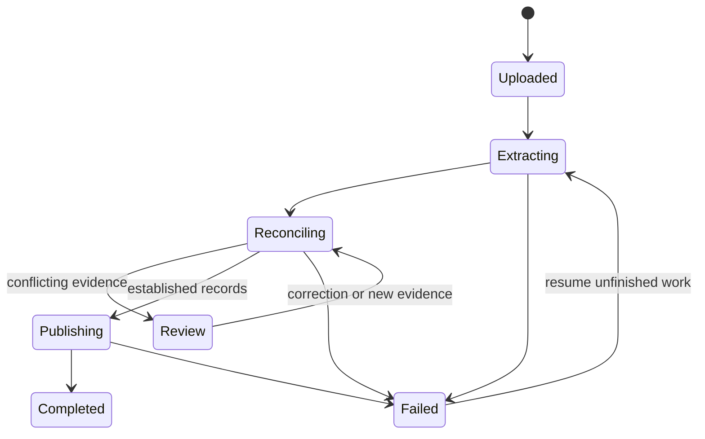

The import pipeline handles every supplied CSV, OFX, and PDF. File identity, transaction identity, and financial relationships are separate decisions. A repeated file is not the same problem as a transfer recorded in two accounts.

[Import and job protocols](/technical/import-protocol) defines the extraction schemas, scoring thresholds, publication payloads, Workflow steps, and recovery states used by this flow.

## Actual CommBank files

:::note
The actual CommBank files to import are in `fixtures/commbank/`, relative to the repository root. This local directory contains the supplied CSV exports, OFX exports, PDF statements, and their original README. The entire directory is Git-ignored, so it is absent from a fresh clone.
:::

These files are the source corpus for parser development, account mapping, duplicate reconciliation, and coverage validation. Implementation agents inspect the actual file structures and overlapping records when developing those behaviors. Source files remain unchanged, and private contents stay out of tracked fixtures and published outputs.

`fixtures/README.md` describes the directory contents. The README inside `fixtures/commbank/` describes the previous application. Its import order, pairing requirements, and supported-profile claims are historical context. The current product and technical specifications define the behavior to build.

## Source handling

The server verifies file type from content and streams the bytes to a temporary R2 object while computing SHA-256. A completed upload becomes an immutable source object. A unique owner-and-hash constraint identifies an existing source even when its filename changes.

An upload attempt has its own status and can reference an existing source. The source stores the original filename, content type, size, hash, object key, and accepted time. Filenames are labels, not proof of account identity or coverage.

The upload endpoint returns a receipt after source registration. A lost response can be retried with the same command identity. A source whose registration failed is reconciled against pending upload records before temporary-object cleanup.

The upload path supports the full supplied corpus. Operational byte and page limits are explicit, displayed before upload, and tested against the corpus. Larger files are streamed and processed in bounded chunks.

## Extraction

<Tabs>
  <Tab title="CSV">
    The CommBank parser reads four headerless columns in order: posting date in DD/MM/YYYY format,
    signed decimal amount, description, and balance. These exports contain no stable bank
    transaction ID. It preserves empty card balances, quoted fields, byte-order marks, and line
    locations. Parsing is deterministic and does not call a model.
  </Tab>
  <Tab title="OFX">
    The structured adapter reads the export header, account and currency metadata, transaction
    records, and balance anchors. It supports the supplied OFX 1.02 SGML layout and preserves
    literal fields and source locations. Parsing does not require a companion CSV or a model call.
    Transaction IDs are checked for reuse and conflicts before matching.
  </Tab>
  <Tab title="PDF text">
    A document adapter extracts page text and positions with a Worker-compatible PDF parser. It
    separates transaction tables from totals, rewards, notices, and repeated page headers. Debit and
    credit signs follow the statement layout.
  </Tab>
  <Tab title="Scanned or ambiguous PDF">
    A document-processing Container renders only the pages that need visual extraction. A configured
    vision model proposes structured rows. Page locations, extracted text, and validation results
    remain attached to each proposal.
  </Tab>
</Tabs>

Parser and extraction versions are recorded per observation. An improved parser can reprocess original files without replacing user corrections. The PDF adapter's exact library and rendering build are pinned after a corpus extraction check. They share the same output contract.

An observation contains raw fields, normalized candidate fields, a format-specific source locator, extraction version, and validation findings. A schema-valid model output is still a proposal until amount, date, and reconciliation checks pass.

## Establish accounts and intervals

Statement and OFX account identifiers, together with previously confirmed mappings, establish account identity. Masked suffixes can narrow candidates but are not globally unique. A CSV with no account identifier uses its batch mapping and prior evidence. An unresolved mapping creates a concrete review item.

Coverage stores separate facts: the requested export interval, observed transaction dates, statement interval, and reconciled interval. A sparse transaction list alone does not prove missing days. A matching opening balance, closing balance, and set of postings can establish a period with no activity.

## Match observations to transactions

The matcher first restricts candidates to the same account. OFX identifiers are corroborating evidence, never a globally unique deduplication key. Reused identifiers with conflicting values cannot establish a match. It then uses amount, currency, posting date, available balance, identifiers, description tokens, and source order.

Matching follows the identifier, literal-occurrence, and scored paths in the protocol. Two identical rows in one source can represent two real purchases. Complete overlap groups preserve their multiplicity; ambiguous subsets remain reviewable.

Cross-format matching uses a scored candidate graph. One source observation can support one canonical posting. Matching is one-to-one within an overlapping source sequence, with explicit allowances for source date conventions. Competing plausible matches remain unresolved rather than being forced by row order.

The score is a rule score, not a calibrated probability. Versioned thresholds are defined in [Import and job protocols](/technical/import-protocol#duplicate-matching) and evaluated against checked duplicate and non-duplicate examples. Accepted matches retain the evidence that justified them.

<Accordion>
  <AccordionItem title="Exact repeated upload">
    The content hash returns the existing source receipt. Completed extraction and enrichment are
    reused.
  </AccordionItem>
  <AccordionItem title="Overlapping exports">
    Matching observations attach to existing postings. Unmatched occurrences become candidates for
    new postings, subject to reconciliation.
  </AccordionItem>
  <AccordionItem title="Conflicting source values">
    Different amounts, balances, or identities create a conflict. Neither observation silently
    overwrites the other. Source evidence and statement reconciliation determine resolution.
  </AccordionItem>
</Accordion>

## Reconcile before publication

For a statement interval, opening balance plus signed movements must equal closing balance under the account's sign convention. Statement-specific debit, credit, fee, and interest totals provide additional independent checks.

Missing card balance cells remain missing. A statement supplies anchors when available. Inter-account transfer matching is a later interpretation step and does not delete either bank posting.

An extraction segment with unresolved financial values or duplicate identity is staged outside confirmed totals. Category-only uncertainty does not block publication of an otherwise established expense. Import results disclose accepted and unresolved segments separately.

The state diagram describes a processing segment. A batch contains independently progressing files and segments. A completed file can still have unresolved category proposals.

## Publish atomically

A Workflow stages extraction and matching against an immutable financial snapshot. The API commits bounded groups of validated postings, observation links, review items, and dispatch records in Postgres transactions.

Every group has a stable commit ID. The API acquires the owner revision lock and checks the staged input revision before publication. If a commit returns no response, the caller retrieves the recorded outcome before retrying. If the input revision changed, matching repeats against current records. After a group commits, remaining groups are matched against the resulting snapshot before publication.

Unique source-observation constraints and revision checks make simultaneous overlapping imports converge to the same history. Batch summaries derive from committed results, not from attempted insert counts.

Extraction, model interpretation, and source-object writes finish outside the financial transaction. The commit performs only bounded validation and database changes. The [financial command protocol](/technical/financial-model#persistence-and-concurrency) defines locking, receipts, and retries.

## Enrich and refresh

Deterministic financial-role establishment runs before semantic enrichment, following [Financial-role establishment](/technical/import-protocol#financial-role-establishment). Known merchant rules and explicit corrections run before model classification. Only novel or unresolved interpretations require model calls. Accepted amount and date evidence remains separate from semantic proposals.

After publication, jobs update recurring-cost detection, affected period summaries, saved analyses, forecasts, and insights. Jobs include their input revision and calculation version. A late job cannot replace newer results.

The API's durable dispatch table is the source of pending work. Direct Workflow dispatch and steps can repeat. Exhausted dispatch records an actionable job failure. Interpretation or refresh failure does not change a completed posting import back to failed.

The [verification plan](/technical/verification) includes shuffled file order, concurrent overlap, repeated callbacks, and interruption immediately after a database commit.
