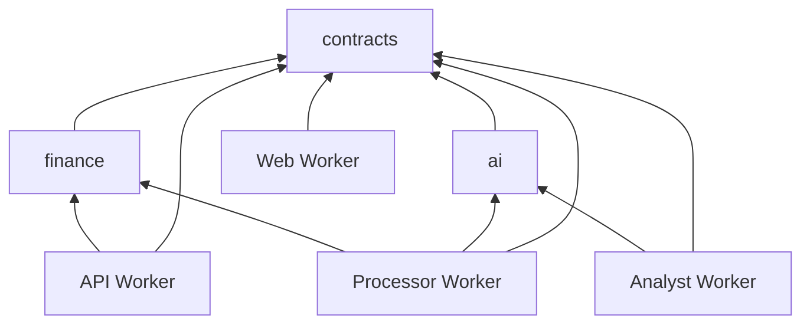

This reference defines the target workspace structure. The [architecture](/technical/architecture) explains the runtime design. The [RPC specification](/technical/rpc) defines the methods that cross between runtimes. Existing starter code moves to this structure as its financial replacements are implemented.

## Runtime responsibilities

A service owns its behavior, durable state, infrastructure declarations, and recovery tests. A shared package owns reusable code and has no deployment lifecycle.

| Workspace           | Responsibility                                                                                                                                                           | Persistent state and resources                                                                                                                                                               |
| ------------------- | ------------------------------------------------------------------------------------------------------------------------------------------------------------------------ | -------------------------------------------------------------------------------------------------------------------------------------------------------------------------------------------- |
| `apps/web`          | Authentication at browser entry, TanStack Start server functions, routes, query state, shadcn views, and authenticated analyst namespace routing.                        | Public Worker and domain. No financial database or independent financial cache.                                                                                                              |
| `workers/api`       | Financial commands and queries, source registration, evidence access, snapshots, review, revisions, dispatch, and the application records in the database specification. | PlanetScale Postgres, Hyperdrive, source and artifact R2 buckets, backup resources, and the fixed-command maintenance Container. Owns migration execution requirements and retention policy. |
| `workers/processor` | Import extraction, reconciliation preparation, interpretation, numerical analysis, refresh, export, removal, and bounded computation jobs.                               | Workflows and the computation Container when required by the specified workload. Workflow state owns execution scheduling.                                                                   |
| `workers/analyst`   | AIChatAgent, conversation sequencing, analyst tools, clarification, memory selection, answers, and run recovery.                                                         | Agent Durable Object namespace and its conversation storage.                                                                                                                                 |

The API owns durable application job and AI-run records because receipts, usage reservations, authorizations, and result publication refer to the same owner and financial evidence. The processor owns Workflow execution history. The analyst owns canonical conversation messages. These records have different purposes. Each field has one authoritative writer and store as defined in the [database schema](/technical/database-schema) and [AI functionality](/technical/ai-functionality).

An accepted classification is an API command. A processor-generated classification is a proposal until that command accepts it. A chart and an analyst tool call the same financial queries. Neither the web app nor the analyst maintains a separate calculation implementation.

## Shared packages

| Package and exports                                                                                                                                                              | Owns                                                                                                                                                                             | Consumers and exclusions                                                                                                                                           |
| -------------------------------------------------------------------------------------------------------------------------------------------------------------------------------- | -------------------------------------------------------------------------------------------------------------------------------------------------------------------------------- | ------------------------------------------------------------------------------------------------------------------------------------------------------------------ |
| `@repo/contracts`: `./finance/values`, `./finance/records`, `./finance/queries`, `./finance/commands`, `./finance/imports`, `./finance/jobs`, `./finance/ai`, `./finance/errors` | Effect Schemas, inferred encoded and decoded types, closed unions, boundary codecs, and versioned payload definitions.                                                           | All runtimes and both packages below. No SQL, provider clients, Worker bindings, React, or imports from another workspace. Effect is a direct external dependency. |
| `@repo/finance`: `./money`, `./events`, `./reconciliation`, `./metrics`, `./commitments`, `./forecast`, `./insights`                                                             | Exact arithmetic and the deterministic rules in [Calculation rules](/technical/calculation-rules) and [Import protocols](/technical/import-protocol).                            | API and processor. Imports contracts. No storage access, model calls, environment reads, or framework runtime.                                                     |
| `@repo/ai`: `./models`, `./execution`                                                                                                                                            | Role registry, provider selection through AI Gateway, schema adaptation, bounded model attempts, output decoding, usage accounting integration, and safe model-call diagnostics. | Processor and analyst. Imports contracts and the selected AI SDK. No SQL, Durable Object state, financial commands, or application tool registry.                  |

Each export names a cohesive module. It is not a requirement to create a separate workspace for every export. Public exports use explicit package subpaths, with `workspace:*` dependencies. Source files inside a package remain private unless an export names them. There is no root barrel that pulls every financial schema, provider, or calculation into every consumer.

The contracts package defines values and payloads once. Scalar and record modules are leaves. Query and command modules compose them. Job and AI payloads reuse those definitions through an acyclic import graph. Cross-references use IDs and shared value schemas rather than mutually recursive imports of full records.

The finance package accepts decoded records, an explicit calculation definition, and any required clock value or seed. It returns calculated values and evidence references. It never fetches missing data. Snapshot completeness and publication remain API responsibilities. Money brands and codecs come from contracts. Finance supplies operations on those values rather than declaring a second money type.

The AI execution module accepts a role, validated input, execution identity, and the caller's cancellation scope. Runtime composition supplies Gateway configuration, the selected role prompt and output schema, and the typed usage reservation and settlement operations. The role definition preserves the input and output type relationship. ModelCall and UsageAttempt records separate reusable logical output from provider attempts; runtime composition injects their owning API operations. Callers cannot pair a document input with an interpretation decoder. The module reserves usage before a provider call and records its outcome under the stable call ID. Its public result contains validated role output and usage identity, or a tagged failure from the [AI contract](/technical/ai-functionality). It does not advance a Workflow or agent checkpoint. The caller owns that transition.

Streaming execution exposes typed incremental events and one final decoded result. The analyst adapter connects those events to AIChatAgent. Cancelling or losing a stream settles or retains the usage reservation according to the AI recovery contract. An emitted text fragment does not count as a validated financial claim.

Prompts and evaluation fixtures stay with the behavior they implement. Document and interpretation prompts live in the processor. Intent, analyst, and summary prompts live in the analyst. The shared model registry records their version IDs. Moving provider execution into a package does not move product decisions into a generic agent framework.

UI components stay in `apps/web/src/components/ui`, because there is one web application. Parsers stay in the processor. SQL repositories stay in the API. A second real consumer can justify extracting one of these modules later. Anticipated stock or crypto features do not create empty packages now.

## Workspace layout

```text
apps/web/src/
  features/                   product views, server functions, query options
  components/ui/              shadcn components shared by those views
  server/                     authentication, RPC client, analyst routing
workers/api/
  src/
    finance/                  queries, commands, corrections, commitments
    imports/                  source registry, observations, publication
    analysis/                 snapshots, result publication, saved work
    execution/                jobs, AI runs, usage, receipts, dispatch
    storage/                  Postgres layers and R2 access
    index.ts                  runtime composition and exported handlers
  migrations/                 financial SQL and data migrations
  tests/
workers/processor/src/
  imports/                    CSV, OFX, PDF extraction and reconciliation
  analysis/                   interpretation, forecasts, insights, refresh
  maintenance/                export and source-removal jobs
  computation/                bounded Container job adapter
  platform/                   Workflow, API, and model composition
  index.ts
workers/analyst/src/
  conversation/               AIChatAgent and message transport
  runs/                       supervisor, checkpoint recovery, cancellation
  tools/                      product tools and injected authorization
  context/                    selection, confirmed memory, summaries
  platform/                   API and model composition
  index.ts
packages/
  contracts/src/finance/
  finance/src/
  ai/src/
infra/src/
  api/                        resource declarations and API Worker assembly
  processor/                  Workflows, computation resources
  analyst/                    Worker and Durable Object assembly
  web/                        public Worker, domain, service bindings
  shared/                     stage policy, compatibility, AI Gateway
  workers.ts                  composition of private runtimes
  worker-bindings.ts          typed binding composition
infra/alchemy.run.ts           root deployment entry point
```

Each workspace keeps its own tests. The API's financial operations use concrete repositories and the shared transaction protocol. A repository groups SQL for a domain operation and keeps table access private. Internal query and command modules can use the same transaction-scoped database layer without calling each other over RPC.

## Dependency rules

The following graph describes shared runtime code. The server portion of the web app also receives the API and analyst bindings through infrastructure composition.



Workers communicate through bindings or HTTP streams defined in the specifications. A Worker does not import another Worker's repository, runtime implementation, or private module. Shared packages cannot import from `apps`, `workers`, or `infra`.

The starter's Alchemy assembly is a deliberate exception to ordinary source isolation. `infra` imports runtime entry points to construct Workers. Runtime entry points may use type-only imports of their inferred bindings from `@repo/infra/worker-bindings`. Server-only clients may import Worker declaration types. These imports emit no infrastructure code into the runtime. The root graph, resource declarations, and deployment credentials are never runtime value imports.

Keep that integration at entry points and platform adapters. The infrastructure workspace may use explicit relative imports to those entry points, following the starter, rather than creating a cyclic workspace build dependency. Other cross-workspace access uses package exports. Type checking covers the complete assembly so this exception cannot hide incompatible bindings.

## RPC and validation ownership

The established chain remains intact:

1. A runtime composes Effect services and returns its handler object.
2. Its Alchemy Worker declaration derives the exposed method types from that object and selects the public methods explicitly.
3. Typed bindings supply the remote Worker capability. Clients use Alchemy's RPC bridge and infer arguments, success values, and tagged failures from the declaration.
4. Browser server functions and model tool adapters derive their input schemas from contracts and inject trusted caller context.

The method signatures have one implementation source. The shared package owns payload schemas, not a handwritten second service interface. Alchemy owns RPC transport and serialization. An additional RPC framework or generated HTTP client would duplicate this mechanism.

Schemas validate browser input, imported bytes, model output, stored serialized payloads, and externally supplied HTTP or Workflow envelopes. Decoded values pass through internal functions without repeated shape validation. Financial ownership, expected versions, and the remaining amount eligible for a credit link are command preconditions checked against current state even when the input is well typed.

Native bindings connect trusted deployed services and retain the typed Effect contract. Framework-owned transport values do not need speculative guards. Persistent job payloads still carry a schema version because they can outlive a deployment. Runtime adapters map transport failures separately from application failures, and the [receipt protocol](/technical/contracts#commands-and-receipts) resolves an ambiguous command outcome.

Read, user-command, processor, and analyst method groups stay in separate source modules behind the API runtime. The RPC actor rules are enforced there. A TypeScript `Pick` limits a caller's interface but does not itself authorize a call. Browser and model data never choose the trusted caller identity.

## Infrastructure and storage ownership

Infrastructure remains one Alchemy application with service-owned modules. The API declares its database and buckets in `infra/src/api/`. The processor declares its Workflows in `infra/src/processor/`. The analyst declares its Durable Object in `infra/src/analyst/`. Shared infrastructure contains only resources or policy used by multiple services, such as AI Gateway and stage configuration.

`worker-bindings.ts` composes capabilities from those owned resource declarations. There is no global data-plane object handed to every runtime. The API receives database and evidence storage capabilities, plus a cross-script binding for the processor's Workflow. The processor and analyst receive API bindings and their own execution resources. The processor also receives a private analyst binding exposing only exportConversation for an API-authorized export job. The API owns the maintenance Container and its dedicated backup credentials. The analyst validates export scope through the API and uploads a job-owned artifact; the processor receives no general conversation-store access. The web Worker receives an analyst namespace reference with scriptName pointing to the analyst Worker; it owns ingress authentication and SDK routing. The analyst Worker keeps class migrations and canonical conversation storage. Source and artifact transfers use the scoped private streams defined in the RPC specification. They do not require a shared writable bucket binding.

The API's transaction outbox owns the obligation to start a Workflow. The processor owns execution, including resumable steps and attempt recovery. The API fences old execution generations at each mutation. Durable job state remains authoritative after Workflow history expires. The API's export and removal commands record authorization and work status. The processor coordinates the job and calls the API for storage operations. The API also owns the scheduled triggers listed in Operations and accepts their jobs through the same outbox.

Services may add a private database when their state has an independent lifecycle and cannot be represented adequately by their existing runtime storage. D1 is an option for such a service. The present design needs no additional D1 database: Workflow persistence handles processor scheduling, and Durable Object storage handles conversation state.

A private store has one owning service, its own migrations and retention policy, and a documented recovery path. Other services use its owner's interface. Data derived from financial records carries the source revision and can be rebuilt or reconciled. An operation that requires an atomic financial change remains inside the API's Postgres transaction. Splitting that operation across databases would add a distributed consistency problem.

Financial migrations live at `workers/api/migrations/`, alongside the owning implementation. Alchemy executes them with the deployment role. If another service later needs SQL migrations, they live under that service. This replaces the starter's undifferentiated root migration directory when the financial schema is implemented.

## Build, test, and change ownership

The pnpm catalog and lockfile pin shared dependency versions. Each workspace declares the packages it imports. Turborepo uses that dependency graph for type checking and builds. Shared code changes invalidate consuming runtime builds, including the Alchemy web build's source memo. Source-only packages need no separate compilation artifact when the existing tooling consumes their exports directly.

Unit tests protect each package's public behavior. Contracts test encoding and boundary failures. Finance tests protect independently calculated outcomes. AI tests replace the provider seam while exercising the real budget and decoding logic. Worker tests cover application operations and recovery. `infra/tests` covers actual bindings, migrations, deployed assembly, and cross-service behavior.

Implementation adds import restrictions to the existing lint configuration for forbidden workspace directions and private source imports. The rules allow the assembly exceptions above explicitly. Browser build checks reject SQL drivers, provider clients, Worker runtime modules, and deployment code in client bundles. These are required implementation checks, not claims about checks already present in the starter.

Work is divided by a complete behavior and its owning workspace. A correction change includes the API command, affected finance rules, contract changes, and consumer updates in one reviewable change. A forecast change belongs to finance and processor, with its result consumers updated together. Shared schemas are agreed first when work proceeds concurrently. Each contributor then owns named files and verifies the consumers of changed exports.

A new package needs independent consumers and a useful interface. A new service needs a distinct execution, state, or operational requirement. Size alone does not decide either split. The four planned runtimes and three shared packages cover the current spend-management scope.
