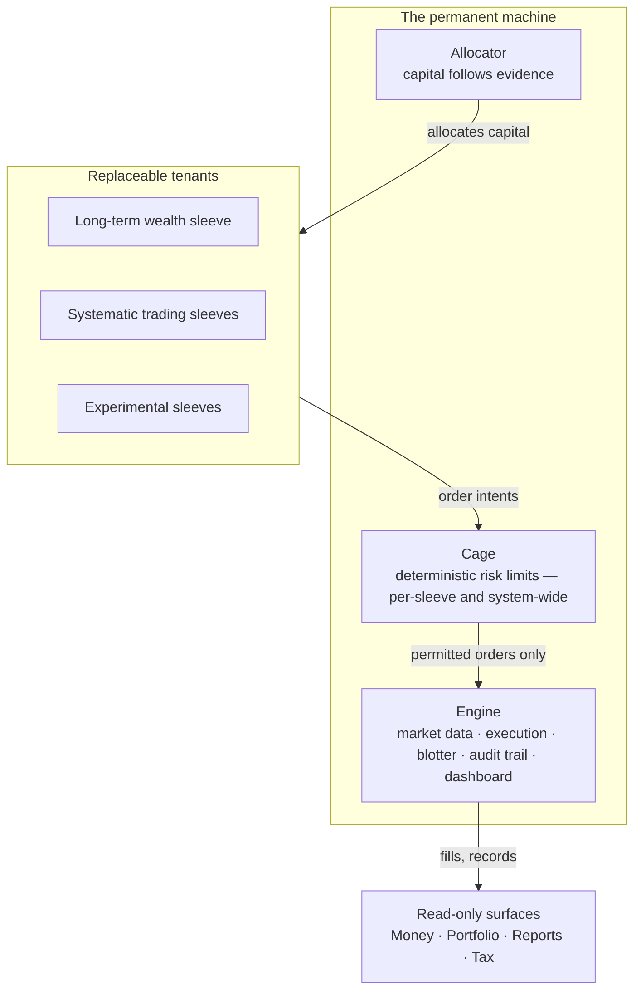

:::info[One-liner]
Ironcage is my personal wealth operating system: one engine that runs many investment strategies in parallel — every strategy caged by deterministic risk rules it cannot override, every strategy earning its capital through evidence, and AI doing the work it is actually good at: judging conditions and designing improvements, never holding the order button.
:::

## Why this exists

Markets run around the clock; I don't. A system can watch continuously, never get tired, never revenge-trade, and never forget why it made a decision. That is the one structural advantage an individual can actually build — and with modern AI, the ceiling on what that system can understand about markets, news, and my own finances is higher than it has ever been.

But the obvious version of this idea — "let an AI trade for me" — has now been tested in public with real money, and it fails. In the Alpha Arena live experiments, four of six frontier models lost 30–63% of their capital in under three weeks; the winner won through low frequency and strict risk discipline, not intelligence. Independent re-evaluations of the impressive academic results (FINSABER, StockBench, Agent Market Arena) found the same pattern: the backtests collapse under fair testing, and _risk design_ drives outcomes far more than model choice. The institutions best equipped to know — Bridgewater, Man Group, AQR — all converged on the same shape: AI as a research and synthesis engine, with deterministic systems and gatekeeping between the model and the money.

The lesson is not that AI is useless for investing. It's that the division of labor decides everything:

- **AI is strong at judgment shaped like language** — reading news flow, market conditions, filings, and my own transaction history, and turning that mess into a clear, bounded assessment.
- **AI is deeply knowledgeable about the craft itself** — decades of public quant research, strategy design, market structure, and the documented ways systems like this blow up are all in the model. That makes it a genuinely capable engineer of the machine, not just a commentator on markets — as long as its designs are treated as hypotheses that must survive testing, never as truths.
- **AI is weak and dangerous at execution** — left alone with an order button, it overtrades, burns fees, panics, and can be misled by bad or even hostile input.
- **Deterministic code is the mirror image** — unbeatable at discipline, hopeless at reading the world.

Ironcage is the composition: **AI brain, iron cage.** AI informs and designs; code enforces; evidence decides. Concretely, AI participates at three layers, each with its own containment:

| Layer           | AI's role                                                                                                         | Containment                                                                                          |
| --------------- | ----------------------------------------------------------------------------------------------------------------- | ---------------------------------------------------------------------------------------------------- |
| **Run time**    | Bounded judgment: assessing market conditions and only ever reducing what the deterministic rules already permit. | Clamping.                                                                                            |
| **Design time** | The knowledgeable engineer: proposing strategy variants, tuned parameters, and adversarial what-ifs.              | The gate pipeline — reproducible backtests, walk-forward evaluation, shadow runs — and my signature. |
| **Build time**  | Pair-engineering the system itself with me, as a standing part of how Ironcage is made.                           | Code review, and the fact that the cage is code.                                                     |

## What Ironcage is

Ironcage is not one strategy. It is the machine my strategies live inside — an all-in-one system for growing and understanding my money, built from three permanent parts and any number of replaceable tenants.

The diagram states the same composition the following paragraphs define: three permanent parts, any number of tenants, and read-only surfaces that observe everything and trade nothing.

**The engine** is the shared foundation every strategy uses: market data, order execution, the blotter (the append-only record of every order and fill, from which all positions and profit figures are recomputed — never trusted from memory), the audit trail, and the dashboard. Build it once, well, and every strategy inherits it.

**The cage** is the deterministic risk layer, and it is the heart of the project. Position limits, stop-losses, daily loss halts, a drawdown kill switch, trade-frequency caps — enforced in plain code that no AI output can reach or override. The cage exists at two levels: each strategy has its own limits, and above them all sits one system-wide cage watching total exposure and total drawdown. When anything is uncertain — a stale signal, missing data, an unreachable exchange — the cage fails closed: it stands down rather than guessing. Every documented way autonomous AI trading blows up is contained here structurally, not by hoping the model behaves.

**The allocator** is the discipline that decides how much capital each sleeve holds, and it follows one constitutional rule described below: capital follows evidence.

**Sleeves** are the tenants. A sleeve is a bounded allocation of capital with its own mandate: what it trades, how fast, by what rules, and which bounded AI capabilities it holds. Ironcage is built to run many sleeves in parallel, and they can differ in every dimension:

- A **long-term wealth sleeve** — the largest and most conservative: slow, diversified, compounding-focused. The boring core lives _inside_ the system, because an allocator that can see everything manages the whole better than one managing only the risky slice.
- **Systematic trading sleeves** — rules-based strategies (trend-following, momentum, and whatever else earns its way in) across crypto and stocks, where AI's role is bounded judgment: assessing conditions and scaling exposure down when they're hostile — never up, and never placing the trades itself.
- **Experimental sleeves** — including fast day-trading strategies and even fully autonomous AI-in-the-loop trading. These are welcome _as experiments_: small, hard-capped, instrumented to the teeth. The evidence says most will fail their trials — and Ironcage is precisely the machine for finding that out cheaply instead of assuming it expensively.

**The read-only surfaces** are the parts of the system that read but never trade: analysis of my bank transactions and spending, portfolio-wide views across every sleeve and account, savings recommendations, tax, and the regular reports that tell me what's working and what should change. They carry zero execution risk, which means they can ship early and be useful on day one.

The operator is me — one person, personal capital — working with AI coding tools as a standing part of the process. Ironcage is never finished; it is a long-term engine that grows new sleeves, retires failed ones, and gets smarter as I do.

## The constitutional rule: capital follows evidence

No sleeve is entitled to capital; every sleeve is entitled to a fair trial.

Every sleeve enters the system the same way: first in **dry run** — trading simulated money against live markets through the exact same code path as real trading — then with a small, capped real allocation, then with more only if its live track record earns it. Promotion is always my decision, but never an uninformed one: it is made from the evidence — performance against honest benchmarks (including "just hold the market"), drawdowns, costs, and whether the strategy did what its mandate said — and the decision is recorded beside the evidence it was made on. Risk response, by contrast, is automatic and unsentimental: limits breach, sleeves halt, no discussion. A sleeve that can't beat its trial doesn't get argued for; it gets its capital back to the allocator.

This one rule is what lets Ironcage be ambitious and honest at the same time. I get to try everything — fast strategies, autonomous AI loops, ideas I haven't had yet — because trying is cheap and bounded, and only evidence scales.

## Principles

1. **Fail closed.** Every ambiguity, everywhere in the system, resolves toward not trading. Stale input → stand down. Uncomputable risk state → blocked. Infrastructure down → nothing moves.
2. **The cage is code.** No AI output can create, enlarge, or extend risk beyond what a sleeve's deterministic rules allow. At run time, AI can only work within — or shrink — what the rules permit; any richer contribution, from tuned parameters to whole new strategies, is a proposal that must survive testing and my signature before it exists.
3. **Capital follows evidence.** Dry run first, small real capital second, scale only on a live track record. For every sleeve, forever, no exceptions for excitement.
4. **Costs are a first-class enemy.** Fees and overtrading are the best-documented killers of systems like this. Every sleeve is judged net of costs, and the default posture is to trade less.
5. **Everything is auditable.** Every signal, judgment, verdict, order, and fill is reconstructable from persisted records. If I can't trace why the system did something, that part of the system is broken by definition.
6. **The system is the asset.** Early returns will be pocket money; the compounding asset is a proven machine and my own judgment about it. Scaling capital is downstream of evidence, never of enthusiasm.

## What Ironcage is not

- **Not a product.** One operator, personal capital. Simplicity beats generality wherever they conflict.
- **Not an entitlement to autonomy.** Full AI-loop trading is a sleeve that must earn trust like any other — autonomy is a dial set per sleeve, never an assumption.
- **Not a prediction machine.** Nothing in the system claims to know where prices go. Strategies react to conditions; AI classifies and explains them; the cage assumes everyone is wrong sometimes.
- **Not a get-rich scheme.** The honest good outcome is a system that survives, compounds steadily, understands my whole financial picture, and earns the right to manage more of it.
